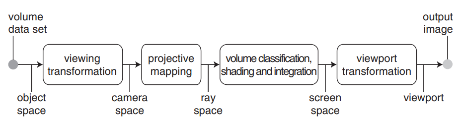

# 4 Dimension Gaussian Splatting

## Gaussian Distribution

### Covariance

For a given random vector $X:\Omega \rightarrow R^{n}$, its **covariance matrix** $\Sigma$ is the $n\times n$ square matrix whose extries are given by $\Sigma_{ij}=Cov[X_{i},X_{j}]=E[(X_{i}-E[X_{i}])(X_{j}-E[X_{j}])]$

$$
\Sigma=E[(X-E[X])(X-E[X])^{T}] 
$$

**Proposition:** Suppose that $\Sigma$ is the covariance matrix corresponding to some random vector $X$. Then $\Sigma$ is symmetric positive semidefinite

!!! note "positive semidefinite"

    A symmetric matrix $A\in S^{n}$ is **positive semidefinite** (PSD) if for all vectors $x^{T}Ax\geq 0$
 
$\textit{proof}\text{: For any vector }z\in R^{n} \text{, observe that}$

$$
z^{T}\Sigma z= \sum_{i=1}^{n}\sum_{j=1}^{n}\Sigma_{ij}z_{i}z_{j}\\
=E[\sum_{i=1}^{n}\sum_{j=1}^{n}(X_{i}-E[X_{i}])(X_{j}-E[X_{j}])z_{i}z_{j}]
$$

$\text{Observe that the quantity inside the brackets is of the form}$ 

$$
\sum_{i=1}^{n}\sum_{j=1}^{n}x_{i}x_{j}z_{i}z_{j}=(x^{T}z)^{2}\geq 0\\
$$

$\text{, which complete the proof}$

### Gaussian Distribution

* $X\sim Normal(\mu,\sigma^{2})$: also known as univariate Gaussian distribution

$$
f(x)=\frac{1}{\sqrt{2\pi}\sigma}e^{-\frac{1}{2\sigma^{2}}(x-\mu)^{2}}
$$

* $X\sim \mathcal{N}(\mu,\Sigma)$ For multivariate Gaussian, where mean $\mu\in R^{d}$ and covariance matrix $\Sigma$ is symmetric positive definite $d\times d$ matrix 

$$
f_{X_{1},X_{2},\dots,X_{d}}(x_1,x_2,\dots,x_{d};\mu,\Sigma)=\frac{1}{(2\pi)^{d/2}|\Sigma|^{1/2}}\exp(-\frac{1}{2}(x-\mu)^{T}\Sigma^{-1}(x-\mu))
$$

**Proposition:** $\Sigma=E[(X-\mu)(X-\mu)^{T}]=E[X^{2}]-\mu\mu^{T}$

!!! note

    In the definition of multivariate Gaussians, we required that the covariance matrix $\Sigma$ be symmetric positive definite. That's because we need $\Sigma^{-1}$ exists, which means $\Sigma$ is full rank. Since any full rank symmetric positive semidefinite matrix is necessarily symmetric positive definite, it follows that $\Sigma$ must be symmetric positive definite.

#### Isocontour

!!! note

    For a function $f : R^2 → R$, an isocontour is a set of the form $\{x\in R^{2}:f(x)=c\}$ for some $c\in R$

Consider the case where $d=2$ and $\Sigma$ is diagonal. For some constant $c\in R$ and all $x1,x2\in R$, we have

$$
\begin{aligned}
c&=\frac{1}{2\pi \sigma_{1}\sigma_{2}}\exp{(-\frac{1}{2\sigma_{1}^{2}}(x_{1}-\mu_{1})^{2}-\frac{1}{2\sigma_{2}^{2}}(x_{2}-\mu_{2})^{2})} \\
1&=\frac{(x_{1}-\mu_{1})^{2}}{2\sigma_{1}^{2}\log{\frac{1}{2\pi c\sigma_{1}\sigma_{2}}}}+\frac{(x_{2}-\mu_{2})^{2}}{2\sigma_{2}^{2}\log{\frac{1}{2\pi c\sigma_{1}\sigma_{2}}}}
\end{aligned}
$$

Defining

$$
r_{1}=\sqrt{2\sigma_{1}^{2}\log{(\frac{1}{2\pi c\sigma_{1}\sigma_{2}})}}\\
r_{2}=\sqrt{2\sigma_{2}^{2}\log{(\frac{1}{2\pi c\sigma_{1}\sigma_{2}})}}\\
$$

It follows that

$$
1=\left(\frac{x_{1}-\mu_{1}}{r_{1}}\right)^{2}+\left(\frac{x_{2}-\mu_{2}}{r_{2}}\right)^{2}
$$

When $\Sigma$ is diagonal, it is the equation of an **axis-aligned ellipse**, while a **rotated ellipses** when not diagonal.

In $d$ dimensional case, the level sets form geometrical structures known as **ellipsoid** in $R^{d}$

#### Closure properties

$\textbf{Theorem:}\text{ Suppose that }y\sim\mathcal{N}(\mu,\Sigma)\text{ and }z\sim\mathcal{N}(\mu',\Sigma')\text{ are independent }\\
\text{Gaussian distributed random variables, where }\mu,\mu'\in R^{d}\text{ and }\Sigma,\Sigma'\in S^{d}_{++}\text{. Then, their sum is also Gaussian:}$

$$
y+z\sim \mathcal{N}(\mu+\mu',\Sigma+\Sigma')\\
$$

$\textbf{Theorem:}\text{ Suppose that }$

$$
\begin{bmatrix}
x_{A} \\
x_{B}
\end{bmatrix}
\sim\mathcal{N}
\left(
\begin{bmatrix}
x_{A} \\
x_{B}
\end{bmatrix}
,
\begin{bmatrix}
\Sigma_{AA} & \Sigma_{AB}\\
\Sigma_{BA} & \Sigma_{BB}
\end{bmatrix}
\right)
$$

$\text{where }x_{A}\in R^{n},x_{B}\in R^{d}\text{ and the dimensions of the mean vectors and covariance matrix subblocks are chosen }\\
\text{to match }x_{A}\text{ and }x_{B}\text{. Then, the marginal densities are Gaussian:}$

$$
\begin{aligned}
p(x_A)&=\int_{x_{B}\in R^{d}}p(x_{A},x_{B};\mu,\Sigma)dx_{B}\\
p(x_B)&=\int_{x_{A}\in R^{n}}p(x_{A},x_{B};\mu,\Sigma)dx_{A}\\
\\
x_{A}&\sim \mathcal{N}(\mu_{A},\Sigma_{AA})\\
x_{B}&\sim \mathcal{N}(\mu_{B},\Sigma_{BB})
\end{aligned}
$$

$\textbf{Theorem:}\text{ Suppose that }$

$$
\begin{bmatrix}
x_{A}\\
x_{B}\\
\end{bmatrix}
\sim\mathcal{N}
\begin{pmatrix}
\begin{bmatrix}
x_{A}\\
x_{B}\\
\end{bmatrix}
,
\begin{bmatrix}
\Sigma_{AA}&\Sigma_{AB}\\
\Sigma_{BA}&\Sigma_{BB}\\
\end{bmatrix}
\end{pmatrix}
$$

$\text{where }x_{A}\in R^{n},x_{B}\in R^{d}\text{ and the dimensions of the mean vectors and covariance matrix subblocks are chosen }\\
\text{to match }x_{A}\text{ and }x_{B}\text{. Then, the conditional densities are Gaussian:}$

$$
\begin{aligned}
p(x_{A}|x_{B})&=\frac{p(x_{A},x_{B};\mu,\Sigma)}{\int_{x_{A}\in R^{n}}p(x_{A},x_{B};\mu,\Sigma)dx_{A}}\\
p(x_B|x_{A})&=\frac{p(x_{A},x_{B};\mu,\Sigma)}{\int_{x_{B}\in R^{d}}p(x_{A},x_{B};\mu,\Sigma)dx_{B}}\\
\\
x_{A}|x_{B}\sim \mathcal{N}(\mu_{A}+\Sigma_{AB}&\Sigma_{BB}^{-1}(x_{B}-\mu_{B}),\Sigma_{AA}-\Sigma_{AB}\Sigma_{BB}^{-1}\Sigma_{BA})\\
x_{B}|x_{A}\sim \mathcal{N}(\mu_{B}+\Sigma_{BA}&\Sigma_{AA}^{-1}(x_{A}-\mu_{A}),\Sigma_{BB}-\Sigma_{BA}\Sigma_{AA}^{-1}\Sigma_{AB})
\end{aligned}
$$

#### Decomposition

Given that the covariance matrix is positive definite, it can be diagonalize in the following format:

$$
\begin{aligned}
\Sigma&=U\Lambda U^{T}\\
&=(U\Lambda^{1/2})(\Lambda^{1/2}U)^{T}\\
&=AA^{T}
\end{aligned}
$$

$\Lambda$ here is a diagonal matrix. We can consider it as a scaling matrix $S$ and $U$ as a rotation matrix $R$.

$$
\Sigma=RSS^{T}T^{T}
$$

## Volumn Rendering

**backward mapping algorithm:** shoot rays through pixels on the image plane into the volume data

**forward mapping alogorithm:** map the data onto the image plane

### rendering pipeline

## Splatting Alogorithm

We denote a point in ray space by a column vector of three coordinates $\mathbf{x}=(x_0,x_1,x_2)^{T}$. The coordinates $x_0$ and $x_1$ specify a point on the projection plane and $x_2$ specifes the Euclidean distance from the center of projection to a point on the viewing ray. Here we use the abbreviation $\mathbf{\hat{x}}=(x_0,x_1)^{T}$.

The volume rendering equation describes the light intensity $I_{\lambda}(\hat{\mathbf{x}})$ at wavelength $\lambda$ that reaches the center of projection along the ray $\hat{\mathbf{x}}$ with length $L$:

$$
I_{\lambda}(\hat{\mathbf{x}})=\int_{0}^{L}c_{\lambda}(\hat{\mathbf{x}},\xi)g(\hat{\mathbf{x}},\xi)e^{-\int_{0}^{\xi}g(\hat{\mathbf{x}},\mu)d\mu}d\xi
$$

* $g(\mathbf{x})$ is the extinction function that defines the rate of light occlusion, and $c_{\lambda}(\mathbf{x})$ is an emission coefficient. 

* $c_{\lambda}(\mathbf{x})g(\mathbf{x})$ describes the light intensity scattered in the direction of the ray $\hat{\mathbf{x}}$ at the point $x_2$. 

* The exponential term can be interpreted as an attenuation factor.

Now let's make several assumptions

* The volume consists of individual particles that absorb and emit light. Given weight cofficient $g_k$ and reconstruction kernels $r_{k}(\mathbf{x})$, we have $g(\mathbf{x})=\sum_{k}g_kr_{k}(\mathbf{x})$

* Local support areas do not overlap along a ray $\hat{\mathbf{x}}$, and the reconstruction kernels are ordered front to back. 

* The emission coefficient is constant in the support of each reconstruction kernel along a ray, hence we use the notation $c_{\lambda k}(\hat{\mathbf{x}})=c_{\lambda}(\hat{\mathbf{x}},\xi)$

* Approximate the exponential function with the first two terms of its Taylor expansion, thus $e^{x}\approx 1-x$

* Ignore self-occlusion

Exploiting these assumptions, yielding: 

$$
I_{\lambda}(\hat{\mathbf{x}})=\sum_{k}c_{\lambda k}(\hat{\mathbf{x}})g_kr_{k}(\mathbf{x})\prod_{j=0}^{k-1}(1-g_{j}q_{j}(\hat{\mathbf{x}}))
$$

where $q_{j}(\hat{\mathbf{x}})$ denotes an integrated reconstruction kernel, hence:

$$
q_{j}(\hat{\mathbf{x}})=\int_{\mathbb{R}}r_{k}(\hat{\mathbf{x}},x_{2})dx_{2}
$$

### The Viewing Transformation

Denote the Gaussian reconstruction kernels in *object space* by $r_{k}''(\mathbf{t})=\mathcal{G}_{\mathbf{V''}}(\mathbf{t}-\mathbf{t_k})$, where $\mathbf{t_k}$ are the voxel positions of center of kernel.

 Denote camera coordinates by a vector $\mathbf{u}=(u_0,u_1,u_2)^{T}$. Object coordinates are transformed to camera coordinates using an affine mapping $\mathbf{u}=\varphi(\mathbf{t})=\mathbf{Wt+d}$, called *viewing tranformation*.

Now we can transform the reconstruction kernels $\mathcal{G}_{\mathbf{V''}}(\mathbf{t}-\mathbf{t_k})$ to camera space: 

$$
\mathcal{G}_{\mathbf{V''}}(\varphi^{-1}(\mathbf{u})-\mathbf{t_k})=\frac{1}{|\mathbf{W}^{-1}|}\mathcal{G}_{\mathbf{V'}_{k}}(\mathbf{u}-\mathbf{u_k})=r_{k}'(\mathbf{u})
$$

where $\mathbf{u_k}=\varphi(\mathbf{t_k})$ is the center of the Gaussian in camera coordinates and $\mathbf{V'}_{k}=\mathbf{W}\mathbf{V''}_{k}\mathbf{W}^{T}$ is the variance matrix in camera coordinates.

### The Projective Transformation

In camera space, The ray intersecting the center of projection and the point $(x_0, x_1)$ on the projection plane is called a viewing ray.

To facilitate analiytical integration of volumn function, we need to transform the camera space to ray space such that the viewing rays are parallel to a coordinate axis. The projective transformation converts camera coordinates to ray coordinates.

Camera space is defined such that the origin of the camera coordinate system is at the center of projection and the projection plane is the plane $u_{2}=1$. Camera space and ray space are related by the mapping $\mathbf{x=m(u)}$. 

$$
\begin{pmatrix}
x_0\\
x_1\\
x_2\\
\end{pmatrix}
=\mathbf{m(u)}=
\begin{pmatrix}
u_{0}/u_{2}\\
u_{1}/u_{2}\\
\Vert(u_{0},u_{1},u_{2})^{T}\Vert\\
\end{pmatrix}\\
~\\
\begin{pmatrix}
u_0\\
u_1\\
u_2\\
\end{pmatrix}
=\mathbf{m^{-1}(u)}=
\begin{pmatrix}
x_{0}/l\cdot x_2\\
x_{1}/l\cdot x_2\\
1/l\cdot x_2\\
\end{pmatrix}
$$

where $l=\Vert(x_{0},x_{1},1)^{T}\Vert$.

Unfortunately, these mappings are not affine. The Gaussian after the transformation may not still Gaussian. To solve this problem, we introduce the *local affine approximation* $m_{uk}$ of the projective transformation. It is defined by the first two terms of the Taylor expansion of $\mathbf{m}$ at the point $\mathbf{u}_k$:

$$
\mathbf{m_{u_k}(u)=x_k+J_{u_k}\cdot (u-u_k)}\\
~\\
\mathbf{J_{u_k}}={\frac{\partial \mathbf{m}}{\partial \mathbf{u}}}(\mathbf{u}_k)
$$

where $\mathbf{x}_k=\mathbf{m(u_k)}$ is the center of a Gaussian in ray space and the Jacobian $\mathbf{J_{u_k}}$ is given by the partial derivatives of $\mathbf{m}$ at the point $\mathbf{u}_k$.

This yields the local affine approximation of reconstruction kernels to ray space:

$$
\begin{aligned}
r_{k}(\mathbf{x})&=\frac{1}{|\mathbf{W}^{-1}|}\mathcal{G}_{\mathbf{V'}_{k}}(\mathbf{m^{-1}(x)}-\mathbf{u_k})\\
&=\frac{1}{|\mathbf{W}^{-1}||\mathbf{J}^{-1}|}\mathcal{G}_{\mathbf{V}_{k}}(\mathbf{x}-\mathbf{x_k})
\end{aligned}
$$

where $\mathbf{V}_k$ is the variance matrix in ray coordinates:

$$
\begin{aligned}
\mathbf{V}_{k}&=\mathbf{J}\mathbf{V'}_{k}\mathbf{J}^{T}\\
&=\mathbf{JW}\mathbf{V''}_{k}\mathbf{W}^{T}\mathbf{J}^{T}
\end{aligned}
$$