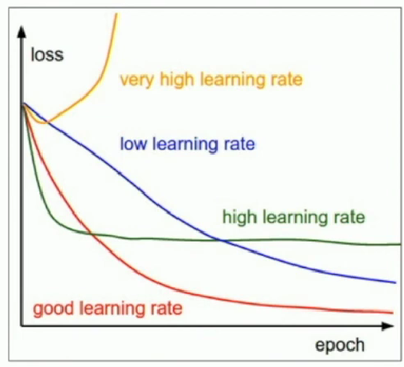
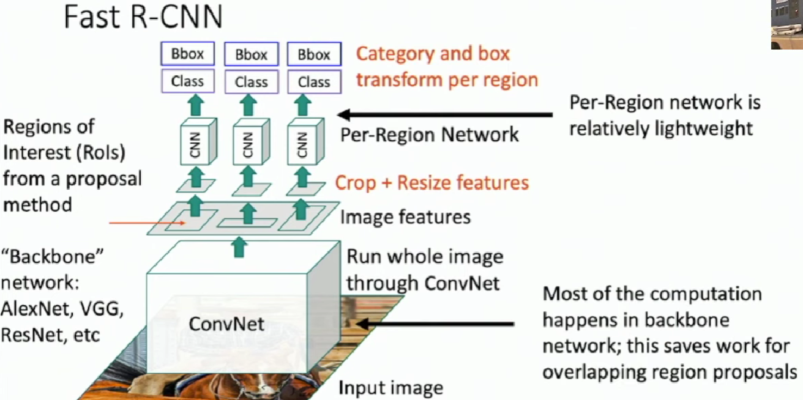
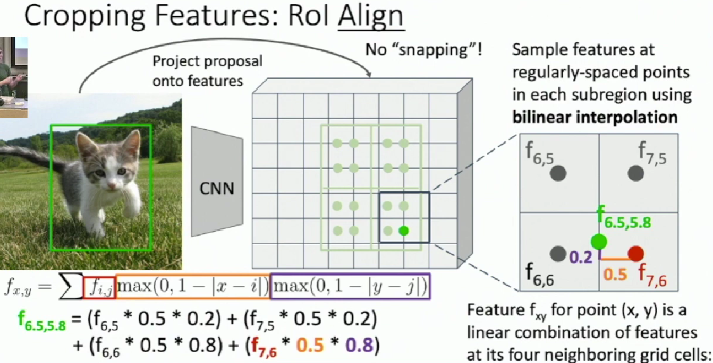
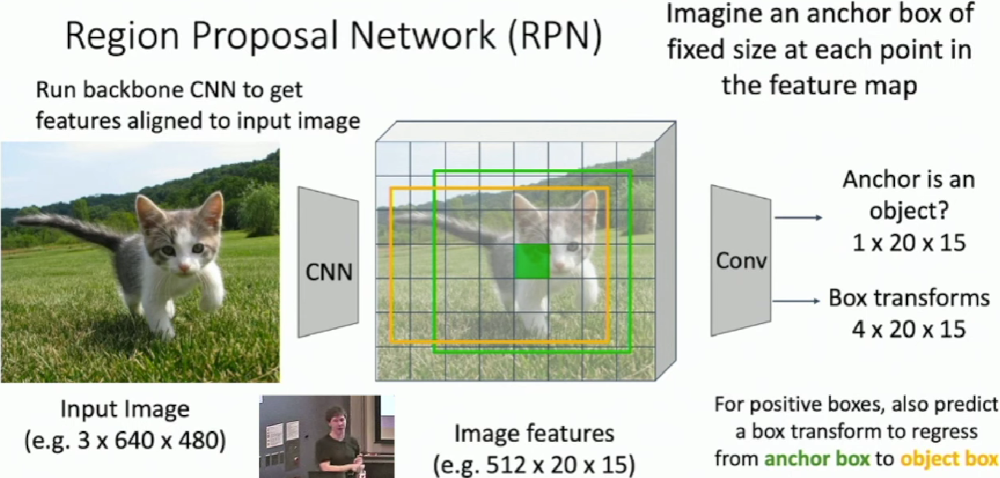
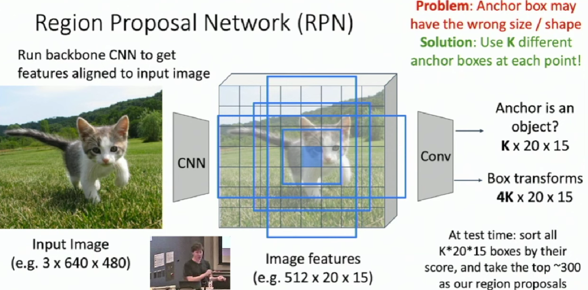
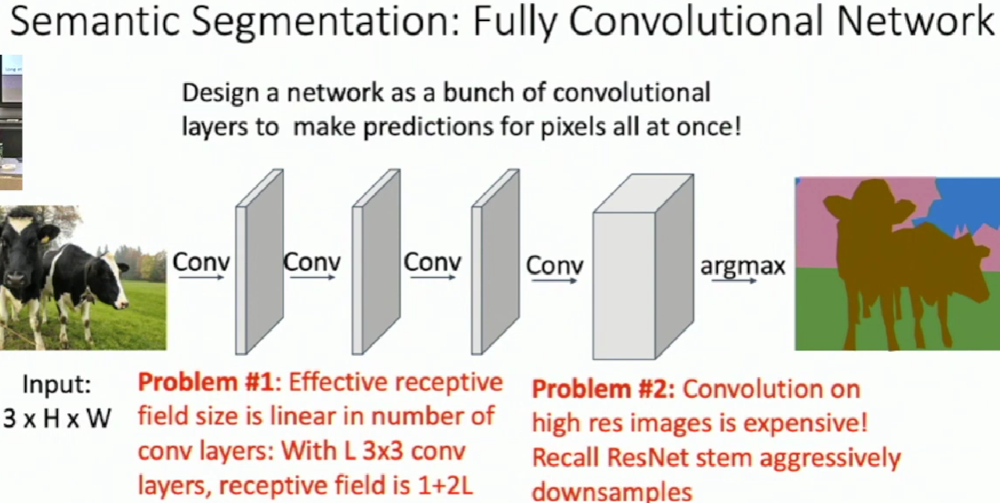
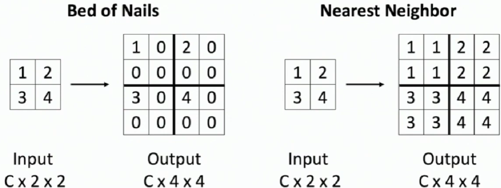
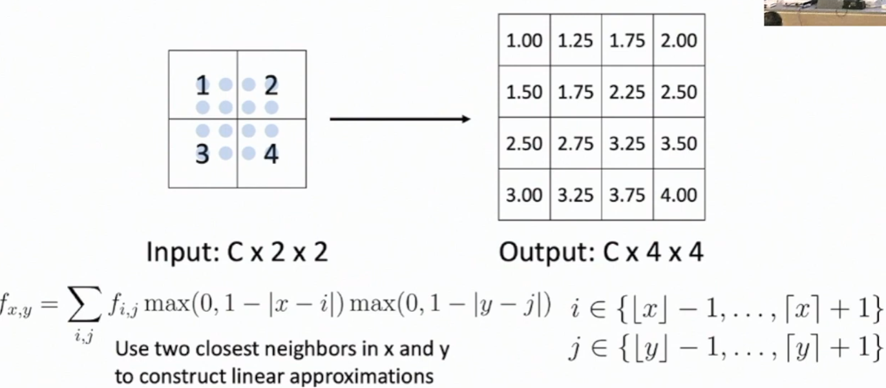
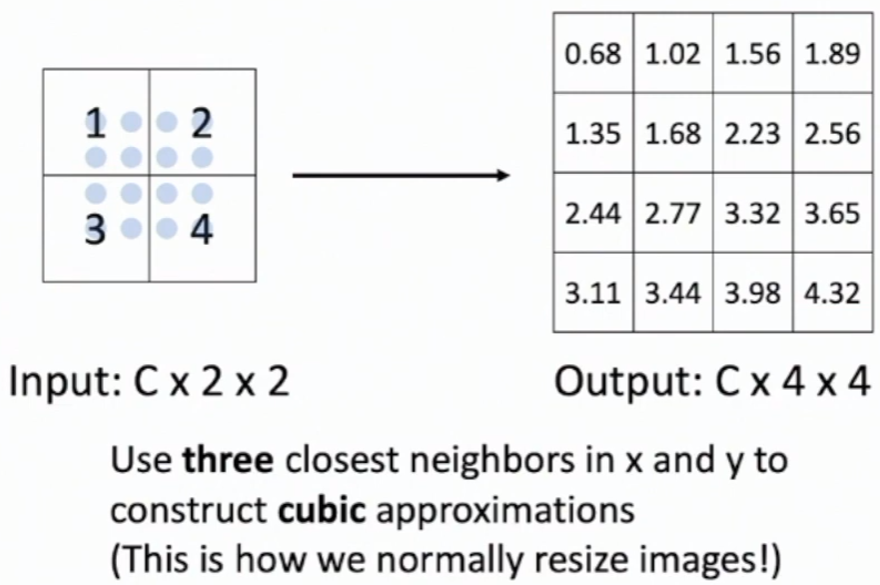
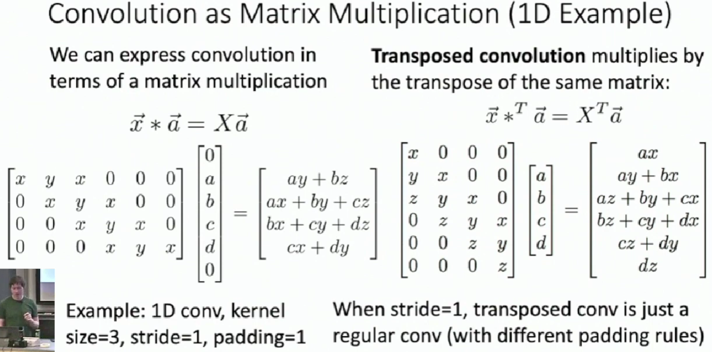

# Deep Learning for Computer Vision
## Image Classifier - Nearest Neighbor Classifier
Compare a new image with each image in training set using some similarity function. Assign the new image a label as same as the most similar image in training set.

* Using more neighbors helps reduce the effect of outliers.
* When $K > 1$ there can be ties between classes, which needed to be break somehow.

* The idea #2 is bad because when we adjust the hyperparameters according to the test set, we pollute it and it has little differences with training set.
* Remember that test set can be used only once in the final test.

If we want to have a good prediction on a new image, we need a large amount of examples on training set, which grows exponentially with dimension.

## Linear Classifier

Bias Trick is less common to use in practice because when we separate the weight and the bias into separate parameters, we can treat them differently on how they are initialized or regularized.

 

We can visualize the "template" for each category

 

 

The score goes linearly with respect to the change of pixels. We can extend this to high dimensions. The changes of scores are consistent with those hyperplanes. 

 

 

This also account for why perceptron, actually a linear classifier, couldn't learn XOR.

Now we can compute class scores for an image with given $W$. To get a good $W$, we need to do:

* Use a **loss function** to quantiy how good a value of $W$ is.

* Find a $W$ that minimizes the loss function.

 

Different regularization functions give the model extra hints about what types of classifier we'd like them to learn.

For example, L2 regularization likes to spread out the weight while L1 regularization does in the opposite way.

 

It's important to notice the loss function on random values, if your model get a worse loss value after training, there must be sth bad.

 

 

SVM Loss is easy to get to zero point while Cross-Entropy nearly impossible to get to zero.

## Optimization

* goal: find $w^{*}=argmin_{w}L(w)$

How to evaluate gradient?

* Numeric gradient
    * We can approximate the gradient by defination. Increasing one slot of the weight matrix by a small step and recompute loss function. Use the defination of derivative to get a approximation of gradient.
    * Takes lots of time and not accurate.

* Analytic gradient
    * exact, fast, error-prone

* In practice, always use analytic gradient, but check implementation with numerical gradienet. This is called a ***gradient check***

### Gradient Descent

### Stochastic Gradient Descend

* We don't use the full training data but some small subsamples of it  to approximate loss function and gradient, for computing on the whole set is expansive. These small subsamples are called ***minibatches***

* SGD + Momentum may overshoot in the bottom for its historical speed and will come back.

* Progress along "steep" direction is damped. Progress along "flat" directions is accelerated.

* The learning rate will continuely decay since `grad_squared` gets larger and larger.

* We initialize `moment2` as 0 and if we take `beta2` closely to 0, the `moment2` will also close to 0, which may make our first gradient step very large. This could cause bad results.

* Second-order optimization is better to use in low dimension. 

## Neural Network
To solve the limitation of linear classifier, we can apply feature transformation.

### Activation function

### Neuron

### Space Warping

The more the layer, the more complex the model is. Try to adjust regularization parameter to solve it.

### Universal Approximation
A two layer neural network can approximate any function. But it may need a large size to get high fidelity.

### Convex Functions
Taking any two points in the input, the secant line will always lie above the function between that two points.

However, most neural networks need **nonconvex optimization**

## Backpropagation

### Computation Graph

### Backprop Implementation

* You can define your own node object in computation graph using pytorch API

### Backprop with Vectors

### Backprop with Matrics

* $dL/dx$ must have the same shape as $x$ since loss $L$ is a scalar

Assume we want to derive $dL/dx_{i,j}$

* Note that only the $ith$ row of $y$ is formed by $x_{i,j}$ and corresponding coefficients are the $jth$ row of $w$.
* So $dL/dx_{i,j}$ is just the inner product of the $ith$ row of $dL/dy$ and the $jth$ column of $w^{T}$, which leads to the result of $dL/dx=(dL/dy)w^{T}$

### High-Order Derivatives
$\frac{\partial ^{2}L}{\partial x_{0}^{2}}$ is $D_{0} \times D_{0}$ dimension for it's the derivative of $\frac{\partial L}{\partial x_{0}}$, which is a $D_{0}$ dimension vector.

## Convolutional Network
* **Problem**: So far our classifiers don't respect the spatial structure of images!

* **Solution**: Define new computational nodes that operate on images!

### Convolutional Layer

* There can be many filters generating many activation maps.
* Each filter must have same depth as the input image.
* Each filter also has a bias.
* Activation map can be considered as a feature vector, telling us the structure of the input.

* The input is often a batch of images
* The output channel $C_{out}$ is usually different from input channel $C_{in}$

### Pooling Layer
* Compute one unique number to represent the region to downsampling.

### Convolutional Network Architecture

### Normalization

* **Problem**: Deep network is hard to train
* Normalization is introduced to accelerate optimization.

* The batch normalization get its name for it doing normalization in batch dimension $N$. 
* It's a stiff constraint for those layers to exactly fit zero mean and unit variance. So in practice, we introduce learnable scale and shift $\gamma,\beta$ to make our network able to learn mean and variance.

* It is wired that the result of one image is influenced by other images, so the model process differently in training time and test time
    * **Training Time**: empirically compute mean and variance.
    * **Test Time**: use the average of historical mean and variance computed during training to compute.

## CNN Architecture
### AlexNet

* Output channels $=$ number of filters $=$ 64
* Output size $W_{out}=(W_{in}-K+2P)/S+1=56$
* Memory that output feature consume
    * Number of output elements $=C_{out}\times H_{out}\times W_{out}=200704$
    * Bytes per element $=4$ (for 32-bit floating point)
    * KB $=$ (number of elements)$\times$ (bytes per element)/1024=784 
* Number of learnable parameters
    * Weight shape $=C_{out}\times C_{in}\times K \times K$
    * Bias shape $=C_{out}=64$
    * Number of parameter $=$ weight $+$ bias $=$ 23296

* Flatten output size $=C_{in}\times H\times W$
* FCparams $=C_{in}\times C_{out}+C_{out}$
* FC flops $=C_{in}\times C_{out}$

### VGG

* By stacking 3 by 3 conv, we throw away kernal size as a hyperparam and only need to thing about how many 3x3 conv do we need.
* We can also arbitaryly insert ReLU between these 3x3 conv, allowing more nonlinear computation.

### GoogLeNet
* Many innovation for efficiency: reduce parameter count, memory usage, and computation.

### Residual Network

When training deeper model, we found that deeper model does worse than shallow model. The initial guess is that Deep model is **overfitting** since it is much bigger than the other model. 

### Other

## Train Neural Network
### One time setup
#### Activation functions
**Sigmoid**: $\sigma(x)=1/(1+e^{-x})$

* Squashes numbers to range $[0,1]$
* problems:
    * Saturated neurons "kill" the gradients
    * Sigmoid outputs are not zero-centered
    * exp() is a bit compute expensive

**Tanh**

* Squashes numbers to range $[-1,1]$
* zero centered(nice)
* still kill gradients when saturated

**ReLU**: $f(x)=max(0,x)$

* Does not saturate in positive region
* Very computationally efficient
* COnverges much faster than sigmoid/tanh in practice
* Problems:
    * Not zero-centered output
    * When x < 0, the gradient will also be zero, which may cause it never update.

**Leaky ReLU**: $f(x)=max(0.01x,x)$

* Does not saturate
* Very computationally efficient
* COnverges much faster than sigmoid/tanh in practice
* will not "die" like ReLU
* We can introduce learnable parameter $\alpha$, which is call PReLU(Parametric Rectifier): $f(x)=max(\alpha x,x)$

#### Data Preprocessing
* Subtract the mean image(AlexNet)
* Subtract per-channel mean(VGGNet)
* Subtract per-channel mean and divide by per-channel std(ResNet)
* Others
    * PCA: data has diagonal covariance matrix
    * whitening: covariance matrix is the identity matrix

#### Weight Initialization
**Q**: What happens if we initialize all $W=0, b=0$?

**A**: All outputs are zero and weights will never update.

**Small random values**

**Big random values**

**Xavier Initialization**

* **Derivation**: Varience of output = Variance of input

$$
y=Wx\qquad \qquad \qquad \qquad y_{i}=\sum_{j=1}^{Din}x_{j}w_{j} \\
\begin{align}
Var(y_{i})&=Din\times Var(x_{i}w_{i}) \qquad &\text{Assume x, w are iid}\\
&=Din\times (E[x_{i}^{2}]E[w_{i}^{2}]-E[x_{i}]^{2}E[w_{i}]^{2}) \qquad &\text{Assume x, w independent}\\
&=Din\times Var(x_{i})\times Var(w_{i})\qquad &\text{Assume x, w are zero-mean} \\
\end{align}
\\
\text{If }Var(w_{i})=1/Din\text{ then }Var(y_{i})=Var(x_{i})
$$

Unfortunately, this initialization tends to be bad when we use ReLU as activation function.

**Kaiming / MSRA Initialization**
* ReLU correction: std = sqrt(2 / Din)

"Just right" - activations nicely scaled for all layers.

Not do well in Residual Networks.

If we initialize with MSRA: then $Var(F(x))=Var(x)$. But then $Var(F(x)+x)>Var(x)$ - variance grows with each block!

* Solution: Initialize first conv with MSRA, initialize second conv to zero. Then $Var(x+F(x))=Var(x)$

#### Regularization
In common use: L2 regularization, L1 regularization ...

**Dropout**
In each forward pass, randomly set some neurons to zero. Probability of dropping is a hyperparameter. 0.5 is common

Forces the network to have a redundant representation. Prevents co-adaptation of features.

Another interpretation: Dropout is training a large ensemble of models (that share parameters). Each binary mask is one model

* Test Time: We need to take another way to compute output when testing or our output will be random.
    * We want to "average out" the randomness at test-time. That is, multiply the result without dropout by dropout probobility.

**Inverted Dropout**
Drop and scale layer during training, 

#### Data Augmentation
Tranform input training image before feeding it into the network. Horizontal flips is one example. This augments the amount of data and keep their label unchanged.

**Random Crops and Scales**

* Training: sample random crops / scales

    * Pick random L in range [256, 480]
    * Resize training image, short side = L
    * Sample random 224 x 224 patch

* Testing: average a fixed set of crops
    * Resize image at 5 scales: {224, 256, 384, 480, 640}
    * For each size, use 10 224 x 224 crops: 4 corners + center, + flips

### Training Dynamics
#### Learning rate schedules

We can Start with large learning rate and decay over time.

**Step Schedule**

Step: Reduce learning rate at a few fixed points. 

E.g. for ResNets, multiply LR by 0.1 after epochs 30, 60, and 90.

* Problem: introduce additional hyperparameters we have to tune.

**Cosine Schedule**: $\alpha_{t}=\frac{1}{2}\alpha_{0}(1+cos(t\pi /T))$

**Linear Schedule**: $\alpha_{t}=\alpha_{0}(1-t/T)$

**Inverse Sqrt**: $\alpha_{t}=\alpha_{0}/\sqrt{t}$

**Constant**: $\alpha_{t}=\alpha_{0}$

* Early Stopping: Stop training the model when accuracy on the validation set decreases. Or train for a long time, but always keep track of the model snapshot that worked best on val. Always a good idea to do this!

#### hyperparameter optimization
**Grid Search**

Choose several values for each hyperparameter(Often space choices log-linearly).

Example:

Weight decay: [1x10-4, 1x10-3, 1x10-2, 1x10-1], Learning rate: [1x10-4, 1x10-3, 1x10-2, 1x10-1]

Evaluate all possible choices on this hyperparameter grid.

**Random Search**

Randomly choose several values for each hyperparameter in a given range(Often space choices log-linearly)

Example:

Weight decay: log-uniform on [1x10-4, 1x10-1], Learning rate: log-uniform on [1x10-4, 1x10-1]

* Jump out of the grid and may have a better performance when some parameters are not important.

**Choosing hyperparameters:**

**Step 1**: Check initial loss

Turn off weight decay, sanity check loss at initialization

**Step 2**: Overfit a small sample

Try to train to 100% training accuracy on a small sample of training data (~5-10 minibatches); fiddle with architecture, learning rate, weight initialization. Turn off regularization.

Loss not going down? LR too low, bad initialization

Loss explodes to Inf or NaN? LR too high, bad initialization

**Step 3**: Find LR that makes loss go down

Use the architecture from the previous step, use all training data, turn on small weight decay, find a learning rate that makes the loss drop significantly within ~100 iterations

**Step 4**: Coarse grid, train for ~1-5 epochs

**Step 5**: Refine grid, train longer

**Step 6**: Look at loss curves

**Step 7**: GOTO step 5

### After training
#### Model ensembles

1. Train multiple independent models

2. At test time average their results

#### Transfer learning
1. Train on Imagenet

2. Use CNN as a feature extractor. Remove those fully connected layers in the last and freeze other layers.

3. Bigger dataset: **Fine-Tuning**

Reinitialize those last layer to new layers and continue training CNN for new task.

**Some tricks**:

- Train with feature extraction first before fine-tuning

- Lower the learning rate: use ~1/10 of LR used in original training

- Sometimes freeze lower layers to save computation
#### Large-batch training
How to scale up on data-parallel training on K GPUs?

**Goal:** Train for same number of epochs, but use larger minibatches. We want model to train K times faster

Single-GPU model: batch size N, learning rate $\alpha$

K-GPU model: batch size KN, learning rate $K\alpha$

## Object Detection
**Input**: Single RGB Image

**Output**: A set of detected objects;

For each object predict:

* Category label (from fixed, known set of categories)
* Bounding box (four numbers: x, y, width, height)

**Challenges**:

- Multiple outputs: Need to output variable numbers of objects per image
- Multiple types of output: Need to predict "what" (category label) as well as "where" (bounding box)
- Large images: Classification works at 224x224; need higher resolution for detection, often ~800x600

### Detecting a single object

### Detecting Multiple Objects

Need different numbers of outputs per image

#### Sliding Wingdow 

Apply a CNN to many different crops of the image, CNN classifies each crop as object or background.

**Question**: There are many possible boxes in an image of size $H\times W$. Total possible boxes: $\frac{H(H+1)}{2}\frac{W(W+1)}{2}$

#### Region Proposals

* Find a small set of boxes that are likely to cover all objects
* Often based on heuristics: e.g. look for "blob-like" image regions
* Relatively fast to run; e.g. Selective Search gives 2000 region proposals in a few seconds on CPU

#### R-CNN: Region-Based CNN

We can use region proposal method like selective search to get some region proposals in the image with different sizes and different aspect ratios.

Then we warp these region to a same size and forward them throusgh ConvNet.

Here if we only output the predicted class in each ConvNet, the box be may not accurate. So we introduce **bounding box regression** to predict "tranform" to correct the box: 4 numbers $(t_{x},t_{y},t_{h},t_{w})$. Now our CNN is going to output an additional thing, which is a transformation that will transform the region proposal box into the final box that we want.

Region proposal: $(p_{x},p_{y},p_{h},p_{w})$

Transform: $(t_{x},t_{y},t_{h},t_{w})$, which is one of the output of convnet

Final bex: $(b_{x},b_{y},b_{h},b_{w})$

Translate relative to box size: $b_{x}=p_{x}+p_{w}t_{x}\qquad b_{y}=p_{y}+p_{h}t_{y}$

Log-space scale transform: $b_{w}=p_{w}exp(t_{w})\qquad b_{h}=p_{h}exp(t_{h})$

The way we parameterize the transformation is invariant to the location and the scale of the box.

**Test-time**:

* Run region proposal method to compute ~2000 region proposals
* Resize each region to 224x224 and run independently through CNN to predict class scores and bbox transform
* Use scores to select a subset of region proposals to output (Many choices here: threshold on background, or per-category? Or take top K proposals per image?)
* Compare with ground-truth boxes

### Comparing Boxes: Intersection over Union(IoU)

How can we compare our prediction to the ground-truth box?

Intersection over Union (IoU)(Also called "Jaccard similarity" or
"Jaccard index"): $\frac{Area of Intersection}{Area of Union}$

IoU > 0.5 is "decent".
IoU > 0.7 is "pretty good".
IoU > 0.9 is "almost perfect".

### Overlapping Boxes: Non-Max Supperssion(NMS)

**Problem**: Object detectors often output many overlapping detections, which are detecting the same object but in different boxes.

**Solution**: Post-process raw detections using Non-Max Suppression (NMS)

1. Select next highest-scoring box

2. Eliminate lower-scoring boxes with loU > threshold (e.g. 0.7)

3. If any boxes remain, GOTO 1

**Problem**: NMS may eliminate "good" boxes when objects are highly overlapping ... no good solution 

### Evaluating Object Detectors: Mean Average Precision(mAP)

* Run object detector on all test images (with NMS)

* For each category, compute Average Precision (AP) = area under Precision vs Recall Curve

    * For each detection (highest score to lowest score)

        * If it matches some GT box with loU > 0.5, mark it as positive and eliminate the GT
        
        * Otherwise mark it as negative
        
        * Plot a point on PR Curve
    
    * Average Precision (AP) = area under PR curve

* Mean Average Precision (mAP) = average of AP for each category

* For "COCO mAP": Compute mAP@thresh for each loU threshold (0.5, 0.55, 0.6, ... , 0.95) and take average

> How to get AP = 1.0: Hit all GT boxes with loU > 0.5, and have no "false positive" detections ranked above any "true positives"

### Fast R-CNN

### Cropping Features: Rol Pool

First, we project proposal onto features. The projected region may not align with the grid cells so we have to "snap" them to fit the grid cells.

Then we divide these regions into 2x2 grid of (roughly) equal subregions. Max-pool within each subregion to get the region features. So region features always the same size even if input regions have different sizes.

**Problem**:

* Misaligned features due to snapping

* Can't backprop to box coordinates

### Cropping Features: Rol Align
We still divide the projected proposal into equal-size subregion. But instead of snapping, we're going to sample a fixed number of regularly-spaced points inside each subregion. These points may not align with the grid. Here we use bilinear interpolation.

After sampling, max-pool in each subregion.

Output features now aligned to input box! And we can backprop to box coordinates!
### Faster R-CNN: Learnable Region Proposals

We eliminate the heuristic algorithm called selective search and instead train a CNN to predict region proposals.

Compared to Fast R-CNN, we insert **Region Proposal Network(RPN)** after feature map to predict porposals from features.

Otherwise same as Fast R-CNN: Crop features for each proposal, classify each one.

### Region Proposal Network(RPN)

Now in Faster R-CNN, we jointly train with 4 losses:

* RPN classification: anchor box is object / not an object
* RPN regression: predict transform from anchor box to proposal box
* Object classification: classify proposals as background / object class
* Object regression: predict transform from proposal box to object box

Faster R-CNN is a **Two-stage object detector**

**First stage**: Run once per image
* Backbone network
* Region proposal network

**Second stage**: Run once per region
* Crop features: Rol pool / align
* Predict object class
* Prediction bbox offset

### Single-Stage Object Detection

Just like the RPN in faster R-CNN except that rather than classfying the anchor boxes as object or not object, instead we'll just make a full classification decision for the category of the object right here.

## Semantic Segmentation

Label each pixel in the image with a category label. Don't differentiate instances, only care about pixels

### Sliding Window

For every pixel, extract a patch centered it and input to CNN to get the label for that pixel.

**Problem**: Very inefficient! Not reusing shared features between overlapping patches.

### Fully Convolutional Network

### In-Network Upsampleing: "Unpooling"

**Bilinear Interpolation**

**Bicubic Interpolation**

**Max Unpooling**

Pair each downsampling layer with an upsampling layer

When Max Pooling, Remember which position had the max

When Max Unpooling, Place the value into remembered positions, while filling other positions with 0.

**Transposed Convolution**

Convolution with stride > 1 is "Learnable Downsampling"

Can we use stride < 1 for "Learnable Upsampling"?

