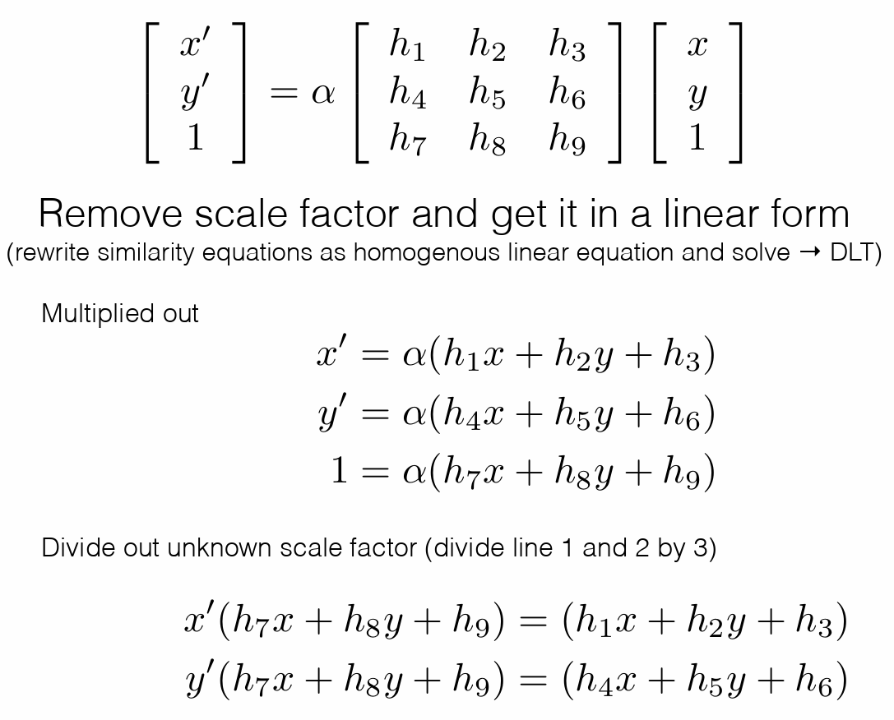
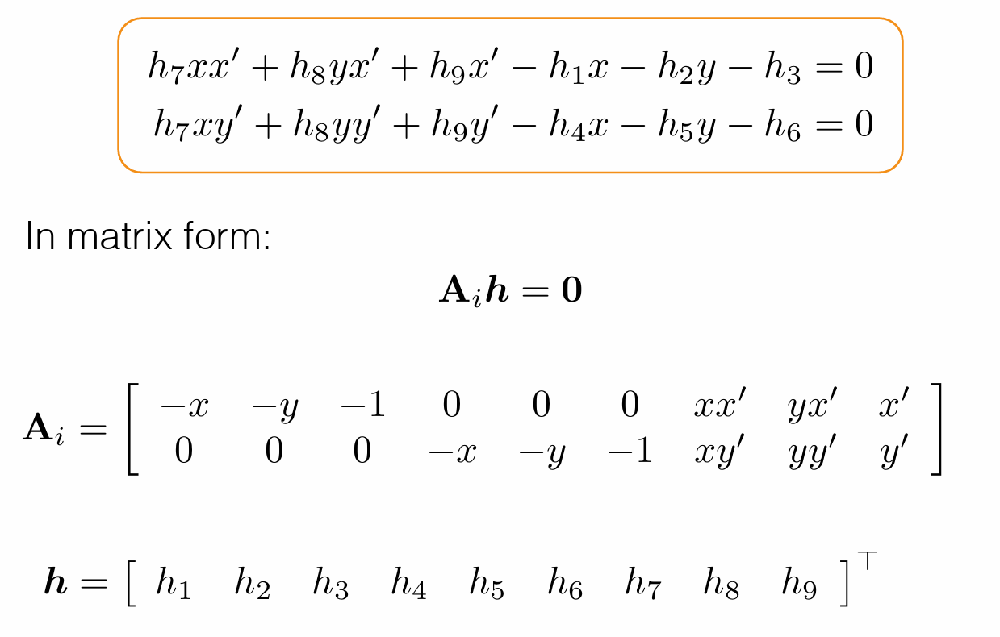

# Direct Linear Transform

$$
Let \ \mathcal X =\{\tilde{x}_{i},\tilde{x}^{'}_{i}\} \ denote \ a \ set \ of \ 2D-2D \ correspondences. \\
$$

Concatenate $A_{i}$ into single $2n\times 9$ matrix $A$ leads to the following ***constrained least squares problem***

$$
\begin{aligned}
\tilde{h}^{*}&=\mathop{\arg\min}\limits_{\tilde{h}} \ ||A\tilde{h}||_{2}^{2}+\lambda(||\tilde{h}||_{2}^{2}-1) \\
&=\mathop{\arg\min}\limits_{\tilde{h}} \ \tilde{h}^{T}A^{T}A\tilde{h}+\lambda(\tilde{h}^{T}\tilde{h}-1)
\end{aligned}
$$

where we have fixed $||\tilde{h}||_{2}^{2}=1$ as $\tilde{H}$ is is homogeneous (i.e., defined only up to scale).

The solution to the above optimization problem is the ***singular vector*** corresponding to the smallest singular value of A. The resulting algorithm is called ***Direct Linear Transformation***.

## Singular Value Decomposition
The SVD of $m \times n$ matrix $A$ is given by $A=U\Sigma V^{T}=\sum_{i=1}^{r}u_{i}\sigma _{i}v_{i}^{T}$

where:

* $U$: $m\times m$ orthogonal  matrix of the orthonormal eigenvectors of $AA^{T}$

* $V^{T}$: transpose of a $n\times n$ orthogonal matrix containing the orthonormal eigenvectors of $A^{T}A$

* $\Sigma$: a $m\times n$ matrix, actually a diagonal matrix with $r$ elements equal to the root of the positive eigenvalues of $AA^{T}$ or $A^{T}A$ (both matrics have the same positive eigenvalues anyway) and $m-r$ extra zero rows and $n-r$ new zero columns.
