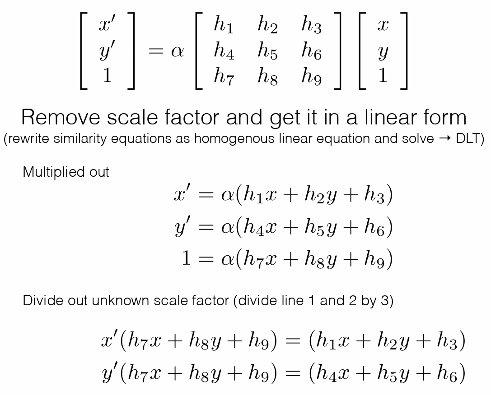

# Direct Linear Transform

$$
Let \ \mathcal X =\{\tilde{x}_{i},\tilde{x}^{'}_{i}\} \ denote \ a \ set \ of \ 2D-2D \ correspondences. \\
$$




Concatenate $A_{i}$ into single $2n\times 9$ matrix $A$ leads to the following ***constrained least squares problem***

$$
\begin{aligned}
\tilde{h}^{*}&=\mathop{\arg\min}\limits_{\tilde{h}} \ ||A\tilde{h}||_{2}^{2}+\lambda(||\tilde{h}||_{2}^{2}-1) \\
&=\mathop{\arg\min}\limits_{\tilde{h}} \ \tilde{h}^{T}A^{T}A\tilde{h}+\lambda(\tilde{h}^{T}\tilde{h}-1)
\end{aligned}
$$

where we have fixed $||\tilde{h}||_{2}^{2}=1$ as $\tilde{H}$ is is homogeneous (i.e., defined only up to scale).

The solution to the above optimization problem is the ***singular vector*** corresponding to the smallest singular value of A. The resulting algorithm is called ***Direct Linear Transformation***.


## Singular Value Decomposition
The SVD of $m \times n$ matrix $A$ is given by $A=U\Sigma V^{T}=\sum_{i=1}^{r}u_{i}\sigma _{i}v_{i}^{T}$

where:

* $U$: $m\times m$ orthogonal  matrix of the orthonormal eigenvectors of $AA^{T}$

* $V^{T}$: transpose of a $n\times n$ orthogonal matrix containing the orthonormal eigenvectors of $A^{T}A$

* $\Sigma$: a $m\times n$ matrix, actually a diagonal matrix with $r$ elements equal to the root of the positive eigenvalues of $AA^{T}$ or $A^{T}A$ (both matrics have the same positive eigenvalues anyway) and $m-r$ extra zero rows and $n-r$ new zero columns.

# Pseudoinverse Matrix
## Definition

For $A \in \mathbb{K}^{m\times n}$, a pseudoinverse of $A$ is defined as a matrix 
${\displaystyle A^{+}\in \mathbb {K} ^{n\times m}}$ satisfying all of the following four criteria, known as the Moore–Penrose conditions:

* ${\displaystyle AA^{+}}$ need not be the general identity matrix, but it maps all column vectors of A to themselves:

$$
{\displaystyle AA^{+}A=\;A.}
$$

* ${\displaystyle A^{+}}$ acts like a weak inverse:

$$
{\displaystyle A^{+}AA^{+}=\;A^{+}.}
$$

* ${\displaystyle AA^{+}}$ is Hermitian. **Hermitian matrix** is a complex square matrix that is equal to its own conjugate transpose.

$$
A\ Hermitian\Longleftrightarrow A=\overline{A^{T}}=A^{H}
$$

* ${\displaystyle A^{+}A}$ is also Hermitian.

## Linear least-squares
The pseudoinverse provides a least squares solution to a system of linear equations.For ${\displaystyle A\in \mathbb {K} ^{m\times n}}$, given a system of linear equations $Ax=b$, in general, a vector ${\displaystyle x}$ that solves the system may not exist, or if one does exist, it may not be unique. More specifically, a solution exists if and only if ${\displaystyle b}$ is in the image of ${\displaystyle A}$, and is unique if and only if ${\displaystyle A}$ is injective. The pseudoinverse solves the "least-squares" problem as follows:

* $\forall x \in \mathbb{K}^{n}$, we want to find a $z$ satisfying $\Vert{Az-b}\Vert_{2}\leq \Vert{Ax-b}\Vert_{2}$, where $z=A^{+}b$ and $\Vert \cdot \Vert_{2}$ denotes the Euclidean norm.

* This weak inequality holds with equality if and only if ${\displaystyle x=A^{+}b+\left(I-A^{+}A\right)w}$ for any vector ${\displaystyle w}$; this provides an infinitude of minimizing solutions unless ${\displaystyle A}$ has full column rank, in which case ${\displaystyle \left(I-A^{+}A\right)}$ is a zero matrix.

Assume we want to solve $n$ in $Sn=I$ where S is a real matrix. A solution may not unique. We can use pseudoinverse to solve it.

$$
S^{T}I=S^{T}Sn \\
n=(S^{T}S)^{-1}S^{T}I
$$

$(S^{T}S)^{-1}S^{T}$ here is pesudoinverse.
* Reference: <a herf="https://en.wikipedia.org/wiki/Moore%E2%80%93Penrose_inverse#">wikipedia</a>

# Chamfer Distance
Chamfer Distance is widely used in 3D reconstruction to judge how close one point cloud is on average to the other.


Given two point clouds $X$ and $Y$, Chamfer Distance is defined as follows:

$$
d=0.5\cdot (\frac{1}{\vert{X}\vert}\sum_{x_{i}\in X}min_{y_{j}\in Y}\Vert x_{i}-y_{j}\Vert ^{2}+\frac{1}{\vert{Y}\vert}\sum_{y_{j}\in Y}min_{x_{i}\in X}\Vert x_{i}-y_{j}\Vert ^{2})
$$

In the following code, we use the KDTree to get the nearest neighbors of one point cloud to the other.

```py title="Chamfer Distance"
def chamfer_distance(pcl_0, pcl_1):     # pcl_0 and pcl_1 are two point clouds in 3D space
    assert pcl_1.shape[-1] == 3
    assert pcl_0.shape[-1] == 3
    kd_pcl_0 = KDTree(pcl_0)
    kd_pcl_1 = KDTree(pcl_1)
    mindis_x2y, nearest_x2y= kd_pcl_1.query(pcl_0)
    mindis_y2x, nearest_y2x= kd_pcl_0.query(pcl_1)
    chamfer_dist = 0.5 * float(mindis_x2y.mean() + mindis_y2x.mean())
    assert type(chamfer_dist) == float
    return chamfer_dist
```