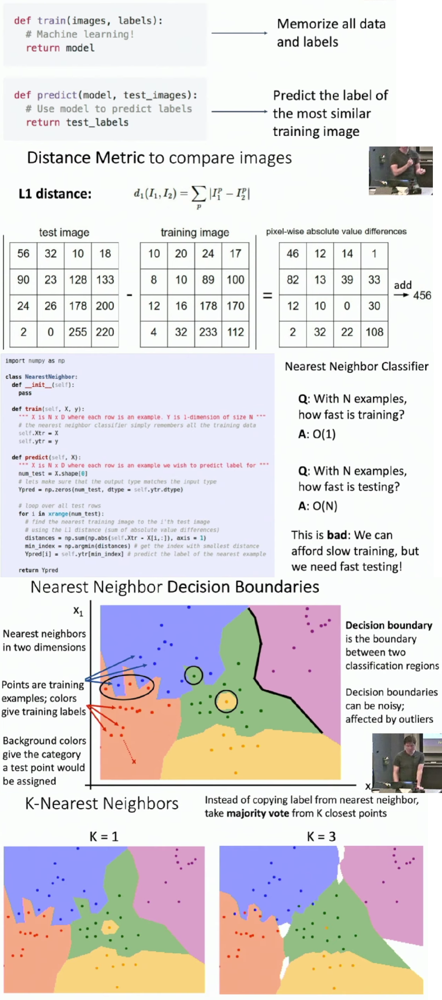
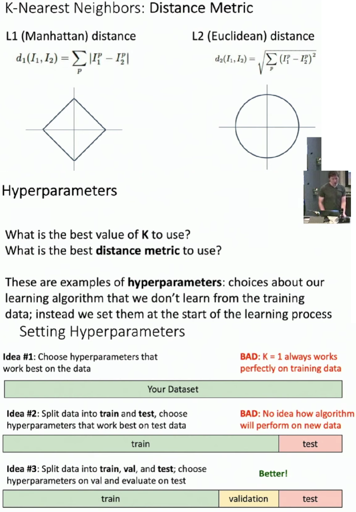
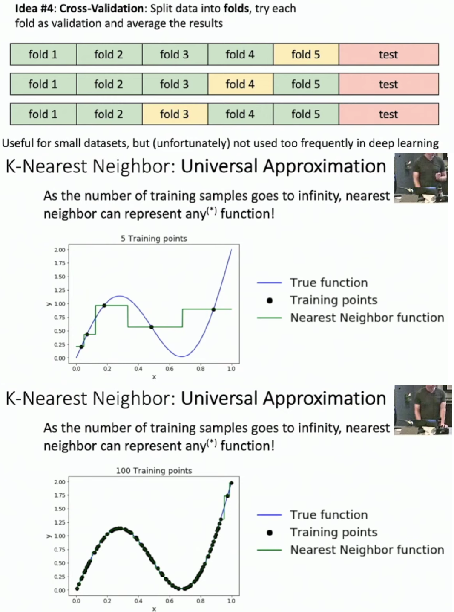
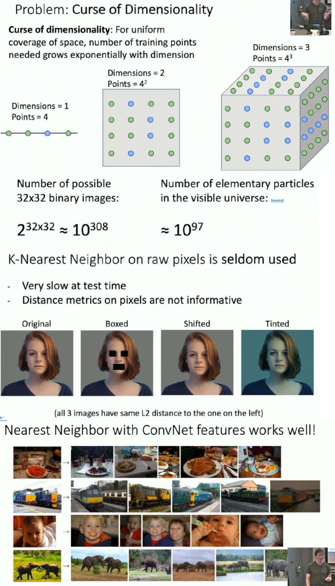
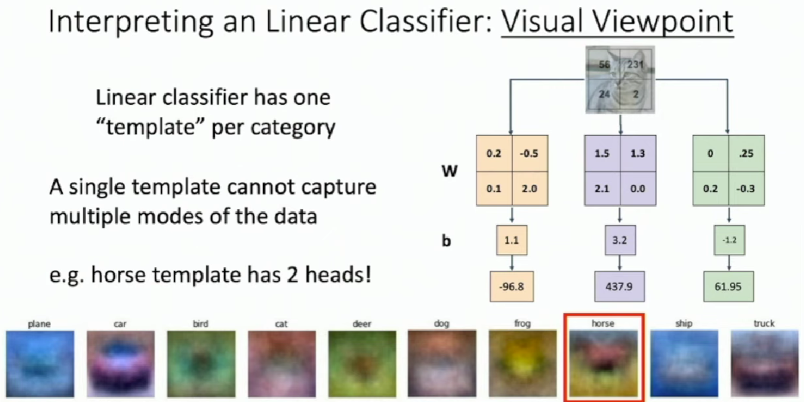
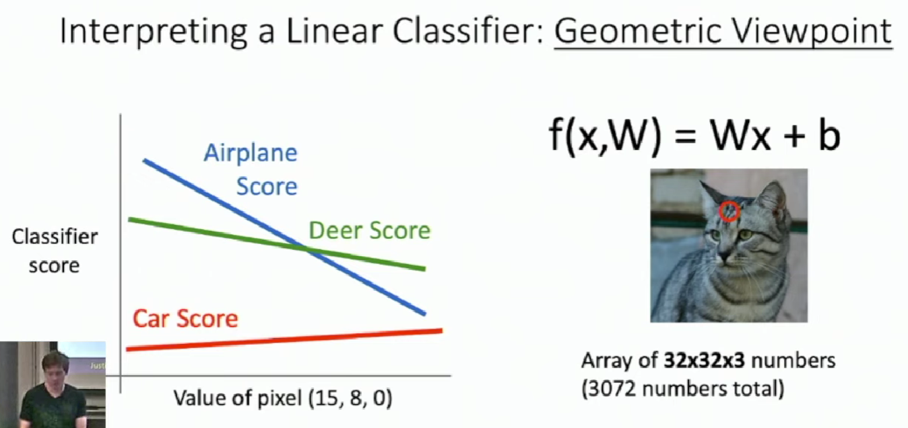
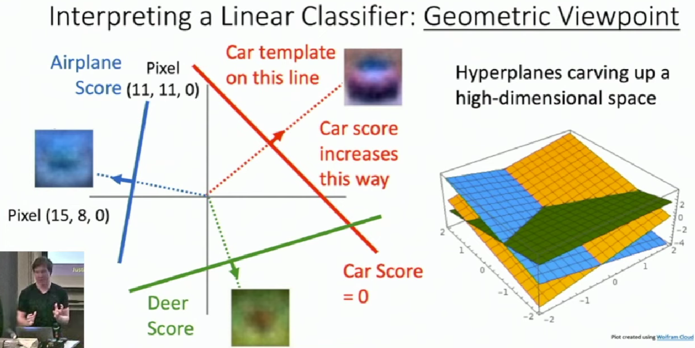
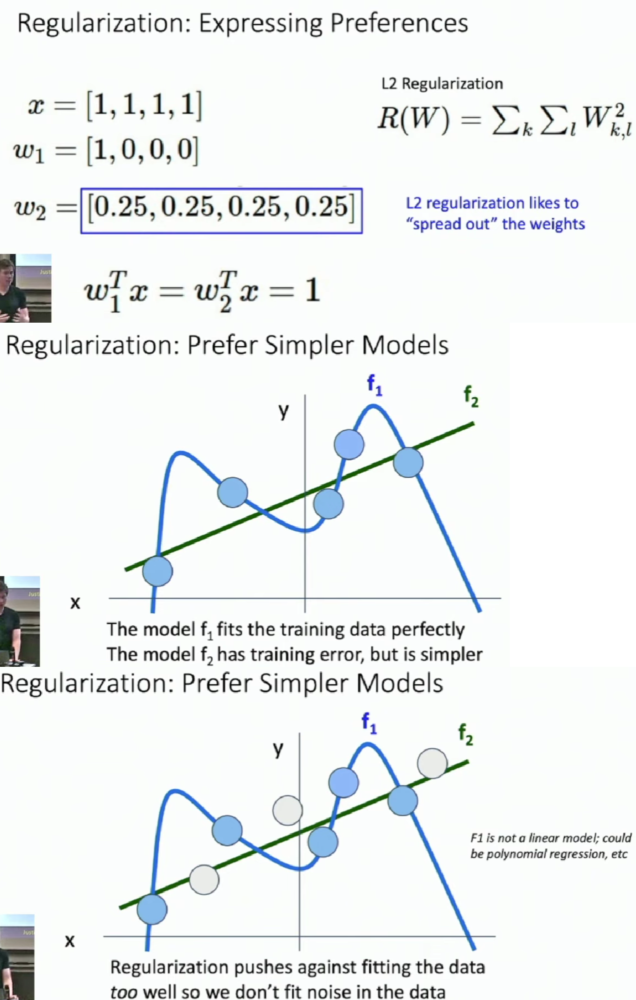
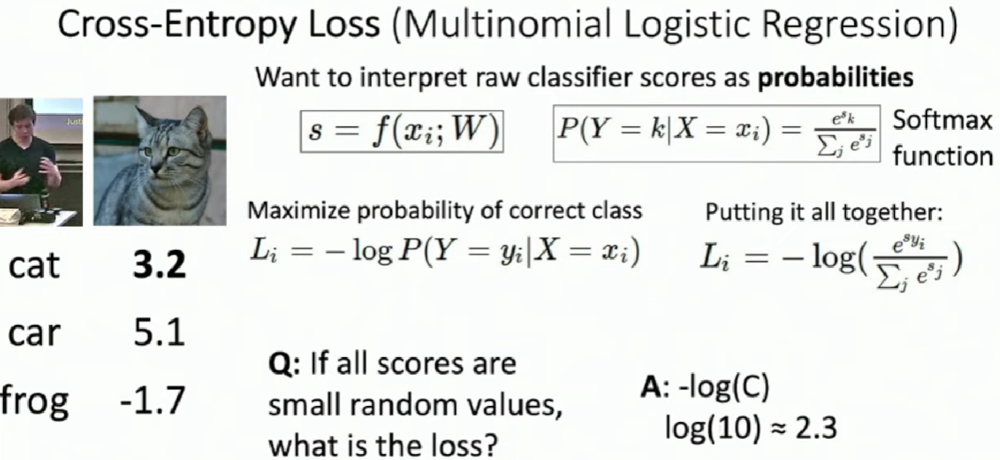

# Image Classifier - Nearest Neighbor Classifier
Compare a new image with each image in training set using some similarity function. Assign the new image a label as same as the most similar image in training set.

* Using more neighbors helps reduce the effect of outliers.
* When $K > 1$ there can be ties between classes, which needed to be break somehow.

* The idea #2 is bad because when we adjust the hyperparameters according to the test set, we pollute it and it has little differences with training set.
* Remember that test set can be used only once in the final test.

If we want to have a good prediction on a new image, we need a large amount of examples on training set, which grows exponentially with dimension.

# Linear Classifier

Bias Trick is less common to use in practice because when we separate the weight and the bias into separate parameters, we can treat them differently on how they are initialized or regularized.

 

We can visualize the "template" for each category

 

 

The score goes linearly with respect to the change of pixels. We can extend this to high dimensions. The changes of scores are consistent with those hyperplanes. 

 

 

This also account for why perceptron, actually a linear classifier, couldn't learn XOR.

Now we can compute class scores for an image with given $W$. To get a good $W$, we need to do:

* Use a **loss function** to quantiy how good a value of $W$ is.

* Find a $W$ that minimizes the loss function.

 

Different regularization functions give the model extra hints about what types of classifier we'd like them to learn.

For example, L2 regularization likes to spread out the weight while L1 regularization does in the opposite way.

 

It's important to notice the loss function on random values, if your model get a worse loss value after training, there must be sth bad.

 

 

SVM Loss is easy to get to zero point while Cross-Entropy nearly impossible to get to zero.