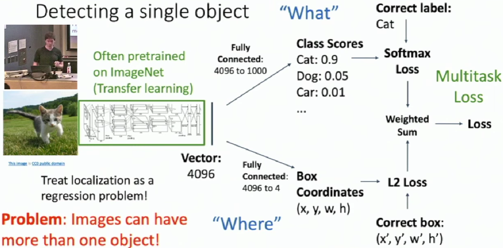
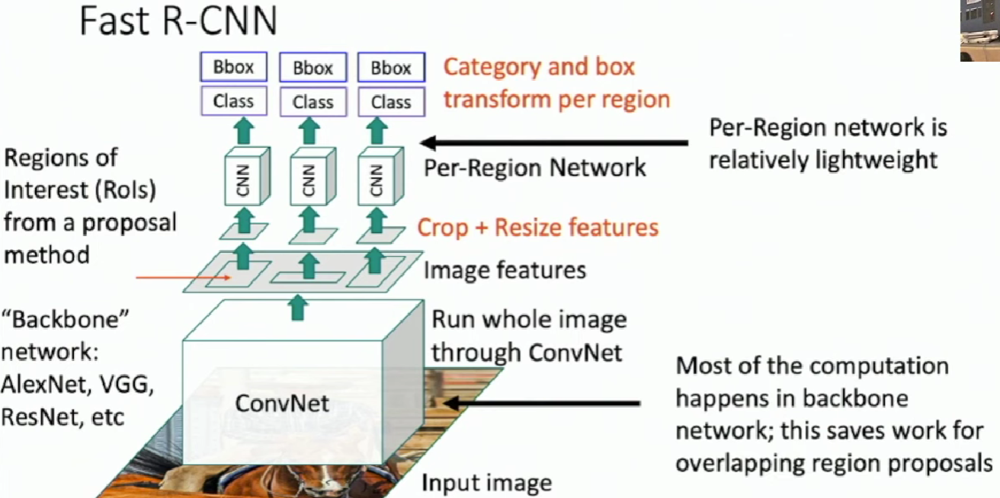
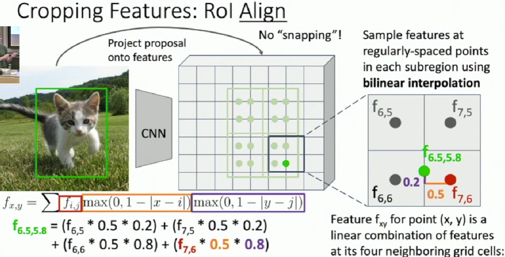
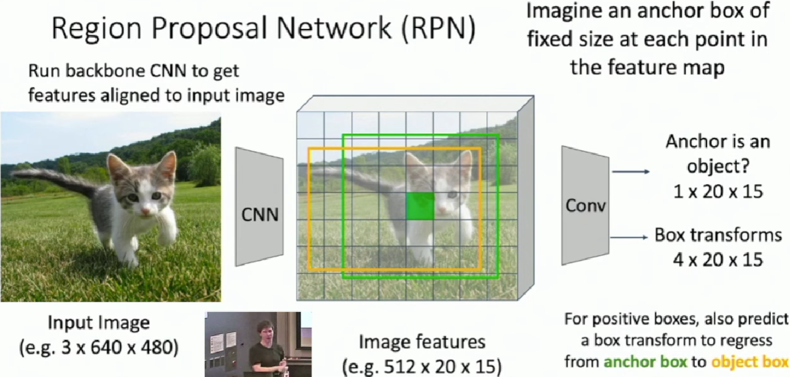
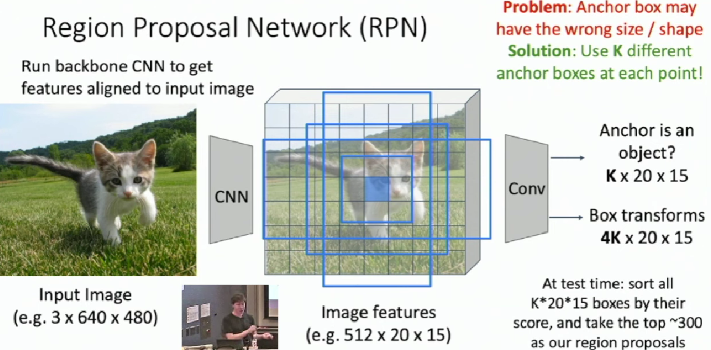

# Object Detection
**Input**: Single RGB Image

**Output**: A set of detected objects;

For each object predict:

* Category label (from fixed, known set of categories)
* Bounding box (four numbers: x, y, width, height)

**Challenges**:

- Multiple outputs: Need to output variable numbers of objects per image
- Multiple types of output: Need to predict "what" (category label) as well as "where" (bounding box)
- Large images: Classification works at 224x224; need higher resolution for detection, often ~800x600

## Detecting a single object

## Detecting Multiple Objects

Need different numbers of outputs per image

### Sliding Wingdow 

Apply a CNN to many different crops of the image, CNN classifies each crop as object or background.

**Question**: There are many possible boxes in an image of size $H\times W$. Total possible boxes: $\frac{H(H+1)}{2}\frac{W(W+1)}{2}$

### Region Proposals

* Find a small set of boxes that are likely to cover all objects
* Often based on heuristics: e.g. look for "blob-like" image regions
* Relatively fast to run; e.g. Selective Search gives 2000 region proposals in a few seconds on CPU

### R-CNN: Region-Based CNN

We can use region proposal method like selective search to get some region proposals in the image with different sizes and different aspect ratios.

Then we warp these region to a same size and forward them throusgh ConvNet.

Here if we only output the predicted class in each ConvNet, the box be may not accurate. So we introduce **bounding box regression** to predict "tranform" to correct the box: 4 numbers $(t_{x},t_{y},t_{h},t_{w})$. Now our CNN is going to output an additional thing, which is a transformation that will transform the region proposal box into the final box that we want.

Region proposal: $(p_{x},p_{y},p_{h},p_{w})$

Transform: $(t_{x},t_{y},t_{h},t_{w})$, which is one of the output of convnet

Final bex: $(b_{x},b_{y},b_{h},b_{w})$

Translate relative to box size: $b_{x}=p_{x}+p_{w}t_{x}\qquad b_{y}=p_{y}+p_{h}t_{y}$

Log-space scale transform: $b_{w}=p_{w}exp(t_{w})\qquad b_{h}=p_{h}exp(t_{h})$

The way we parameterize the transformation is invariant to the location and the scale of the box.

**Test-time**:

* Run region proposal method to compute ~2000 region proposals
* Resize each region to 224x224 and run independently through CNN to predict class scores and bbox transform
* Use scores to select a subset of region proposals to output (Many choices here: threshold on background, or per-category? Or take top K proposals per image?)
* Compare with ground-truth boxes

## Comparing Boxes: Intersection over Union(IoU)

How can we compare our prediction to the ground-truth box?

Intersection over Union (IoU)(Also called "Jaccard similarity" or
"Jaccard index"): $\frac{Area of Intersection}{Area of Union}$

IoU > 0.5 is "decent".
IoU > 0.7 is "pretty good".
IoU > 0.9 is "almost perfect".

## Overlapping Boxes: Non-Max Supperssion(NMS)

**Problem**: Object detectors often output many overlapping detections, which are detecting the same object but in different boxes.

**Solution**: Post-process raw detections using Non-Max Suppression (NMS)

1. Select next highest-scoring box

2. Eliminate lower-scoring boxes with loU > threshold (e.g. 0.7)

3. If any boxes remain, GOTO 1

**Problem**: NMS may eliminate "good" boxes when objects are highly overlapping ... no good solution 

## Evaluating Object Detectors: Mean Average Precision(mAP)

* Run object detector on all test images (with NMS)

* For each category, compute Average Precision (AP) = area under Precision vs Recall Curve

    * For each detection (highest score to lowest score)

        * If it matches some GT box with loU > 0.5, mark it as positive and eliminate the GT
        
        * Otherwise mark it as negative
        
        * Plot a point on PR Curve
    
    * Average Precision (AP) = area under PR curve

* Mean Average Precision (mAP) = average of AP for each category

* For "COCO mAP": Compute mAP@thresh for each loU threshold (0.5, 0.55, 0.6, ... , 0.95) and take average

> How to get AP = 1.0: Hit all GT boxes with loU > 0.5, and have no "false positive" detections ranked above any "true positives"

## Fast R-CNN

## Cropping Features: Rol Pool

First, we project proposal onto features. The projected region may not align with the grid cells so we have to "snap" them to fit the grid cells.

Then we divide these regions into 2x2 grid of (roughly) equal subregions. Max-pool within each subregion to get the region features. So region features always the same size even if input regions have different sizes.

**Problem**:

* Misaligned features due to snapping

* Can't backprop to box coordinates

## Cropping Features: Rol Align
We still divide the projected proposal into equal-size subregion. But instead of snapping, we're going to sample a fixed number of regularly-spaced points inside each subregion. These points may not align with the grid. Here we use bilinear interpolation.

After sampling, max-pool in each subregion.

Output features now aligned to input box! And we can backprop to box coordinates!
## Faster R-CNN: Learnable Region Proposals

We eliminate the heuristic algorithm called selective search and instead train a CNN to predict region proposals.

Compared to Fast R-CNN, we insert **Region Proposal Network(RPN)** after feature map to predict porposals from features.

Otherwise same as Fast R-CNN: Crop features for each proposal, classify each one.

## Region Proposal Network(RPN)

Now in Faster R-CNN, we jointly train with 4 losses:

* RPN classification: anchor box is object / not an object
* RPN regression: predict transform from anchor box to proposal box
* Object classification: classify proposals as background / object class
* Object regression: predict transform from proposal box to object box

Faster R-CNN is a **Two-stage object detector**

**First stage**: Run once per image
* Backbone network
* Region proposal network

**Second stage**: Run once per region
* Crop features: Rol pool / align
* Predict object class
* Prediction bbox offset

## Single-Stage Object Detection

Just like the RPN in faster R-CNN except that rather than classfying the anchor boxes as object or not object, instead we'll just make a full classification decision for the category of the object right here.