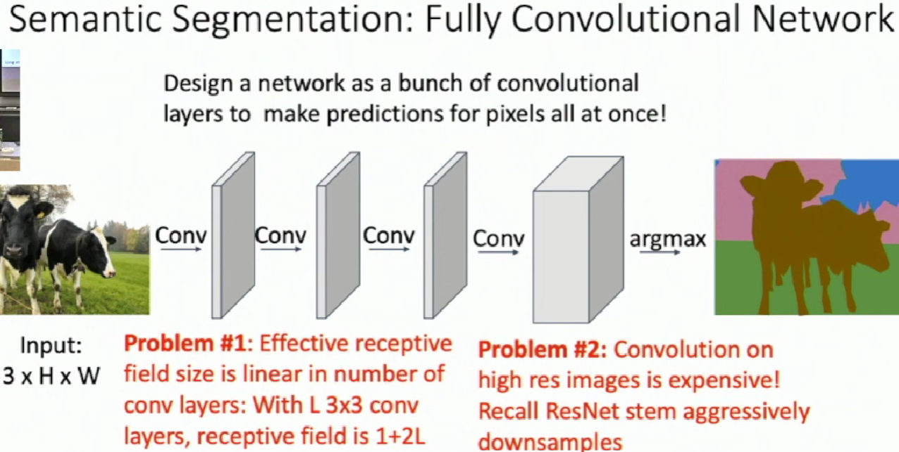
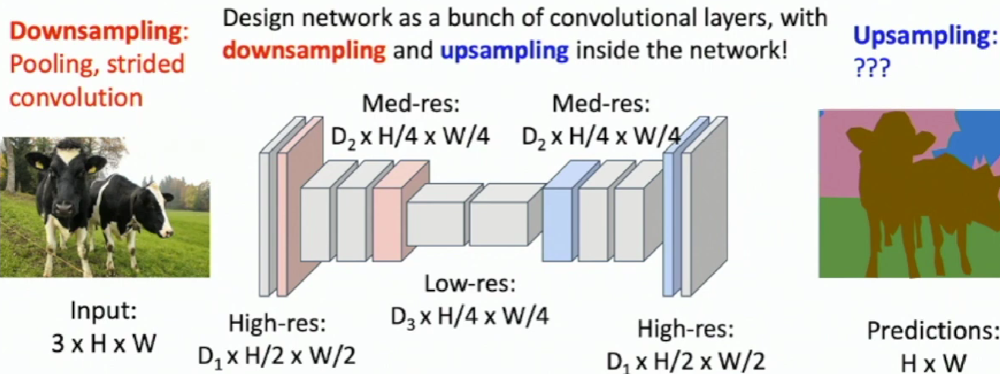
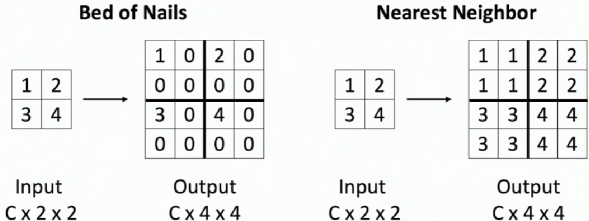
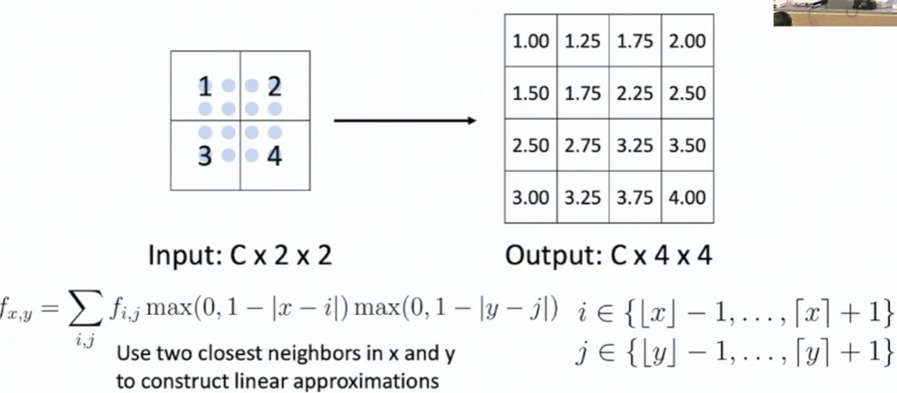
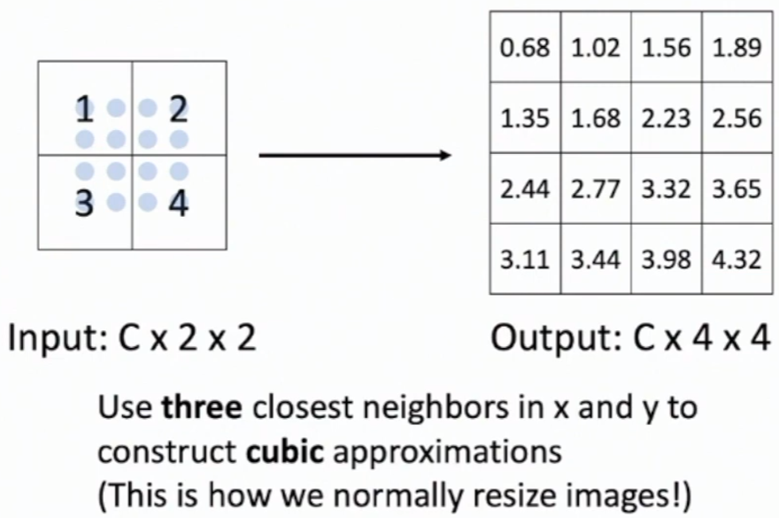
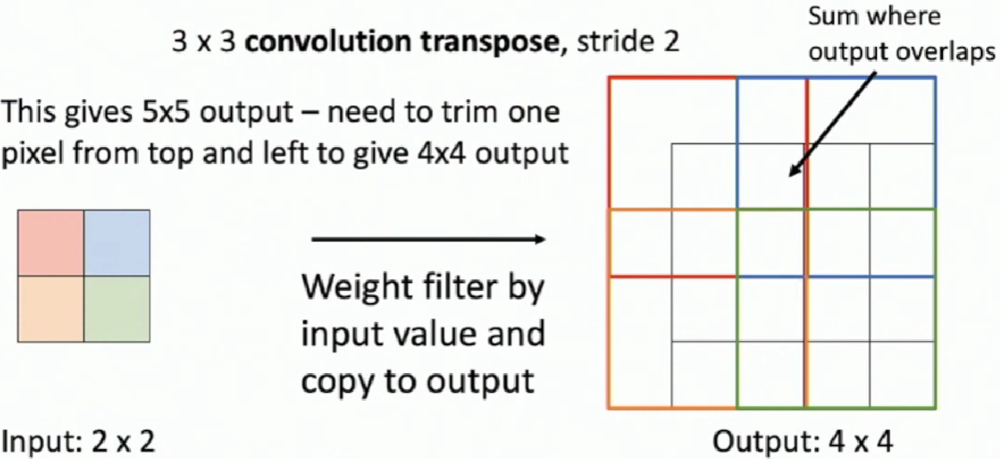
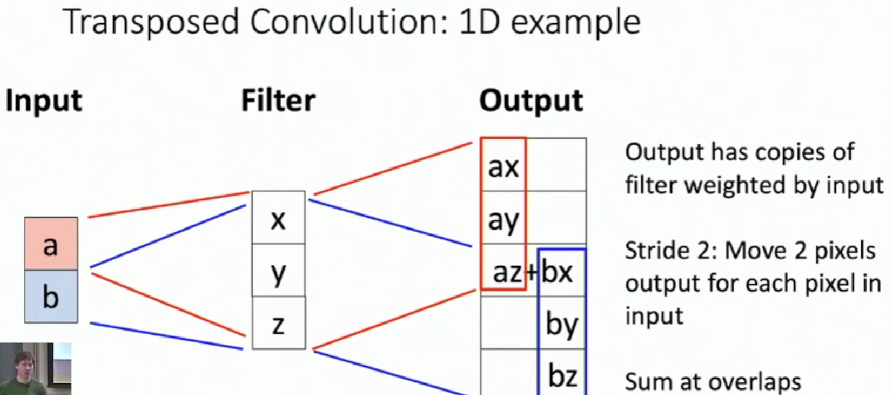
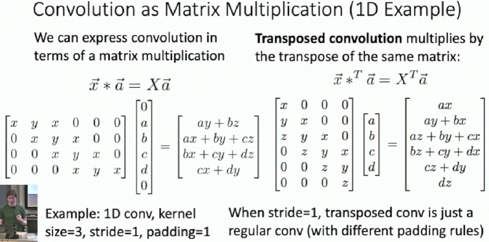

# Semantic Segmentation

Label each pixel in the image with a category label. Don't differentiate instances, only care about pixels

## Sliding Window

For every pixel, extract a patch centered it and input to CNN to get the label for that pixel.

**Problem**: Very inefficient! Not reusing shared features between overlapping patches.

## Fully Convolutional Network

## In-Network Upsampleing: "Unpooling"

**Bilinear Interpolation**

**Bicubic Interpolation**

**Max Unpooling**

Pair each downsampling layer with an upsampling layer

When Max Pooling, Remember which position had the max

When Max Unpooling, Place the value into remembered positions, while filling other positions with 0.

**Transposed Convolution**

Convolution with stride > 1 is "Learnable Downsampling"

Can we use stride < 1 for "Learnable Upsampling"?

