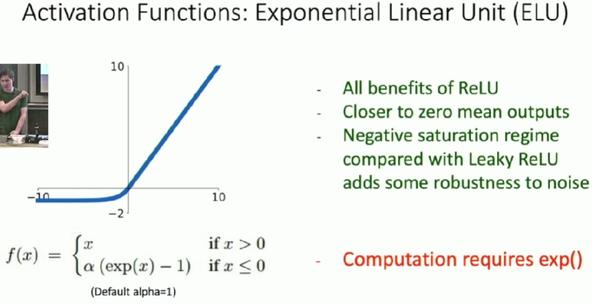
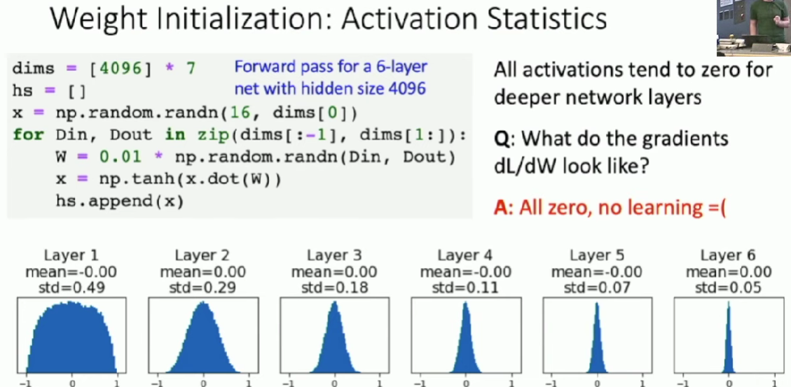
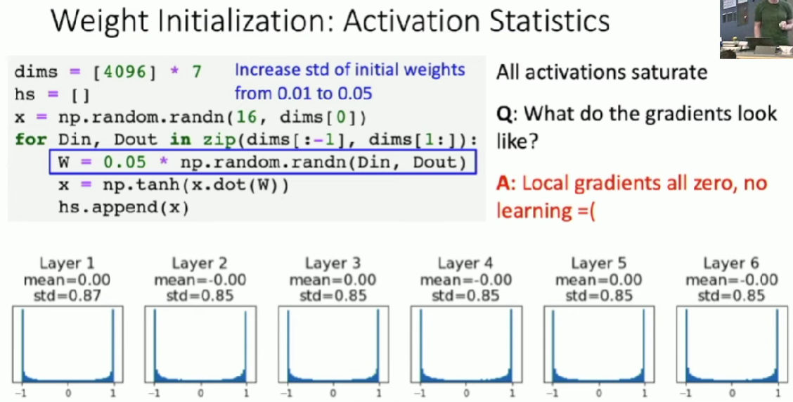
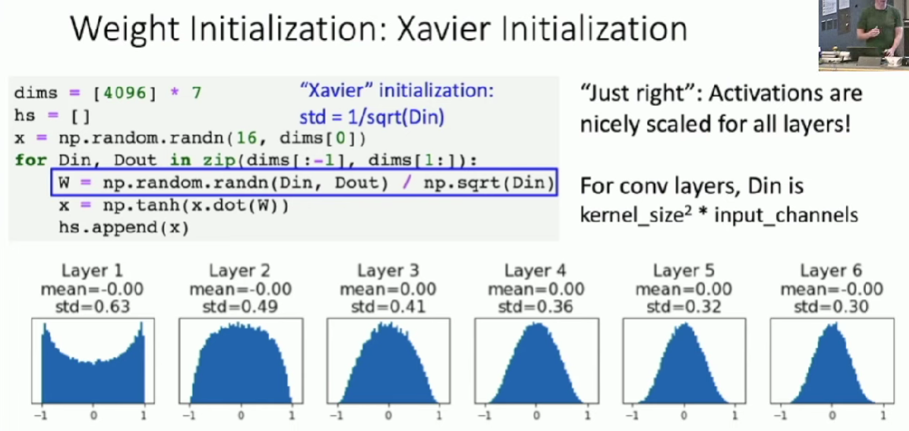
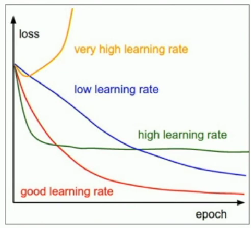
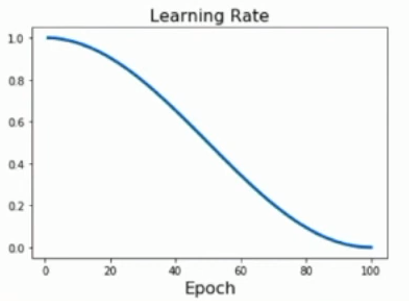

# Deep Learning for Computer Vision
## Train Neural Network
### One time setup
#### Activation functions
**Sigmoid**: $\sigma(x)=1/(1+e^{-x})$

* Squashes numbers to range $[0,1]$
* problems:
    * Saturated neurons "kill" the gradients
    * Sigmoid outputs are not zero-centered
    * exp() is a bit compute expensive

**Tanh**

* Squashes numbers to range $[-1,1]$
* zero centered(nice)
* still kill gradients when saturated

**ReLU**: $f(x)=max(0,x)$

* Does not saturate in positive region
* Very computationally efficient
* COnverges much faster than sigmoid/tanh in practice
* Problems:
    * Not zero-centered output
    * When x < 0, the gradient will also be zero, which may cause it never update.

**Leaky ReLU**: $f(x)=max(0.01x,x)$

* Does not saturate
* Very computationally efficient
* COnverges much faster than sigmoid/tanh in practice
* will not "die" like ReLU
* We can introduce learnable parameter $\alpha$, which is call PReLU(Parametric Rectifier): $f(x)=max(\alpha x,x)$

#### Data Preprocessing
* Subtract the mean image(AlexNet)
* Subtract per-channel mean(VGGNet)
* Subtract per-channel mean and divide by per-channel std(ResNet)
* Others
    * PCA: data has diagonal covariance matrix
    * whitening: covariance matrix is the identity matrix

#### Weight Initialization
**Q**: What happens if we initialize all $W=0, b=0$?

**A**: All outputs are zero and weights will never update.

**Small random values**

**Big random values**

**Xavier Initialization**

* **Derivation**: Varience of output = Variance of input

$$
y=Wx\qquad \qquad \qquad \qquad y_{i}=\sum_{j=1}^{Din}x_{j}w_{j} \\
\begin{align}
Var(y_{i})&=Din\times Var(x_{i}w_{i}) \qquad &\text{Assume x, w are iid}\\
&=Din\times (E[x_{i}^{2}]E[w_{i}^{2}]-E[x_{i}]^{2}E[w_{i}]^{2}) \qquad &\text{Assume x, w independent}\\
&=Din\times Var(x_{i})\times Var(w_{i})\qquad &\text{Assume x, w are zero-mean} \\
\end{align}
\\
\text{If }Var(w_{i})=1/Din\text{ then }Var(y_{i})=Var(x_{i})
$$

Unfortunately, this initialization tends to be bad when we use ReLU as activation function.

**Kaiming / MSRA Initialization**
* ReLU correction: std = sqrt(2 / Din)

"Just right" - activations nicely scaled for all layers.

Not do well in Residual Networks.

If we initialize with MSRA: then $Var(F(x))=Var(x)$. But then $Var(F(x)+x)>Var(x)$ - variance grows with each block!

* Solution: Initialize first conv with MSRA, initialize second conv to zero. Then $Var(x+F(x))=Var(x)$

#### Regularization
In common use: L2 regularization, L1 regularization ...

**Dropout**
In each forward pass, randomly set some neurons to zero. Probability of dropping is a hyperparameter. 0.5 is common

Forces the network to have a redundant representation. Prevents co-adaptation of features.

Another interpretation: Dropout is training a large ensemble of models (that share parameters). Each binary mask is one model

* Test Time: We need to take another way to compute output when testing or our output will be random.
    * We want to "average out" the randomness at test-time. That is, multiply the result without dropout by dropout probobility.

**Inverted Dropout**
Drop and scale layer during training, 

#### Data Augmentation
Tranform input training image before feeding it into the network. Horizontal flips is one example. This augments the amount of data and keep their label unchanged.

**Random Crops and Scales**

* Training: sample random crops / scales

    * Pick random L in range [256, 480]
    * Resize training image, short side = L
    * Sample random 224 x 224 patch

* Testing: average a fixed set of crops
    * Resize image at 5 scales: {224, 256, 384, 480, 640}
    * For each size, use 10 224 x 224 crops: 4 corners + center, + flips

### Training Dynamics
#### Learning rate schedules

We can Start with large learning rate and decay over time.

**Step Schedule**

Step: Reduce learning rate at a few fixed points. 

E.g. for ResNets, multiply LR by 0.1 after epochs 30, 60, and 90.

* Problem: introduce additional hyperparameters we have to tune.

**Cosine Schedule**: $\alpha_{t}=\frac{1}{2}\alpha_{0}(1+cos(t\pi /T))$

**Linear Schedule**: $\alpha_{t}=\alpha_{0}(1-t/T)$

**Inverse Sqrt**: $\alpha_{t}=\alpha_{0}/\sqrt{t}$

**Constant**: $\alpha_{t}=\alpha_{0}$

* Early Stopping: Stop training the model when accuracy on the validation set decreases. Or train for a long time, but always keep track of the model snapshot that worked best on val. Always a good idea to do this!

#### hyperparameter optimization
**Grid Search**

Choose several values for each hyperparameter(Often space choices log-linearly).

Example:

Weight decay: [1x10-4, 1x10-3, 1x10-2, 1x10-1], Learning rate: [1x10-4, 1x10-3, 1x10-2, 1x10-1]

Evaluate all possible choices on this hyperparameter grid.

**Random Search**

Randomly choose several values for each hyperparameter in a given range(Often space choices log-linearly)

Example:

Weight decay: log-uniform on [1x10-4, 1x10-1], Learning rate: log-uniform on [1x10-4, 1x10-1]

* Jump out of the grid and may have a better performance when some parameters are not important.

**Choosing hyperparameters:**

**Step 1**: Check initial loss

Turn off weight decay, sanity check loss at initialization

**Step 2**: Overfit a small sample

Try to train to 100% training accuracy on a small sample of training data (~5-10 minibatches); fiddle with architecture, learning rate, weight initialization. Turn off regularization.

Loss not going down? LR too low, bad initialization

Loss explodes to Inf or NaN? LR too high, bad initialization

**Step 3**: Find LR that makes loss go down

Use the architecture from the previous step, use all training data, turn on small weight decay, find a learning rate that makes the loss drop significantly within ~100 iterations

**Step 4**: Coarse grid, train for ~1-5 epochs

**Step 5**: Refine grid, train longer

**Step 6**: Look at loss curves

**Step 7**: GOTO step 5

### After training
#### Model ensembles

1. Train multiple independent models

2. At test time average their results

#### Transfer learning
1. Train on Imagenet

2. Use CNN as a feature extractor. Remove those fully connected layers in the last and freeze other layers.

3. Bigger dataset: **Fine-Tuning**

Reinitialize those last layer to new layers and continue training CNN for new task.

**Some tricks**:

- Train with feature extraction first before fine-tuning

- Lower the learning rate: use ~1/10 of LR used in original training

- Sometimes freeze lower layers to save computation
#### Large-batch training
How to scale up on data-parallel training on K GPUs?

**Goal:** Train for same number of epochs, but use larger minibatches. We want model to train K times faster

Single-GPU model: batch size N, learning rate $\alpha$

K-GPU model: batch size KN, learning rate $K\alpha$