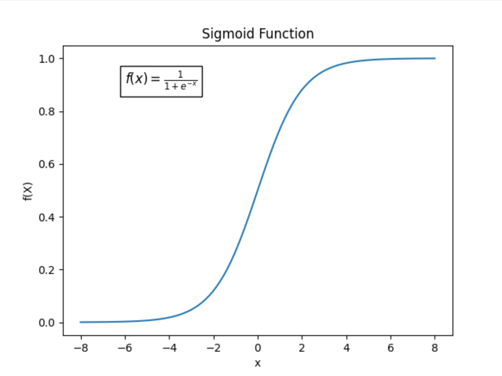

# Neural Networks and Deep Learning
## Introduction
### Neural Network


* Use the given input x to predict output y. Inputs are called input layer.
* the circles are called hidden units, use input features to output another features. The units in a column are called a hidden layer.

### Supervised Learning
* Structured Data: Basically databases of data. Each of the features has a defined meaning.
* Unstructured Data: Data like audio, image and text.
### Drivers behind deep learning
* Scale: Large NN performs much better with a large amount of labeled data. 
* Algorithms: From sigmoid to ReLU to solve gradient descend.
* Computation
## Neural Network Basics
### Binary Classification
Learn a classifier that can input a feature vector x and predict the corresponding label y is 1 or 0.
#### Notation
* $(x,y)$: A single training example where $x$ is a $n_{x}$ dimension feature vector and $y$, the label, is either 0 or 1.

* $m$: Number of training examples. Training examples are denoted from $(x^{(1)},y^{(1)})$ to $(x^{(m)},y^{(m)})$

* matrix $X$ represents training examples in a compact way.

$$
X=
\begin{bmatrix}
\vdots & \vdots & \cdots & \vdots \\
x^{(1)} & x^{(2)} & \dots & x^{(m)} \\
\vdots & \vdots & \cdots & \vdots
\end{bmatrix}
$$

The width and height of the matrix are $m$ and $n_{x}$ respectively.

* Label $y$ can also be denoted by stacking $y$ in columns.

$$
Y=
\begin{bmatrix}
y^{(1)} & y^{(2)} & \dots & y^{(m)}
\end{bmatrix}
$$

#### Logistic Regression
Given an input feature vector $x \in R^{n_{x}}$, we want to get $\hat{y}=P(y=1|x)$ as the probability of the chance that $y$ is equal to 1.

When  implementing logistic regression, our job is to learn the parameters $w \in R^{n_{x}}$ and $b \in R$, so that $\hat{y}$ can be got by the following way:

$$
\hat{y}=\sigma (w^{T}x+b)
$$

$\sigma(z)=\frac{1}{1+e^{-z}}$, the sigmoid function, is used to map the result in the parenthesis to $[0,1]$ for $\hat{y}$ is the probability.
<figure markdown>
    {width="50%"}
</figure>

#### Logistic Regression cost function
* Denote $z^{(i)}=w^{T}x^{(i)}+b$ and $\hat{y}^{(i)}=\sigma(z^{(i)})$

* Goal: Given $\{(x^{(1)},y^{(1)}),\dots,(x^{(m)},y^{(m)})\}$, want $\hat{y}^{(i)}\approx y^{i}$.

* Loss(error) function: A function to measure how good our prediction $\hat{y}$ is on a single example. The small the loss function value, the better our prediction. Denoted by $\mathcal L(\hat{y},y)$. Some common functions are shown below.
    * $\mathcal L(\hat{y},y)=\frac{1}{2}(\hat{y}-y)^{2}$
    * $\mathcal L(\hat{y},y)=-(ylog\hat{y}+(1-y)log(1-\hat{y}))$

* Cost function: measures how well you are doing on the entire training set.

$$
J(w, b)=\frac{1}{m}\sum^{m}_{i=1}\mathcal L(\hat{y}^{(i)},y^{(i)})
$$

The function here is a convex function with global optimal.
#### Gradient Descent
* Goal: Find $w,b$ that minimize $J(w,b)$.


* Gradient Descent: initialize parameters with some values and repeatedly update them in the opposite gradient direction. Take $w$ for example:

$$
Repeat\{
    w:=w-\alpha\frac{dJ(w)}{dw}
\}
$$

* $\alpha$: Learning rate, controls how big a step we take on each iteration.

#### Derivatives with a Computation Graph
* Computation Graph: Assume wew want to compute $J=3(a+bc)$

* $\frac{dJ}{db}=\frac{dJ}{dv}\frac{dv}{du}\frac{du}{db}$
* Logistic regression derivatives:

    * In programming, we use `dx` to represent $\frac{dL}{dx}$. `x` can be any variable here such as `a`, `z` and so on.
    * `da`$=\frac{dL}{da}=-\frac{y}{a}+\frac{1-y}{1-a}$
    * `dz`$=\frac{dL}{da}\frac{da}{dz}=(-\frac{y}{a}+\frac{1-y}{1-a})a(1-a)=a-y$
    * `dw1`$=\frac{dL}{dw_{1}}=$`dz`$\frac{dz}{dw_{1}}=x_{1}$`dz`
    * `db`$=$`dz`

#### Logistic regression on m examples
We know that 

$$
J(w, b)=\frac{1}{m}\sum^{m}_{i=1}\mathcal L(\hat{y}^{(i)},y^{(i)})
$$

So when computing derivatives on $J$, we just need to take the average of derivatives on $\mathcal L^{(i)}$.
i.e. `dw1`$=\frac{1}{m}\sum_{i=1}^{m}$`dw1`$^{(i)}$, `db`$=\frac{1}{m}\sum_{i=1}^{m}$`db`$^{(i)}$

The algorithm is shown below:

$$
\begin{aligned}
J=0;dw&1=0;dw2=0;db=0; \\
for \ \ i=1& \ \ to \ \ m: \\
&z^{i}=w^{T}x^{i}+b\\
&a^{i}=\sigma(z^{(i)})\\
&J+=-[y^{(i)}loga^{(i)}+(1-y^{(i)})log(1-a^{(i)})]\\
&dz^{(i)}=a^{(i)}-y^{(i)}\\
&dw1+=x_{1}^{(i)}dz^{(i)}\\
&dw2+=x_{2}^{(i)}dz^{(i)}\\
&db+=dz^{(i)}\\
J/=m;d&w1/=m;dw2/=m;db/=m;
\nonumber
\end{aligned}
$$

### Python and Vectorization
#### Vectorization
Vectorization can significantly speed up calculation compared to using explicit `for` loops.

=== "Vectorization"
    ```py
    import numpy as np
    a = np.random.rand(1000000)
    b = np.random.rand(1000000)
    c = np.dot(a, b)
    ```
=== "For Loop"
    ```py
    import numpy as np
    a = np.random.rand(1000000)
    b = np.random.rand(1000000)
    c = 0
    for i in range(1000000):
        c += a[i] * b[i]
    ```

If we use `time()` function in `time` library to check the time comsuming, we will find that the Vectorization is hundreds of times faster than for loop.

One criterian is that always using built-in functions in Python or Numpy instead of explicit for loop.

Now we can apply vectorization to logistic regression.

When it comes to compute the prediction, recap the defination of matrix $X$.

Here we define matrix $Z$ and $A$. Note that $z^{(i)}=w^{T}x^{(i)}+b$ and $a^{(i)}=\sigma(z^{(i)})$

$$
Z=
\begin{bmatrix}
z^{(1)} & z^{(2)} & \dots & z^{(m)} 
\end{bmatrix}
\\
=w^{T}X+
\begin{bmatrix}
b & b & \dots & b 
\end{bmatrix}
\\
A=\begin{bmatrix}
a^{(1)} & a^{(2)} & \dots & a^{(m)} 
\end{bmatrix}
$$

If writen in Python:
```py
Z = np.dot(w.T, X) + b
A = sigmoid(Z)
dZ = A - Y
dw = np.dot(X, dZ.T) / m
db = np.sum(dZ) / m
w = w - alpha * dw
b = b - alpha * db
```
A for loop is still needed to control the iteration times.

## Shallow Neural Networks