# Animation

Animation bring things to life

* Communication tool 

* Aesthetic issues often dominate technical issues 

An extension of modeling 

* Represent scene models as a function of time 

Output: sequence of images that when viewed sequentially provide a sense of motion 

* Film: 24 frames per second 

* Video (in general): 30 fps 

* Virtual reality: 90 fp

## Keyframe Animation

* Animator (e.g. lead animator) creates keyframes 

* Assistant (person or computer) creates in-between frames ("tweening")

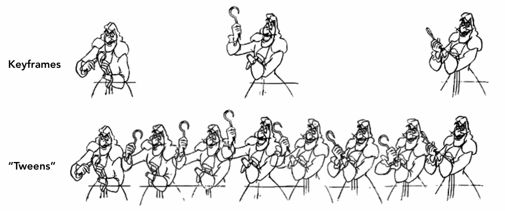{ width="80%" }

### Keyframe Interpolation

* Think of each frame as a vector of parameter values

* For each parameters, we can use, for example, splines for smooth / controllable interpolation

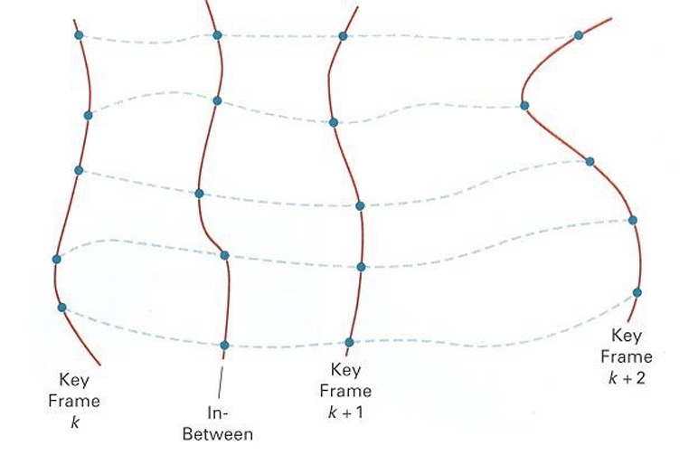{ width="70%" }

## Physical Simulation

Construct the phisical model, using phisical formulas to calculate the motion of objects

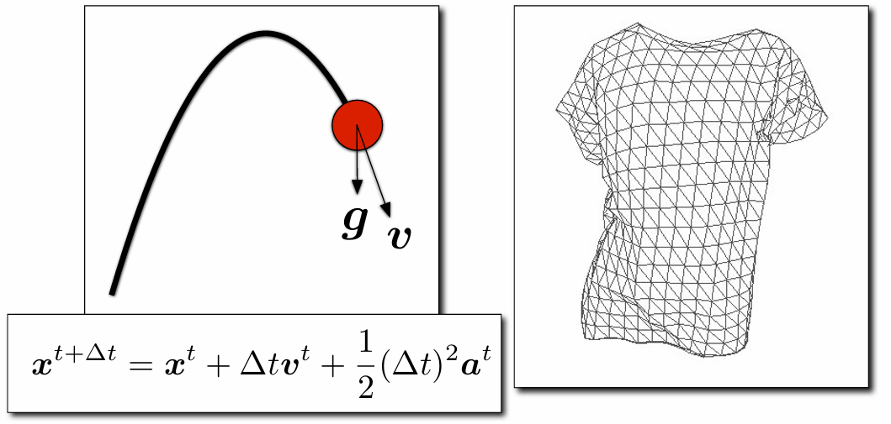{ width="70%" }

For fluids, 

* First simulate the motion to get the position, shape of fluids

* Then render the scene to get what it looks like

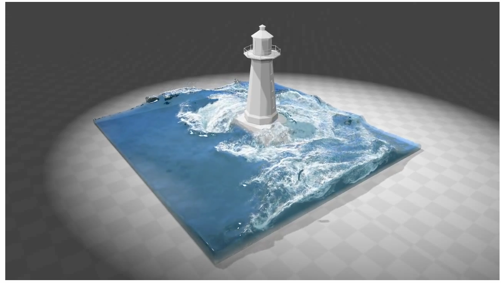{ width="70%" }

### Mass Spring System

Using a set of connected mass and spring to simulate the motion of rope, hair, cloth, etc...

#### A Simple Spring

Idealized Spring: 

* Force pulls points together

* Strength proportional to displacement (Hooke's Law)  

* $k_s$ is a spring coefficient: stiffness  

* Problem: this spring wants to have zero length

$$\boldsymbol{f}_{a\rightarrow b}=k_s(\boldsymbol{b}-\boldsymbol{a}), \quad \boldsymbol{f}_{b\rightarrow a}=-\boldsymbol{f}_{a\rightarrow b}$$

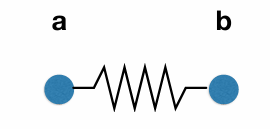{ width="40%" }

For Non-Zero Length Spring:

$$
\boldsymbol{f}_{a \rightarrow b} = k_s \frac{\boldsymbol{b} - \boldsymbol{a}}{\|\boldsymbol{b} - \boldsymbol{a}\|} (\|\boldsymbol{b} - \boldsymbol{a}\| - l)
$$

* where $l$ is the non-zero rest length

* Problem: it will oscillates forever

#### Energy Loss

Here we use the dot notation for derivatives: 

* If $\boldsymbol{x}$ is a vector for the position of a point of interest, we will use  dot notation for velocity and acceleration: $\dot{\boldsymbol{x}}=\boldsymbol{v} \quad\ddot{\boldsymbol{x}}=\boldsymbol{a}$

We can introduce the damping force to make the motion stop

* Simple motion damping: $\boldsymbol{f}=-k_d\dot{\boldsymbol{b}}$

    * Behaves like viscous drag on motion 

    * Slows down motion in the direction of velocity 

    * $k_d$ is a damping coefficient 

* Problem: slows down all motion

    * we want a rusty spring's oscillations to slow down, but should it also fall to the ground more slowly? 

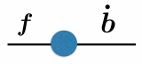{ width="40%" }

Here comes Internal Damping for Spring, Damp only the internal, spring-driven motion

$$
\boldsymbol{f}_{\boldsymbol{b}}=-k_d\left({\frac{\boldsymbol{b}-\boldsymbol{a}}{||\boldsymbol{b}-\boldsymbol{a}||}\cdot(\dot{\boldsymbol{b}}-\dot{\boldsymbol{a}})}\right)\frac{\boldsymbol{b}-\boldsymbol{a}}{||\boldsymbol{b}-\boldsymbol{a}||}
$$

* where: 

    * $\boldsymbol{f}_{\boldsymbol{b}}$ is the damping force applied on $b$

    * $\frac{\boldsymbol{b}-\boldsymbol{a}}{||\boldsymbol{b}-\boldsymbol{a}||}$ is the direction from $a$ to $b$

    * ${\frac{\boldsymbol{b}-\boldsymbol{a}}{||\boldsymbol{b}-\boldsymbol{a}||}\cdot(\dot{\boldsymbol{b}}-\dot{\boldsymbol{a}})}$ is the relative velocity projected to the direction from $a$ to $b$ (scalar)

* Viscous drag only on change in spring length

    * Won't slow group motion for the spring system  (e.g. global translation or rotation of the group)

* Note: This is only one specific type of damping

## Particle System

{ width="80%" align=left}

Model dynamical systems as collections of large numbers of particles 

Each particle's motion is defined by a set of physical (or non-physical) forces 

Popular technique in graphics and games 

* Easy to understand, implement 

* Scalable: fewer particles for speed, more for higher complexity 

Challenges 

* May need many particles (e.g. fluids) 

* May need acceleration structures (e.g. to find nearest particles for interactions)

For each frame in animation 

* [If needed] Create new particles  

* Calculate forces on each particle 

* Update each particle's position and velocity 

* [If needed] Remove dead particles 

* Render particles

Particle System Forces: 

* Attraction and repulsion forces 
    
    * Gravity, electromagnetism, ...
    
    * Springs, propulsion, ...

* Damping forces 
    * Friction, air drag, viscosity, ...

* Collisions 

    * Walls, containers, fixed objects, ...

    * Dynamic objects, character body parts, ...

Simulated Flocking as an ODE

* Model each bird as a particle 

* Subject to very simple forces: 

    * attraction to center of neighbors 
    
    * repulsion from individual neighbors 

    * alignment toward average trajectory of neighbors 

Simulate evolution of large particle system numerically 

Emergent complex behavior (also seen in fish, bees, ...)

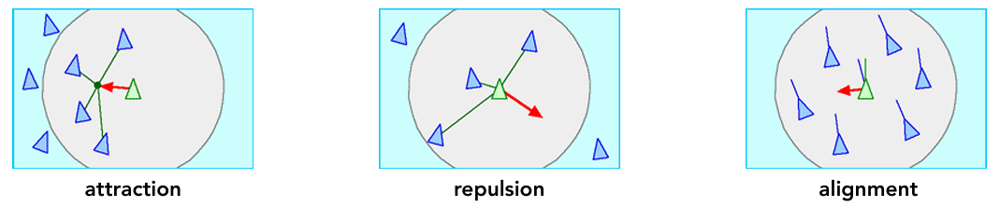{ width="80%"}

## Kinematics

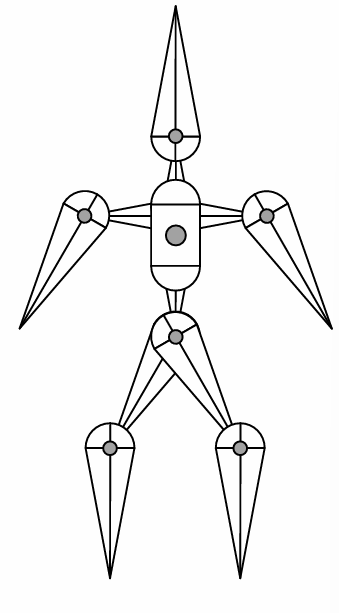{ width="60%" align=right}

Articulated skeleton 

* Topology (what's connected to what) 

* Geometric relations from joints 

* Tree structure (in absence of loops) 

Joint types 

* Pin (1D rotation) 

* Ball (2D rotation) 

* Prismatic joint (translation)

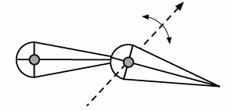{ width="40%" }

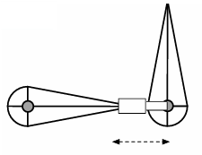{ width="40%"}

### Forwawrd Kinematics

Animator provides angles, and computer determines position $p$ of end effector

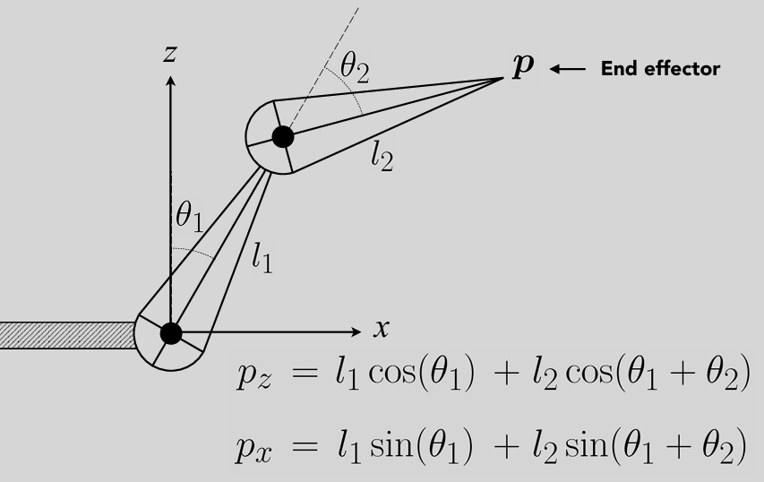{ width="80%"}

Animation is described as angle parameter values as a function of time

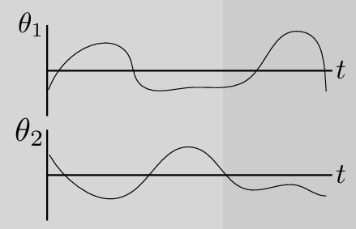{ width="50%"}

Strengths 

* Direct control is convenient 

* Implementation is straightforward 

Weaknesses 

* Animation may be inconsistent with physics 

* Time consuming for artists

### Inverse Kinematics

Animator provides position of end-effector, and computer must determine joint angles that satisfy constraints

Direct inverse kinematics: for two-segment arm, can solve for parameters analytically

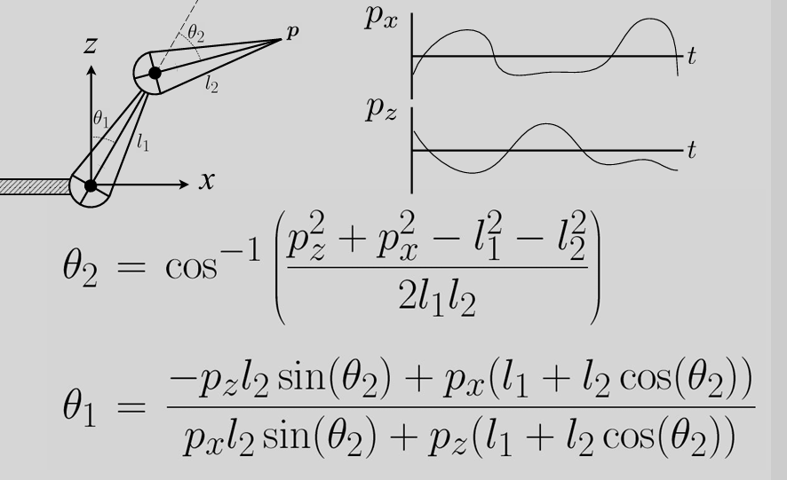{ width="80%"}

Why is the problem hard? 

* Multiple solutions in configuration space

* Solutions may not always exist

Numerical solution to general N-link IK problem 

* Choose an initial configuration 

* Define an error metric (e.g. square of distance between goal and current position) 

* Compute gradient of error as function of configuration 

* Apply gradient descent (or Newton's method, or other optimization procedure)

## Rigging

Rigging is a set of higher level controls on a character that allow more rapid & intuitive modification of pose, deformations, expression, etc.

* Like strings on a puppet 

* Captures all meaningful character changes 

* Varies from character to character 

Expensive to create 

* Manual effort 

* Requires both artistic and technical training

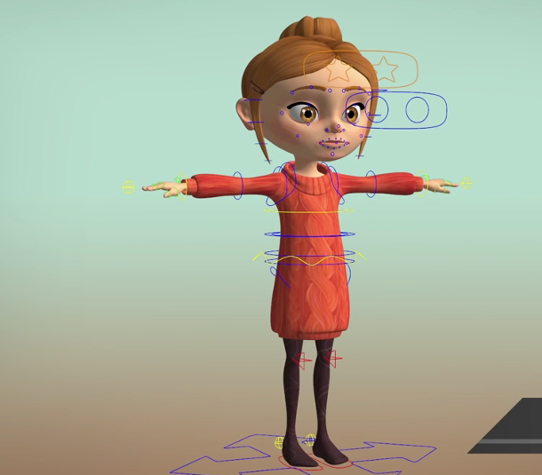{ width="60%"}

### Blend Shapes

Instead of skeleton, interpolate directly between surfaces 

E.g., model a collection of facial expressions: 

Simplest scheme: take linear combination of vertex positions 

Spline used to control choice of weights over time

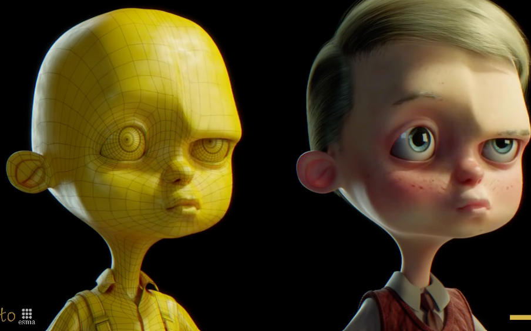{ width="70%"}

## Motion Capture

Data-driven approach to creating animation sequences 

* Record real-world performances (e.g. person executing an activity) 

* Extract pose as a function of time from the data collected

Strengths 

* Can capture large amounts of real data quickly 

* Realism can be high 

Weaknesses 

* Complex and costly set-ups 

* Captured animation may not meet artistic needs, requiring alterations

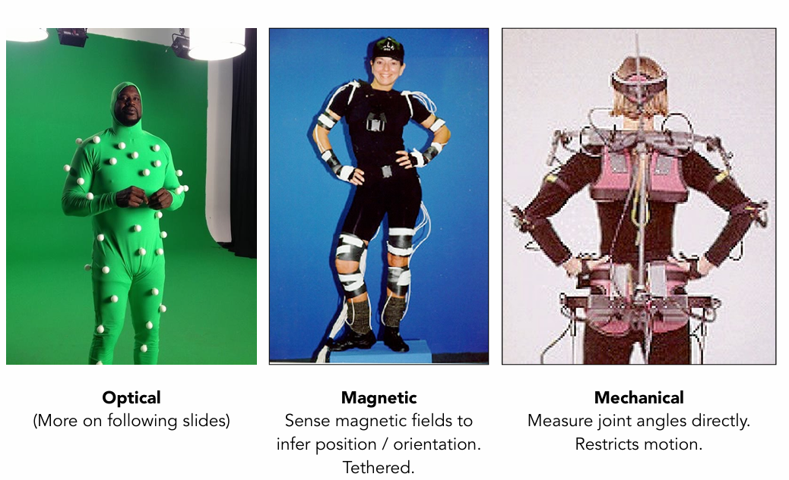{ width="70%"}

Optical Motion Capture:

* Markers on subject  

* Positions by triangulation from multiple cameras  

* 8+ cameras, 240 Hz, occlusions are difficult

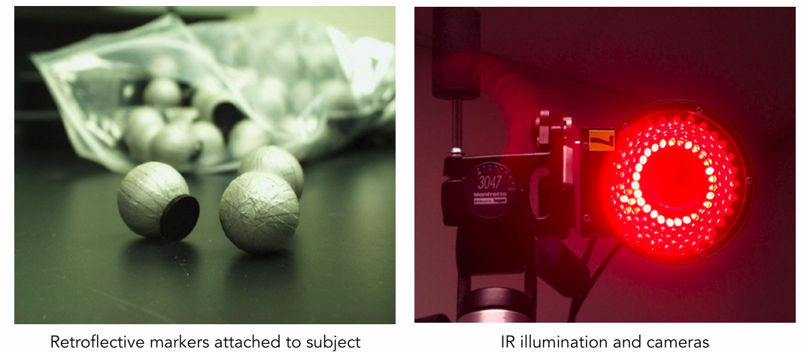{ width="70%"}

Challenges of Facial Animation:  Uncanny valley

* In robotics and graphics 

* As artificial character appearance approaches human realism, our emotional response goes negative, until it achieves a sufficiently convincing level of realism in expression

## The Production Pipeline

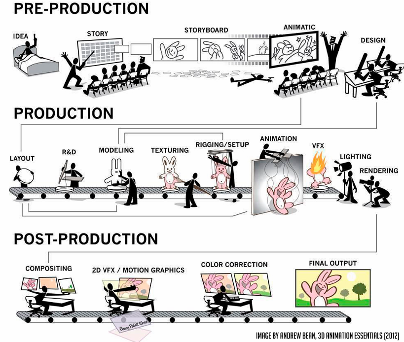{ width="80%"}

## Single Particle Simulation

First study motion of a single particle. Later, generalize to a multitude of particles

To start, assume motion of particle determined by a velocity vector field that is a function of position and time: $v(x,y)$

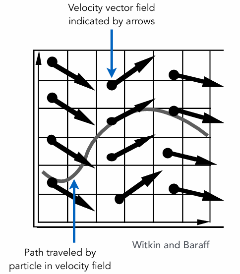{ width="70%"}

We wants to compute the position of particle over time.

* This requires  solving a first order ordinary differential equation: 

$$
\frac{dx}{dt}=\dot{x}=v(x,t)
$$

* "First-order" refers to the first derivative being taken

* "Ordinary" means no "partial" derivatives, i.e. $x$ is just a function of $t$

We can solve the ODE, subject to a given initial particle position $x_0$, by using forward numerical integration

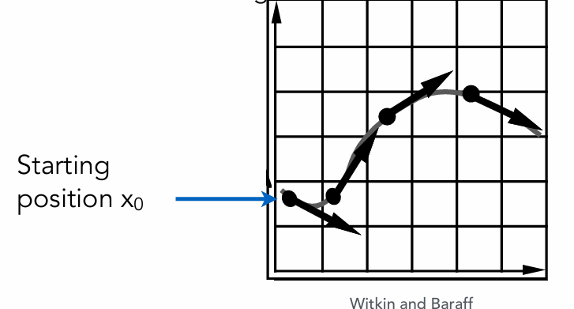{ width="70%"}

### Euler's Method

Euler's Method (a.k.a. Forward Euler, Explicit Euler) 

* Simple iterative method 

* Commonly used 

* Very inaccurate 

* Most often goes unstable

$$
\begin{align*}
\boldsymbol{x}^{t+\Delta{t}}=\boldsymbol{x}^{t}+\Delta t\dot{\boldsymbol{x}}^{t}\\
\dot{\boldsymbol{x}}^{t+\Delta{t}}=\dot{\boldsymbol{x}}^{t}+\Delta t\ddot{\boldsymbol{x}}^{t}
\end{align*}
$$

Errors: 

* With numerical integration, errors accumulate

* Euler integration is particularly bad

*  Large time step has large error

* Errors at each time step accumulate. Accuracy decreases as simulation proceeds 

* Accuracy may not be critical in graphics applications 

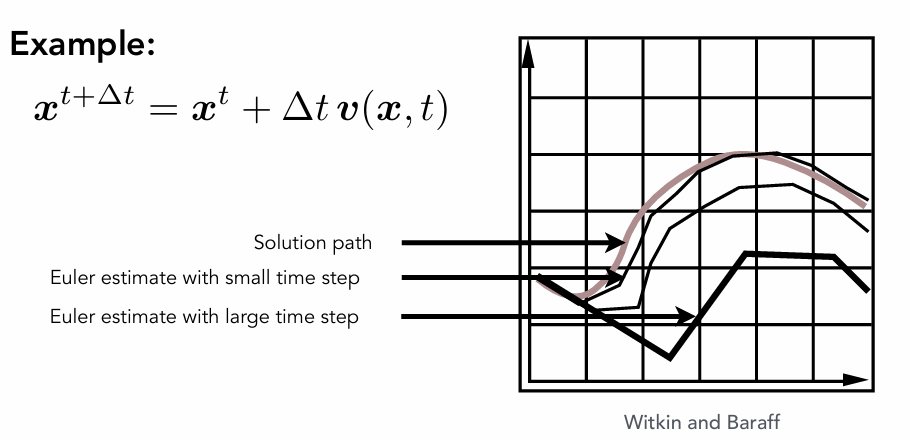{ width="70%"}

Instability: 

* Inaccuracies increase as time step $\Delta t$ increases 

* Instability is a common, serious problem that can cause simulation to diverge

* Errors can compound, causing the simulation to diverge even when the underlying system does not 

* Lack of stability is a fundamental problem in simulation, and cannot be ignored

* For a ripple-like velocity field, the correct behavior of a particle should be to continuously rotate around the center, but Euler's method causes it to move outward in a centrifugal motion.

    * This will always happen no matter how small the time step is.

* For the velocity field as right, the particle will oscillate with incresing amplitude in Euler Method

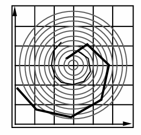{ width="50%" align=left}

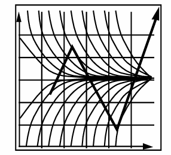{ width="50%"}

### Combating Instability

Midpoint method / Modified Euler 

* Average velocities at start and endpoint  

Adaptive step size 

* Compare one step and two half-steps, recursively, until error is acceptable 

Implicit methods 

* Use the velocity at the next time step (hard) 

Position-based / Verlet integration 

* Constrain positions and velocities of particles after time step

#### Midpoint Method 

Steps:

* Compute Euler step (a) 

* Compute derivative at midpoint of Euler step (b) 

* Update position using midpoint derivative (c) 

$$
\begin{aligned}
x_{\mathrm{mid}} & =x(t)+\Delta t/2\cdot v(x(t),t) \\
x(t+\Delta t) & =x(t)+\Delta t\cdot v(x_{\mathrm{mid}},t)
\end{aligned}
$$

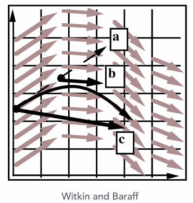{ width="60%"}

#### Modified Euler 

* Average velocity at start and end of step 

* Actually a local quadratic model

* Better results

$$
\begin{aligned}
 & \boldsymbol{x}^{t+\Delta t}=\boldsymbol{x}^{t}+\frac{\Delta t}{2}(\dot{\boldsymbol{x}}^{t}+\dot{\boldsymbol{x}}^{t+\Delta t}) \\
 & 
\dot{\boldsymbol{x}}^{t+\Delta t}=\dot{\boldsymbol{x}}^t+\Delta t\ddot{\boldsymbol{x}}^t \\
 & \boldsymbol{x}^{t+\Delta t}=\boldsymbol{x}^t+\Delta t\dot{\boldsymbol{x}}^t+\frac{(\Delta t)^2}{2}\ddot{\boldsymbol{x}}^t
\end{aligned}
$$

#### Adaptive Step Size

Adaptive step size 

* Technique for choosing step size based on error estimate 

* Very practical technique 

* But may need very small steps! 

Repeat until error is below threshold: 

* Compute $x_T$ an Euler step, size $T$ 

* Compute $x_{T/2}$ two Euler steps, size $T/2$ 

* Compute error $\|x_T-x_{T/2}\|$ 

* If (error > threshold) reduce step size and try again

We may have different step size at different position 

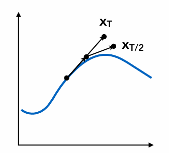{ width="50%" align=left}

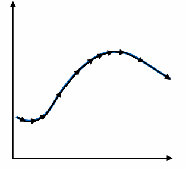{ width="50%"}

#### Implicit Euler Method

* Informally called backward methods 

* Use derivatives in the future, for the current step

    * We don't know the velocity and acceleration of next step in current step

$$
\begin{align*}
&\boldsymbol{x}^{t+\Delta t}=\boldsymbol{x}^t+\Delta t\boldsymbol{\dot{x}}^{t+\Delta t}\\
&\boldsymbol{\dot{x}}^{t+\Delta t}=\boldsymbol{\dot{x}}^t+\Delta t\boldsymbol{\ddot{x}}^{t+\Delta t}
\end{align*}
$$

* Need to solve nonlinear problem for $\boldsymbol{x}^{t+\Delta t}$ and $\dot{\boldsymbol{x}}^{t+\Delta t}$

* Use root-finding algorithm, e.g. Newton's method 

* Offers much better stability

How to determine / quantize "stability"?

* We use the local truncation error (every step) / total accumulated error (overall)

* Absolute values do not matter, but the orders w.r.t. step

* Implicit Euler has order 1, which means that

    - Local truncation error: $O(h^2)$ and
    
    - Global truncation error: $O(h)$ ($h$ is the step, i.e. $\Delta t$)

* Understanding of $O(h)$

    - If we halve $h$, we can expect the error to halve as well

#### Runge-Kutta Families

A family of advanced methods for solving ODEs 

* Especially good at dealing with non-linearity 

* It's order-four version is the most widely used, a.k.a. RK4

Initial Condition: 

$$
\frac{dy}{dt}=f(t,y),\quad y(t_0)=y_0.
$$

RK4 solution: 

$$
\begin{aligned}
 & y_{n+1}=y_n+\frac{1}{6}h\left(k_1+2k_2+2k_3+k_4\right), \\
 & t_{n+1}=t_{n}+h
\end{aligned}
$$

where: 

$$
\begin{aligned}
k_{1} & =f(t_n,y_n), & k_3 & =f\left(t_n+\frac{h}{2},y_n+h\frac{k_2}{2}\right), \\
k_{2} & =f\left(t_n+\frac{h}{2},y_n+h\frac{k_1}{2}\right), & k_4 & =f\left(t_n+h,y_n+hk_3\right).
\end{aligned}
$$

#### Position-based / Verlet integration 

Idea:

* After modified Euler forward-step, constrain positions of particles to prevent divergent, unstable behavior

* Use constrained positions to calculate velocity

* Both of these ideas will dissipate energy, stabilize

Pros / Cons

* Fast and simple

* Not physically based, dissipates energy (error)

### Rigid Body Simulation

Simple case

* Similar to simulating a particle 

* Just consider a bit more properties

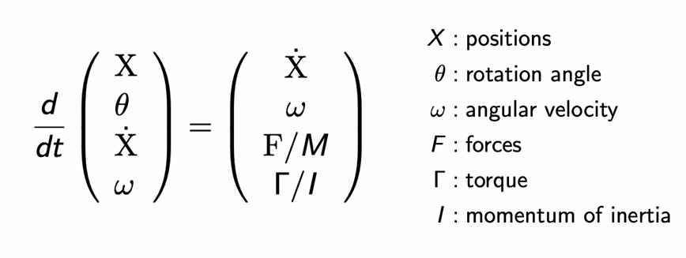{ width="70%"}

## Fluid Simulation

### A Simple Position-Based Method

Key idea 

* Assuming water is composed of small rigid-body spheres 

* Assuming the water cannot be compressed (i.e. const. density) 

* So, as long as the density changes somewhere, it should be “corrected” via changing the positions of particles 

    * Change the position of a particle may effect the position of others

* You need to know the gradient of the density anywhere w.r.t. each particle's position 

* Update? Just gradient descent!

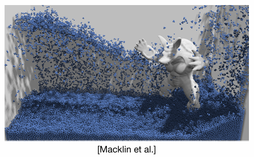{ width="70%"}

### Eulerian vs. Lagrangian

 Two different views to simulating large collections of matters

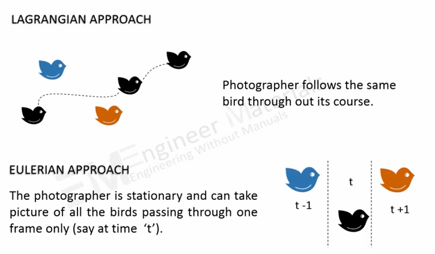{ width="70%"}

### Material Point Method (MPM)
 
Hybrid, combining Eulerian and Lagrangian views 

* Lagrangian: consider particles carrying material properties 

* Eulerian: use a grid to do numerical integration 

* Interaction: particles transfer properties to the grid, grid performs update, then interpolate back to particles