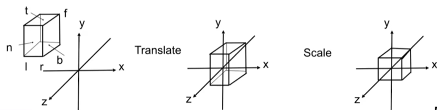
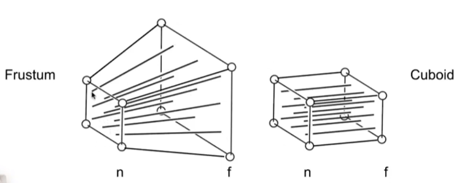
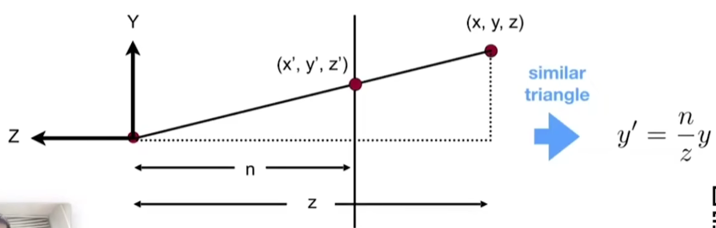
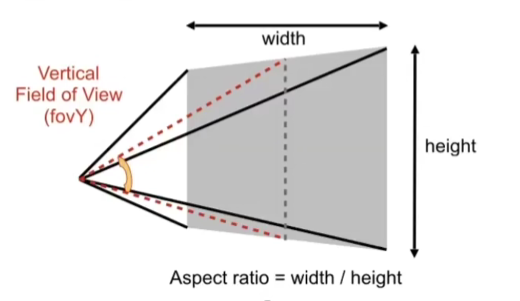

# GAMES101

## Transformation

为什么引入齐次变换？把所有变换都写为一个矩阵和一个向量相乘的形式
旋转一般都是绕原点旋转
写成一个矩阵是先线性变换再平移

### Viewing Transformation

Define camera first: 

* Position $\vec{e}$

* Look-at / gaze direction $\hat{g}$

* Up direction $\hat{t}$

How to take a photo?(MVP)

* Find a good place and arrange people (**model** transformation)

* Find a good "angle" to put the camera (**view** transformation)

* Cheese! (**projection** transformation)

### View Transformation

Key observation

* If the camera and all objects move together,
the "photo" will be the same

How about that we always transform the camera using $M_{view}$ to

* The origin, up at Y, look at -Z

* And transform the objects along with the camera

Let's write $M_{view}=R_{view}T_{view}$

* $T_{view}$ translate $e$ to origin

$$
T_{view}=
\begin{bmatrix}
1&0&0&-x_{e}\\
0&1&0&-y_{e}\\
0&0&1&-z_{e}\\
0&0&0&1
\end{bmatrix}
$$

* $R_{view}$ rotate $g$ to $-Z$, $t$ to $Y$ and $g\times t$ to $X$

    * Consider the inverse transformation: rotate $Z$ to $-g$, $Y$ to $t$ and $X$ to $g\times t$

$$
R_{view}^{-1}=
\begin{bmatrix}
x_{\hat{g}\times \hat{t}}&x_{t}&x_{-g}&0\\
y_{\hat{g}\times \hat{t}}&y_{t}&y_{-g}&0\\
z_{\hat{g}\times \hat{t}}&z_{t}&z_{-g}&0\\
0&0&0&1
\end{bmatrix}
\stackrel{inverse(transpose)}{\longrightarrow}
R_{view}=
\begin{bmatrix}
x_{\hat{g}\times \hat{t}}&y_{\hat{g}\times \hat{t}}&z_{\hat{g}\times \hat{t}}&0\\
x_{t}&y_{t}&z_{t}&0\\
x_{-g}&y_{-g}&z_{-g}&0\\
0&0&0&1
\end{bmatrix}
$$

### Projection Transformation

#### Orthographic Projection

A simple way of understanding

- Camera located at origin, looking at -Z, up at Y

- Drop Z coordinate

- Translate and scale the resulting rectangle to $[-1, 1]^2$

In general

- We want to map a cuboid $[I, r] \times [b, t] \times [f, n]$ to the canonical cube $[-1,1]^3$

    - Center cuboid by translating

    - Scale into "canonical" cube

Transformation matrix

- Translate (center to origin) first, then scale (length/width/height to 2)

$$
M_{ortho}=
\begin{bmatrix}
\frac{2}{r-l}&0&0&0\\
0&\frac{2}{t-b}&0&0\\
0&0&\frac{2}{n-f}&0\\
0&0&0&1
\end{bmatrix}
\begin{bmatrix}
1&0&0&-\frac{r+l}{2}\\
0&1&0&-\frac{t+b}{2}\\
0&0&1&-\frac{n+f}{2}\\
0&0&0&1
\end{bmatrix}
$$

Caveat

- Looking at / along -Z is making near and far not intuitive (n > f)
- FYI: that's why OpenGL (a Graphics API) uses left hand coords.

#### Perspective Projection

How to do perspective projection

- First "squish" the frustum into a cuboid ($n \rightarrow n, f \rightarrow f$) ($M_{persp->ortho}$)

- Do orthographic projection ($M_{ortho}$, already known!)

In order to find a transformation

- Find the relationship between transformed points $(x', y', z')$ and the original points $(x, y, z)$

$$
y'=\frac{n}{z}y \qquad x'=\frac{n}{z}x
$$

In homogeneous coordinates,

$$
M_{persp\rightarrow ortho}
\begin{pmatrix}
x\\
y\\
z\\
1\\
\end{pmatrix}
\,=
\begin{pmatrix}
nx/z\\
ny/z\\
unknown\\
1\\
\end{pmatrix}
\, ==
\begin{pmatrix}
nx\\
ny\\
unknown\\
z\\
\end{pmatrix}\\
M_{persp\rightarrow ortho}=
\begin{pmatrix}
n&0&0&0\\
0&n&0&0\\
?&?&?&?\\
0&0&1&0
\end{pmatrix}
$$

Observation: the third row is responsible for $z'$

- Any point on the near plane will not change

- Any point's $z$ on the far plane will not change

From the two property we have: 

$$
M_{persp\rightarrow ortho}
\begin{pmatrix}
x\\
y\\
n\\
1\\
\end{pmatrix}
\,=
\begin{pmatrix}
x\\
y\\
n\\
1\\
\end{pmatrix}
\,==
\begin{pmatrix}
nx\\
ny\\
n^2\\
n\\
\end{pmatrix}\\
M_{persp\rightarrow ortho}
\begin{pmatrix}
0\\
0\\
f\\
1\\
\end{pmatrix}
\,=
\begin{pmatrix}
0\\
0\\
f\\
1\\
\end{pmatrix}
\,==
\begin{pmatrix}
0\\
0\\
f^2\\
f\\
\end{pmatrix}
$$

Now we can get the entire matrix

$$
M_{persp\rightarrow ortho}=
\begin{pmatrix}
n&0&0&0\\
0&n&0&0\\
0&0&n+f&-nf\\
0&0&1&0
\end{pmatrix}
$$

What's next?

- Do orthographic projection ($M_{ortho}$) to finish
- $M_{persp} = M_{ortho} M_{persp\rightarrow ortho}$

What's near plane's $l, r, b, t$(left, right, bottom, top) then?

- If explicitly specified, good

- Sometimes people prefer: vertical field-of-view ($fovY$) and aspect ratio(assume symmetry i.e. I = -r, b = -t)

$$
tan\frac{fovY}{2}=\frac{t}{|n|}\\
tan\frac{fovX}{2}=\frac{r}{|n|}\\
aspect=\frac{r}{t}
$$

What's after MVP?

### Viewport Transformation

What is a screen?

- An array of pixels

- Size of the array: resolution

- A typical kind of raster display

Raster == screen in German

- Rasterize == drawing onto the screen

Pixel (FYI, short for "picture element")

- For now: A pixel is a little square with uniform color

- Color is a mixture of (red, green, blue)

Defining the screen space

- Pixels' indices are in the form of $(x, y)$, where both $x$ and $y$ are integers

- Pixels' indices are from $(0, 0)$ to $(width - 1, height - 1)$

- Pixel $(x, y)$ is centered at $(x+ 0.5, y + 0.5)$

- The screen covers range $(0, 0)$ to $(width, height)$

Canonical Cube to Screen:

- Irrelevant to $z$

- Transform in $xy$ plane: $[-1, 1]^2$ to $[0, width] \times [0, height]$

- Viewport transform matrix:

$$
M_{viewport}=
\begin{pmatrix}
\frac{width}{2}&0&0&\frac{width}{2}\\
0&\frac{height}{2}&0&\frac{height}{2}\\
0&0&1&0\\
0&0&0&1
\end{pmatrix}
$$