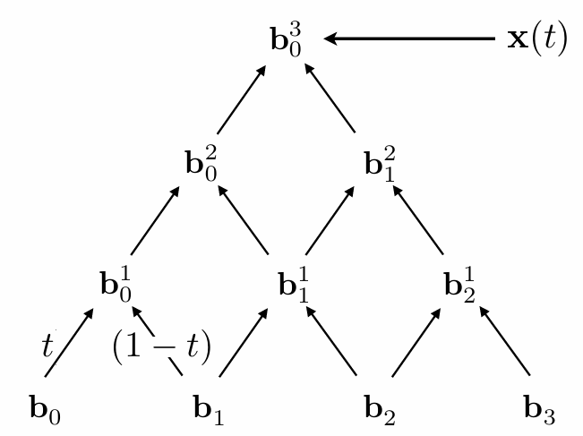

# Geometry

## Ways to Represent Geometry

### Implicit

* algebraic surface

* level sets

* distance functions

* ...

Based on classifying points

* It tells you the specified relationships that the points satisfy, but not the coordinates.

* E.g. sphere: all points in 3D, where $x_2+y_2+z_2 = 1$

* More generally, $f(x,y,z) = 0$

* Easy to decide whether the given point is inside/on/outside the surface

* Hard to find what points lie on it

#### Constructive Solid Geometry

Combine implicit geometry via Boolean operations

#### Distance Function

Instead of Booleans, gradually blend surfaces together using Distance functions:

* Distance functions: given a position, return the minimum distance to object

* The distance can be signed (for example, negative means the point is inside the object)

* blend, for example, can be linear interpolation

* Can blend any two distance functions $d1, d2$: 

* The surface can be found via $d(\mathbf{x})=0$

#### Level Set Method

Closed-form equations are hard to describe complex shapes

Alternative: store a grid of values approximating function

* Surface is found where (bilinear) interpolated values equal zero

* Provides much more explicit control over shape (like a
texture)

#### Fractals

* Exhibit self-similarity, detail at all scales

* "Language" for describing natural phenomena

* Hard to control shape!

Level set encodes distance to air-liquid boundary

#### Prons & Cons

Pros:

* compact description (e.g., a function)

* certain queries easy (inside object, distance to surface)

* good for ray-to-surface intersection (more later)

* for simple shapes, exact description / no sampling error

* easy to handle changes in topology (e.g., fluid)

Cons:

* difficult to model complex shapes

### Explicit

* point cloud

* polygon mesh

* subdivision, NURBS

* ...

All points are given **directly** or via **parameter mapping**

* Genernally, $f:\mathbb{R}^2\to\mathbb{R}^3;(u,v)\mapsto(x,y,z)$

* Easy to find what points lie on this surface: Just plug in $(u,v)$ values!

* Hard to decide whether the point is inside or outside

#### Point Cloud

* Easiest representation: list of points $(x,y,z)$

* Easily represent any kind of geometry

* Useful for LARGE datasets (>>1 point/pixel)

* Often converted into polygon mesh

* Difficult to draw in undersampled regions

#### Polygon Mesh

* Store vertices & polygons (often triangles or quads)

* Easier to do processing / simulation, adaptive sampling

* More complicated data structures

* Perhaps most common representation in graphics

* Often stored in Wavefront Object File Format(.obj)

## Curves

### Bezier Curve

The Bezier Curve is controlled by $n$ control points.

* The curve starts at the first point and ends at the last point.

* The tangent line at the start passes through the first two points, and the tangent line at the end passes through the last two points.

#### Evaluating Bezier Curves(de Casteljau Algorithm)

Consider three points (quadratic Bezier), we can use a parameter $t\in[0,1]$ to control the drawing procedure

* Each point in curve corresponds to a $t$

* For the image below, $\frac{\mathbf{b}_0\mathbf{b}_0^1}{\mathbf{b}_0\mathbf{b}_1}=\frac{\mathbf{b}_1\mathbf{b}_1^1}{\mathbf{b}_1\mathbf{b}_2}=\frac{\mathbf{b}_0^1\mathbf{b}_0^2}{\mathbf{b}_0^1\mathbf{b}_1^1}=t$. 

* $b_0^2$ is on curve

* Compute $b_0^2$ for every $t$ to draw the curve

For four input points (Cubic Bezier), same recursive linear interpolations

#### Algebratic Formula

de Casteljau algorithm gives a pyramid of coefficients

* Every rightward arrow is multiplication by $t$, Every leftward arrow by $(1-t)$

The coefficient for each point is actually binomial coefficient.

For a quadratic Bezier curve, 

$$
\mathbf{b}_0^2(t)=(1-t)^2\mathbf{b}_0+2t(1-t)\mathbf{b}_1+t^2\mathbf{b}_2
$$

The Bernstein form of a Bezier curve of order $n$: 

$$
\mathbf{b}^n(t)=\mathbf{b}_0^n(t)=\sum_{j=0}^n\mathbf{b}_jB_j^n(t) 
$$

* $\mathbf{b}^n(t)$ is the Bezier curve with order $n$ (vector polynomial of degree $n$)

* $\mathbf{b}_j \in \mathbb{R}^N$ are Bezier control points

* $B_i^n(t)={\binom{n}{i}}t^i(1-t)^{n-i}$ are Bernstein polynomial (scalar polynomial of degree $n$)

* The points on Bezier curve are actually a weighted sum of control points, since $\sum_{j=0}^nB_j^n(t)=1$

#### Properties of Bézier Curves

Interpolates endpoints

* For cubic Bézier: $\mathbf{b}(0)=\mathbf{b}_0;\quad\mathbf{b}(1)=\mathbf{b}_3$

Tangent to end segments

* Cubic case: $\mathbf{b}^{\prime}(0)=3(\mathbf{b}_1-\mathbf{b}_0);\quad\mathbf{b}^{\prime}(1)=3(\mathbf{b}_3-\mathbf{b}_2)$

Affine transformation property

* Transform curve by transforming control points

Convex hull property

* Curve is within convex hull of control points

* Convex hull: the smallest convex shape that can enclose a set of points in a plane or space

#### Piecewise Bézier Curves

Higher-Order Bezier Curves are hard to control

* The middle doesn't twist as much as we expected.

* Instead, chain many low-order Bézier curve

* **Piecewise cubic Bezier** is the most common technique

Below are two Bézier curves, let's call the left one $\mathbf{a}$ and the right one $\mathbf{b}$

* $C^0$ continuity: $\mathbf{a}_n=\mathbf{b}_0$

* $C^1$ continuity: $\mathbf{a}_n=\mathbf{b}_0=\frac{1}{2}(\mathbf{a}_{n-1}+\mathbf{b}_1)$

* where $\mathbf{a}_{n}$ is the last control point of $\mathbf{a}$ and $\mathbf{b}_{0}$ is the first control point of $\mathbf{b}$

### Other Types of Splines

* Spline

    * a continuous curve constructed so as to pass through a given setof points and have a certain number of continuous derivatives.

    * In short, a curve under control

* B-splines

    - Short for basis splines

    - Require more information than Bezier curves

    - Satisfy all important properties that Bézier curves have (i.e. superset)

## Surface

### Bézier Surfaces

Extend Bézier curves to surfaces

#### Evaluating Bézier Surfaces

We can evaluating surface position for parameters $(u,v)$

For bi-cubic Bezier surface patch,

* Input: 4x4 control points

* Output: 2D surface parameterized by $(u,v)$ in $[0,1]^2$

* Goal: Evaluate surface position corresponding to $(u,v)$

(u,v)-separable application of de Casteljau algorithm

* Use de Casteljau to evaluate point $u$ on each of the 4 Bezier curves in
$u$. This gives 4 control points for the "moving" Bezier curve

* Use 1D de Casteljau to evaluate point $v$ on the "moving" curve

### Mesh

Mesh Operations: 

* Mesh subdivision: Increase the number of triangles to improve resolution

* Mesh simplification: Decrease resolution while preserving shape/appearance

* Mesh regularization: Modify sample distribution to **improve quality** with same #triangles

#### Mesh Subdivision

##### Loop Subdivision

Loop Subdivision is a common subdivision rule for **triangle mesh**

* First, create more triangles (vertices)
    * Split each triangle into four

* Second, tune their positions
    * Assign new vertex positions according to weights
    * New / old vertices updated differently

For new vertices, update to $\frac{3}{8}(A+B)+\frac{1}{8}(C+D)$

For old vertices, update to: $(1-n\cdot u)\cdot position_{original}+u\cdot sum(position_{neighbors})$

* $n$: vertex degree
* $u$: $\frac{3}{16}$ if $n=3,\frac{3}{8n}$ otherwise
* A weighted sum of its original position and the positions of its neighbors.

* $C^2$ continuity on regular meshes

##### Catmull-Clark Subdivision

Catmull-Clark Subdivision can be used for general meshes, while Loop Subdivision is only suitable for triangle meshes

Define: 

* Non-quad face: faces that don't have 4 vertices

* Extraordinary vertex: vertex with $degree\neq 4$

Subdivision Step: 

* Add vertex in the middle of each face 

* Add midpoint on each edge

* Connect all new vertices

After one subdivision: 

* How many extraordinary vertices? 
    * 2(original extraordinary point) + 2 (new vertice in the middle of non-quad faces)

* How many non-quad faces?
    * None. Each non-quad face becomes many quad faces with one additional extraordinary point.

Vertex Update Rules (Quad Mesh):

Convergence: Overall Shape and Creases

#### Mesh simplification

Goal: reduce number of mesh elements while maintaining the overall shape

##### Edge Collapsing

We can simplify a mesh using edge Collapsing

* Removing an edge by merging its two vertices into a single vertex.

##### Quadric Error Metrics

* How much geometric error is introduced by simplification?

* Not a good idea to perform local averaging of vertices

* Quadric error: new vertex should minimize its **sum of square distance (L2 distance)** to previously related **triangle planes**!

How to collapse edges? 

* put the new point on the position that minimizes quadric error

Which edge should we collapse?

* assign each edge a score with quadric error metric

* approximate distance to surface as sum of distances to planes containing triangles

* iteratively collapse the edge with the smallest score and update the scores of the edges affected by the collapsed edge.

    * use Heap to maintain scores

* actually a greedy algorithm: try to find global optimal with local optimal. But has great results

