# Miscellaneous

## Material

What is material in CG?

### Material == BRDF

#### Diffuse / Lambertian Material

Light is equally reflected in each output direction.

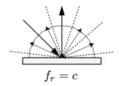{ width="40%" }

Suppose the incident lighting is uniform and the surface doesn't emit light, then we have: 

$$
\begin{align*}
L_o(\omega_o)&=\int_{H^2}f_rL_i(\omega_i)\cos{\theta_i}d\omega_i\\
&=f_rL_i\int_{H^2}\cos{\theta_i}d\omega_i\\
&=\pi f_r L_i
\end{align*}
$$

* $L_i(\omega_i)$ is a constant since the incident lighting is uniform

* For diffuse material, if the surface doesn't absorb light, then the outgoing irradiance is identical to the incoming irradiance in any direction.

* $f_r=\frac{\rho }{\pi}$, where $\rho\in[0,1]$ is called albedo

#### Glossy material

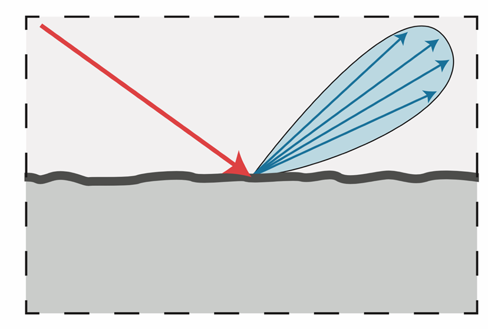{ width="50%" }

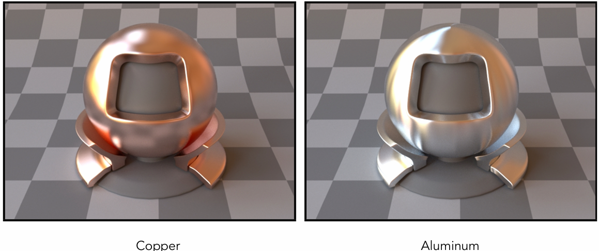{ width="80%" }

#### Ideal reflective / refractive material (BSDF)

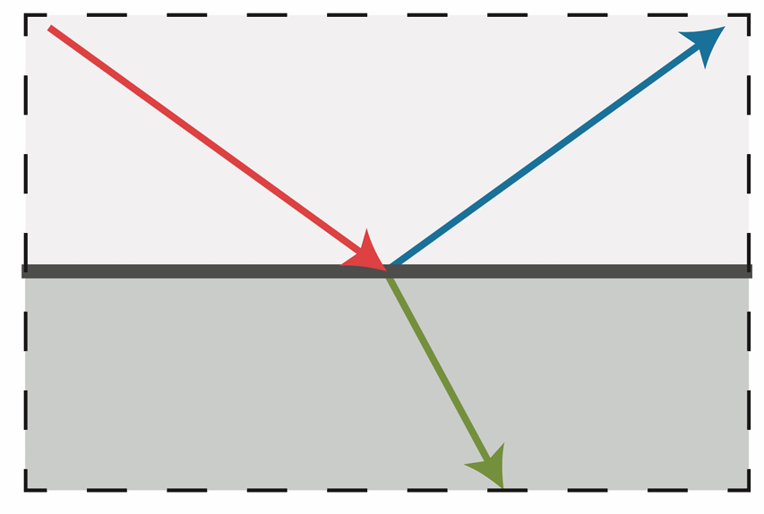{ width="50%" }

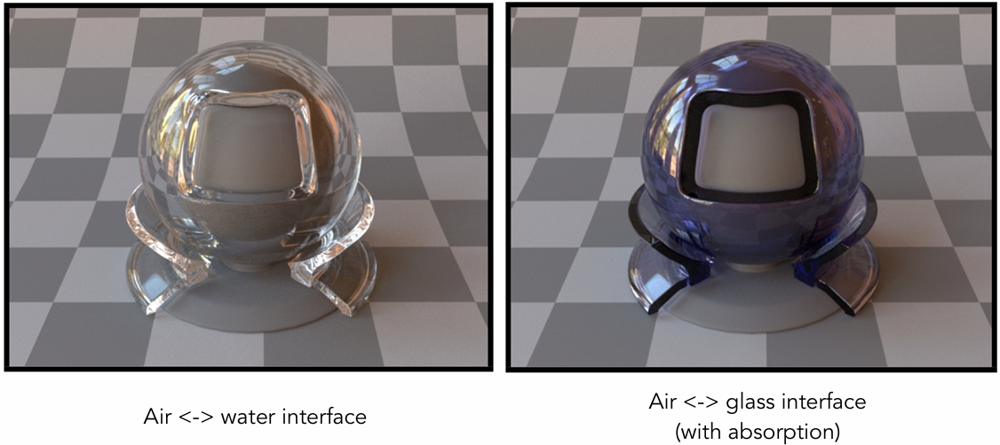{ width="80%" }

##### Perfect Specular Reflection

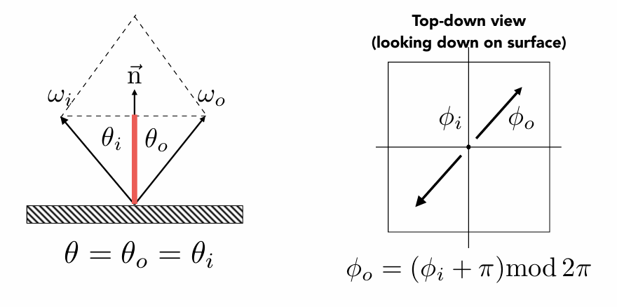{ width="70%" }

$\theta$ describes the incident angle with respect to $\vec{n}$, while $\phi$ describes the rotation on surface

For incoming light and outgoing light $\omega_i$ and $\omega_o$, we have:

$$
\omega_o+\omega_i=2\cos{\theta}\ \vec{n}=2(\omega_i\cdot\vec{n})\vec{n}\\
\omega_o=-\omega_i+2(\omega_i\cdot \vec{n})\vec{n}
$$

* The BRDF of perfect specular reflection can be described by impulse function, which is nonzero only at outgoing direction.

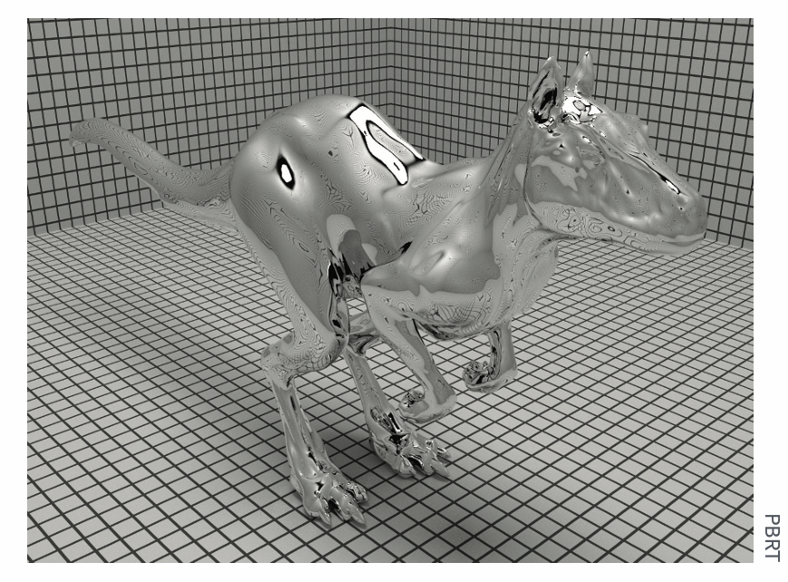{ width="70%" }

##### Specular Refraction

* In addition to reflecting off surface, light may be transmitted through surface.

* Light refracts when it enters a new medium.

##### Snell's Law: Transmitted angle depends on

* index of refraction (IOR) for incident ray

* index of refraction (IOR) for exiting ray

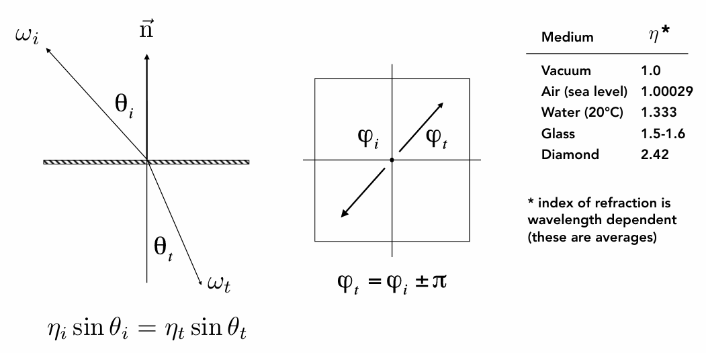{ width="80%" }

##### Law of Refraction: 

$$
\begin{aligned}
\eta_{i}\operatorname{sin}\theta_{i} & =\eta_t\sin\theta_t \\
\cos\theta_{t} & =\sqrt{1-\sin^2\theta_t} \\
 & =\sqrt{1-\left(\frac{\eta_i}{\eta_t}\right)^2\sin^2\theta_i} \\
 & =\sqrt{1-\left(\frac{\eta_i}{\eta_t}\right)^2(1-\cos^2\theta_i)} \\
 & 
\begin{aligned}
1-\left(\frac{\eta_i}{\eta_t}\right)^2(1-\cos^2\theta_i)<0
\end{aligned}
\end{aligned}
$$

Total internal reflection:

* When light is moving from a more optically dense
medium to a less optically dense medium, i.e. $\frac{\eta_i}{\eta_t}>1$, Light incident on boundary from large enough angle will
not exit medium.

Snell's Window / Circle: 

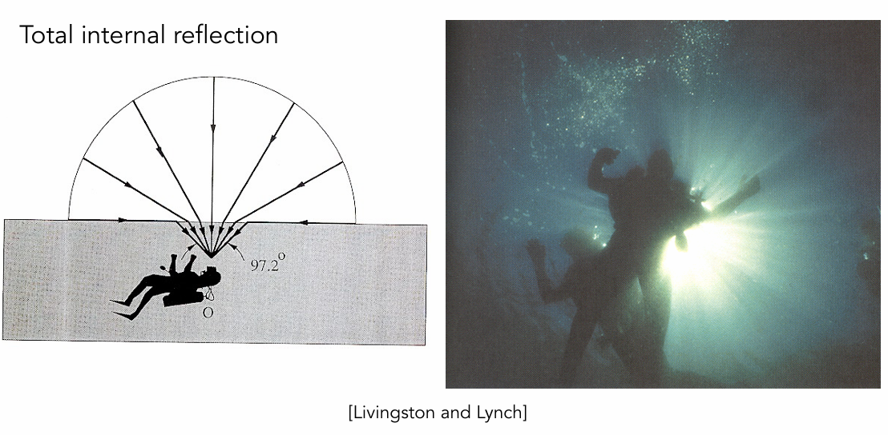{ width="80%" }

##### Fresnel Reflection / Term

Reflectance depends on incident angle (and polarization of light)

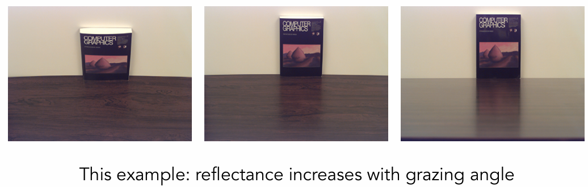{ width="80%" }

Fresnel Term (Dielectric, $\eta=1.5$): 

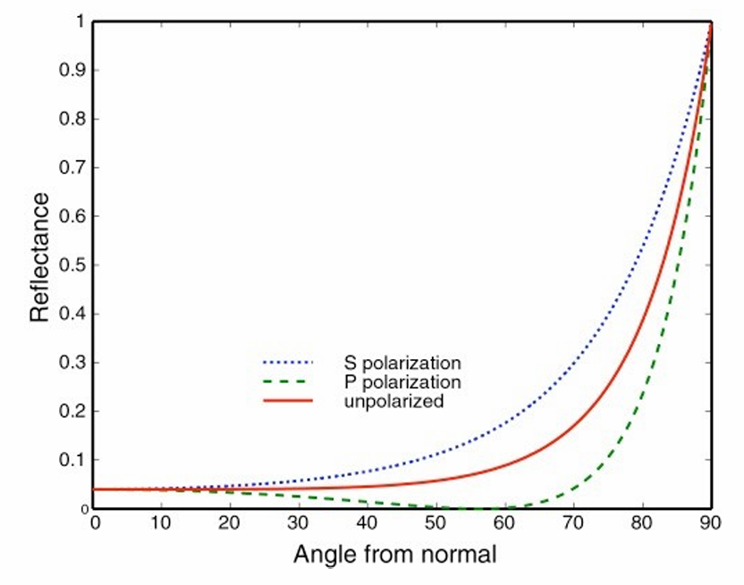{ width="70%" }

Fresnel Term (Conductor)

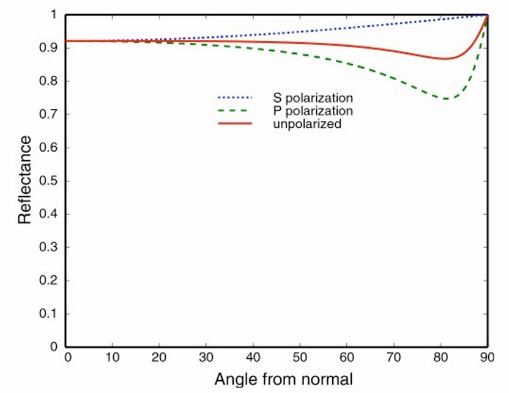{ width="70%" }

Formulae: 

* Accurate: need to consider polarization

$$
\begin{aligned}
R_{s} & =\left|\frac{n_1\cos\theta_1-n_2\cos\theta_t}{n_1\cos\theta_1+n_2\cos\theta_t}\right|^2=\left|\frac{n_1\cos\theta_1-n_2\sqrt{1-\left(\frac{n_1}{n_2}\sin\theta_i\right)^2}}{n_1\cos\theta_i+n_2\sqrt{1-\left(\frac{n_1}{n_2}\sin\theta_i\right)^2}}\right|^2, \\
R_{p} & =\left|\frac{n_1\cos\theta_i-n_2\cos\theta_i}{n_1\cos\theta_i+n_2\cos\theta_i}\right|^2=\left|\frac{n_1\sqrt{1-\left(\frac{n_1}{n_2}\sin\theta_i\right)^2}-n_2\cos\theta_i}{n_1\sqrt{1-\left(\frac{n_1}{n_2}\sin\theta_i\right)^2}+n_2\cos\theta_i}\right|^2, \\
R_{\mathrm{eff}}&=\frac{1}{2}\left(R_{\mathrm{s}}+R_{\mathrm{p}}\right)
\end{aligned}
$$

* Approximate: Schlick's approximation

$$
\begin{aligned}
R(\theta) & =R_0+(1-R_0)(1-\cos\theta)^5 \\
R_{0} & =\left(\frac{n_1-n_2}{n_1+n_2}\right)^2
\end{aligned}
$$

### Microfacet Material

Motivation: When looking from a distance, we can't see the fine details. We can only see the overall appearance.

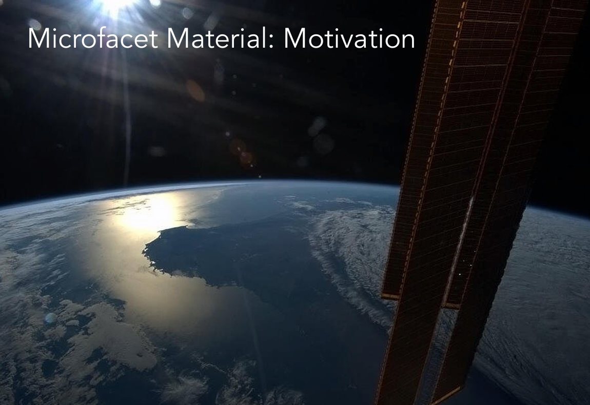{ width="80%" }

Theory: 

* Rough surface

    * Macroscale: flat & rough
    
    * Microscale: bumpy & specular

* Individual elements of surface act like mirrors

    * Known as Microfacets

    * Each microfacet has its own normal

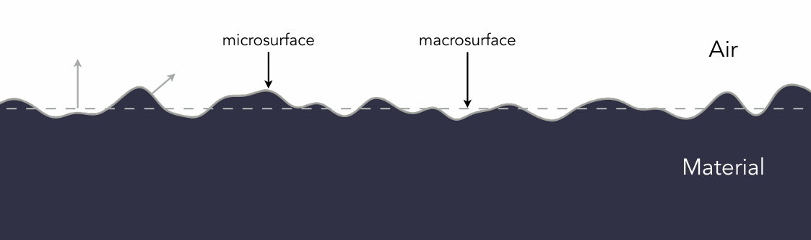{ width="70%" }

We can describe this property using the **distribution of microfacets' normals**

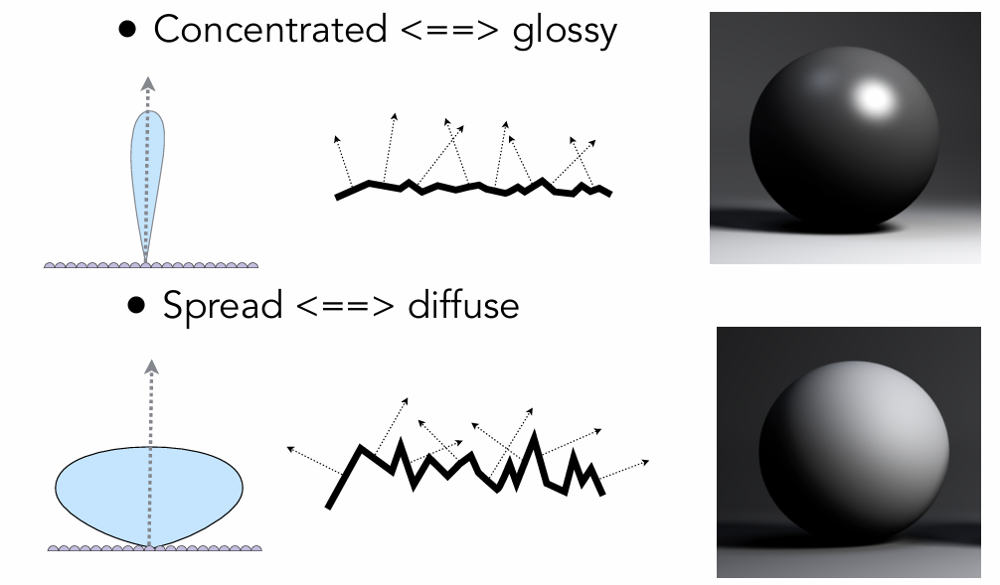{ width="80%" }

Microfacet BRDF: 

$$
f(\mathbf{i},\mathbf{o})=\frac{\mathbf{F}(\mathbf{i},\mathbf{h})\mathbf{G}(\mathbf{i},\mathbf{o},\mathbf{h})\mathbf{D}(\mathbf{h})}{4(\mathbf{n},\mathbf{i})(\mathbf{n},\mathbf{o})}
$$

where: 

* $\mathbf{F}(\mathbf{i},\mathbf{h})$ is the Fresnel term, describing how much light is reflected

* $\mathbf{G}(\mathbf{i},\mathbf{o},\mathbf{h})$ is the shadowing masking term, describing the self occlusion between microfacets

    * This term may have a significant effect when the ray direction is nearly parallel to the surface. We call this kind of angle the grazing angle.

* $\mathbf{D}(\mathbf{h})$ is the distribution of normals

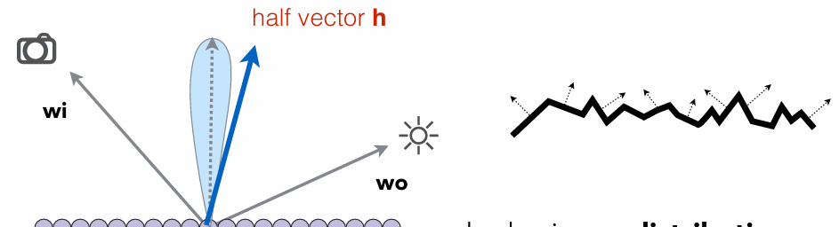{ width="70%" }

### Isotropic / Anisotropic Materials (BRDFs)

Key: directionality of underlying surface

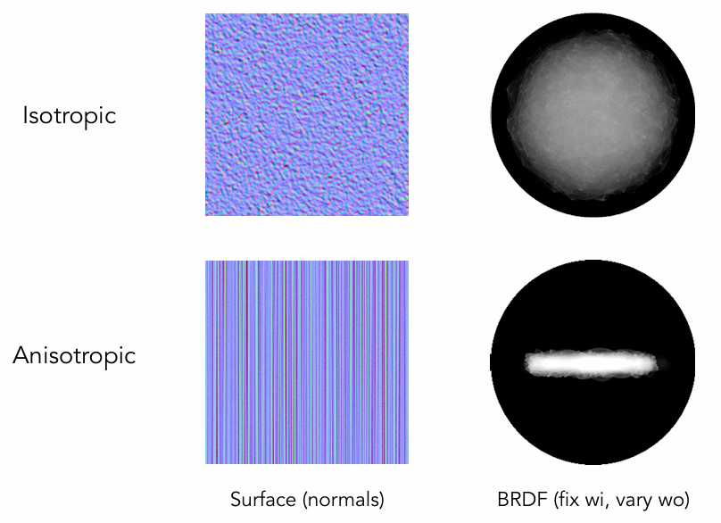{ width="80%" }

Anisotropic BRDFs: 

* Reflection depends on absolute azimuthal angle $\phi$. 

* The BRDF may change even when the relative relationship between azimuthal angles $\phi_i$ and $\phi_r$ is unchanged

    * i.e. $f_r(\theta_i,\phi_i;\theta_r,\phi_r)\neq f_r(\theta_i,\theta_r,\phi_r-\phi_i)$

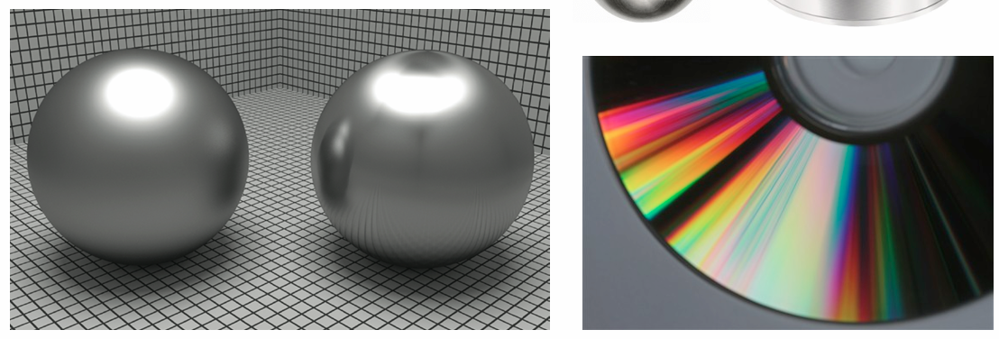{ width="70%" }

### Properties of BRDFs

* Non-negativity: $f_r(\omega_i\rightarrow\omega_r)\geq 0$

* Linearity: $L_r(\mathrm{p},\omega_r)=\int_{H^2}f_r(\mathrm{p},\omega_i\to\omega_r)L_i(\mathrm{p},\omega_i)\cos\theta_i\mathrm{d}\omega_i$

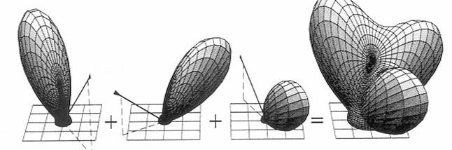{ width="70%" }

* Reciprocity: $f_r(\omega_r\rightarrow\omega_i)=f_r(\omega_i\rightarrow\omega_r)$

* Energy conservation: $\forall\omega_r\int_{H^2}f_r(\omega_i\to\omega_r)\cos\theta_i\mathrm{d}\omega_i\leq1$

* Isotropic vs. anisotropic

    * If isotropic, $f_r(\theta_i,\phi_i;\theta_r,\phi_r)= f_r(\theta_i,\theta_r,\phi_r-\phi_i)$

    * Then, from reciprocity, $f_r(\theta_i,\theta_r,\phi_r-\phi_i)= f_r(\theta_r,\theta_i,\phi_i-\phi_r)=f_r(\theta_i,\theta_r,|\phi_r-\phi_i|)$

### Measuring BRDFs

Motivation: 

* Avoid need to develop / derive models
    
    * Automatically includes all of the scattering effects present

* Can accurately render with real-world materials

    * Useful for product design, special effects, ...

* Theory vs. practice: 

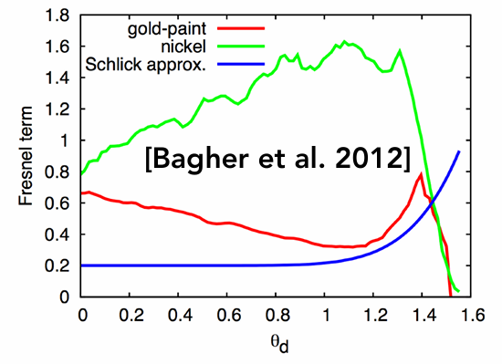{ width="50%" }

Image-Based BRDF Measurement: 

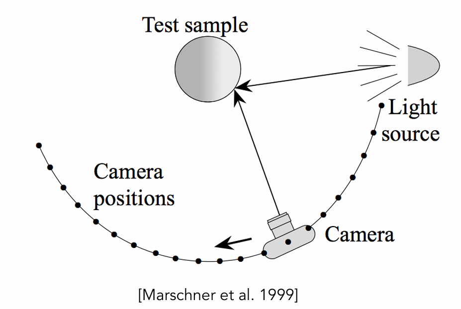{ width="80%" }

General approach: 

```
for each outgoing direction wo
    move light to illuminate surface with a thin beam from wo
    for each incoming direction wi
        move sensor to be at direction wi from surface
        measure incident radiance
```

Improving efficiency:

* Isotropic surfaces reduce dimensionality from 4D to 3D

* Reciprocity reduces # of measurements by half

* Clever optical systems ...

Challenges in Measuring BRDFs:

* Accurate measurements at grazing angles

    * Important due to Fresnel effects

* Measuring with dense enough sampling to capture high frequency specularities

* Retro-reflection

* Spatially-varying reflectance, ...

Representing Measured BRDFs, Desirable qualities:

* Compact representation

* Accurate representation of measured data

* Efficient evaluation for arbitrary pairs of directions

* Good distributions available for importance sampling

Tabular Representation

* Store regularly-spaced samples in $(\theta_i,\theta_r,|\phi_r-\phi_i|)$

    * Better: reparameterize angles to better match specularities

* Generally need to resample measured values to table

* Very high storage requirements

## Advanced Topics in Rendering

### Advanced Light Transport

* Unbiased light transport methods
 
    - Bidirectional path tracing (BDPT)
 
    - Metropolis light transport (MLT)

* Biased light transport methods
 
    - Photon mapping
 
    - Vertex connection and merging (VCM)

* Instant radiosity (VPL / many light methods)

#### Biased vs. Unbiased Monte Carlo Estimators

* An unbiased Monte Carlo technique does not have any systematic error

    - The expected value of an unbiased estimator will always be the correct value, no matter how many samples are used

* Otherwise, biased

    - One special case, the expected value converges to the correct value as infinite #samples are used - consistent

#### Bidirectional Path Tracing (BDPT)

* Recall: a path connects the camera and the light

* BDPT:

    - Traces sub-paths from both the camera and the light
    
    - Connects the end points from both sub-paths

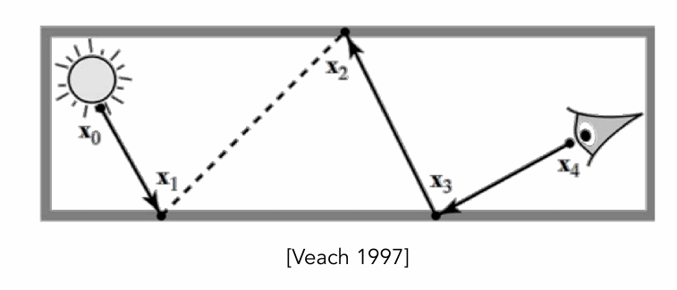{ width="70%" }

* Suitable if the light transport is complex on the light's side. For example, indirect light dominates as the following figure

* Difficult to implement & quite slow

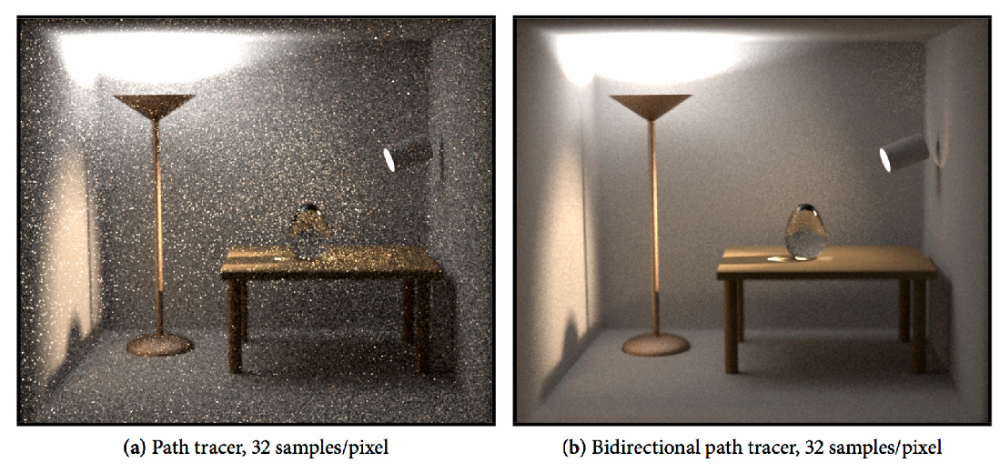{ width="80%" }

#### Metropolis Light Transport (MLT)

* A Markov Chain Monte Carlo (MCMC) application

    - Jumping from the current sample to the next
with some PDF

* Very good at locally exploring difficult light paths

* Key idea
    
    - Locally perturb an existing path to get a new path

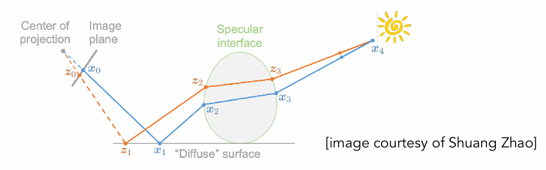{ width="80%" }

* Pros

    * Works great with difficult light paths 

    * Also unbiased

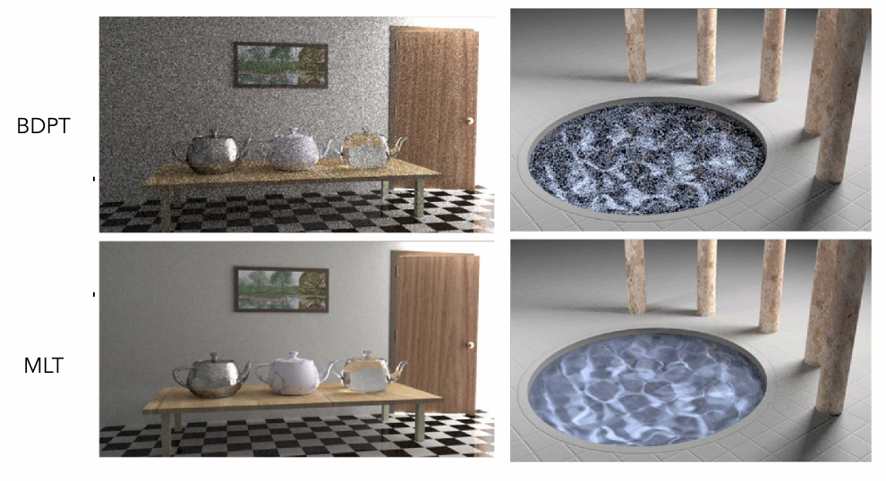{ width="80%" }

* Cons 

    * Difficult to estimate the convergence rate 

    * Does not guarantee equal convergence rate per pixel 

    * So, usually produces “dirty” results 

    * Therefore, usually not used to render animations

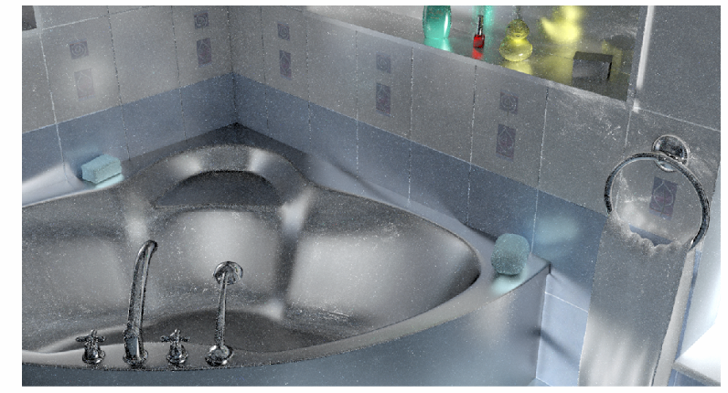{ width="80%" }

#### Photon Mapping

* A biased approach & A two-stage method

* Very good at handling Specular-Diffuse-Specular (SDS) paths and generating caustics (as following figures)

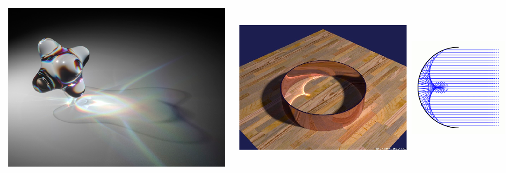{ width="80%" }

Approach (variations apply)

* Stage 1 — photon tracing - Emitting photons from the light source, bouncing them around. Stop and record photons when hitting diffuse surfaces

* Stage 2 — photon collection (final gathering) - Shoot sub-paths from the camera, bouncing them around, until they hit diffuse surfaces

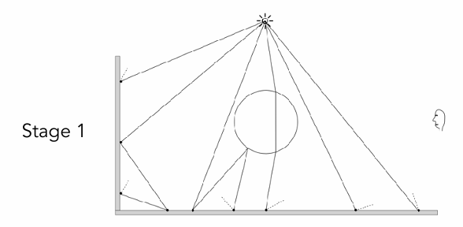{ width="60%" }

Calculation — local density estimation 

- Idea: areas with more photons should be brighter 

- For each shading point, find the nearest N photons. Take the surface area they over

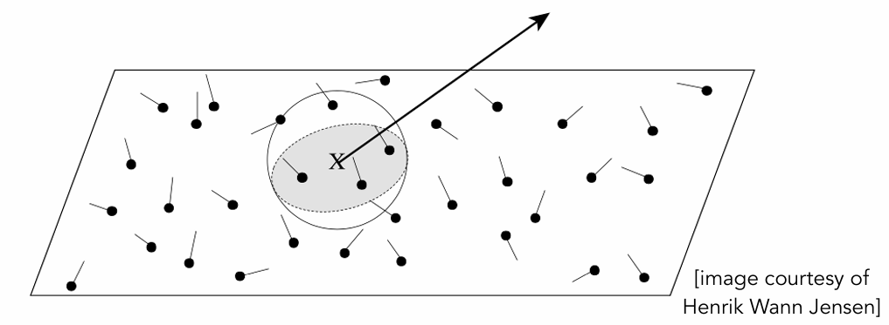{ width="80%" }

Why the method is biased?

* Local density estimation $dN/dA\neq \Delta N/\Delta A$

* But in sense of limit, with more photons emitted, the same $N$ photons will cover a smaller $\Delta A$. $\Delta A\rightarrow dA$

* So, biased but consistent

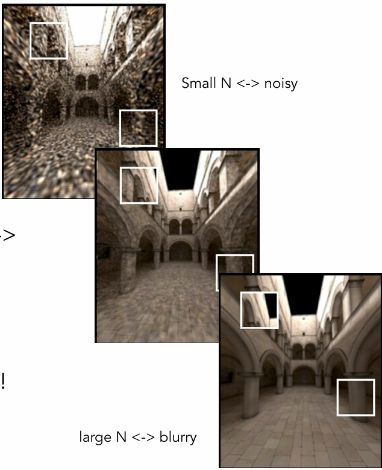{ width="80%" }

An easier understanding bias in rendering 

- Biased == blurry 

- Consistent == not blurry with infinite #samples 

Why not do a “const range” search for density estimation?

* Always biased and not consistent since $\Delta A$ will not converge to $dA$

#### Vertex Connection and Merging

* A combination of BDPT and Photon Mapping 

* Key idea 

- Let's not waste the sub-paths in BDPT if their end points cannot be connected but can be merged 

- Use photon mapping to handle the merging of nearby "photons"

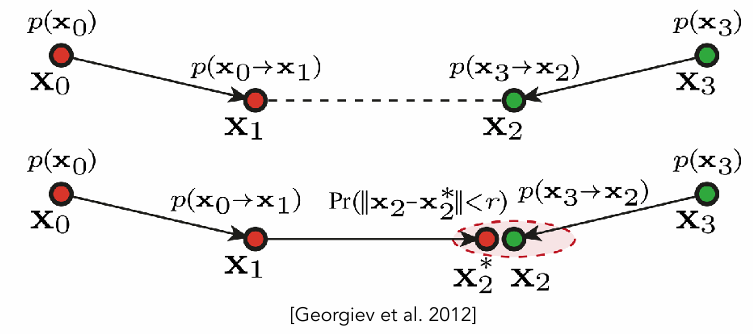{ width="80%" }

#### Instant Radiosity (IR)

* Sometimes also called many-light approaches

* Key idea
    
    - Lit surfaces can be treated as light sources

* Approach

    - Shoot light sub-paths and assume the end point of each sub-path is a Virtual Point Light (VPL)
    
    - Render the scene as usual using these VPLs

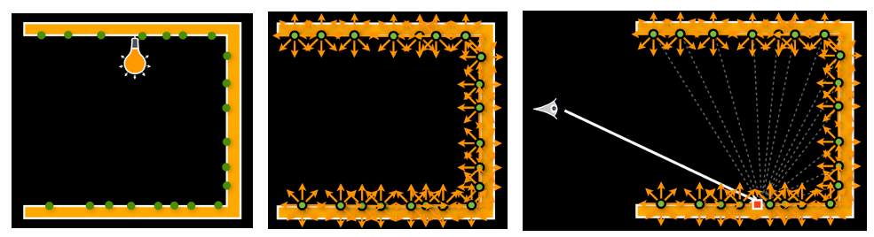{ width="70%" }

* Pros: fast and usually gives good results on diffuse scenes

* Cons

    - Spikes will emerge when VPLs are close to shading points
 
    - Cannot handle glossy materials

### Non-surface models

* Non-surface models

    - Participating media

    - Hair / fur / fiber (BCSDF)

    - Granular material

* Surface models

    - Translucent material (BSSRDF)

    - Cloth

    - Detailed material (non-statistical BRDF)

* Procedural appearance

#### Participating Media 

Participating Media includes fog, cloud, etc 

* At any point as light travels through a participating medium, it can be (partially) absorbed and scattered.

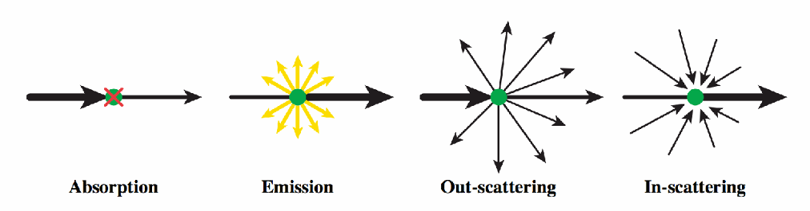{ width="70%" }

* We use Phase Function to describe the angular distribution of light scattering at any point x within participating media.

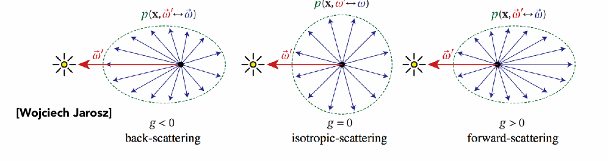{ width="70%" }

Rendering: 

* Randomly choose a direction to bounce 

* Randomly choose a distance to go straight 

* At each 'shading point', connect to the light

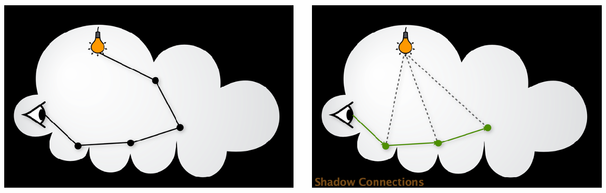{ width="70%" }

#### Hair Appearance

##### Kajiya-Kay Model 

* When the light hitting the hair, it will scatter around the intersection as well as forward into a conical region.

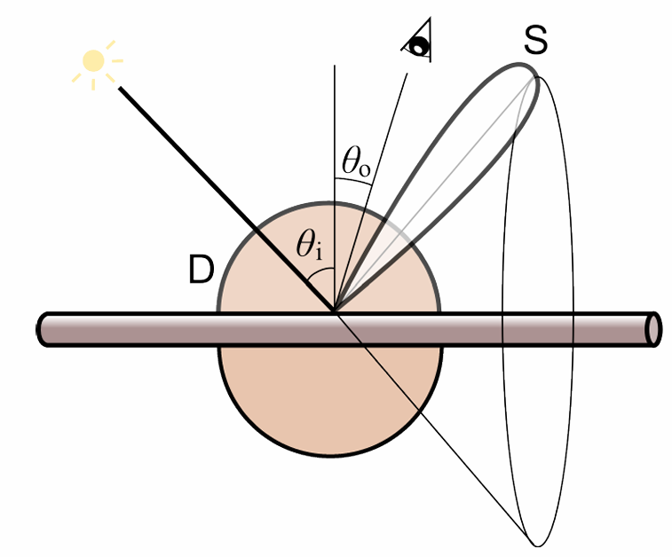{ width="70%" }

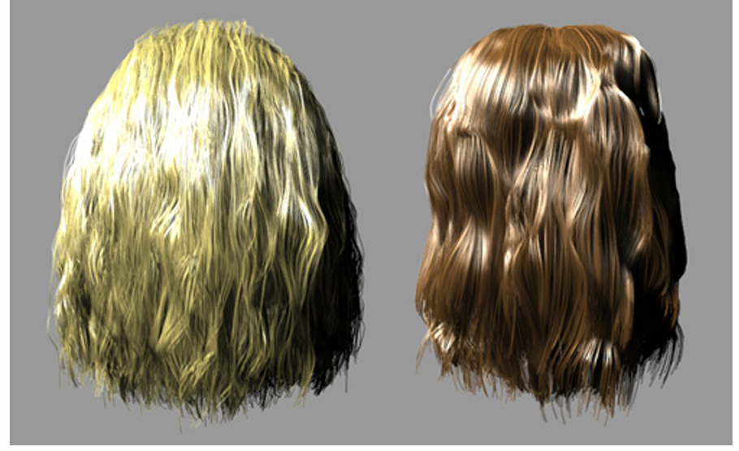{ width="70%" }

##### Marschner Model

* This model represents the hair as a glass-like cylinder.

* It defines 3 types of light interactions: $R, TT, TRT$ 

    * $R$: reflection, $T$: transmission

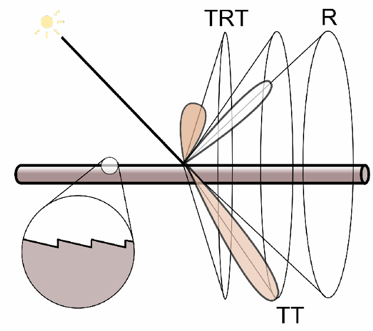{ width="70%" }

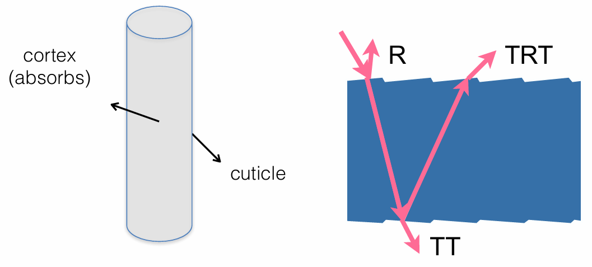{ width="70%" }

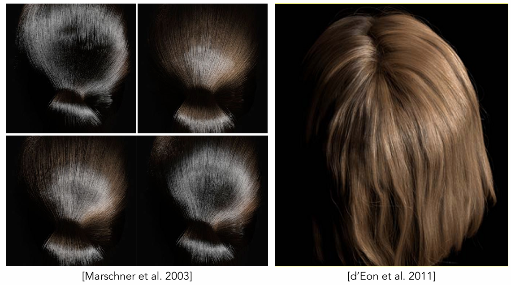{ width="70%" }

#### Fur Appearance 

Rendering as human hair cannot represent diffusive and saturated appearance

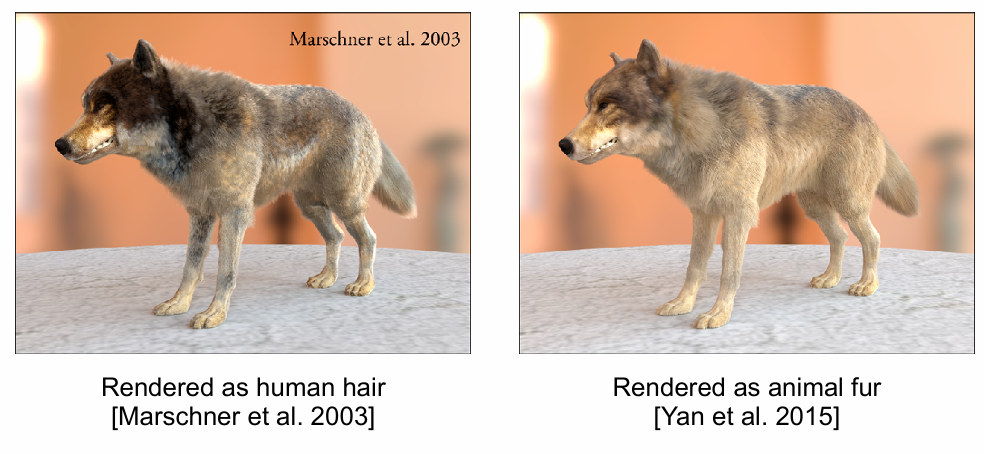{ width="70%" }

Human Hair vs. Animal Fur

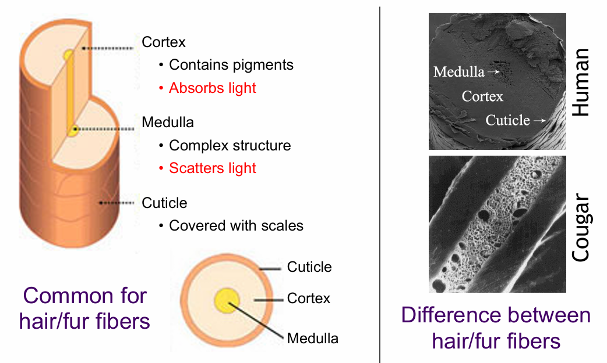{ width="70%" }

##### Double Cylinder Model

Animal Fur has larger medulla, which scatters light a lot

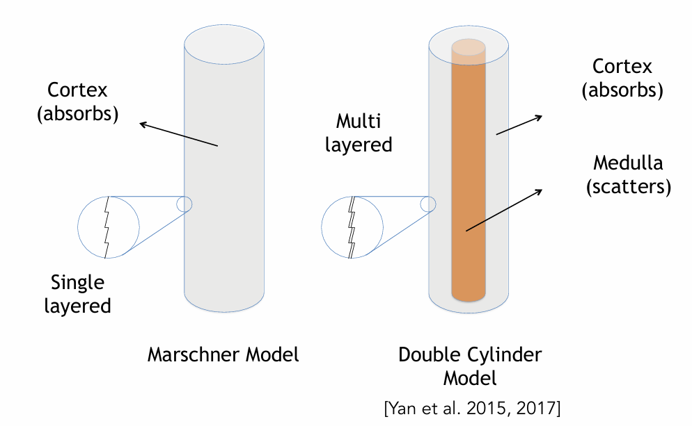{ width="70%" }

* The model defines 5 types of light interactions: $R, TT, TRT, TT^S, TRT^S$

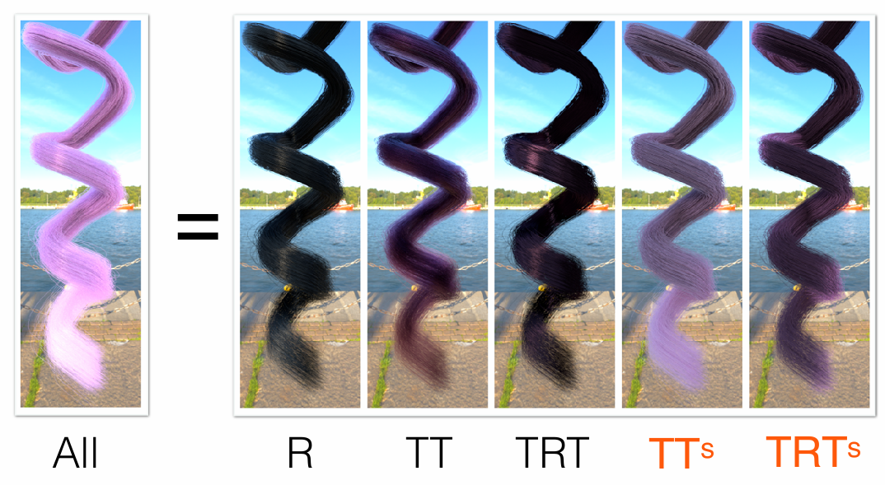{ width="70%" }

### Surface Model

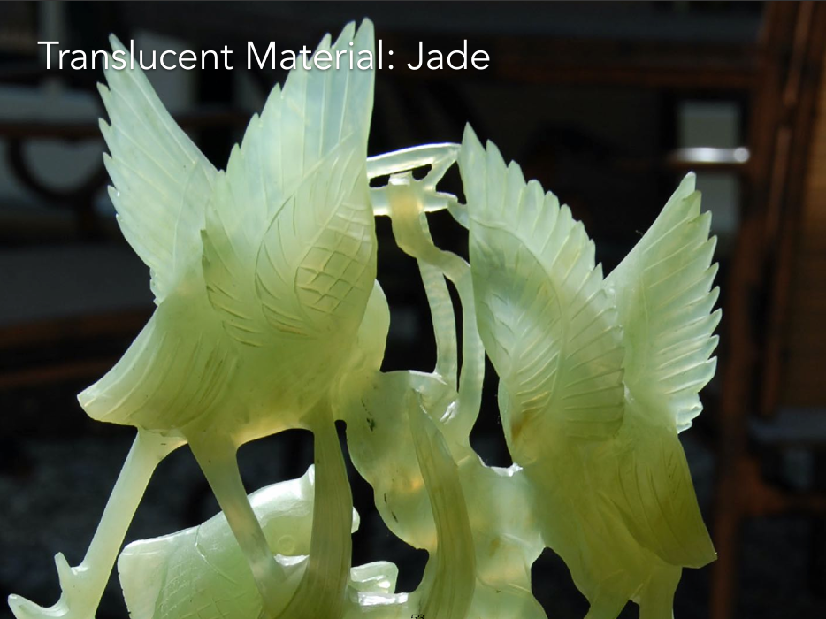{ width="70%" }


#### Subsurface Scattering

* The scatter happens under surface

* Visual characteristics of many surfaces caused by light exiting at different points than it enters

* Violates a fundamental assumption of the BRDF

{ width="50%" }

#### Scattering Functions

* BSSRDF: 
    * generalization of BRDF
    
    * exitant radiance at one point due to incident differential irradiance at **another point** (For BRDF, the light enters and exits at the same point)

$$
S(x_i,\omega_i,x_o,\omega_o)
$$

Generalization of rendering equation: integrating over all points on the surface and all directions

$$
L(x_o,\omega_o)=\int_A\int_{H^2}S(x_i,\omega_i,x_o,\omega_o)L_i(x_i,\omega_i)\cos\theta_i\mathrm{d}\omega_i\mathrm{d}A
$$

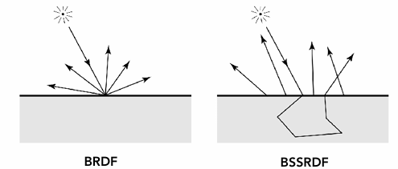{ width="60%" }

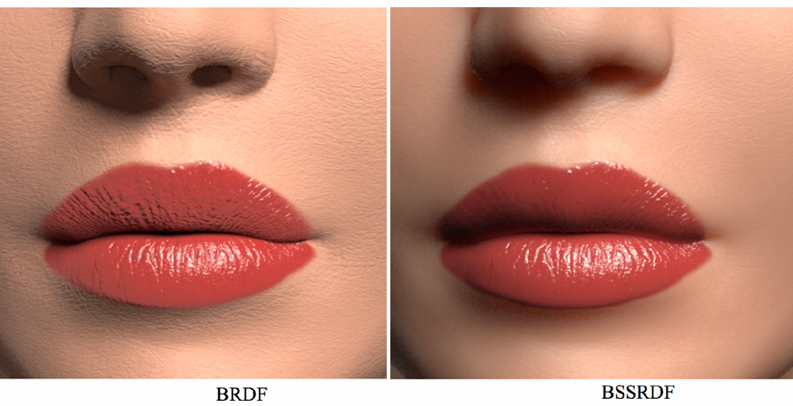{ width="70%" }

#### Detailed Material 

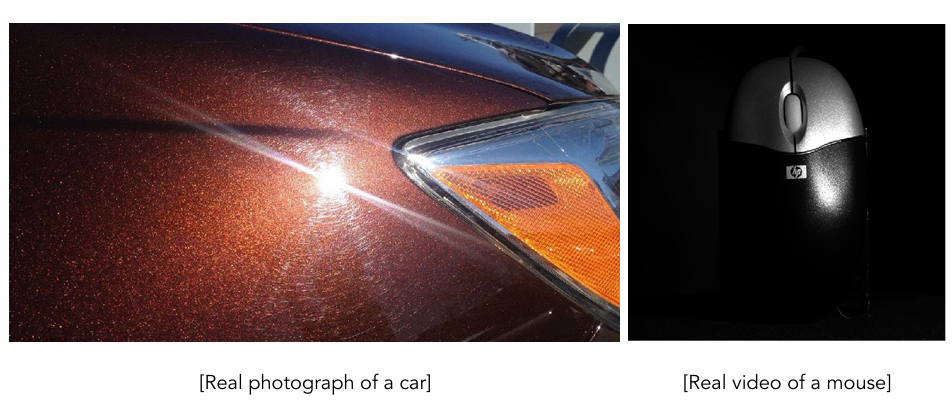{ width="70%" }

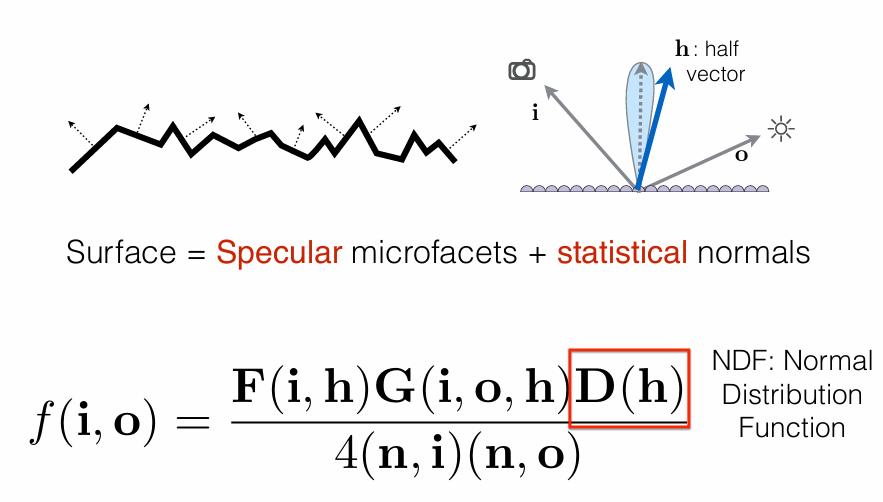{ width="70%" }

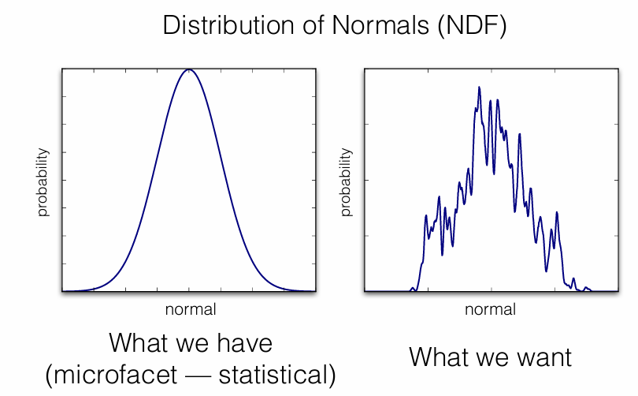{ width="70%" }

Problem: Hard to sample a path from light to camera

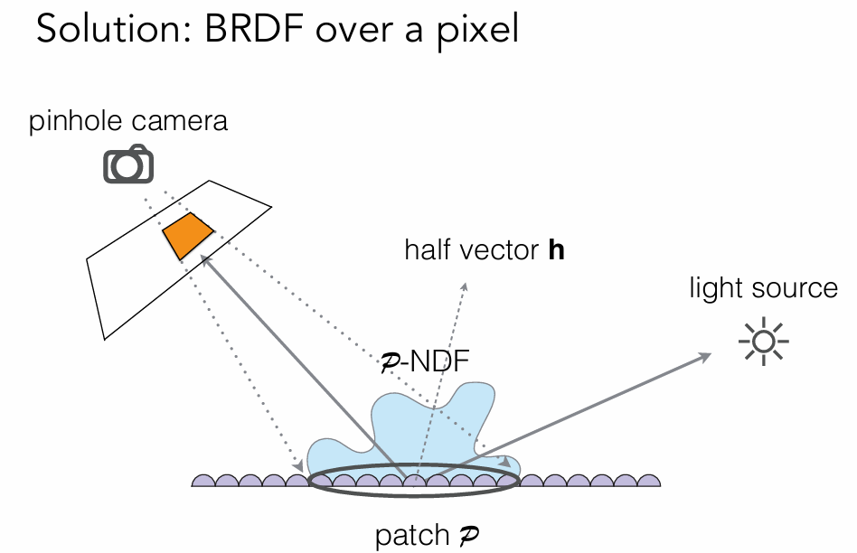{ width="70%" }