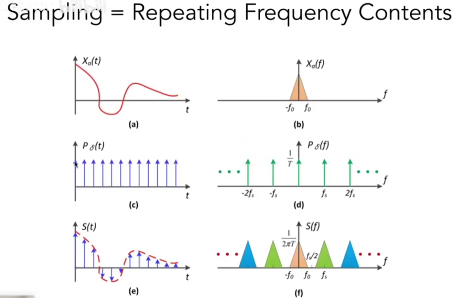

# Rasterization

## Triangles - Fundamental Shape Primitives

Why triangles?

- Most basic polygon

- Break up other polygons

Unique properties

- Guaranteed to be planar

- Well-defined interior

- Well-defined method for interpolating values at vertices over triangle (barycentric interpolation)

Input: position of triangle vertices projected on screen

Output: set of pixel values approximating triangle

## Sampling

Evaluating a function at a point is sampling. We can discretize a function by sampling.

Define Binary Function: $inside(tri,x,y)$. The value is 1 if point $(x,y)$ is inside the triangle, otherwise 0.

How to know whether inside?

- Three Cross Products

- If $P_{0}P_{1}\times P_{0}Q > 0$, then $Q$ is on the left of $P_{0}P_{1}$
- When the three cross products have same sign, then $Q$ is inside


Do we need check all pixels on the screen?

- Using a Bounding Box, confine the triangle in a square and only ckeck the pixels inside it.

- For each line, find the leftmost and rightmost pixel containing the triangle.

## Antialiasing

Artifacts due to sampling - "Aliasing"

- Jaggies - sampling in space
- Moire - undersampling images
- Wagon wheel effect - sampling in time
- [Many more] ...

Behind the Aliasing Artifacts

- Signals are changing too fast (high frequency), but sampled too slowly


### Frequency Domain


High-frequency signal is insufficiently sampled: samples erroneously appear to be from a low-frequency signal

Two frequencies that are indistinguishable at a given sampling are called "aliases"

#### Filtering = Getting rid of certain frequency contents


#### Filtering = Convolution (= Averaging)

Convolution in the spatial domain is equal to multiplication in the frequency domain, and vice versa

Option 1:

- Filter by convolution in the spatial domain

Option 2:

- Transform to frequency domain (Fourier transform)

- Multiply by Fourier transform of convolution kernel

- Transform back to spatial domain (inverse Fourier)


#### Sampling = Repeating Frequency Contents



More sparse the sampling is, more dense the repeating in frequency is, which may cause overlap.


How Can We Reduce Aliasing Error?

Option 1: Increase sampling rate

- Essentially increasing the distance between replicas in the Fourier domain

- Higher resolution displays, sensors, framebuffers ...

- But: costly & may need very high resolution

Option 2: Antialiasing

- Making Fourier contents "narrower" before repeating

- i.e. Filtering out high frequencies before sampling


### Antiallased Sampling


Antialiasing By Averaging Values in Pixel Area

- Convolve f(x,y) by a 1-pixel box-blur
    - Recall: convolving = filtering = averaging
- Then sample at every pixel's center


### Antialiasing By Supersampling (MSAA)

Supersampling: Approximate the effect of the 1-pixel box filter by sampling multiple locations within a pixel and averaging their values:

- Step 1: Take $N\times N$ samples in each pixel.

- Step 2: Average the NxN samples "inside" each pixel.


MSAA reduce aliasing by approximate the blur operation but not by increasing resolution.

## Visibility & Occlusion

### Painter's Algorithm

Sort every primitives in depth($O(n\log{n})$ for $n$ triangles) and paint from back to front, overwrite in the framebuffer.

But the depth order is unresolvable.


### Z-Buffer

Idea: 

* Store current $\min({value_z})$ for **each sample(pixel)**

* Needs an additional buffer for depth values
    * framebuffer stores color values
    * depth buffer(z-buffer) stores depth

!!! note
    For simplicity, we suppose $z$ is always **positive**(smaller $z$ for closer sample)


``` title="Z-Buffer Algorithm"
Initialize depth buffer to infinity

During rsterization:

    for (each triangle T):
        for (each sample (x, y, z) in T):
            if (z < zbuffer[x, y]):     // the sample is closer
                framebuffer[x, y] = rgb // update color
                zbuffer[x, y] = z       // update depth
            else:
                continue                // do nothing, the sample is occluded
```

* Complexity is $O(n)$ for $n$ triangles (assuming constant coverage)

* Drawing triangles in different orders brings the same result

* The most important visibility algorithm, Implemented in hardware for all GPUs

## Shadow Mapping

How to draw shadows using rasterization?  Shadow Mapping

* An Image-space Algorithm
    - no knowledge of scene's geometry during shadow computation
    - must deal with aliasing artifacts
    - applicable to point light sources

* Key idea:
    - the points NOT in shadow must be seen both by the light and by the camera

### Steps

* Pass 1: Render the scene from the light's perspective to obtain the depth image.

* Pass 2A: Render the standard image with depth from eye

* Pass 2B: Reproject visible points in the eye view back to the light source. If the depth matches the light's depth map, the point can be seen by both the eye and the light.


* Compare with and without shadows


### Problems

* Hard shadows (point lights only)

    * hard shadow: created by point light sources and have sharp, well-defined edges, since the area is either visible or invisible.

    * soft shadow: produced by area light sources and have blurred, gradual edges due to the varying degrees of occlusion.


* Quality depends on shadow map resolution (general problem with image-based techniques)

* Involves equality comparison of floating-point depth values, which introduces issues of scale, bias, and tolerance.
    * Noisy near the boundary

