# Ray Tracing

Why Ray Tracing?

* Rasterization couldn't handle global effects well

    - (Soft) shadows

    - And especially when the light bounces more than once

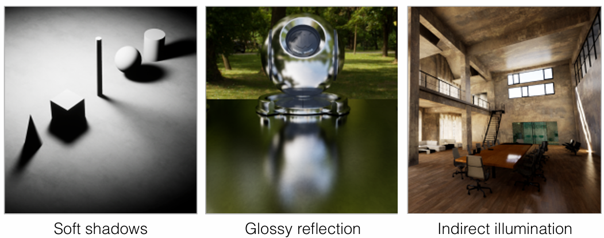{ width="80%" }

* Rasterization is fast, but quality is relatively low

* Ray tracing is accurate, but is very slow

    - Rasterization: real-time, ray tracing: offline

    - ~10K CPU core hours to render one frame in production

## Basic Ray-Tracing Algorithm

### Light Rays

Three ideas about light rays

1. Light travels in straight lines (though this is wrong)

2. Light rays do not "collide" with each other if they cross (though this is still wrong)

3. Light rays travel from the light sources to the eye (but the physics is invariant under path reversal - reciprocity).

### Ray Casting

1. Generate an image by casting one eye ray per pixel.

2. Find the closest scene intersection point

3. Check for shadows by sending a ray to the light

4. Perform shading calculation to compute color of pixel

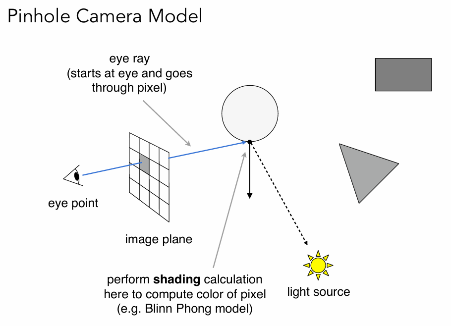{ width="80%" }

* Local only, without reflection and refraction

### Recursive (Whitted-Style) Ray Tracing

An improved illumination model for shaded display

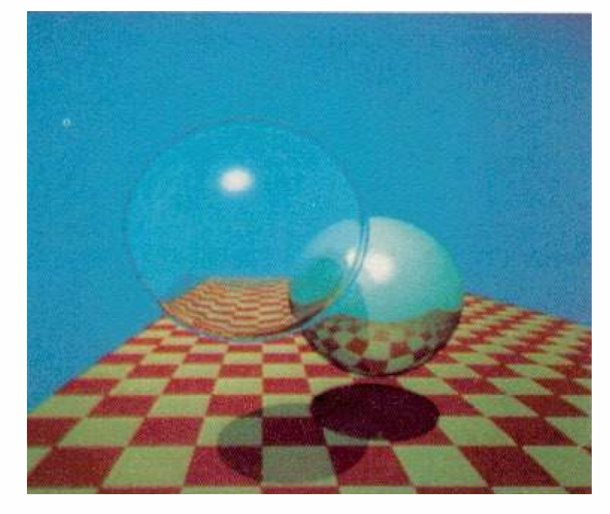{ width="70%" }

* When a ray hits a glass-like material, both reflection and refraction occur.

* When the primary ray hits the surface, continuely computing the intersection point between refracted/reflected rays and surface

* For each intersection point, shoot a ray to light source to check shadow

* Compute shading result on each intersection point

* Sum these results to get the color

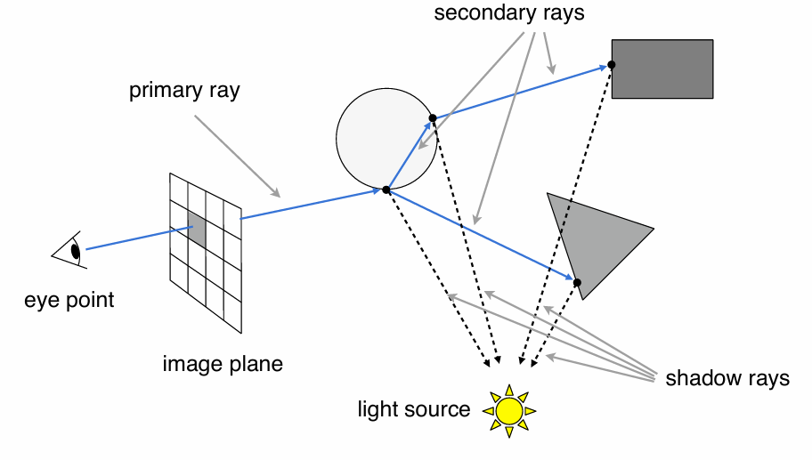{ width="80%" }

## Ray-Surface Intersection

### Ray Equation

Ray is defined by its origin and a direction vector.

Ray equation: 

$$
\mathbf{r}(t)=\mathbf{o}+t\mathbf{d}\quad0\leq t\leq \infty
$$

* $\mathbf{r}$: point along ray

* $t$: "time"

* $\mathbf{o}$: origin

* $\mathbf{d}$: normalized direction

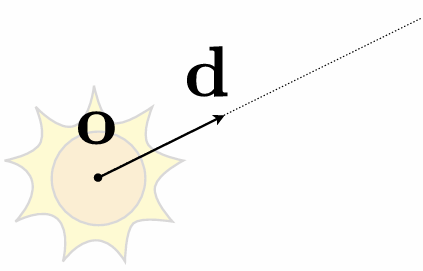{ width="50%" }

### Ray Intersection With Implicit Surface

Ray: $\mathbf{r}(t)=\mathbf{o}+t\mathbf{d}\quad0\leq t\leq \infty$

General implicit surface: $\mathbf{p}:f(\mathbf{p})=0$

Substitute ray equation: $f(\mathbf{o}+t\mathbf{d})=0$

* Solve for **real, positive** roots

### Ray Intersection With Triangle Mesh

Why?

* Rendering: visibility, shadows, lighting ...

* Geometry: inside/outside test
    * Shoot a ray from the point, if #intersection between the ray and surface is odd, then the point is inside the surface, outside otherwise.

How to compute?

Let's break this down:

* Simple idea: just intersect ray with each triangle

* Simple, but slow 

* Note: can have 0, 1 intersections (ignoring multiple intersections)

#### Ray Intersection With Triangle

Triangle is in a plane

* First find ray-plane intersection

* Then test if hit point is inside
triangle

Plane is defined by normal vector and a point on plane

Plane Equation (if p satisfies it, then p is on the plane):

$$
\mathbf{p}:(\mathbf{p}-\mathbf{p}^{\prime})\cdot\mathbf{N}=0
$$

Solve for intersection: Set $\mathbf{p}=\mathbf{r}(t)$ and solve for $t$

$$
(\mathbf{p}-\mathbf{p}^{\prime})\cdot\mathbf{N}=(\mathbf{o}+t\mathbf{d}-\mathbf{p}^{\prime})\cdot\mathbf{N}=0 \\
t=\frac{(\mathbf{p}^{\prime}-\mathbf{o})\cdot\mathbf{N}}{\mathbf{d}\cdot\mathbf{N}}
$$

* Check: $0\leq t\leq \infty$

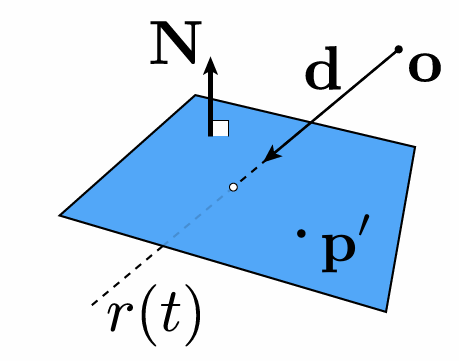{ width="40%" }

##### Möller Trumbore Algorithm

A faster approach, giving barycentric coordinate directly

$$
\vec{\mathbf{O}}+t\vec{\mathbf{D}}=(1-b_1-b_2)\vec{\mathbf{P}}_0+b_1\vec{\mathbf{P}}_1+b_2\vec{\mathbf{P}}_2\\
\begin{bmatrix}
t \\
b_1 \\
b_2
\end{bmatrix}=\frac{1}{\vec{\mathbf{S}}_1\bullet\vec{\mathbf{E}}_1}
\begin{bmatrix}
\vec{\mathbf{S}}_2\bullet\vec{\mathbf{E}}_2 \\
\vec{\mathbf{S}}_1\bullet\vec{\mathbf{S}} \\
\vec{\mathbf{S}}_2\bullet\vec{\mathbf{D}}
\end{bmatrix}
$$

Where: 

$$
\begin{aligned}
 & \mathbf{\vec{E}}_1=\mathbf{\vec{P}}_1-\mathbf{\vec{P}}_0 \\
 & \mathbf{\vec{E}}_{2}=\mathbf{\vec{P}}_{2}-\mathbf{\vec{P}}_{0} \\
 & \vec{\mathbf{S}}=\vec{\mathbf{O}}-\vec{\mathbf{P}}_{0} \\
 & \vec{\mathbf{S}}_1=\vec{\mathbf{D}}\times\vec{\mathbf{E}}_2 \\
 & \vec{\mathbf{S}}_{2}=\vec{\mathbf{S}}\times\vec{\mathbf{E}}_{1}
\end{aligned}
$$

* $Cost = (1 div, 27 mul, 17 add)$

* The intersection is inside the triangle if $b_1>0,b_2>0,b_1+b_2<1$

## Accelerating Ray-Surface Intersection

### Performance Challenges

Simple ray-scene intersection

* Exhaustively test ray-intersection with every triangle
* Find the closest hit (i.e. minimum t)

Problem:

* Naive algorithm = $\#pixels \times \# traingles \times \#bounces$
* Very slow!

For generality, we use the term objects instead of triangles later (but doesn't necessarily mean entire objects)

### Bounding Volumns

Quick way to avoid intersections: bound complex object with a simple volume

* Object is fully contained in the volume

* If it doesn't hit the volume, it doesn't hit the object

* So test BVol first, then test object if there is a hit

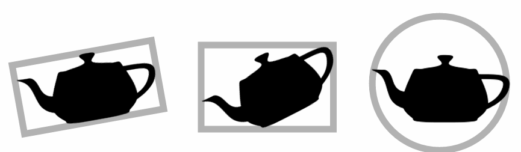{ width="80%" }

#### Ray-Intersection With Box

Box is the **intersection of 3 pairs of slabs**

* Specifically, we often use an Axis-Aligned Bounding Box (AABB)
    
    * i.e. any side of the BB is along either x, y, or z axis

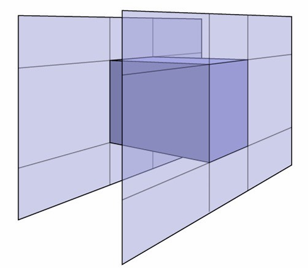{ width="50%" }

For 2D cases, 

* We first compute the intersections with each pair of slabs

    * This tells us the time $t$ when the ray is inside that pair: $t_{min}\leq t\leq t_{max}$

* When the ray intersects the box? 

    * Take the intersection of $t$ for each pair

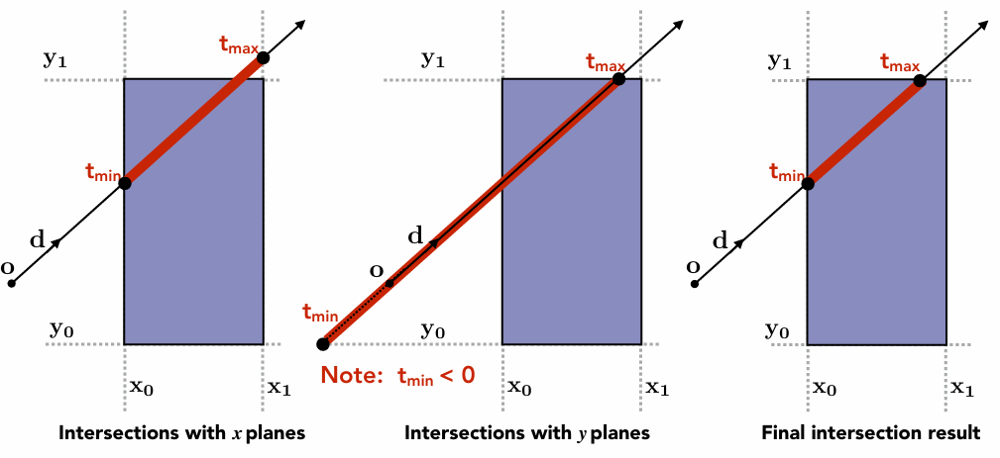{ width="90%" }

* Key ideas: 

    * The ray enters the box **only when** it enters all pairs of slabs

    * The ray exits the box **as long as** it exits any pair of slabs

* For each pair, calculate the $t_{min}$ and $t_{max}$ (negative is fine)

* For 3D box, $t_{enter}=\max\{t_{min}\},t_{exit}=\min\{t_{max}\}$

* The ray and AABB intersect iff $t_{enter}<t_{exit}\ and\ t_{exit}\geq 0$

    * If $t_{exit}<0$: The box is "behind" the ray, no intersection

    * If $t_{exit}\geq 0\ and\ t_{enter}< 0$: The ray's origin is inside the box, have intersection.

Why Axis-Aligned?

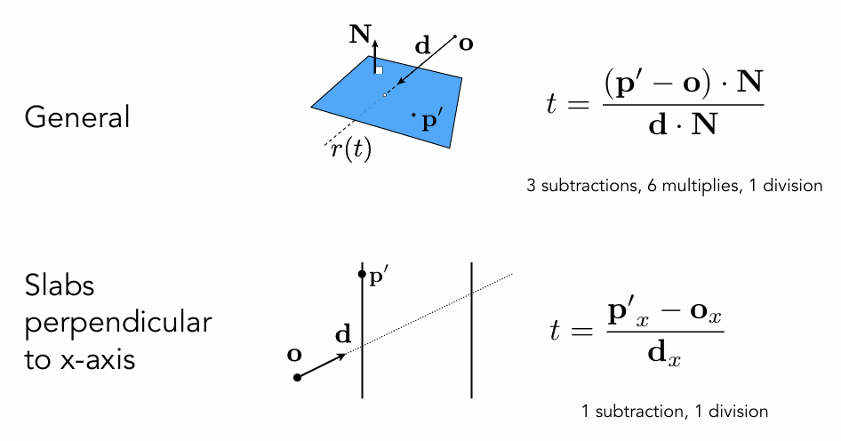{ width="90%" }

### Uniform Spatial Partitions (Grids)

Preprocess: Build Acceleration Grid

1. Find bounding box

2. Create grid

3. Store each object in overlapping cells

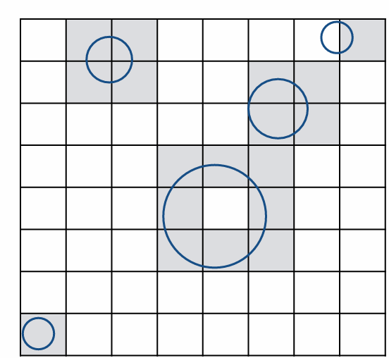{ width="70%" }

How to find Ray-Scene Intersection?

* Step through grid in ray traversal order

* For each grid cell: Test intersection with all objects stored at that cell

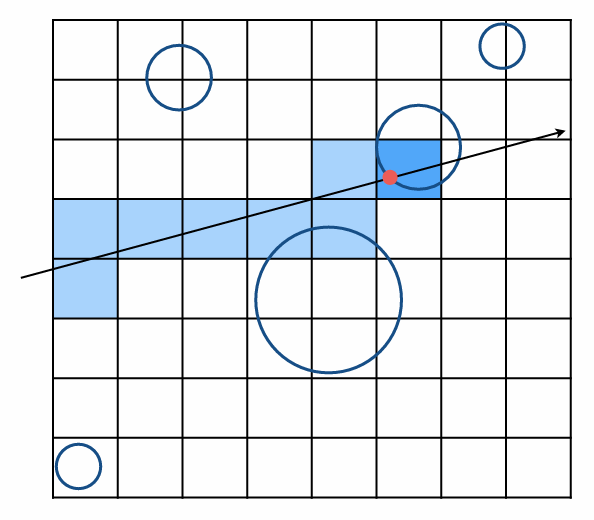{ width="70%" }

How to select grid resolution? 

* One cell: 

    * No speedup

* Too many cells: 

    * Inefficiency due to extraneous grid traversal

* Heuristic:

    * $\#cells = C \times \#objs$

    * $C \approx 27$ in 3D

When uniform grids work well? 

* Grids work well on large collections of objects that are distributed evenly in size and space

When They fail?

* "Teapot in a stadium" problem: Have to spend lots of time to test grid without objects inside

### Spatial Partitions

#### Data Structures to Partition Space

* Oct-Tree: Recursively divides a space into 8 (4 in 2D) regions with equivalent volume. Stop when the number of objects in the space is 0 or below a threshold.

    * The branching factor of an Oct-Tree grows exponentially with the number of dimensions.

* KD-Tree: Recursively divides a space into two regions by selecting an axis and splitting the data along a chosen coordinate. The axis used for division typically cycles through the dimensions (e.g., x, y, z) at each level of the tree.

* BSP-Tree: Similar to KD-Tree, but the divisions are not necessarily axis-aligned.

    * Hard to perform division in high dimension

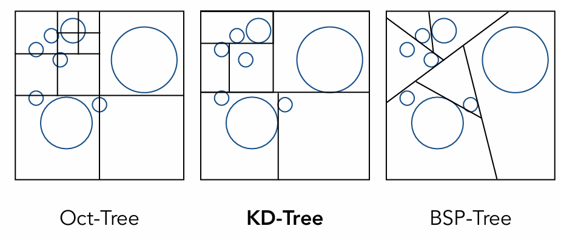{ width="80%" }

* you could have these in both 2D and 3D. Here we will illustrate principles in 2D.

#### KD-Tree

Pre-Processing

* Divide the space into several regions following the rule. Then we get a KD-Tree.

* Note that nodes 1 and 2 should also be subdivided but we don't demonstrate it here for simplicity

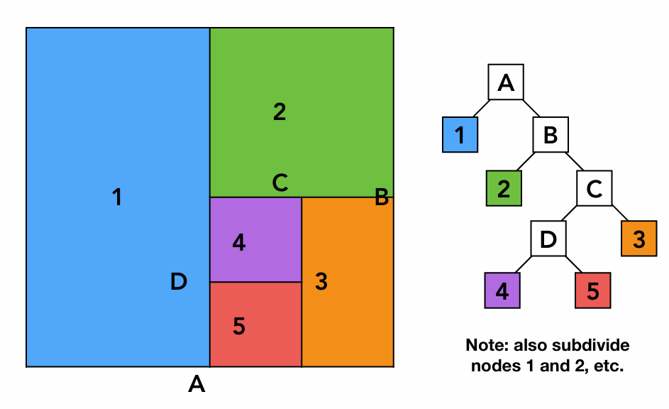{ width="80%" }


Data Structure for KD-Trees

* Internal nodes store

    * split axis: x-, y-, or z-axis

    * split position: coordinate of split plane along axis

    * children: pointers to child nodes

    * No objects are stored in internal nodes

* Leaf nodes store

    * list of objects

Traversing a KD-Tree

* First check the split axis and split position of the root node to decide whether the ray intersect with its child.

* Recursively traverse the subtree that intersects.

* If the node is leaf node, test the intersection of all objects inside it.

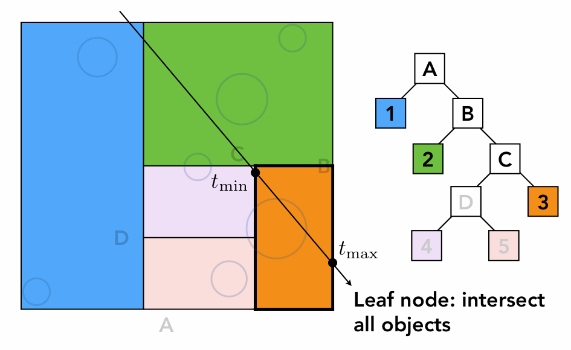{ width="80%" }

Problem: 

* It's hard to determine the intersection between box and triangle

* An object can be in many leaf nodes

### Object Partitions & Bounding Volume Hierarchy (BVH)

#### Building BVH

Procedure: 

* Find the bounding box of the current set objects

* Recursively split the set of objects into two subsets

    * Need to minimize the overlap of bounding boxes

* Recompute the bounding box of the subsets

* Stop when necessary

* Store objects in each leaf node

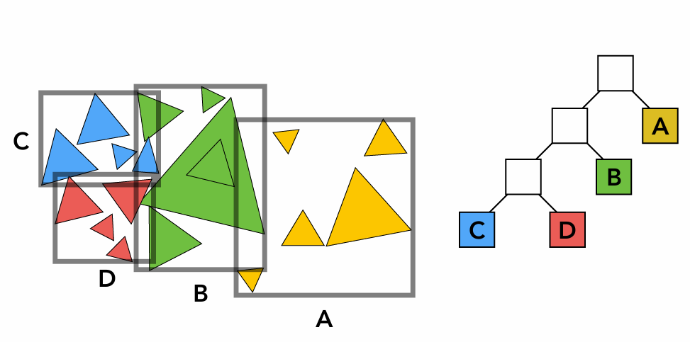{ width="80%" }

How to subdivide a node?

* Choose a dimension to split

* Heuristic #1: Always choose the longest axis in node

* Heuristic #2: Split node at location of median object

    * i.e. make the childs have same number of nodes. The tree can be more balanced

Termination criteria?

. Heuristic: stop when node contains few elements
(e.g. 5)

#### Data Structure for BVH

Internal nodes store

* Bounding box

* Children: pointers to child nodes 

Leaf nodes store

* Bounding box

* List of objects

Nodes represent subset of primitives in scene

* All objects in subtree

#### BVH Traversal

```
Intersect (Ray ray, BVH node) {
    if (ray misses node.bbox) return;

    if (node is a leaf node)
        test intersection with all objs;
        return closest intersection;

    hit1 = Intersect(ray, node.child1);
    hit2 = Intersect(ray, node.child2);

    return the closer of hit1, hit2;

}
```

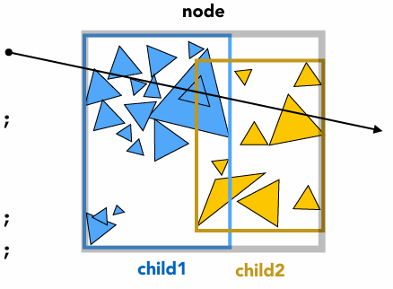{ width="60%" }


#### Spatial vs Object Partitions

Spatial partition (e.g.KD-tree)

* Partition space into non-overlapping regions

* An object can be contained in multiple regions

Object partition (e.g. BVH)

* Partition set of objects into disjoint subsets

* Bounding boxes for each set may overlap in space

## Radiometry

Why Radiometry?

* Blinn-Phong model is just a approximation: 

    * Many assumptions are incorrect.

    * Many quantities do not have a definite physical meaning.

* Whitted style ray tracing does not gives the correct result

Radiometry: 

* Measurement system and units for illumination

* Accurately measure the spatial properties of light
    
    * New terms: Radiant flux, intensity, irradiance, radiance

* Perform lighting calculations in a physically correct manner

### Radient Energy and Flux (Power)

Radiant Energy: 

* Definition: Radiant energy is the energy of electromagnetic
radiation. It is measured in units of joules, and denoted by
the symbol:

$$
Q\left[\text{J}=\text{Joule}\right]
$$

Radiant flux (power):

* Definition: Radiant flux (power) is the energy emitted, reflected, transmitted or received, per unit time.

$$
\Phi\equiv\frac{\mathrm{d}Q}{\mathrm{d}t}\text{ [W = Watt] [lm = lumen]}
$$

* Flux can also be understood as #photons flowing through a sensor in unit time

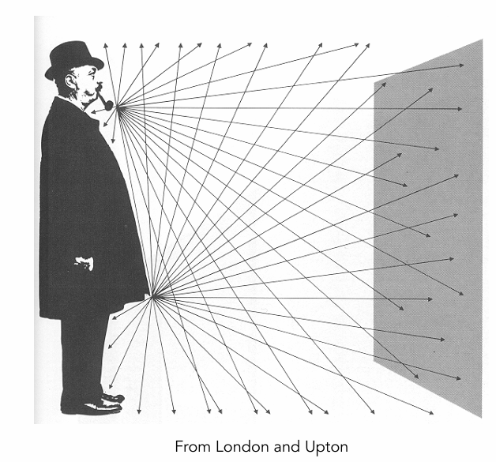{ width="60%" }

important Light Measurements of Interest

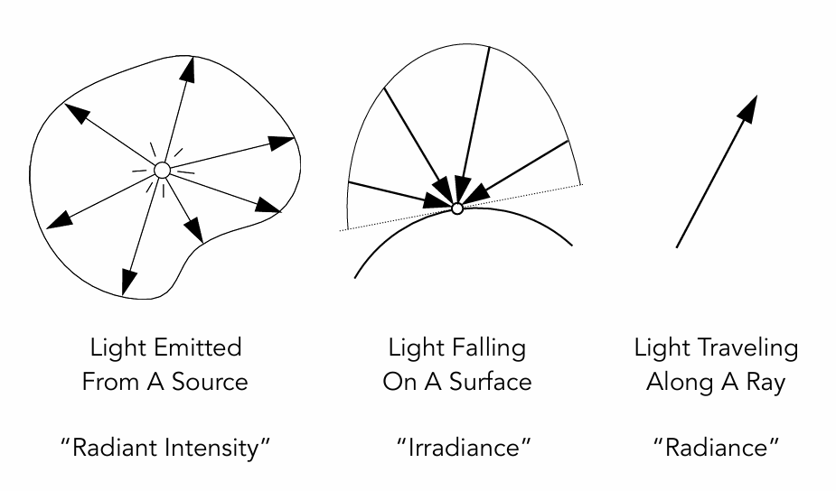{ width="60%" }

### Radiant Intensity

Definition: 

* The radiant (luminous) intensity is the power per unit solid angle emitted by a point light source.

$$
I(\omega)\equiv\frac{\mathrm{d}\Phi}{\mathrm{d}\omega}\left[\frac{\mathrm{W}}{\mathrm{sr}}\right]\left[\frac{\mathrm{lm}}{\mathrm{sr}}=\mathrm{cd}=\mathrm{candela}\right]
$$

Angle: ratio of subtended arc length on circle to radius

* $\theta = \frac{l}{r}$

* Circle has $2\pi$ radians

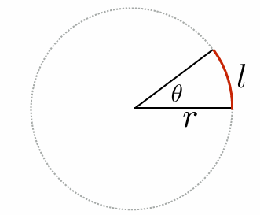{ width="40%" }

Solid angle: ratio of subtended area on sphere to radius squared

* $\Omega=\frac{A}{r^2}$

* Sphere has $4\pi$ steradians

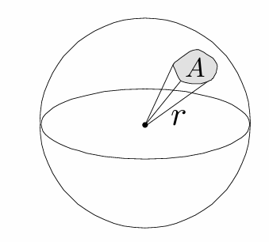{ width="40%" }

Differential Solid Angles

$$
\begin{align*}
\mathrm{d}A&=(r\mathrm{d}\theta)(r\sin{\theta}\mathrm{d}\phi)\\
&=r^2\sin{\theta}\ \mathrm{d}\theta \mathrm{d}\phi
\end{align*}
$$

$$
\begin{align*}
\mathrm{d}\omega=\frac{\mathrm{d}A}{r^2}=\sin{\theta}\ \mathrm{d}\theta\mathrm{d}\phi
\end{align*}
$$

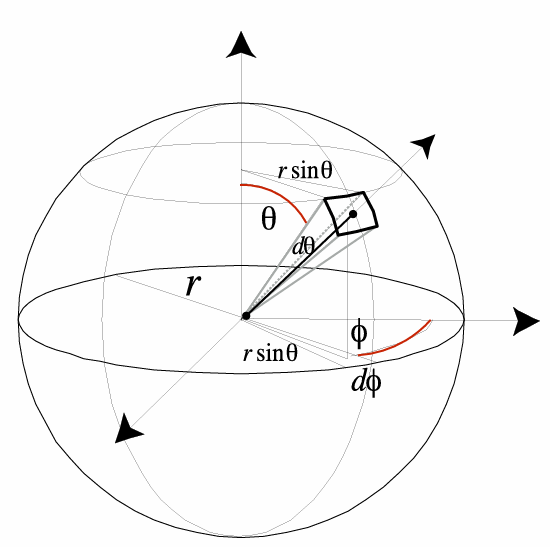{ width="60%" }

For sphere $S^2$, the solid angle is: 

$$
\begin{align*}
\Omega&=\int_{S^2}\mathrm{d}\omega\\
&=\int_{0}^{2\pi}\int_{0}^{\pi}\sin{\theta}\ \mathrm{d}\theta\mathrm{d}\phi\\
&=4\pi
\end{align*}
$$

We use $\omega$ to denote a direction vector (unit length)

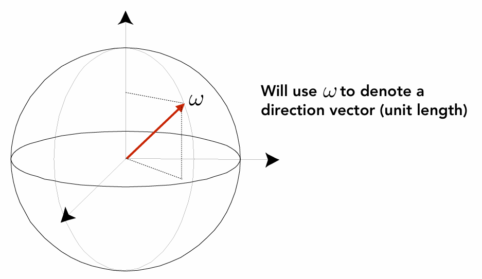{ width="80%" }

For Isotropic Point Source, 

$$
\begin{align*}
\Phi&=\int_{S^2}I\mathrm{d}\omega\\
&=4\pi I
\end{align*}
$$

$$
I=\frac{\Phi}{4\pi}
$$

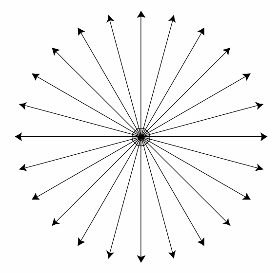{ width="60%" }

### Irradiance

Definition: 

* The irradiance is the power per (**perpendicular/projected**) unit area incident on a surface point.

$$
E(\mathbf{x})\equiv\frac{\mathrm{d}\Phi(\mathbf{x})}{\mathrm{d}A}\left[\frac{\mathrm{W}}{\mathrm{m}^2}\right]\left[\frac{\mathrm{lm}}{\mathrm{m}^2}=\mathrm{lux}\right]
$$

This explains Lambert's cosine law we discussed before: 

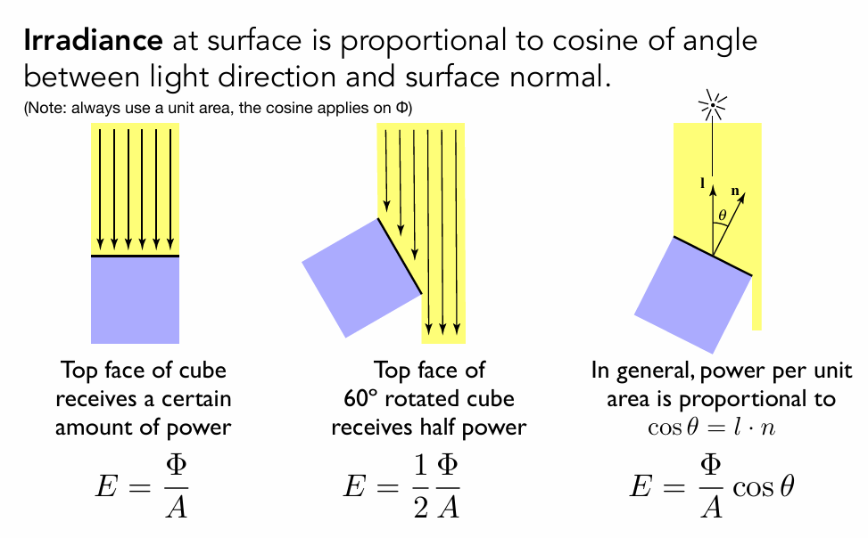{ width="80%" }

This also explains irradiance falloff

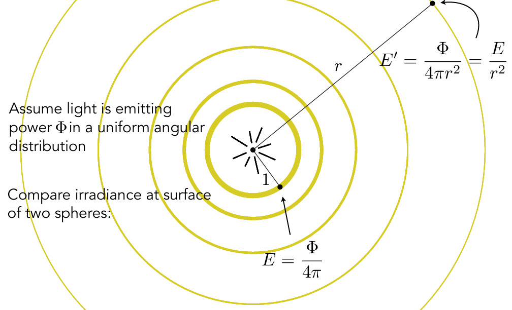{ width="80%" }

### Radiance

Radiance is the fundamental field quantity that describes the distribution of light in an environment

* Radiance is the quantity associated with a ray

* Rendering is all about computing radiance

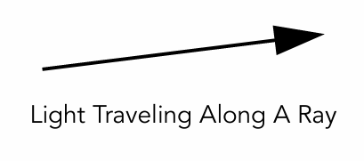{ width="40%" }

Definition: 

* The radiance (luminance) is the power emitted, reflected, transmitted or received by a surface, **per unit solid angle**, **per projected unit area**.

$$
L(\mathrm{p},\omega) \equiv\frac{\mathrm{d}^2\Phi(\mathrm{p},\omega)}{\mathrm{d}\omega\mathrm{d}A\cos\theta}
\left[\frac{\mathrm{W}}{\mathrm{sr}\ \mathrm{m}^2}\right]\left[\frac{\mathrm{cd}}{\mathrm{m}^2}=\frac{\mathrm{lm}}{\mathrm{sr}\ \mathrm{m}^2}=\mathrm{nit}\right]
$$

* $\cos{\theta}$ accounts for projected surface area

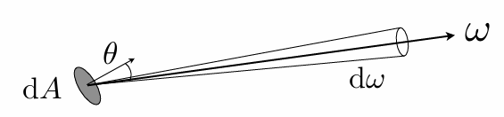{ width="40%" }

Recall

* Irradiance: power per projected unit area

* Intensity: power per solid angle

So

* Radiance: Irradiance per solid angle

* Radiance: Intensity per projected unit area

#### Incident Radiance

Incident radiance is the irradiance per unit solid angle arriving at the surface.

* i.e. it is the light arriving at the surface along a given ray (point on surface and incident direction).

$$
L(\mathrm{p},\omega)=\frac{\mathrm{d}E(\mathrm{p})}{\mathrm{d}\omega\cos\theta}
$$

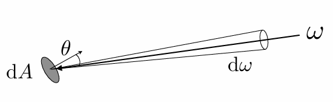{ width="40%" }

#### Exiting Radiance

Exiting surface radiance is the intensity per unit projected area leaving the surface.

* e.g. for an area light it is the light emitted along a given ray (point on surface and exit direction).

$$
L(\mathrm{p},\omega)=\frac{\mathrm{d}I(\mathrm{p},\omega)}{\mathrm{d}A\cos\theta}
$$

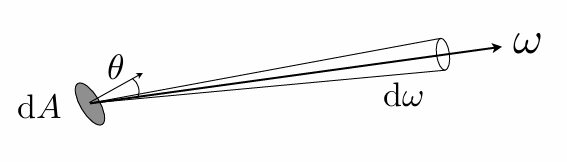{ width="40%" }

#### Irradiance vs. Radiance

* Irradiance: total power received by area $\mathrm{d}A$

* Radiance: power received by area $\mathrm{d}A$ from "direction" $\mathrm{d}\omega$

$$
\begin{aligned}
dE(\mathrm{p},\omega) & =L_i(\mathrm{p},\omega)\cos\theta\mathrm{d}\omega \\
E(\mathrm{p}) & =\int_{H^2}L_i(\mathrm{p},\omega)\cos\theta\mathrm{d}\omega
\end{aligned}
$$

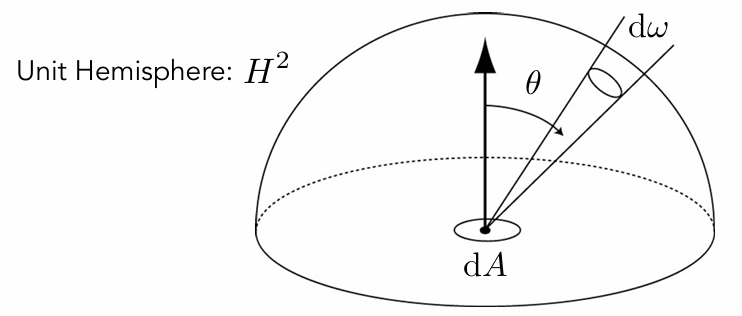{ width="60%" }


## Bidirectional Reflectance Distribution Function (BRDF)

Reflection at a Point:

* Radiance from direction $\omega_i$ turns into the power $E$ that $\mathrm{d}A$ receives

* Then power $E$ will become the radiance to any other direction $\omega _o$

* Differential irradiance incoming: $dE(\omega_i)=L(\omega_i)\cos{\theta_i}d\omega_i$

* Differential radiance exiting (due to $dE(\omega_i)$): $dL_r(\omega_r)$

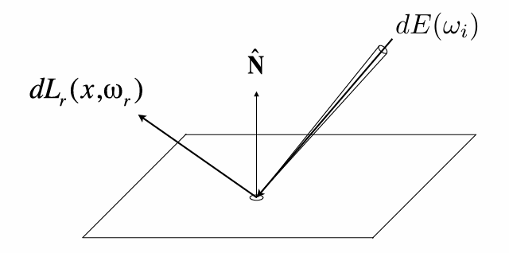{ width="60%" }

### BRDF 

* The Bidirectional Reflectance Distribution Function (BRDF) represents how much light is reflected into each outgoing direction $\omega _r$ from each incoming direction $\omega _i$

$$
f_r(\omega_i\rightarrow\omega_r)=\frac{dL_r(\omega_r)}{dE_i(\omega_i)}=\frac{dL_r(\omega_r)}{L_i(\omega_i)\cos{\theta_i}d\omega_i}\left[\frac{1}{\mathrm{sr}}\right]
$$

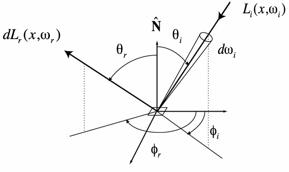{ width="60%" }

### Reflection Equation

* Defines how much light is reflected into the outgoing direction $\omega_r$

* Integrate light from all incoming direction $\omega_i$ times BRDF

$$
L_r(p,\omega_r)=\int_{H^2}f_r(p,\omega_i\rightarrow\omega_r)L_i(p,\omega_i)\cos{\theta_i}d\omega_i
$$

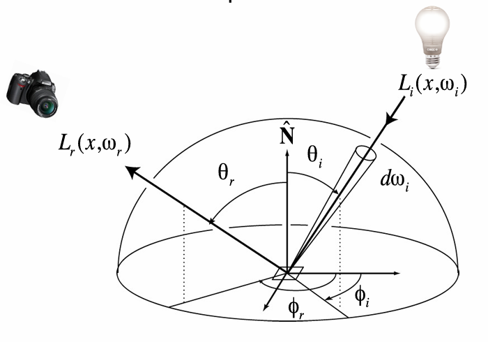{ width="80%" }

* Challenge: Recursive Equation

    * The Reflected radiance $L_r(p,\omega_r)$ depends on incoming radiance $L_i(p,\omega_i)$

    * But incoming radiance depends on reflected radiance (at another point in the scene)

### Rendering Equation 

* The surface may emit light spontaneously. Adding an Emission term to reflection equation to make it general

$$
L_o(p,\omega_o)=L_e(p,\omega_o) + \int_{\Omega+}L_i(p,\omega_i)f_r(p,\omega_i,\omega_o)(n\cdot \omega_i)d\omega_i
$$

!!! note
    Here we assume that all directions are pointing outwards

Note that $L_i$ is also the reflected light computed from the rendering function. So we can reformulate the equation as following: 

$$
l(u)=e(u)+\int l(v)K(u,v)dv
$$

where

* $l(u/v)$ denotes the light from direction $u/v$

* $K(u,v)dv$ is the kernel of equation (Light Transport Operator)

It can be discretized to a simple matrix equation (or system of simultaneous linear equations): 

$$
L=E+KL
$$

where $L,E$ are vectors and $K$ is the light transport matrix.


$$
\begin{align*}
L&=E+KL\\
IL-KL&=E\\
L&=(I-K)^{-1}E\\
L&=(I+K+K^2+K^3+\dots)\quad(\text{Binomial Theorem})\\
L&=E+KE+K^2E+K^3E+\dots
\end{align*}
$$

Now we can have a deeper understanding that $E$ is the emission directly from light sources, $KE$ is the direct illumination on surfaces, $K^2E$ is indirect illumination (One bounce), $\dots$

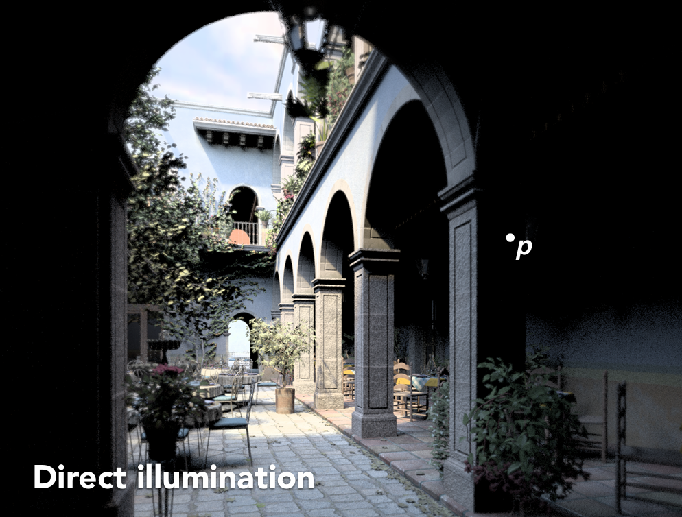{ width="80%" }

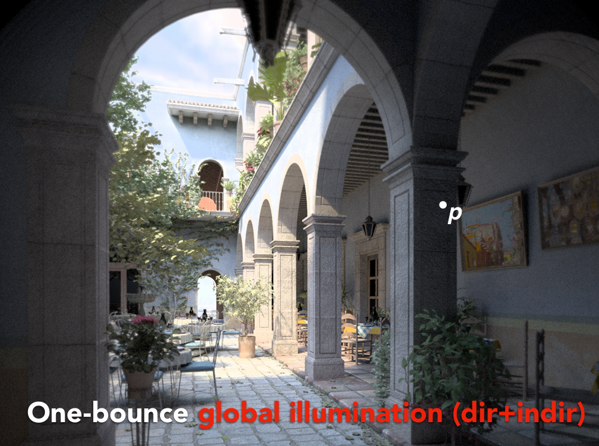{ width="80%" }

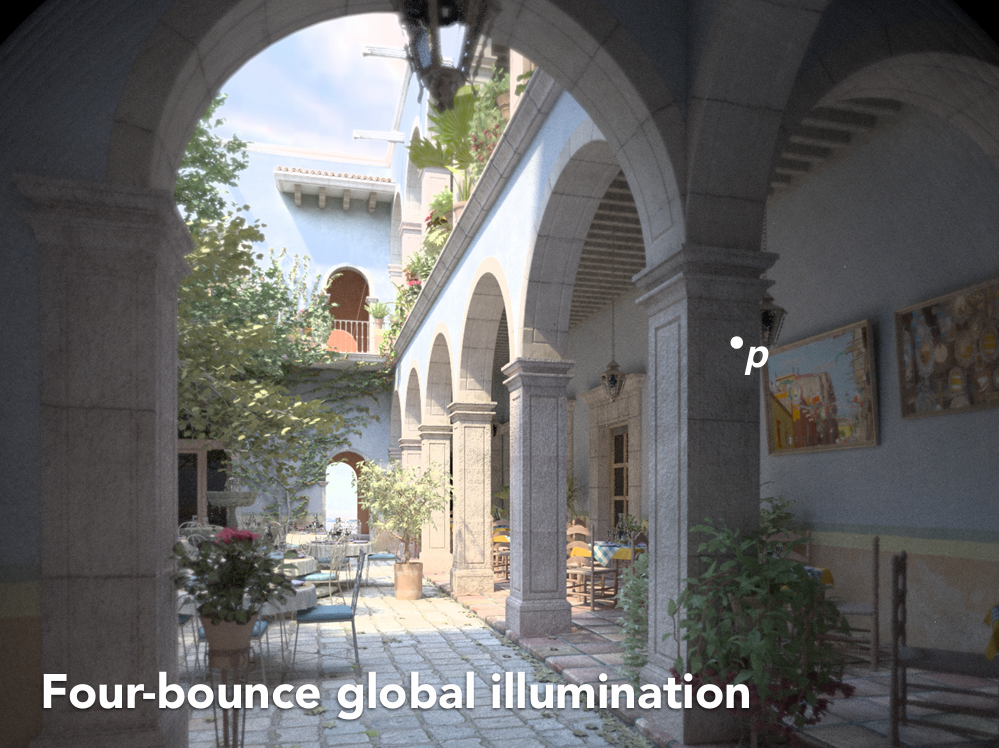{ width="80%" }

## Monte Carlo Integration

Why? 

* We want to solve an integral, but it can be too difficult to solve analytically

What & How? 

* Estimate the integral of a function by averaging random samples of the functoins's value

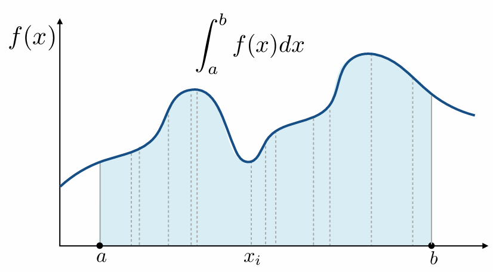{ width="80%" }

For the definite integral of given function $f(x)$, define: 

* Definite integral $\int_{a}^{b}f(x)dx$

* Random varirable $X_i \sim p(x)$

* Monte Carlo estimator: $F_N =\frac{1}{N}\sum_{i=1}^{N}\frac{f(X_i)}{p(X_i)}$

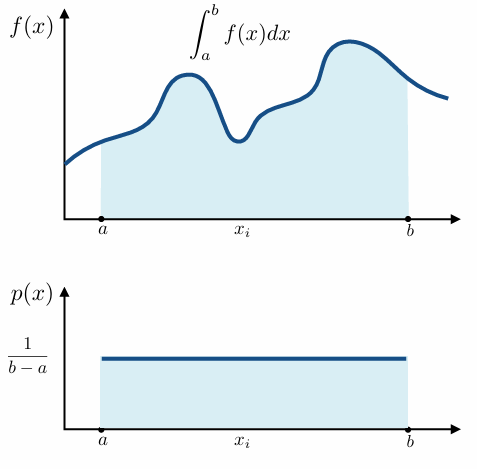{ width="60%" align=left}

For uniform random variable, 

$$
\begin{align*}
&X_i \sim p(x)=C\\
&\int_{a}^{b}p(x)dx=1\\
&\Rightarrow C=\frac{1}{b-a}
\end{align*}
$$

This brings us the Basic Monte Carlo estimator: 

$$
F_N=\frac{b-a}{N}\sum_{i=1}^Nf(X_i)
$$

In conclusion, we estimate the integral by the following formula: 

$$
\int f(x)dx=\frac{1}{N}\sum_{i=1}^{N}\frac{f(X_i)}{p(X_i)}\quad X_i\sim p(x)
$$

* The more samples, the less variance

* Sample on $x$, integrate on $x$

## Path Tracing

Motivation: Whitted-style ray tracing: 

* Always perform specular reflections / refractions

* Stop bouncing at diffuse surfaces

* Problem: 

    * Where should the ray be reflected for glossy materials?

    * No reflections between diffuse materials?

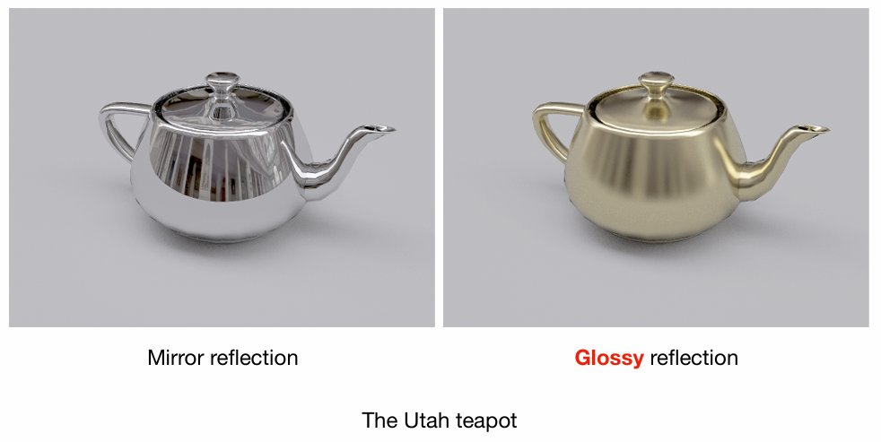{ width="80%" }

Whitted-Style Ray Tracing is Wrong

* The rendering equation is correct

$$
L_o(p,\omega_o)=L_e(p,\omega_o) + \int_{\Omega+}L_i(p,\omega_i)f_r(p,\omega_i,\omega_o)(n\cdot \omega_i)d\omega_i
$$

* But it involves: 

    * Solving an integral over the hemisphere

    * Recursive execution

### A Simple Monte Carlo Solution

Suppose we want to render one pixel (point) in the following scene for direct illumination only.

* An area light

* Assume all directions are **pointing outwards**

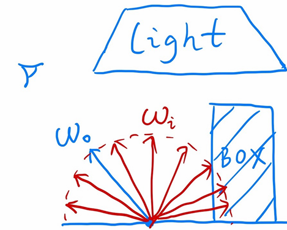{ width="60%" }

We want to compute the radiance at point $p$ towards the camera: 

$$
L_o(p,\omega_o)=\int_{\Omega+}L_i(p,\omega_i)f_r(p,\omega_i,\omega_o)(n\cdot \omega_i)d\omega_i
$$

* Using Monte Carlo integration: $\int_a^b f(x)dx\approx\frac{1}{N}\sum_{k=1}^{N}\frac{f(X_k)}{p(X_k)}\quad X_k\sim p(x)$

* $f(x)=L_i(p,\omega_i)f_r(p,\omega_i,\omega_o)(n\cdot \omega_i)$

* $p(\omega_i)=\frac{1}{2\pi}$

    * Since we assume uniformly sampling the hemisphere and the solid angle for a sphere is $4\pi$

So, in general: 

$$
L_o(p,\omega_o)\approx \frac{1}{N}\sum_{i=1}^{N}\frac{L_i(p,\omega_i)f_r(p,\omega_i,\omega_o)(n\cdot \omega_i)}{p(\omega_i)}
$$

It's a correct shading algorithm for direct illumination

```
shade (p, wo): 
    Randomly choose N directions wi~pdf
    Lo = 0.0
    For each wi
        Trace a ray r(p, wi)
        If ray r hit the light
            Lo += (1 / N) * L_i * f_r * cosine / pdf(wi)
    Return Lo
```

### Introducing Global Illumination

One more step forward: what if a ray hits an object?

* For the following example, $Q$ reflects direct illumination to $P$

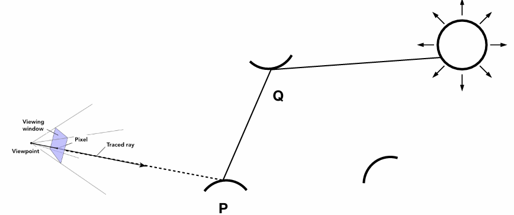{ width="70%" }

We can modify our algorithm, when the ray hits an object at q, recursively compute the shade at q

```
shade (p, wo): 
    Randomly choose N directions wi~pdf
    Lo = 0.0
    For each wi:
        Trace a ray r(p, wi)
        If ray r hit the light:
            Lo += (1 / N) * L_i * f_r * cosine / pdf(wi)
        Else If ray r hit an object at q:
            Lo += (1 / N) * shade(q, -wi) * f_r * cosine / pdf(wi)
    Return Lo
```

### Path Tracing

**Problem 1**: Explosion of $\#rays$ as $\#bounces$ go up: $\#rays=N^{\#bounces}$

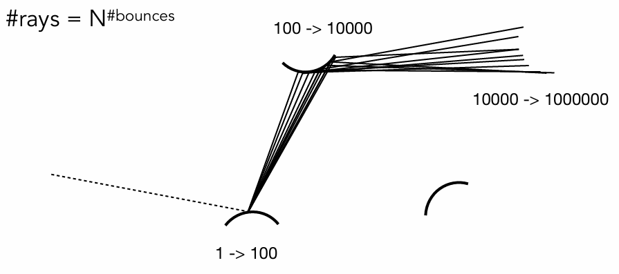{ width="70%" }

Key Observation: 

* $\#rays$ will not explode iff $N=1$

From now on, we always assume that only 1 ray is traced at each shading point, this is **path tracing** (Distributed Ray Tracing if $N\neq1$)

```
shade (p, wo): 
    Randomly choose 1 directions wi~pdf
    Trace a ray r(p, wi)
    If ray r hit the light:
        Return * L_i * f_r * cosine / pdf(wi)
    Else If ray r hit an object at q:
        Return shade(q, -wi) * f_r * cosine / pdf(wi)
    Return Lo
```

This can be too noisy, but we can just trace more paths through each pixel and average their radiance. It's similar to ray casting in ray tracing and called **Ray Generation**

```
ray_generation (camPos, pixel):
    Uniformly choose N sample positions within the pixel
    pixel_radiance = 0.0
    For each sample in the pixel
        Shoot a ray r(camPos, cam_to_sample)
        If ray r hit the scene at p
            pixel_radiance += 1 / N * shade(p, sample_to_cam)
    Return pixel_radiance
```

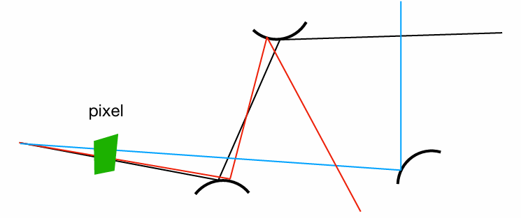{ width="70%" }

**Problem 2**: The recursive algorithm will never stop

* Dilemma: the light does not stop bouncing in reality. Cutting #bounces equals cutting energy

Solution: Russian Roulette (RR)

* Previously, we always shoot a ray at a shading point and get the shading result $L_o$

* Now, set a probability $P\ (0<P<1)$

    * With probability $P$, shoot a ray and return the shading result divided by $P$: $Lo / P$

    * With probability $1-P$, don't shoot a ray and you'll get $0$

* The expectation is still $L_o$: $E=P\cdot (L_o/ P)+(1-P)\cdot 0=L_o$

```
shade (p, wo): 
    Manually specify a probability P_RR
    Randomly select ksi in a uniform dist. in [0, 1]
    If (ksi > P_RR) return 0.0;

    Randomly choose ONE direction wi~pdf(w)
    Trace a ray r(p, wi)
    If ray r hit the light:
        Return L_i * f_r * cosine / pdf(wi) / P_RR
    Else If ray r hit an object at q:
        Return shade(q, -wi) * f_r * cosine / pdf(wi) / P_RR
```

Now we already have a correct version of path tracing!

But it's not really efficient.

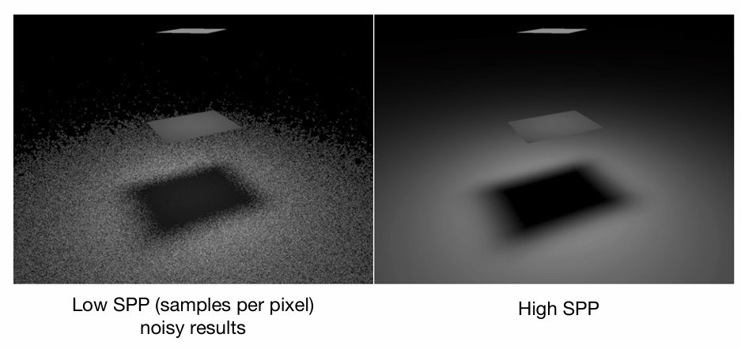{ width="80%" }

### Sampling the Light

Why inefficient? 

* Only part of rays will hit the light while others are wasted if we uniformly sample the hemisphere

Idea: 

* Always sample the light so that no rays are wasted.

Take the following case for example: 

* Assume uniformly sampling on the light, $pdf=\frac{1}{A}$

    * Because $\int pdf\ dA=1$, where $A$ is the light area

* The rendering equation integrates on the solid angle $d\omega_i$, we need transform it to an integral of $dA$: 

    * Recall the alternative defination of solid angle, Projected area on the unit sphere: $d\omega=\frac{dA\cos{\theta'}}{\|x'-x\|^2}$ (Note: $\theta'$ instead of $\theta$)

* Then we can rewrite the rendering equation as 

$$
\begin{align*}
L_o(p,\omega_o)&=\int_{\Omega+}L_i(x,\omega_i)f_r(x,\omega_i,\omega_o)\cos{\theta}d\omega_i\\
&=\int_A L_i(x,\omega_i)f_r(x,\omega_i,\omega_o)\frac{\cos{\theta}\cos{\theta'}}{\|x'-x\|^2}dA
\end{align*}
$$

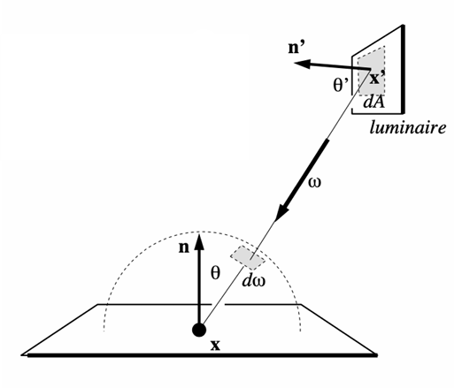{ width="80%" }

Previously, we assume the light is "accidentally" shot by uniform hemisphere sampling

Now we consider the radiance coming from two parts:

1. light source (direct, no need to have RR)

2. other reflectors (indirect, RR)

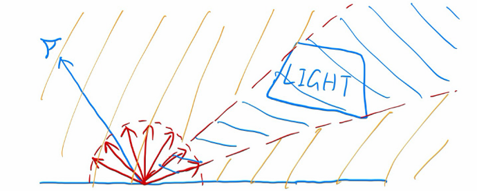{ width="80%" }


One final thing: what if the sample on the light is blocked? 

* check when shooting

```
shade (p, wo):
    # Contribution from the light source.
    Uniformly sample the light at x' (pdf_light = 1 / A)
    Shoot a ray from p to x'
    If the ray is not blocked in the middle:
        L_dir = L i * f_r * cos 0 * cos 0' / |x' - p| ^2 / pdf_light

    # Contribution from other reflectors.
    L_indir = 0.0
    Test Russian Roulette with probability P_RR
    Uniformly sample the hemisphere toward wi (pdf_hemi = 1 / 2pi)
    Trace a ray r(p, wi)
    If ray r hit a non-emitting object at q
        L_indir = shade(q, -wi) * f_r * cos 0 / pdf_hemi / P_RR

    Return L dir + L indir
```

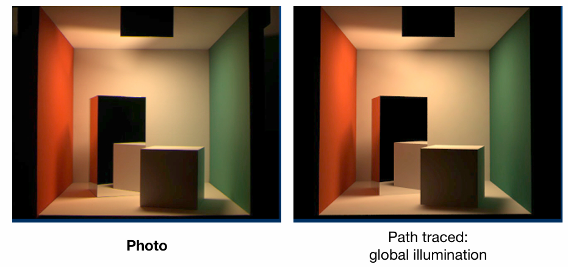{ width="80%" }
