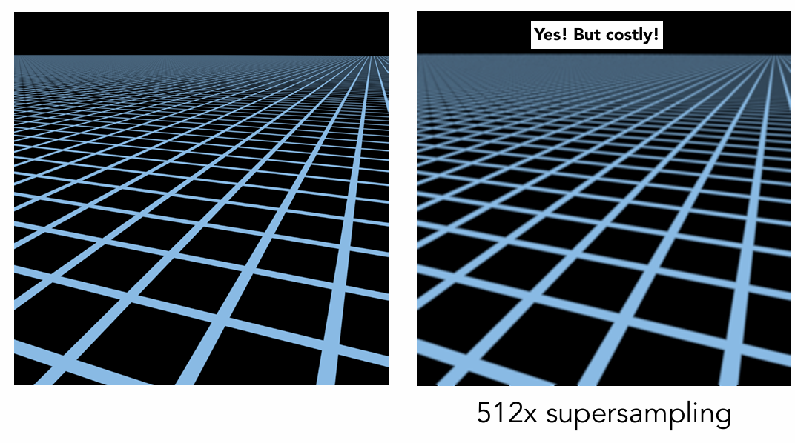
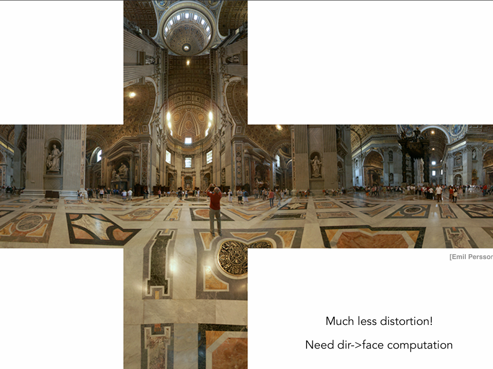

# Shading

Definition: The process of **applying a material** to an object

## Blinn-Phone Reflectance Model


* Shading is local, we only care the property of the object itself, while not caring about other objects.
* So no shadows will be generated (**shading** $\neq$ **shadow**)

Compute light reflected toward camera at a specific **shading point**:

Inputs:

* Viewer direction $\mathbf{v}$
* Surface normal $\mathbf{n}$
* Light drection $\mathbf{l}$
* Surface parameters (color, shininess, ...)

{ width="50%" }

### Diffuse Reflection

* Light is scattered uniformly in all directions
* Surface color is the same for all viewing directions

{ width="70%" }

* The light hitting the same surface at different angles will produce varying levels of brightness.

* How much light(energy) is received? Lambert's cosine law: 

{ width="100%" }

* According to the law of energy conservation, the energy emitted by a point light source is the same at both near and far spheres.

* So the energy of the light will diminish with the distance between the object and the point light source.

{ width="100%" }

Lambertian (Diffuse) Shading: 

$$
L_d=k_d(I/r^2)\max{(0, \mathbf{n}\cdot\mathbf{l})}
$$

* $L_d$ is diffusely reflected light
* $k_d$ is the diffuse coefficient(color), which represents the color and the proportion of light that is diffusely reflected by the surface.
* $I/r^2$ is the energy arrived at the shading point
* $\max{(0, \mathbf{n}\cdot\mathbf{l})}$ represents the energy received by the shading point. We constrain the minimum value to 0 because a negative value indicates that the light is hitting the back of the surface, which is not visible.
* Diffuse reflection is **independent** of view direction
* Produces diffuse appearance

{ width="100%" }

### Specular Reflection

* Intensity **depends** on view direction

* Bright near mirror reflection direction
    * $\mathbf{v}$ close to mirror direction $\leftrightarrow$ half vector $\mathbf{h}$ near normal

* Measure "near" by dot product of unit vectors

$$
\begin{align*}
\mathbf{h}&=\text{bisector}(\mathbf{v}, \mathbf{l})=\frac{\mathbf{v}+\mathbf{l}}{\|\mathbf{v}+\mathbf{l}\|} \\
L_s&=k_s(I/r^2)\max{(0, \cos{\alpha})^p}\\
&=k_s(I/r^2)\max{(0, \mathbf{n}\cdot\mathbf{h})^p}
\end{align*}
$$

{ width="50%" }

* $L_s$ is specularly reflected light
* $k_s$ is specular coefficient, generally $(1,1,1)$(white)
* Increasing $p$ narrows the reflection lobe

{ width="100%" }
{ width="100%" }

### Ambient

* Light from environment, does not depend on anything
* Add constant color to account for disregarded illumination and fill in black shadows
* This is approximate and fake!

$$
L_a=k_aI_a
$$

### Blinn-Phong Reflection Model

$$
\begin{align*}
L&=L_a+L_d+L_s\\
&=k_aI_a+k_d(I/r^2)\max{(0, \mathbf{n}\cdot\mathbf{l})}+k_s(I/r^2)\max{(0, \mathbf{n}\cdot\mathbf{h})^p}
\end{align*}
$$

{ width="100%" }


## Shading Frequencies

So far, we have only discussed shading at a specific point.

### Shade each triangle (flat shading)

* Triangle face is flat: one normal vector

* Shade once per triangle

* Not good for smooth surfaces

{ width="50%" }

### Shade each vertex (Gouraud shading)

* Each vertex has a normal vector

* **Interpolate** colors from vertices across triangle

{ width="50%" }

### Shade each pixel (Phong shading)

* Interpolate normal vectors across each triangle

* Compute full shading model at each pixel

* Not the Blinn-Phong Reflectance Model

{ width="50%" }

* Flat shading also produces good results with more faces.
{ width="50%" }

## Defining Per-Vertex Normal Vectors

* Best to get vertex normals from the underlying geometry (e.g. a sphere)

* Otherwise have infer vertex normals from triangle faces
    * Simple scheme: average surrounding face normals

$$
N_v=\frac{\sum_iN_i}{\|\sum_iN_i\|}
$$

* **Barycentric interpolation** of vertex normals

{ width="50%" }


!!! note
    Don't forget to normalize the interpolated directions

## Graphics (real time) pipeline

{ width="100%" }

### Shader Programs

* Program vertex and fragment processing stages
* Describe operation on a single vertex (or fragment)

```shader title="fragment shader"
uniform sampler2D myTexture;
uniform vec3 lightDir;
varying vec2 uv;
varying vec3 norm;

void diffuseShader()
{
    vec3 kd;
    kd = texture2d(myTexture, uv);
    kd *= clamp(dot(-lightDir, norm), 0.0, 1.0);
    gl_FragColor = vec4(kd, 1.0);
}
```

* Shader function executes once per fragment.
* Outputs color of surface at the current fragment's screen sample position.
* This shader performs a texture lookup to obtain the surface's material color at this point, then performs a diffuse lighting calculation.

## Interpolation Across Triangles: Barycentric coordinates

* Why do we want to interpolate?
    * Specify values at vertices
    * Obtain smoothly varying values across triangles

* What do we want to interpolate?
    * Texture coordinates, colors, normal vectors, ...

* How do we interpolate?
    * Barycentric coordinates

### Barycentric coordinates

* Given a triangle with vertex coordinates $A$, $B$, and $C$, **any point** coplanar with the triangle can be represented as a linear combination of $A$, $B$, and $C$.
    * Here $A,B$ and $C$ are the coordinate of the vertex, i.e. $A=(x_A,y_A)$

* This forms a coordinate system for triangles $(\alpha, \beta, \gamma)$
    * $(x,y)=\alpha A + \beta B + \gamma C$
    * $\alpha + \beta + \gamma = 1$
        * this constrain the points to be in the same plane
    * All three coordinates are non-negative if $(x,y)$ is inside the triangle.

{ width="50%" }

* How can we get the Barycentric coordinate for a point inside the triangle?
    * The coefficient are proportional to areas

$$
\begin{align*}
\alpha &= \frac{A_A}{A_A+A_B+A_C}\\
\beta &= \frac{A_B}{A_A+A_B+A_C}\\
\gamma &= \frac{A_C}{A_A+A_B+A_C}
\end{align*}
$$

{ width="50%" }

* What's the barycentric coordinate of the centroid?
    * $\alpha = \beta = \gamma = \frac{1}{3}$

* You can also get the coordinate using the following formula

$$
\begin{aligned}
 & \alpha=\frac{-(x-x_B)(y_C-y_B)+(y-y_B)(x_C-x_B)}{-(x_A-x_B)(y_C-y_B)+(y_A-y_B)(x_C-x_B)} \\
 & \beta=\frac{-(x-x_C)(y_A-y_C)+(y-y_C)(x_A-x_C)}{-(x_B-x_C)(y_A-y_C)+(y_B-y_C)(x_A-x_C)} \\
 & \gamma=1-\alpha-\beta
\end{aligned}
$$

### Using barycentric coordinates

* Linearly interpolate values at vertices

$$
V=\alpha V_A+\beta V_B + \gamma V_C
$$

* $V_A, V_B, V_C$ can be positions, texture coordinates, color, normal, depth, material attributes ...

{ width="50%" }


!!! note
    However, barycentric coordinates are not invariant under projection! The barycentric coordinates may change after projection. It is better to compute this in 3D space.

### Bilinear Interpolation

* Define: $\text{lerp}(x,v_0,v_1)=v_0+x(v_1-v_0)$
* First interpolate horizontally: 
    * $u_0=\text{lerp}(s,u_{00},u_{10})$
    * $u_1=\text{lerp}(s,u_{01},u_{11})$
* The vertical lerp to get the result:
    * $f(x,y) = \text{lerp}(t,u_{0},u_{1})$


{ width="60%" }


## Texture Mapping

* Surfaces are 2D images lives in 3D world space

* Every 3D surface point maps to a point in the 2D image (**texture**)

{ width="100%" }

* Each triangle "copies" a piece of the texture image to the surface

{ width="100%" }

* Each triangle vertex is assigned a texture coordinate $(u,v)$. Generally, both $u$ and $v$ are in range $[0,1]$ 


### Applying Textures

* Simple Texture Mapping: Diffuse Color

```
for each rasterized screen sample (x,y):
    (u,v) = evaluate texture coordinate at (x,y)
    texcolor = texture.sample(u,v);
    set sample's color to texcolor;
```

### Texture Magnification

* What if the texture is too small?

* Generally don't want this: insufficient texture resolution

* **texel**: a pixel on a texture

* Many texels are mapped to one pixel

{ width="100%" }

* What if the texture is too big?

{ width="100%" }

* Why?
    * The near pixel covers a small range of texels, while the far pixel covers a large range.
    * Problems arise when we use a single texel to represent a large range.

{ width="100%" }

* Will supersampling work?
    * Yes, high quality, but costly
    * When highly minified, many texels in pixel footprint
    * Signal frequency too large in a pixel
    * Need even higher sampling frequency

{ width="100%" }

* Let's understand this problem in another way
    * What if we don't sample?
    * Just need to get the average value within a range!

* Point Query: Given a point, return its value

* Average Range Query: Given a range, return its average value.

### Mipmap

* Allowing fast, approximate and square range queries

{ width="100%" }

* Level 0 is the original image

* Resolution is quartered with each level increase.

* Can be precomputed

* Storage overhead is only one-third of the original storage

#### Computing Mipmap Level $D$

* Estimate texture footprint using texture coordinates of neigboring screen samples. That is, how many units a texel in texture space will move when a pixel move one unit.

$$
D=\log_2L\quad L=\max\left(\sqrt{\left(\frac{du}{dx}\right)^2+\left(\frac{dv}{dx}\right)^2},\sqrt{\left(\frac{du}{dy}\right)^2+\left(\frac{dv}{dy}\right)^2}\right)
$$

* $D$ rounds to the nearset integer

* Query the texel in Level $D$

{ width="100%" }

#### Smooth Boundary

* Problem: The result is not smooth in the boundary of different level

{ width="80%" }

* How to solve? Using trilinear interpolation

{ width="100%" }

{ width="100%" }

* Limitations: Overblur

{ width="100%" }

* Why? There are irregular pixel footprint in texture.

{ width="100%" }

#### Anisotropic Filtering

Ripmaps and summed area tables
* Can look up axis-aligned
rectangular zones
* Diagonal footprints still a problem

{ width="70%" }

EWA filtering
* Use multiple lookups
* Weighted average
* Mipmap hierarchy still helps
* Can handle irregular footprints

{ width="70%" }

### Application

In modern GPUs, texture = memory + range query (filtering)

* General method to bring data to fragment calculations

Many applications

* Environment lighting
* Store microgeometry
* Procedural textures
* Solid modeling
* Volume rendering

#### Environment Map

We can use texture to represent light from environment

{ width="80%" }

!!! note 
    Actually, the environment light is related to both position and direction, but here we approximate it by assuming the light source is infinitely far away.

##### Spherical Environment Map

Assuming you place a mirror sphere in the middle of the scene, you will be able to observe the reflections of the environment light on its surface, which helps in understanding the light's behavior. 

* This inspires us to store the environment light on a sphere, which is called a **Spherical Environment Map**.

{ width="80%" }

* Problem: The top and bottom parts are prone to distortion

{ width="80%" }

##### Cube Map

* Store the environment light on a cube instead of a sphere, which is more uniform in each position.

* The cube is textured with 6 square texture maps

* Each direction vector maps to a cube point along it.

{ width="80%" }

* Much less distortion

* When querying a direction, need to first find the corresponding face.


{ width="80%" }

#### Bump & Normal Mapping

For a bumpy surface, it is costly to represent it using triangles

* Use bump mapping to represent relative height to the underlying surface

* Fake the detailed geometry

{ width="80%" }

Bump mappng adds surface detail without adding more triangles

* Perturb surface normal per pixel for shading computation

* "Height shift" per texel defined by a texture

* The black line is the original surface while the orange one represents the perturbed surface

{ width="80%" }

##### Perturb The Normal

In flatland (2D case), assume the surface normal is $n(p)=(0,1)$

* Derivative at $p$ is $dp=c\times [h(p+1)-h(p)]$
    * $c$ is a constant to control the effect of bump mapping

* Perturbed normal is then $n(p)=(-dp,1).normalize()$

In 3D case, assume the original surface normal $n(p)=(0,0,1)$

* Derivatives at p are 
    * $dp/du=c_1\times[h(\mathbf{u}+1)-h(\mathbf{u})]$
    * $dp/dv=c_1\times[h(\mathbf{v}+1)-h(\mathbf{v})]$

* Perturbed normal is then $n(p)=(-dp/du,-dp/dv,1).normalize()$

!!!note
    Note that this is in **local coordinate** since we constrain the original normal to $(0,0,1)$. The result should be transformed to world coordinate later.

#### Displacement Mapping

Displacement Mapping is a more advanced approach

* Uses the same texture as in bumping mapping

* Actually moves the vertices

* More triangle needed to get a good result

{ width="80%" }

#### 3D Procedural Noise + Solid Modeling

* 3D texture: Any point in 3D space has a texture value. The interior of an object also has texture.

* Define 3D noise function to generate texture

{ width="80%" }

#### Provide Precomputed Shading

Texture can also store precomputed information

* ambient occlusion: store information about which part of the ambient light will be occluded

* multiply the shading result with the texture map. 0 means occluded.

{ width="80%" }

!!! note
    Textures can store various types of information, including but not limited to color. The meaning depends on how you interpret it in the shader.