# Real Time Environment Lighting

## Environment Lighting

* An image representing distant lighting from all directions
 
    * we assume the distant lighting is from infinitely far away

* Spherical map vs. cube map

{ width="80%" }

## Shading from Environment Lighting

*  Informally named Image-Based Lighting (IBL)
 
* How to use it to shade a point (without shadows)?

    * Solving the rendering equation

$$
L_{o}\left(\mathrm{p}, \omega_{o}\right)=\int_{\Omega^{+}} \boxed{L_{i}\left(\mathrm{p}, \omega_{i}\right)} \boxed{f_{r}\left(\mathrm{p}, \omega_{i}, \omega_{o}\right)  \cos \theta_{i}} \mathrm{~d} \omega_{i}
$$

*  General solution: Monte Carlo integration

    - Numerical 
    
    - Large amount of samples required 

* Problem: can be slow
    - Can we avoid sampling?

### The Classic Approximation

* Observation

    - If the BRDF is glossy — small support! 
    
    - If the BRDF is diffuse — smooth! 
    
    - Good for the following approximation we mentioned before

\[
\int_{\Omega} f(x) g(x) \, dx \approx \frac{\int_{\Omega_{G}} f(x) \, dx}{\int_{\Omega_{G}} \, dx} \cdot \int_{\Omega} g(x) \, dx
\]

* BRDF satisfies the accuracy condition in any case

    - We can safely take the lighting term out

$$
\begin{align*}
L_o(p,\omega_o) \approx \boxed{\frac{\int_{\Omega_{f_r}} L_i(p,\omega_i) \, \mathrm{d}\omega_i}{\int_{\Omega_{f_r}} \, \mathrm{d}\omega_i}} \cdot \int_{\Omega^+} f_r(p,\omega_i,\omega_o) \cos\theta_i \, \mathrm{d}\omega_i
\end{align*}
$$

### The Split Sum: 1st Stage

* Prefiltering of the environment lighting

    - Pre-generating a set of differently filtered environment lighting 
    
    - Filter size in-between can be approximated via trilinear interp.

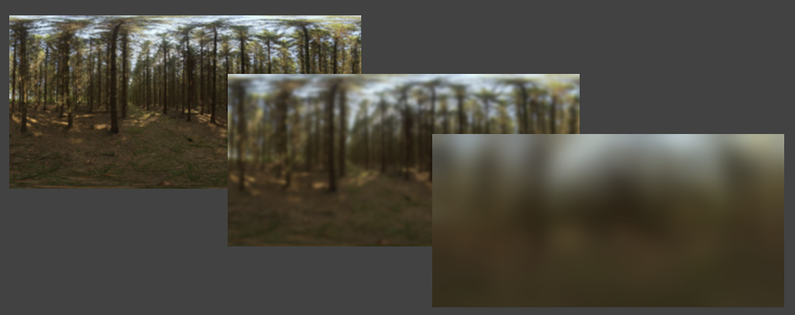{ width="80%" }

*  Then query the pre-filtered environment lighting at the $r$ (mirror reflected) direction!

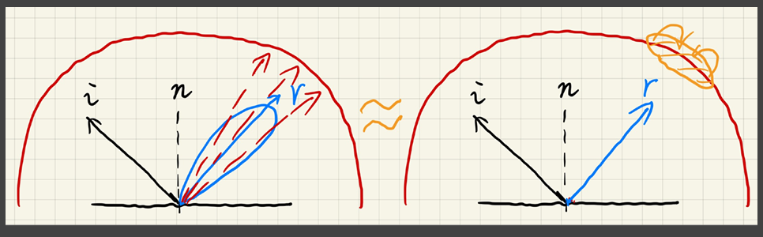{ width="80%" }

### The Split Sum: 2nd Stage

* The second term is still an integral

    - How to avoid sampling this term

$$
\begin{align*}
L_o(p,\omega_o) \approx {\frac{\int_{\Omega_{f_r}} L_i(p,\omega_i) \, \mathrm{d}\omega_i}{\int_{\Omega_{f_r}} \, \mathrm{d}\omega_i}} \cdot \boxed{\int_{\Omega^+} f_r(p,\omega_i,\omega_o) \cos\theta_i \, \mathrm{d}\omega_i}
\end{align*}
$$

*  Idea

    - Precompute its value for all possible combinations of variables roughness, color (Fresnel term), etc. 
    
    
    - But we’ll need a huge table with extremely high dimemsions

* Recall: Microfacet BRDF

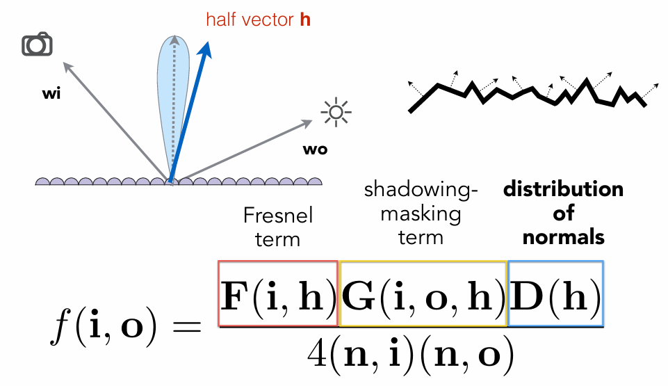{ width="80%" }

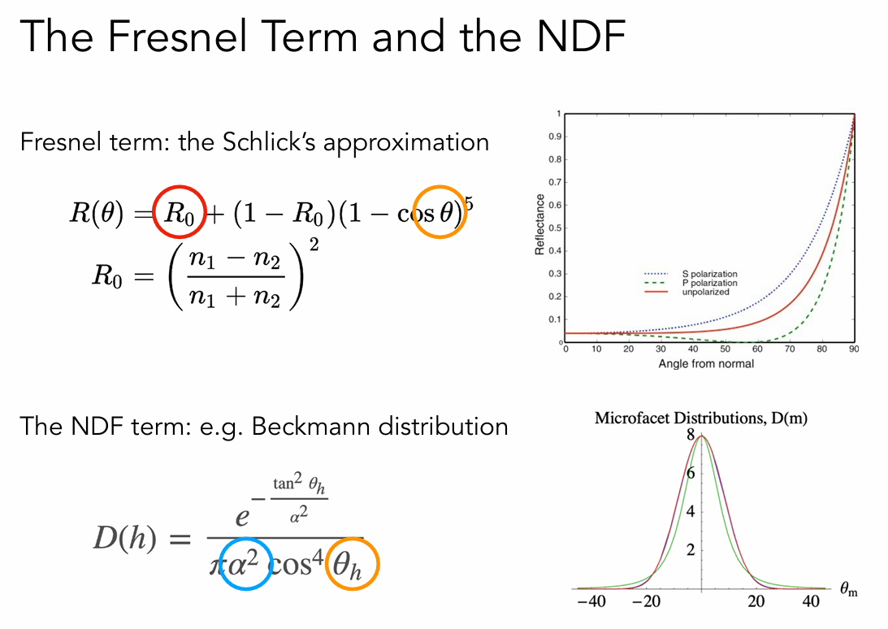{ width="80%" }

* Idea & Observation

    - Try to split the variables again! 

    - The Schlick approximated Fresnel term $F$ is much simpler: Just the "base color" $R_0$ and the half angle $\theta$

* Taking the Schlick’s approximation into the 2nd term

    - The “base color” is extracted

* Both integrals can be precomputed

$$
\begin{align*}
\int_{\Omega^+}f_r(p,\omega_i,\omega_o)\cos\theta_i\mathrm{d}\omega_i\approx &R_0\int_{\Omega^+}\frac{f_r}{F}\left(1-(1-\cos\theta_i)^5\right)\cos\theta_i\mathrm{d}\omega_i+ \\
&\int_{\Omega^+}\frac{f_r}{F}(1-\cos\theta_i)^5\cos\theta_i\mathrm{d}\omega_i
\end{align*}
$$

* Each integral produces one value for each (roughness, incident angle) pair

    - Therefore, each integral results in a 2D table (texture)

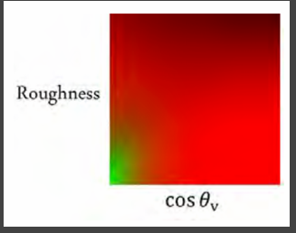{ width="60%" }

### The Split Sum Approximation

*  Finally, completely avoided sampling

* Very fast and almost identical results

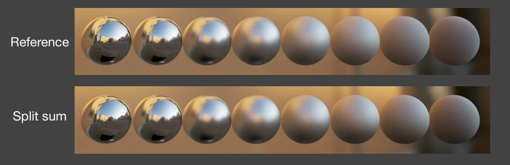{ width="80%" }

*  In the industry

    - Integral -> Sum

$$
\frac{1}{N}\sum_{k=1}^{N}\frac{L_{i}(\mathrm{l}_{k})f(\mathrm{l}_{k},\mathrm{v})\cos\theta_{\mathrm{l}_{k}}}{p(\mathrm{l}_{k},\mathrm{~v})}\approx\left(\frac{1}{N}\sum_{k=1}^{N}L_{i}(\mathrm{l}_{k})\right)\left(\frac{1}{N}\sum_{k=1}^{N}\frac{f(\mathrm{l}_{k},\mathrm{v})\cos\theta_{\mathrm{l}_{k}}}{p(\mathrm{l}_{k},\mathrm{~v})}\right)
$$

* That’s why it’s called split sum rather than “split integral”

## Shadow from Environment Lighting

*  In general, very difficult for real-time rendering

* Different perspectives of view

    * As a many-light problem: Cost of SM is linearly to #light 
    
    * As a sampling problem: Visibility term $V$ can be arbitrarily complex and $V$ cannot be easily separated from the environment

* Industrial solution

    - Generate one (or a little bit more) shadows from the brightest light sources

* Related research

    - Imperfect shadow maps 
    
    - Light cuts 
    
    - RealTimeRayTracing (might be the ultimate solution) 
    
    - Precomputed radiance transfe

### Background Knowledge

#### Fourier Expansion

* Represent a function as a weighted sum of sines and cosines with different frequency

\[f(x) = \frac{A}{2} + \frac{2A \cos(4w)}{\pi} - \frac{2A \cos(3tw)}{3\pi} + \frac{2A \cos(5tw)}{5\pi} - \frac{2A \cos(7tw)}{7\pi} + \cdots\]

#### Filtering in Frequency Space

* Visualizing Image Frequency Content

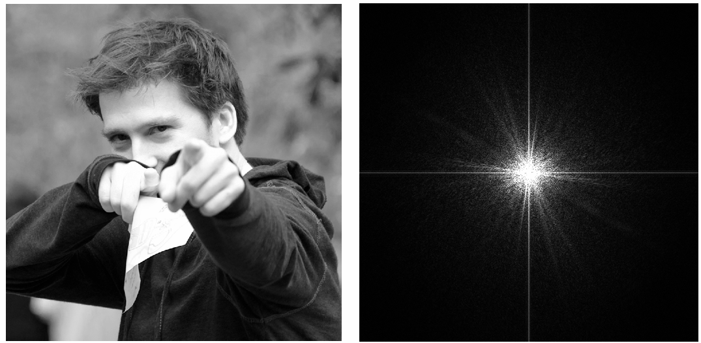{ width="80%" }

* Filtering = Getting rid of certain frequency contents

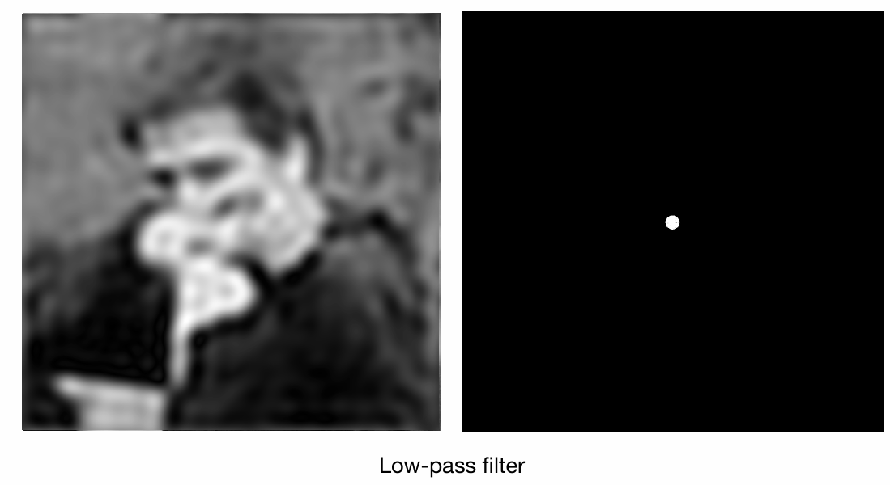{ width="80%" }

* Convolution in spatial domain equals multiplication in frequency domain

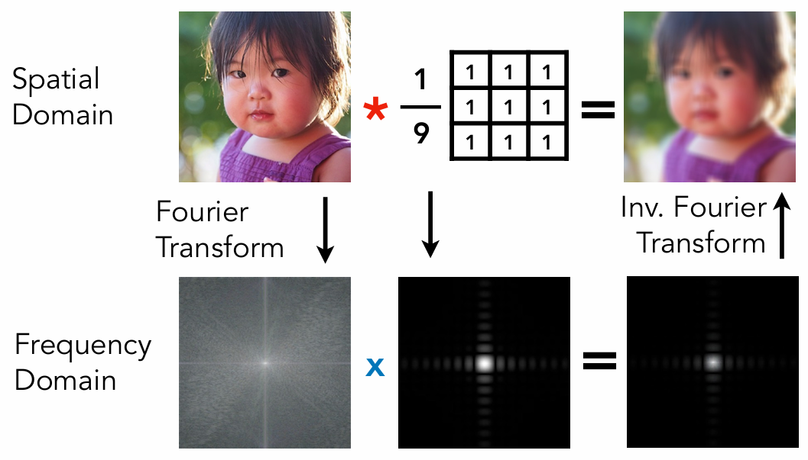{ width="80%" }

* Any product integral can be considered as filtering

$$
\int_{\Omega}f(x)g(y)dx
$$

*  Low frequency == smooth function / slow changes / etc.

* The frequency of the integral is the lowest of any individual's

#### Basis Function

*  A set of functions that can be used to represent other functions in general

$$
f(x) = \sum_ic_i\cdot B_i(x)
$$

* The Fourier series is a set of basis functions

* The polynomial series can also be a set of basis functions

### Real-time Environment Lighting

#### Spherical Harmonics

* A set of 2D basis functions $B_i(\omega)$ defined on the sphere (functions of direction $\theta,\phi$)

    * Analogous to Fourier series in 1D

* There are $2i-1$ functions in $l=i$ and they are called the ith order basis function

    * The frequency increases as $l$ increases.

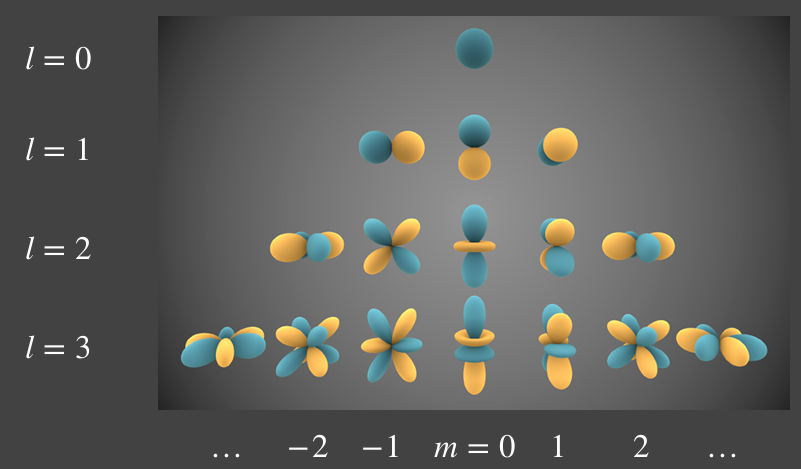{ width="80%" }

* Each SH basis function $B_i(\omega)$ is associated with a Legendre polynomial

* Projection: obtaining the coefficients of each SH basis function

$$
c_i=\int_{\Omega}f(\omega)B_i(\omega)d\omega
$$

* Reconstruction: restoring the original function using (truncated) coefficients and basis functions

    * If we restore the original function up to the 4th order, the retained frequency will also be up to the frequency of the 4th order SH basis function.

* Properties: 

    * orthonormal

    * simple projection/reconstruction

    * simple rotation

    * simple convolution

    * few basis functions means low frequencies

* Diffuse BRDF acts like a low-pass filter, so the multiply intergral of BRDF and environment light has low frequency. We can just use the low order SH basis to describe the environment light for diffuse object.

    * Note: using SH to describe light directly and this is about shading instead of shadowing

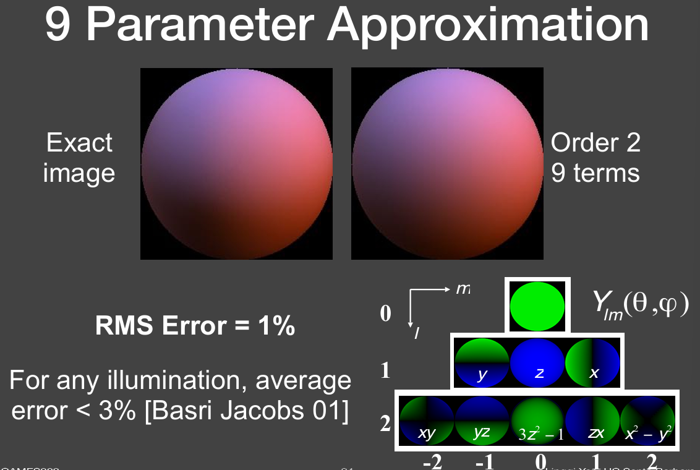{ width="80%" }

### Precomputed Radiance Transfer (PRT)

PRT handles shadows and global illumination

Rendering under environment lighting: 

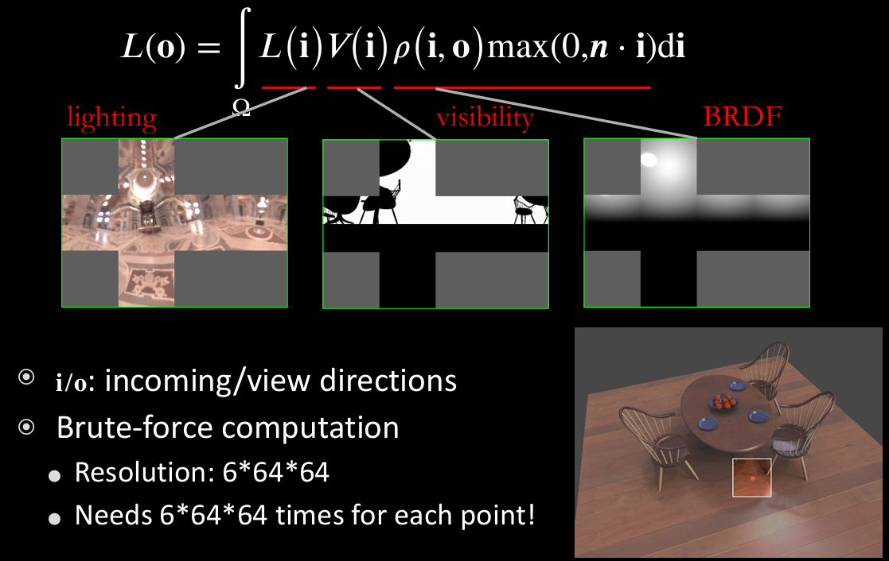{ width="100%" }

* Assumption: we assume the objects in the scene are stationary and the environment light can change.

* Watching the shading point from a given angle $o$, 

    * $L(i)$ is the environment light

    * $V(i)$ is the visibility, describing the occluding information for all direction (the environment light comes from all directions)

    * BRDF can also be stored as a 2D map when we fix $o$

* But the computation is prohibitive

#### PRT

The rendering computation is prohibitive for the method above, so here comes PRT

Basic idea: 

$$
L(\mathbf{o}) =\int L\left(\mathbf{i}\right)V\left(\mathbf{i}\right)\rho\left(\mathbf{i},\mathbf{o}\right)\max(0,\boldsymbol{n}\cdot\mathbf{i})\mathbf{d}\mathbf{i}
$$

* We denote $L\left(\mathbf{i}\right)$ as lighting and $V\left(\mathbf{i}\right)\rho\left(\mathbf{i},\mathbf{o}\right)\max(0,\boldsymbol{n}\cdot\mathbf{i})$ as light transport

* We can approximate lighting using basis functions

    * $L\left(\mathbf{i}\right)\approx\sum l_i B_i(\mathbf{i})$

* In precomputation stage:  

    * compute light transport, and project to basis function space

* In runtime stage: 

    * using dot product for diffuse or matrix-vector multiplication for glossy

##### Diffuse Case

$$
L(\mathbf{o}) =\int L\left(\mathbf{i}\right)V\left(\mathbf{i}\right)\rho\left(\mathbf{i},\mathbf{o}\right)\max(0,\boldsymbol{n}\cdot\mathbf{i})\mathbf{d}\mathbf{i}
$$

For diffuse material, the BRDF is a constant $\rho$. We extract it to the outside and expand $L(\mathbf{i})$ using SH basis. Then we get: 

$$
L(\mathbf{o}) \approx \rho\sum l_i\boxed{\int B_i\left(\mathbf{i}\right)V\left(\mathbf{i}\right)\max(0,\boldsymbol{n}\cdot\mathbf{i})\mathbf{d}\mathbf{i}}
$$

The boxed part can be precomputed, so it turns out to be: 

$$
L(\mathbf{o}) \approx \rho\sum l_i T_i
$$

It reduce rendering computation to dot product

* Run-time Rendering

    * First, project the lighting to the basis to obtain $l_i$  
    * Or, rotate the lighting instead of re-projection 
    * Then, compute the dot product 

We can expand $T$ as 

$$
T\left(\mathbf{i}\right)\approx\sum t_j B_j(\mathbf{i})
$$

Then we get: 

$$
\begin{align*}
L(\mathbf{o}) &=\int_{\Omega^+} L\left(\mathbf{i}\right)V\left(\mathbf{i}\right)\rho\left(\mathbf{i},\mathbf{o}\right)\max(0,\boldsymbol{n}\cdot\mathbf{i})\mathbf{d}\mathbf{i} \\
&=\sum_i\sum_jl_it_j\int_{\Omega^+}B_i(\mathbf{i})B_j(\mathbf{i})d\mathbf{i}
\end{align*}
$$

* Why is this a dot product? (This seems to be $O(n^2)$ rather than $O(n)$)
    
    * Since SH basis is orthonormal

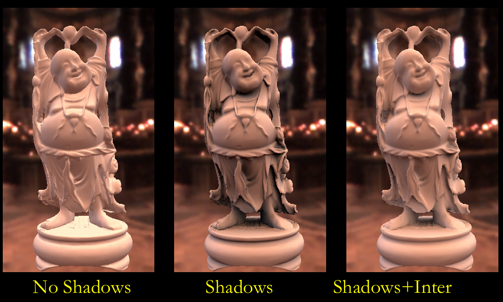{ width="90%" }

##### Glossy Case

For glossy case, BRDF is related to viewing direction $\mathbf{o}$, so the equation becomes: 

$$
\begin{align*}
L(\mathbf{o}) &=\int_{\Omega^+} L\left(\mathbf{i}\right)V\left(\mathbf{i}\right)\rho\left(\mathbf{i},\mathbf{o}\right)\max(0,\boldsymbol{n}\cdot\mathbf{i})\mathbf{d}\mathbf{i} \\
&\approx \sum l_iT_i(\mathbf{o})
\end{align*}
$$

$T$ can be expressd using SH basis: 

$$
T_i(\mathbf{o})\approx\sum t_{ij}B_j(\mathbf{o})
$$

$t_{ij}$ is the transport matrix (since $T$ relates to both $\mathbf{i}$ and $\mathbf{j}$ now). Then we get: 

$$
L({\mathbf{o}})\approx\sum(\sum l_it_{ij})B_j(\mathbf{o})
$$

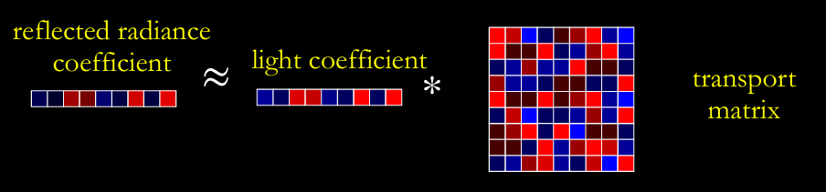{ width="90%" }

* When rendering: vector-matrix multiplication

Time Complexity: 

* #SH Basis: 9/16/25

* Diffuse Rendering

    * At each point: dot-product of size 16

* Glossy Rendering  

    * At each point:  vector(16) * matrix (16*16)

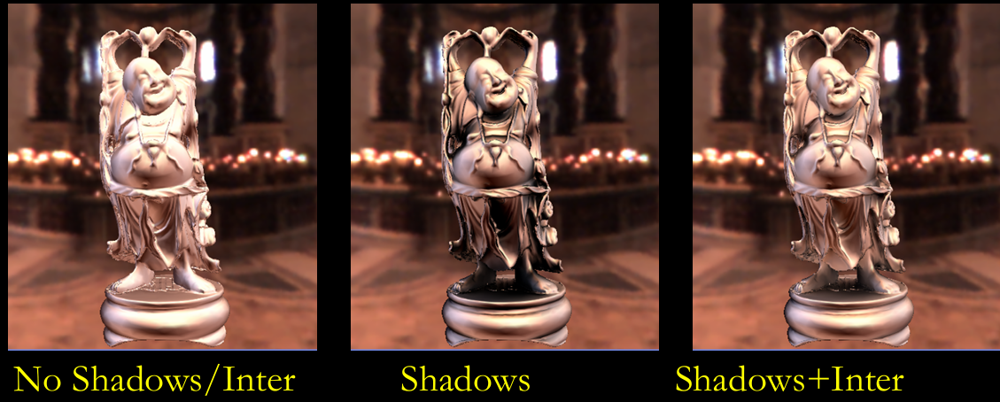{ width="90%" }

##### Interreflections and caustics

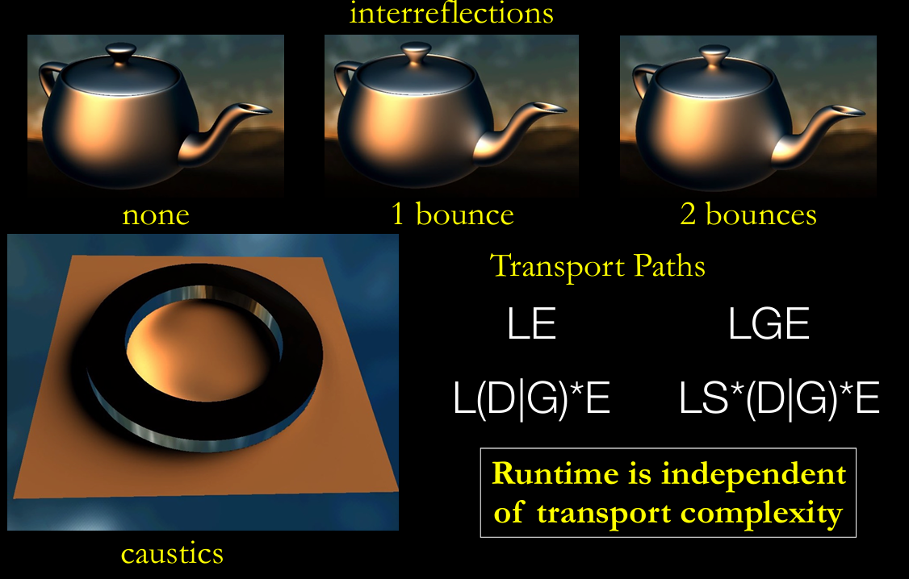{ width="90%" }

* $LE: $ light to eye (directly)

* $LGE: $ light to glossy to eye (1 bounce)

#### Limitations

* Low-frequency  

    * Due to the nature of SH 

* Dynamic lighting, but static scene/material 

    * Changing scene/material invalidates precomputed light transport 

* Big precomputation data

#### Wavelet

* 2D haar wavelet, a kind of basis function in 2D block

* Projection:   

    * Wavelet Transformation

    * After projection, many basis coefficient will be zero. Just retain a small number of non-zero coefficients (a non-linear approximation)

* All-frequency representation

