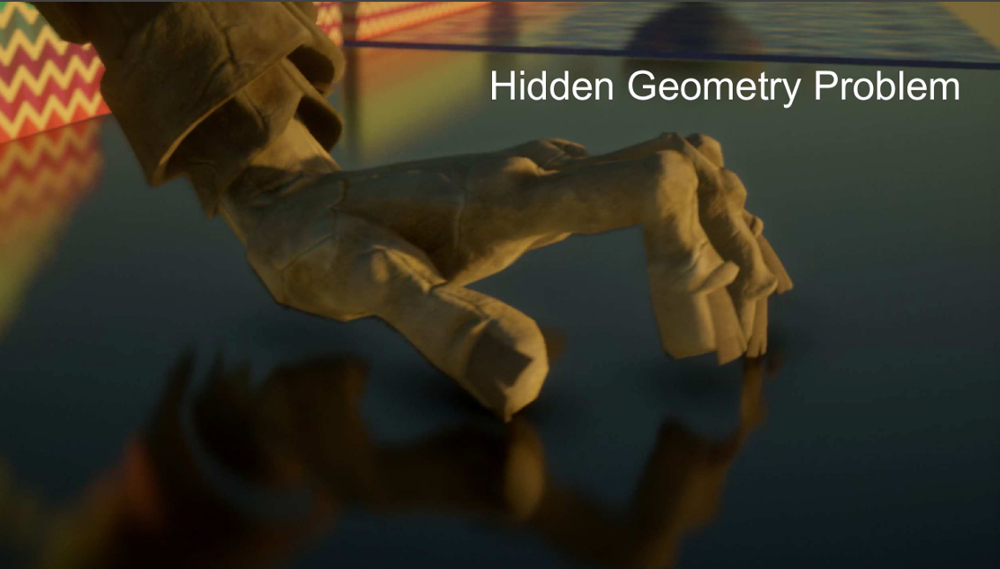

# Real-Time Global Illumination

In RTR, people seek simple and fast solutions to one bounce indirect illumination

{ width="80%" }

## Real-Time Global Illumination in 3D

### Reflective Shadow Maps (RSM)

Key Observations

* Any directly lit surface will act as a light source again

* Which surface patches are directly lit? 

    *  Perfectly solved with a classic shadow map 
    
    * Each pixel on the shadow map is a small surface patch

* What is the contribution from each surface patch to $p$?

    - An integration over the solid angle covered by the patch 
    
    - Can be converted to the integration on the area of the patch

    - Then sum up all the surface patches’ contributions

{ width="70%" }


Assumption

*  Any reflector (not shading point) is diffuse 

* Therefore, outgoing radiance is uniform toward all directions

$$
\begin{align*}
L_o(p, \omega_o) &= \int_{\Omega_{patch}} L_i(p, \omega_i) \, V(p, \omega_i) f_r(p, \omega_i, \omega_o) \, \cos \theta_i \, d\omega_i \\
&= \int_{A_{patch}} L_i(q \to p) \, V(p, \omega_i) f_r(p, q \to p, \omega_o) \frac{\cos \theta_p \cos \theta_q}{\|q - p\|^2} \, dA
\end{align*}
$$

For a diffuse reflective patch: 

* BRDF at that patch $f_r=\rho/\pi$

* $L_i=f_r\cdot \frac{\Phi}{dA}$ ($\Phi$ is the incident flux or energy)

Therefore, 

$$
E_q(p, \omega_o)=\Phi_q\frac{\max\{0, (\cos\theta_p)\}\max\{0, (\cos\theta_q)\}}{\|q-p\|^2}
$$

Not all pixels in the RSM can contribute

- Visibility (still, difficult to deal with) 

- Orientation 

- Distance

Acceleration

- In theory, all pixels in the shadow map can contribute to $p$

- Can we decrease the number? 

    - project shading point to shadow map, sample in the near region

What is needed to record in an RSM?

* Depth, world coordinate, normal, flux, etc.

{ width="80%" }


Pros

- Easy to implement 

Cons

- Performance scales linearly w/ #lights 

- No visibility check for indirect illumination 

- Many assumptions: diffuse reflectors, depth as distance, etc. 

- Sampling rate / quality tradeoff

### Light Propagation Volumes (LPV)

Key problem

- Query the radiance from any direction at any shading point 

Key idea

- Radiance travels in a straight line and does not change 

Key solution

- Use 3D grids to propagate radiance from directly illuminated surfaces to anywhere else

{ width="50%" }

Steps

1. Generation of radiance point set scene representation 

    *  This is to find directly lit surfaces 

    * Simply applying RSM would suffice! 
    
    * May use a reduced set of diffuse surface patches (virtual light sources)

2.  Injection of point cloud of virtual light sources into radiance volume 

    * Pre-subdivide the scene into a 3D grid, each grid stores the geometry and material info of the scene (normal, albedo, occlusion).
    
    * For each grid cell, find enclosed virtual light sources 
    
    * Sum up their directional radiance distribution 
    
    * Project to first 2 orders of SHs(4 in total)

{ width="50%" }

3. Volumetric radiance propagation 

    - For each grid cell, collect the radiance received from each of its 6 faces 
    
    - Sum up, and again use SH to represent 
    
    - Repeat this propagation several times till the volume becomes stable (use geometry and material info to simulate the reflection ...)

{ width="80%" }

4. Rendering scene with final light propagation volume

    - For any shading point, find the grid cell it is located in 
    
    - Grab the incident radiance in the grid cell (from all directions) 
    
    - Shade (based on normal and view direction)

Problems: 

* Light leaking: Since we assume the radiance in each grid is uniform, if the grid is large, the back face will also be lit.

{ width="50%" }

### Voxel Global Illumination (VXGI)

* Still a two-pass algorithm

* Two main differences with RSM

    - Directly illuminated pixels -> (hierarchical) voxels 

    - Sampling on RSM -> tracing reflected cones in 3D (Note the inaccuracy in sampling RSM)

* Voxelize the entire scene

* Build a hierarchy

{ width="80%" }

* Pass 1 from the light

- Store the incident and normal distributions in each voxel 

    * so with the material information, the outcoming direction is known 

- Update on the hierarchy

{ width="90%" }

*  Pass 2 from the camera

    - For glossy surfaces, trace 1 cone toward the reflected direction 
    
    - Query the hierarchy based on the (growing) size of the cone

    - For diffuse, trace several cones (e.g. 8)

{ width="90%" }

{ width="80%" }

## Real-Time Global Illumination (screen space)

What is "screen space"?

- Using information only from “the screen” 

- In other words, post processing on existing renderings

{ width="80%" }

### Screen Space Ambient Occlusion (SSAO)

Why AO?

- Cheap to implement 

- But enhances the sense of relative positions

{ width="80%" }

What is SSAO?

- An approximation of global illumination 

- In screen space 

Key idea

- We don’t know the incident indirect lighting. Let’s assume it is constant (for all shading points, from all directions)

-  Considering different visibility (towards all directions) at different shading points, since the ambient received corresponds to occlusion

{ width="80%" }

- Aassuming diffuse materials

{ width="80%" }

Theory

- Still, everything starts from the rendering equation

$$
L_o(p, \omega_o) = \int_{\Omega^+} \boxed{L_i(p, \omega_i) f_r(p, \omega_i, \omega_o)} \boxed{V(p, \omega_i)} \cos\theta_i \, \mathrm{d}\omega_i
$$

-  And again, from "the RTR approximation / equation"!

$$
\int_{\Omega} f(x) g(x) \, dx \approx \frac{\int_{\Omega_{G}} f(x) \, dx}{\int_{\Omega_{G}} dx} \cdot \int_{\Omega} g(x) \, dx
$$

- Separating the visibility term

$$
\begin{align*}
\frac{\textrm{indir}}{L_o(\mathbf{p},\omega_o)} \approx \boxed{\frac{\int_{\Omega^+} V(\mathbf{p}, \omega_i) \cos\theta_i \, \mathrm{d}\omega_i}{\int_{\Omega^+} \cos\theta_i \, \mathrm{d}\omega_i}}\cdot
\boxed{\int_{\Omega^{+}} L_{i}^{\textrm{indir}}(\mathbf{p},\omega_{i}) f_{r}(\mathbf{p},\omega_{i},\omega_{o})\cos\theta_{i}\, \mathrm{d}\omega_{i}}
\end{align*}
$$

* $\int_{\Omega^+} \cos\theta_i \, \mathrm{d}\omega_i=\iint\cos{\theta_i}\sin{\theta_i}\,\mathrm{d}\theta_i\mathrm{d}\phi=\pi$. For the left box, $\boxed{}\triangleq k_A=\frac{\int_{\Omega^+} V(\mathbf{p}, \omega_i) \cos\theta_i \, \mathrm{d}\omega_i}{\pi}$

    * This is the weight-averaged visibility $\bar{V}$ from all directions

* Since we assume constant ambient and diffuse material, for the right box, $\boxed{}=L_i^{indir}(\rho)\cdot \frac{\rho}{\pi}\cdot\pi=L_i^{indir}(\rho)\cdot\rho$

    * This is a constant for AO

* A deeper understanding 1

    * Actually, $\frac{\int_{\Omega_{G}} f(x) \, dx}{\int_{\Omega_{G}} dx}$ is a kind of weighted sum (average here) over the support of $G$

    * And for const $G=L\cdot f_r$ in AO, this approximation is accurate.

$$
\begin{align*}
\int_{\Omega} f(x) g(x) \, dx &\approx \frac{\int_{\Omega_{G}} f(x) \, dx}{\int_{\Omega_{G}} dx} \cdot \int_{\Omega} g(x) \, dx\\
&= \overline{f(x)} \cdot \int_{\Omega} g(x) \, dx
\end{align*}
$$

* A deeper understanding 2

    - Why can we take the cosine term with $\mathrm{d}\omega_i$?

    - Projected solid angle $\mathrm{d}x_\perp=\cos{\theta_i}\mathrm{d}\omega_i$

        - Unit hemisphere -> unit disk

        - Integration of projected solid angle == the area of the unit disk == $\pi$

{ width="70%" }

* Actually, a much simpler understanding

    - Uniform incident lighting $L_i$ is constant

    - Diffuse BSDF $f_r=\frac{\rho}{\pi}$ is also constant

    - Therefore, taking both out of the intergral:  

$$
\begin{aligned}
L_{o}(\mathrm{p},\omega_{o}) & =\int_{\Omega^+}L_i(\mathrm{p},\omega_i)f_r(\mathrm{p},\omega_i,\omega_o)V(\mathrm{p},\omega_i)\cos\theta_i\mathrm{d}\omega_i \\
 & =\frac{\rho}{\pi}\cdot L_i(p)\cdot\int_{\Omega^+}V(\mathrm{p},\omega_i)\cos\theta_i\mathrm{d}\omega_i
\end{aligned}
$$

How to compute the occlusion values $k_A$ in real time?

* Ambient occlusion approximation: limited radius

    * For a indoor scene, all ray will ultimately be occluded

    * So we limit to local occlusion in a hemisphere of radius $R$, only check occlusion in this region.

    * More efficient and works better in enclosed areas such as indoors.

{ width="80%" }

* SSAO: Ambient occlusion using the z-buffer

    * Use the readily available depth buffer as an approximation of the scene geometry.

    * Take samples in a sphere around each pixel and test against buffer. 
    
    * We can approximately consider these samples unoccluded if their depth values are smaller than those in the buffer.

    * If more than half of the samples are inside (since we sampled on the sphere), AO is applied, amount depending on ratio of samples that pass and fail depth test.

    * Uses sphere instead of hemisphere, since normal information isn't available.

    * Approximation of the scene geometry, some fails are incorrect and may cause false occlusions.

    * Samples are not weighted by $\cos(\theta)$, so not physically accurate, but looks convincing.

{ width="80%" }

{ width="80%" }

* Choosing samples

    * More samples -> greater accuracy

    * Many samples are needed for a good result, but for performance only about 16 samples are used.

    * Positions from randomized texture to avoid banding.

    * Noisy result, blurred with edge preserving blur.

AO after blur

{ width="80%" }

* Horizon based ambient occlusion: HBAO

    * Also done in screen space.

    * Approximates ray-tracing the depth buffer.

    * Requires that the normal is known, and only samples in a hemisphere.

### Screen Space Directional Occlusion

What is SSDO?
 
- An improvement over SSAO 

- Considering (more) actual indirect illumination 

Key idea

- Why do we have to assume uniform incident indirect lighting? 

- Some information of indirect lighting is already known!

- Very similar to path tracing

    - At shading point $p$, shoot a random ray 
    
    - If it does not hit an obstacle, direct illumination 
    
    - If it hits one, indirect illumination

Comparison w/ SSAO

- AO: indirect illumination + no indirect illumination 

    - It assumes that ambient is received from rays in red circle, while ignore rays in orange circle

- DO: no indirect illumination + indirect illumination (same as path tracing)

    - It assumes that indirect light is received from rays in orange circle (only within a small region)

{ width="80%" }

Screen Space Directional Occlusion:

* Consider unoccluded and occluded directions separately

$$
\begin{align*}
L_{o}^{\text{dir}}(p, \omega_{o}) &= \int_{\Omega^+,V = 1} L_{i}^{\text{dir}}(p, \omega_{i}) f_{r}(p, \omega_{i}, \omega_{o}) \cos \theta_{i} \, d\omega_{i}\\
L_{o}^{\text{indir}}(p, \omega_{o}) &= \int_{\Omega^ +, V = 0} L_{i}^{\text{indir}}(p, \omega_{i}) f_{r}(p, \omega_{i}, \omega_{o}) \cos \theta_{i} \, d\omega_{i}
\end{align*}
$$

*  Indirect illum from a pixel (patch) is derived in RSM

How to know which direction is occluded? 

* We don't want to do ray tracing for its cost. Similar to HBAO, we sample points in local hemisphere and test their depth with depth buffer from camera.

* Take the following figure as example and denote the camera position as $O$, we make the following approximation: 

    * Shoot a ray from camera to each sampled points and find their intersection with scene

    * If the sampled points is occluded (depth further than intersection), we consider the intersection will contribute to the indirect light to $p$ (note that the depth of intersections is recorded in depth buffer). 

        * In the left case, $A,B,D$ are occluded and indirect light will be calculated at their intersections. $C$ is unoccluded so we use the ray $PC$ to query the value of Env. map.

    * This is just an approximation and may fail in some cases, like the right figure.

{ width="90%" }

SSDO: quality closer to offline rendering

Issues?

- Still, Global Illuminate in a short range

- Visibility is unaccurate

- Screen space issue: missing information from unseen surfaces

{ width="80%" }

### Screen Space Reflection (SSR)

What is SSR?

- Still, one way to introduce Global Illumination in RTR 

- Performing ray tracing in screen space 

- Does not require 3D primitives (triangles, etc.) 


Two fundamental tasks of SSR

- Intersection: between any ray and the scene 

- Shading: contribution from intersected pixels to the shading point

Motivation & Assumption: 

* Most of the reflected color are from the original screen space

{ width="80%" }

Basic SSR Algorithm - Mirror Reflection

* For each fragment
    
    * Compute reflection ray

    * Trace along ray direction(using depth buffer)

    * Use color of intersection point as reflection color

* For glossy material, shoot several rays from each pixel

{ width="90%" }

How to know the intersection between the reflected ray and scene? 

* Linear Raymarch

    * March the relfected ray step by step

    * At each step, check depth value

    * intersect until the depth value less than that of scene
    
    * Quality depends on step size
    
    * Can be refined

{ width="90%" }

How to decide the stride? 

* we can do it dynamically if we know the safe distance that won't intersect with the scene 

{ width="80%" }

Hierarchical tracing

* Generate Depth Mip-map

    * Use min (closer) values instead of average

{ width="90%" }

* Why Depth Mipmap?

    * Very similar to the hierarchy (BVH, KD-tree) in 3D

    * Enabling faster rejecting of non-intersecting in a bunch

    * The min operation guarantees a conservative logic

        - If a ray does not even intersect a larger node,it will never intersect any child nodes of it

        - If the ray intersects the larger node at left, go checking the left child node.

{ width="90%" }

* Stackless ray walk of min-Z pyramid

    * We start with the finest level and and proceed step by step.

    *  If no intersection is detected within the current cell, increase the step size for the next iteration.

    * Otherwise, refine the search by examining the corresponding cell at a finer level.

        * We can know which child cell to check through the intersection of the parent cell

    * Repeat until intersect at the finest level or no intersection

```cpp
mip = 0;
while (level > -1)
    step through current cell;
    if (above Z plane) ++level;
    if (below Z plane) -- level;
```

{ width="50%" align=left}
{ width="50%" align=right}
{ width="50%" align=left}
{ width="50%" align=right}

Problem

* We don't know anything behind the screen

{ width="80%"}

{ width="80%"}

Shading using SSR

*  Absolutely no difference from path tracing

    - Just again assuming diffuse reflectors / secondary lights

    - We only know the color that reflected to the camera. If we use it to do computation, the reflector must be diffuse so that the color reflected to everywhere is same.

$$
L_o(p, \omega_o) = \int_{\Omega^+} L_i(p, \omega_i) f_r(p, \omega_i, \omega_o) \cos \theta_i \, d\omega_i,\ L_i(p, \omega_i)=L_o(q,q\rightarrow p)
$$

* Does it introduce the square distance falloff? 

    * No, since we are doing BRDF sampling instead of light sampling

Improvements

* BRDF importance sampling: don't need to sample uniformly, but sample in a lobe based on BRDF

{ width="80%"}

* Hit point reuse across neighbors

{ width="80%"}

* Prefiltered samples, weighed be each BRDF

    * may cause blending of foreground and background

Pros

- Fast performance for glossy and specular reflections 

- Good quality 

- No spikes and occlusion issues 

Cons

- Not as efficient in the diffuse case* 

- Missing information outside the screen