# Real-Time Physically-Based Materials

## PBR and PBR Materials

Physically-Based Rendering (PBR): 

- Everything in rendering should be physically based 

- Materials, lighting, camera, light transport, etc. 

- Not just materials, but usually referred to as materials

PBR materials in RTR: 

- The RTR community is much behind the offline community 

- “PB” in RTR is usually not actually physically based

-  For surfaces, mostly just microfacet models (used wrong so not PBR, left) and Disney principled BRDFs (artist friendly but still not PBR, right)

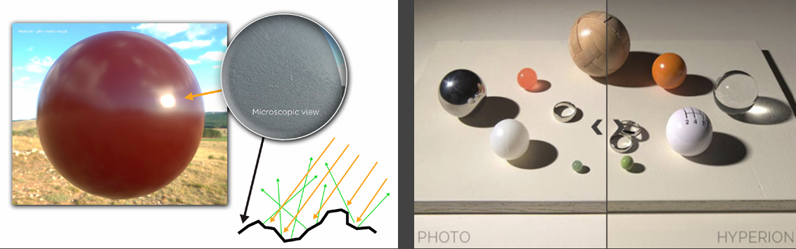{ width="80%" }

- For volumes, mostly focused on fast and approximate single scattering and multiple scattering (for cloud, hair, skin, etc.)

- Usually not much new theory, but a lot of implementation hacks 

- Still, performance (speed) is the key factor to consider

## Surface Model

### Recap: Microfacet BRDF

* microfacets reflect as mirrors but its normals comform to some distribution

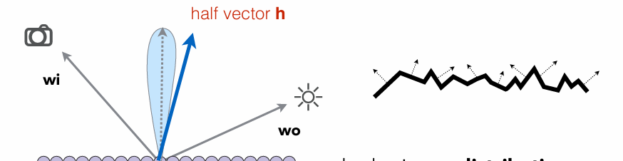{ width="80%" }

$$
f(\mathbf{i},\mathbf{o})=\frac{{\mathbf{F}(\mathbf{i},\mathbf{h})}\mathbf{G}(\mathbf{i},\mathbf{o},\mathbf{h})\mathbf{D}(\mathbf{h})}{4(\mathbf{n},\mathbf{i})(\mathbf{n},\mathbf{o})}
$$

* $\mathbf{F}(\mathbf{i},\mathbf{h})$ is the Fresnel term, describe reflectance depending on incident angle

* $\mathbf{G}(\mathbf{i},\mathbf{o},\mathbf{h})$ is the shadowing-masking term, modeling property of self occlusion

* $\mathbf{D}(\mathbf{h})$ is the distribution of normals

### Normal Distribution FUnction (NDF) 

Key: the distribution of microfacets' normals

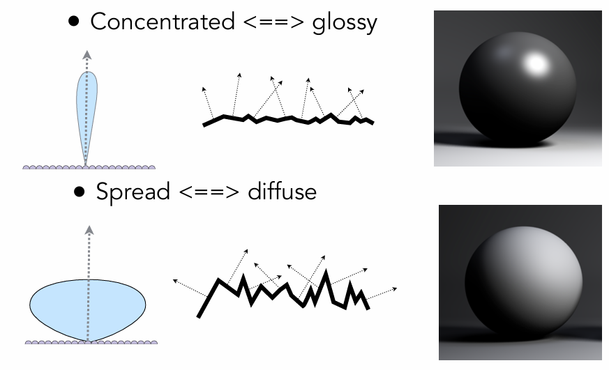{ width="80%" }

The Normal Distribution Function (NDF)

- Note: has nothing to do with the normal distribution in stats 

- Various models to describe it 
    
    - Beckmann, GGX, etc. 
    
    - Detailed models

- The following figures project the values on upper semisphere onto a circle (projected solid angle) to visualize it.

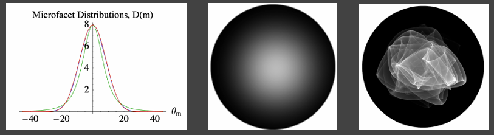{ width="80%" }

Beckmann NDF: 

- Similar to a Gaussian

$$
D(h)=\frac{e^{-\frac{\tan^2\theta_h}{\alpha^2}}}{\pi\alpha^2\cos^4\theta_h}
$$

- $\alpha$: roughness of the surface (the smaller, the more like mirror/specular) 

- $\theta_h$: angle between half vector $h$ and normal $n$

- Defined on the **slope space** ($\tan{\theta}$ instead of $\theta$)

    - map the value angles to a 2D plane

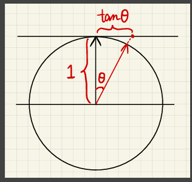{ width="60%" }

- Isotropic here, but can also be anisotropic

- denominator is for normalization

    - That is, the projected area of microfacet at any direction is same as that of macro surface

    - The dot product is used for normalization here because the normal vector is involved in a dot product operation as part of the BRDF computation. (personal view)

$$
\int_{\mathbf{m}\in\Theta}D(\mathbf{m})(\mathbf{v}\cdot\mathbf{m})d\mathbf{m}=\mathbf{v}\cdot\mathbf{n}
$$

- When viewing direction is same as normal direction ($\mathbf{v}=\mathbf{n}$), we have: 

$$
\int_{\mathbf{m}\in\Theta}D(\mathbf{m})(\mathbf{n}\cdot\mathbf{m})d\mathbf{m}=1
$$

GGX: 

$$
D(h)=\frac{\alpha^2}{\pi(\cos{\theta_h})^2(\alpha^2-1)+1)^2}
$$

- Typical characteristic: long tail!

    - have softer edge

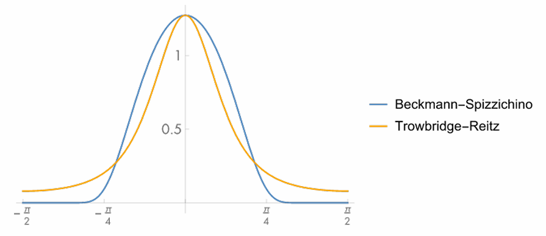{ width="80%" }

* Comparison: Beckmann vs. GGX

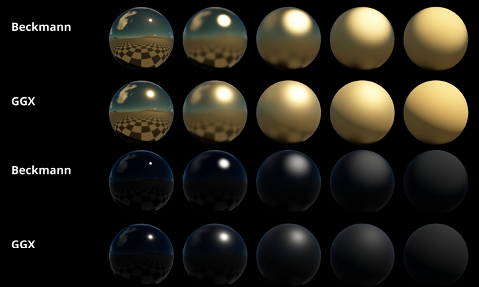{ width="80%" }

Extending GGX 

- GTR (Generalized Trowbridge-Reitz) 

- Additional parameter $\gamma$ to control the tail

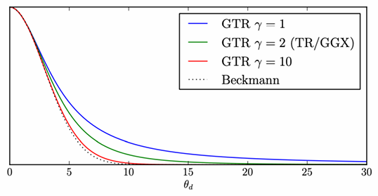{ width="60%" }

### Shadowing-Masking Term

The geometry term $G(i,o,h)$: 

- Account for self-occlusion of microfacets 

- Shadowing — light, masking — eye 

- Provide darkening esp. around grazing angles

Why is it important?

- Suppose no $G$ term, $f(i,o)$ can be arbitarily bright around grazing angle since $(n,i)$ or $(n,o)$ is small

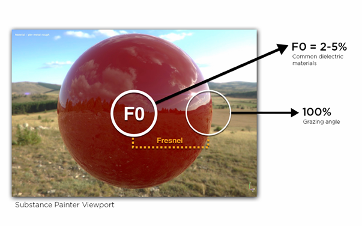{ width="80%" }

A commonly used shadowing-masking term

- The Smith shadowing-masking term 

- Decoupling shadowing and masking

$$
G(\mathbf{i},\mathbf{o},\mathbf{m})\approx G_1(\mathbf{i},\mathbf{m})G_1(\mathbf{o},\mathbf{m})
$$

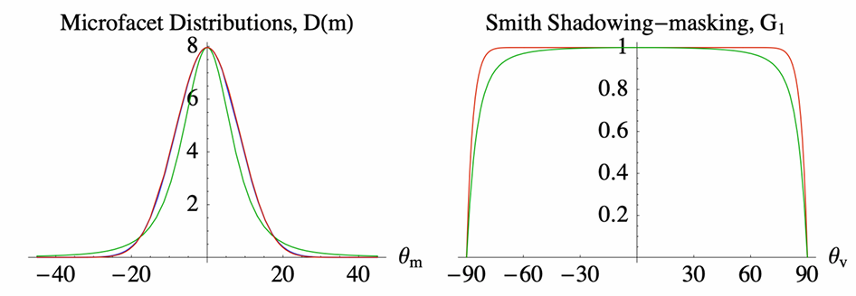{ width="80%" }

#### Multiple Bounces

Problem: Missing energy: 

* Especially prominent when roughness is high because many rays are occluded

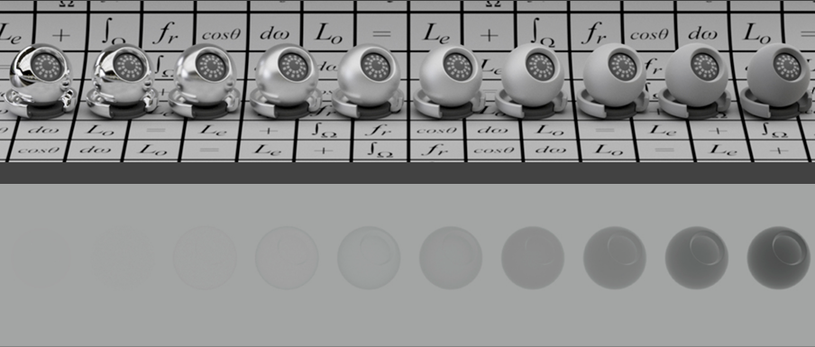{ width="80%" }

Adding back the missing energy?

- Accurate methods exist  

- But can be too slow for RTR 

Basic idea

- Being occluded == next bounce happening

#### The Kulla-Conty Approximation

What's the overall energy of an outgoing 2D BRDF lobe? 

* Assuming the incoming ambient light $L_i=1$ from any direction 

* observing from $\mu_o$

$$
\begin{align*}
E(\mu_o)&=\int_0^{2\pi}\int_0^{\pi/2}f(\mu_o,\theta,\phi)\cos{\theta}\sin{\theta}d\theta d\phi \\
&=\int_0^{2\pi}\int_0^1f(\mu_o,\mu_i,\phi)\mu_id\mu_id\phi, \ \mu=\sin\theta
\end{align*}
$$

Key idea: 

* The loss of energy is $1-E(\mu_o)$. We can design an additional lobe that integrates to $1-E(\mu_o)$ to compensate for it.

* The outgoing BRDF lobe can be different for different incident dir. 

* Consider reciprocity, it can be of the form $c(1-E(\mu_i))(1-E(\mu_o))$. $c$ is the constant for normalization

Therefore: 

$$
f_{\mathrm{ms}}(\mu_o, \mu_i) = \frac{(1 - E(\mu_o))\left(1 - E(\mu_i)\right)}{\pi\left(1 - E_{\mathrm{avg}}\right)}, \quad E_{\mathrm{avg}} = 2 \int_{0}^{1} E(\mu) \, \mu \, d\mu
$$

Validation: 

$$
\begin{align*}
E_{ms}(\mu_o)&=\int_0^{2\pi}\int_0^1f(\mu_o,\mu_i,\phi)\mu_id\mu_id\phi\\
&=2\pi\int_0^1 \frac{(1 - E(\mu_o))\left(1 - E(\mu_i)\right)}{\pi\left(1 - E_{\mathrm{avg}}\right)}\mu_id\mu_i \\
&=  2\frac{1-E(\mu_0)}{1-E_{\rm avg}}\int_0^1\left(1-E\left(\mu_i\right)\right)\,\mu_i\,d\mu_i \\
&=  \frac{1-E(\mu_0)}{1-E_{\rm avg}}\left(1-E_{\rm avg}\right) \\
&=  1-E(\mu_0)
\end{align*}
$$

* But neither $E(\mu)$ nor $E_{avg}$ are analytic

    * precompute / tabulate

* Dimension / parameters of $E(\mu)$ and $E_{avg}$

    * $E(\mu)$: roughness (related to one BRDF) & $\mu$ [therefore, a 2D table]

    * $E(avg)$: roughness [therefore, a 1D table]

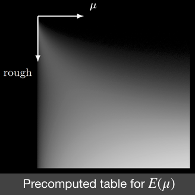{ width="60%" }

* Results

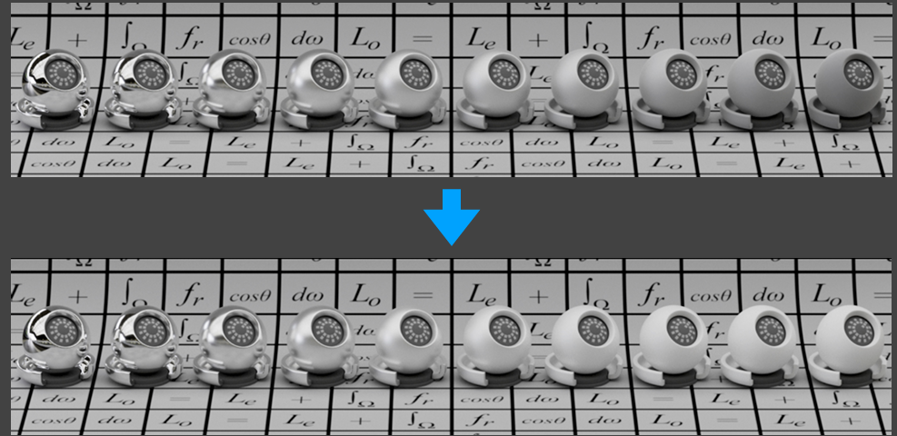{ width="80%" }

* What if the BRDF has color? 

    * Color == absorption == energy loss (as it should) 

    * So we’ll just need to compute the overall energy loss 

* Define the average Frensel (how much energy is reflected, just a number)

$$
F_{avg}=\frac{\int_0^1F(\mu)\mu\mathrm{d}\mu}{\int_0^1\mu\mathrm{d}\mu}=2\int_0^1F(\mu)\mu\mathrm{d}\mu
$$

* And recall that $E_{avg}$ is how much energy that you can see (i.e., will **NOT participate** in further bounces)

* Therefore, the proportion of energy (color) that: 

    * You can directly see: $F_{avg}E_{avg}$

    * After one bounce then be seen: $F_{avg}(1-E_{avg})\cdot F_{avg}E_{avg}$

        * $F_{avg}(1-E_{avg})$: The reflected energy that doesn't leave the surface (will participate in further bounces)

    * After $k$ bounces: $F_{avg}^k(1-E_{avg})^k\cdot F_{avg}E_{avg}$

    * $\dots$

    * Sum them up, we have te color term, Which will be directly multiplied on the uncolored additional BRDF

$$
\frac{F_{avg}E_{avg}}{1-F_{avg}(1-E_{avg})}
$$

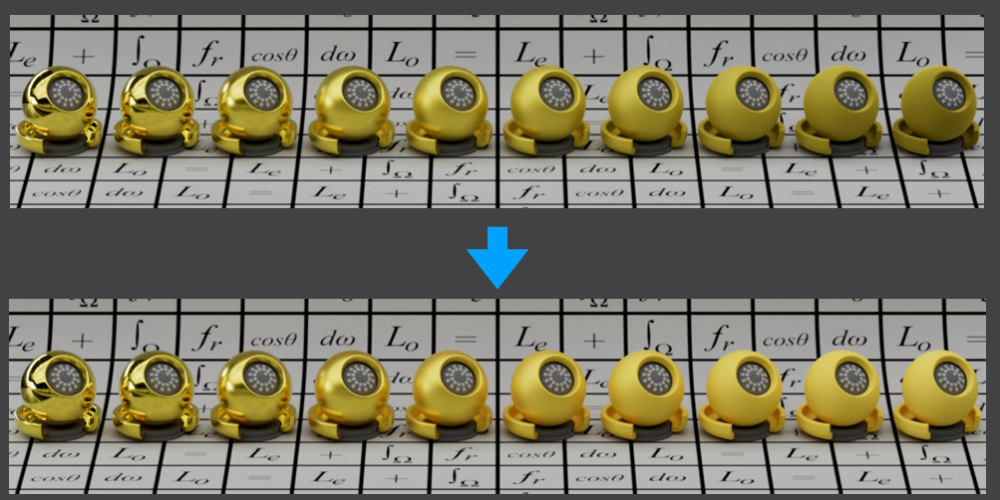{ width="80%" }

## Shading Microfacet Models using Linearly Transformed Cosines (LTC)

Linearly Transformed Cosines: 

- Solves the shading of microfacet models

- Mainly on GGX, though others are also fine 

- No shadows 

- Under polygon shaped lighting

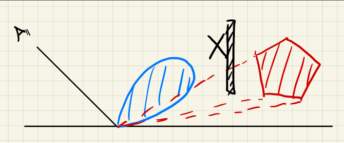{ width="80%" }

Key idea: 

- Transform outgoing 2D BRDF lobe to a cosine ($F(\omega_i)\rightarrow \cos(\omega_i')$)

    - different BRDF and different light $\rightarrow$ fixed BRDF and different light

- The shape of the light can also be transformed along 

- Integrating the transformed light on a cosine lobe is **analytic**

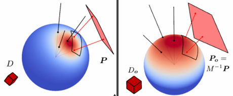{ width="80%" }

Observations: 

- $\mathrm{BRDF}\overset{M^{-1}}{\longrightarrow}\mathrm{Cosine}$

- Direction: $\omega_i\overset{M^{-1}}{\longrightarrow}\omega_i'$

- Domain to integrate: $P\overset{M^{-1}}{\longrightarrow}P'$

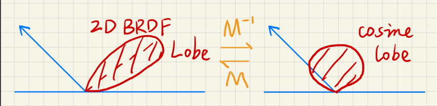{ width="80%" }

Approach: 

* A simple change of variable

* Assume uniform light radiance inside the polygon light source

$$
\begin{aligned}
L(\omega_{o}) & =L_i\cdot\int_PF(\omega_i)\mathrm{d}\omega_i \\
 & =L_{i}\cdot\int_{P}\cos(\omega_{i}^{\prime})\mathrm{d}\frac{M\omega_{i}^{\prime}}{\|M\omega_{i}^{\prime}\|}, \ \omega_i=\frac{M\omega_{i}^{\prime}}{\|M\omega_{i}^{\prime}\|} \\
 & =L_i\cdot\int_{P^{\prime}}\cos(\omega_i^{\prime})J\mathrm{d}\omega_i^{\prime}\quad-\mathrm{Analytic!}
\end{aligned}
$$

* Results

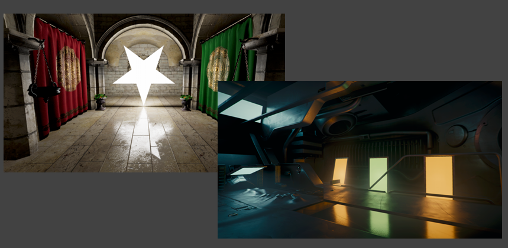{ width="80%" }
