# Real-time Shadow

## Shadow Mapping 

* A 2-Pass Algorithm

    * The first pass render from light and output a "depth texture" from the light source

    * The second pass render a standard image from the eye.

        * For each visible points in eye view, record the depth and reprojected it back to the light source to get another depth value in pass 1. 

        * Visible if the two depths match, otherwise blocked.

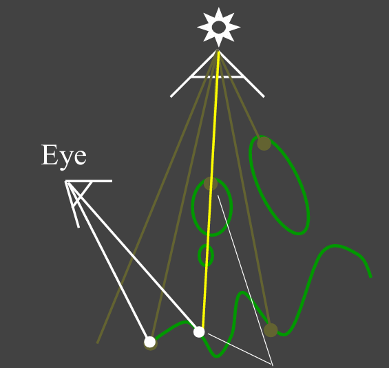{ width="60%" }

* An image-space algorithm

    - Pro: no knowledge of scene’s geometry is required 
    
    - Con: causing self occlusion and aliasing issues

* Well known shadow rendering technique

    - Basic shadowing technique even for early offline renderings, e.g., Toy Story

### Issues in Shadow Mapping

#### Self Occlusion

* The "depth texture" has its own resolution and the depth values are same in one pixel.

    * Just like many small sheet perpendicular to light direction, which may cause severe self occlusion when light shoots on surface in grazing angle.

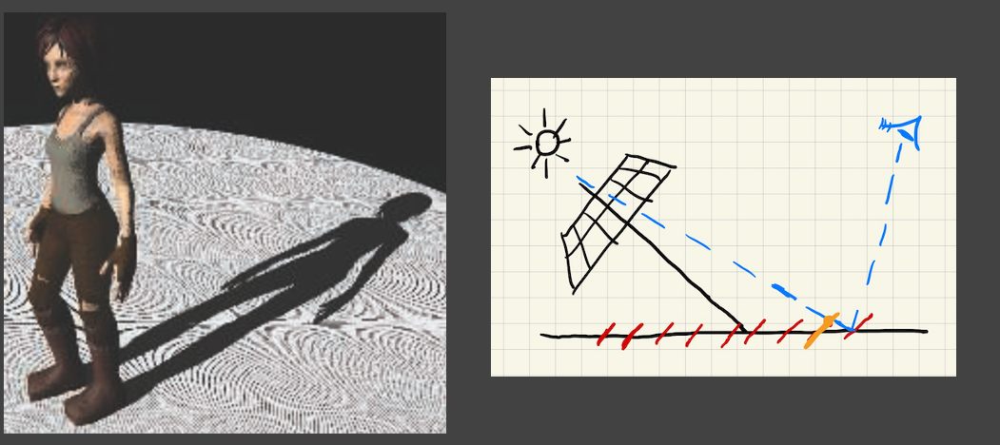{ width="90%" }

How to solve?

* Adding a (variable) bias to reduce self occlusion

    - Calculate as visible if the difference of two depth is smaller than the bias

    - But introducing detached shadow issue

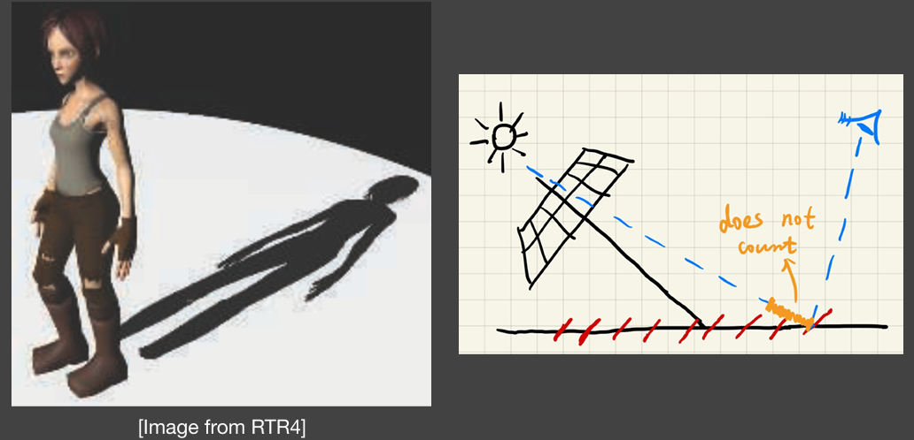{ width="90%" }

*  Second-depth shadow mapping

    - Using the midpoint between first and second depths in SM 
    
    - Unfortunately, requires objects to be watertight 
    
    - And the overhead may not worth it

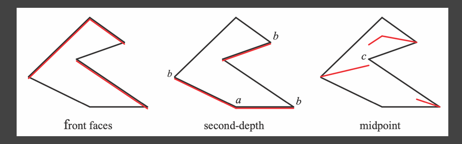{ width="80%" }

#### Aliasing 

* Also caused by resolution

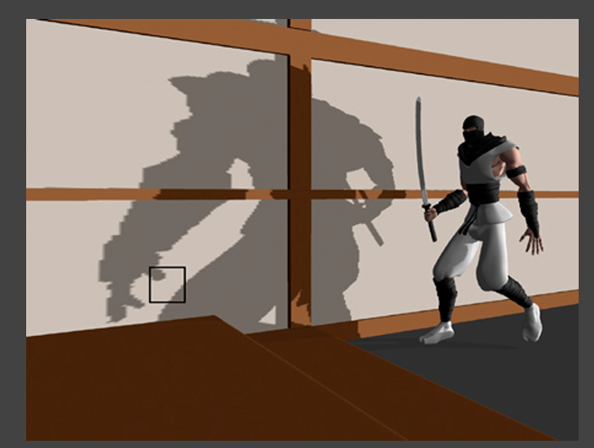{ width="80%" }

## The math behind shadow mapping

* In RTR, we care more about "approximately equal"

* An important approximation throughout RTR: 

\[
\int_{\Omega} f(x) g(x) \, dx \approx \frac{\int_{\Omega} f(x) \, dx}{\int_{\Omega} \, dx} \cdot \int_{\Omega} g(x) \, dx
\]

* When is it (more) accurate?

    * When the integration domain is small and 

    * $g(x)$ is smooth enough (i.e. its value does't change dramatically)

### In Shadow Mapping

* Recall: the rendering equation with explicit visibility

$$
L_{o}\left(\mathrm{p}, \omega_{o}\right)=\int_{\Omega^{+}} \boxed{L_{i}\left(\mathrm{p}, \omega_{i}\right)} \boxed{f_{r}\left(\mathrm{p}, \omega_{i}, \omega_{o}\right)  \cos \theta_{i}} \boxed{V(p,\omega_i)} \mathrm{~d} \omega_{i}
$$

* We can Approximate it as

\[
L_0(p, \omega_0) \approx 
\boxed{\frac
{\int_{\Omega^+} V(p, \omega_i) \, d\omega_i}{\int_{\Omega^+} d\omega_i}}
\cdot \int_{\Omega^+} L_i(p, \omega_i) f_r(p, \omega_i, \omega_0) \cos \theta_i \, d\omega_i
\]

* When is it accurate?

    - Small support (point / directional lighting) 
    
    - Smooth integrand (diffuse bsdf / constant radiance area lighting)

## Percentage Closer Soft Shadows

From Hard Shadows to Soft Shadows

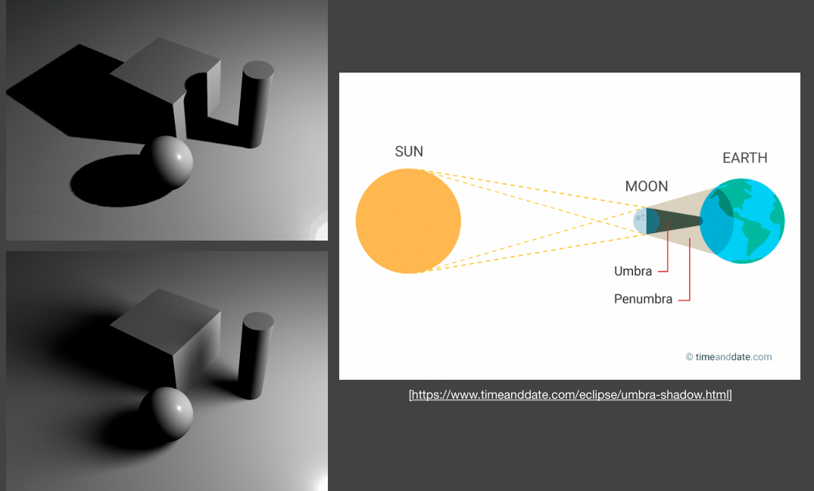{ width="80%" }

### Percentage Closer Filtering (PCF)

Provides anti-aliasing at shadows' edges

- Not for soft shadows (PCSS is, introducing later) 

- Filtering the **results of shadow comparisons**

Why not filtering the shadow map?

- Texture filtering just averages color components, i.e. you'll get blurred shadow map first 

- Averaging depth values, then comparing, you still get a binary visibility

Solution [Reeves, SIGGARPH 87]

- Perform multiple (e.g. 7x7) depth comparisons for each fragment in nearby region

- Then, averages results of comparisons  

- e.g. for point P on the floor,  

    1. compare its depth with all pixels in the box, e.g. 3x3 

    2. get the compared results (1 means visible and 0 means invisible) e.g. 
        1, 0, 1,  
        1, 0, 1,  
        1, 1, 0, 

    3. take avg. to get visibility, e.g. 0.667

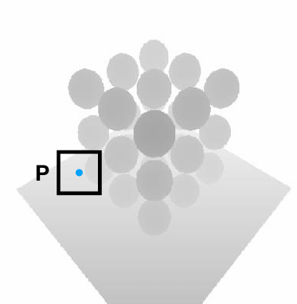{ width="60%" }

Note that this is not soft shadows in the umbra/penumbra sense

{ width="80%" }

Does filtering size matter?

- Small -> sharper 

- Large -> softer 

When the filter is large, the effect is just like the soft shadow

Key thoughts

- First generate hard shadows, applying the filters in some place to change it into soft shadows 

- What's the correct size to filter?

- Is it uniform? No

Key obsevation:

- The shadow is sharper when it's closer to object that casts it (pen tip), softer when farther (pen barrel)

{ width="60%" }

### Percentage Closer Soft Shadows

Key conclusion

- Filter size is related to blocker distance (the distance between blocker and receiver)

- More accurately, relative average projected blocker depth! 

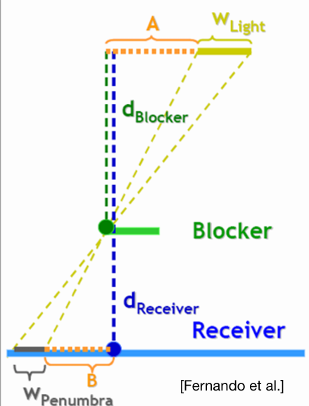{ width="80%" }

A mathematical "translation"

- Larger $w$ brings softer shadow

$$
w_{Penumbra}=(d_{Receiver}-d_{Blocker})\cdot w_{Light} / d_{Blocker}
$$

Now the only question:

- What's the blocker depth $d_{Blocker}$

    - For a shading point, the average depth of the pixels that blocks it on shadow map

    - Note that an area light doesn't have shadow map. Here we can approximate it by taking it as point light(put the camera on the center) 

The complete algorithm of PCSS

- Step 1: Blocker search (getting the average blocker depth in a certain region) 

- Step 2: Penumbra estimation (use the average blocker depth to determine filter size) 

- Step 3: Percentage Closer Filtering 

Which region (on the shadow map) to perform blocker search?

- Can be set constant (e.g. 5x5), but can be better with heuristics
 
- depends on the light size and receiver's distance from the light

- We can just set the shadow map on near plane and shoot rays from light to shading points. Use the area under the rays to Calculate block depth.

    - Note that we should only take the depth of blocked points into account. 

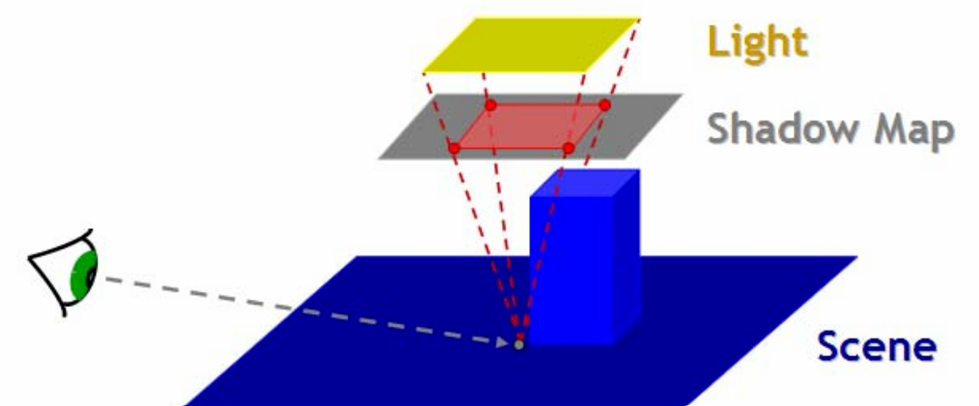{ width="80%" }

The math behind it: 

- filter / convolution: 

$$
[w*f](p)=\sum_{q\in\mathcal{N}(p)}w(p,q)f(q)
$$

- In PCSS: 

$$
V(x)=\sum_{q\in\mathcal{N}(x)}w(p,q)\cdot\chi^+[D_{\mathrm{SM}}(q)-D_{\mathrm{scene}}(x)]
$$

- where $\chi^{+}[x]=1\text{ if }x>0\text{, otherwise }0$. $w$ is the weight.

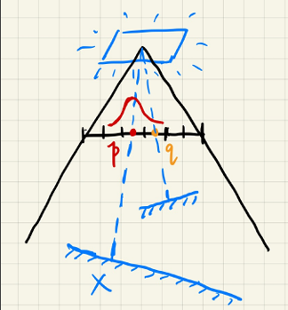{ width="60%" }

- Therefore, it is not filtering the shadow map then compare

$$
V(x)\neq\chi^+\{[w*D_{\mathrm{SM}}](q)-D_{\mathrm{scene}}(x)\}
$$

- Not filtering the resulting image with binary visibilities

$$
V(x)\neq\sum_{q\in\mathcal{N}(x)}w(p,q)V(q)
$$

Which steps can be slow? 

- Looking at every texel inside a region (steps 1 and 3) 

- Softer -> larger filtering region -> slower

## Variance Soft Shadow Mapping

For fast blocker search (step 1) and filtering (step 3)

Let's think from "percentage closer" filtering

- The percentage of texels that are in front of the shading point, i.e.,  

- how many texels are closer than $t$ in the search area, i.e.,  

- how many students did better than you in an exam

    - Using a histogram -> accurate answer! 
    
    - Using a Normal distribution -> approximate answer! 
    
    - What do you need to define a normal distribution?

Key idea 

- Quickly compute the mean and variance of depths in an area 

Mean (average)

- Hardware MIPMAPing 

- Summed Area Tables (SAT) 

Variance

- $Var(X) = E(X^2) - E^2(X)$
 
 - So you just need the mean of (depth2) 
 
    - Just generate a "square-depth map" along with the shadow map

We want to know the percentage of texels that are closer than the shading point

- Need to calculate the shade's area

- Accurate answer can be acquired by looking up the "error table"

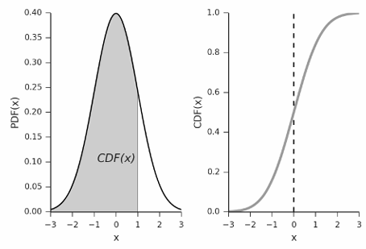{ width="80%" }

Looking up table is cumbersome and it doesn't have to be too accurate:

- We can approximate it using Chebychev's inequality (one-tailed version, for $t>\mu$)

    - $\mu\text{: mean, }\sigma^2\text{: variance, }$it doesn't even assume Gaussian distribution.

$$
P(x>t)\leq \frac{\sigma^2}{\sigma^2+(t-\mu)^2}
$$

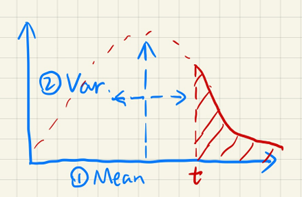{ width="60%" }

Performance

- Shadow map generation: 

    - “square depth map”: parallel, along with shadow map, #pixels 
    
    - Anything else? 
    
- Run time 

    - Mean of depth in a range: O(1) 
    
    - Mean of depth square in a range: O(1) 
    
    - Chebychev: O(1) 
    
    - No samples / loops needed! 

- Step 3 (filtering) solved perfectly

    - But need to update mipmap and shadow map for moving scene

Now we come back to step 1, we also need range query in block search within an area

- Also require sampling (loop) earlier, also inefficient 

- The average depth of blockers 

- Not the average depth $z_{avg}$ 

- The average depth of those texels whose depth $z < t$

Key idea: 

- For blocker in blue $(z<t)$, the average $z_{occ}$ is what we want to compute

- For Non-blocker $(z>t)$, the average is $z_{unocc}$

- We have the following formula: 

$$
\frac{N_1}{N}z_{unocc}+\frac{N_2}{N}z_{occ}=z_{avg}
$$

- we can make the following approximations:  

    - ${N_1}/{N}=P(x>t)$, using Chebychev

    - ${N_1}/{N}=1 - P(x>t)$

    - We really don't know $z_{unocc}$, here we assume $z_{unocc}=t$, i.e. they have the same depth as the shading point

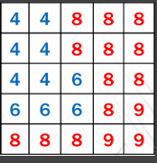{ width="60%" }

- Step 1 solved with negligible additional cost

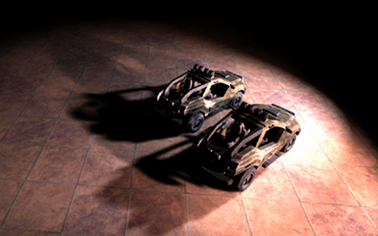{ width="80%" }

## MIPMAP and Summed-Area Variance Shadow Maps

Key observation: 

- When computing $P(x\geq t)$, we need to quickly grab $\mu$ and $\sigma$ from an arbitary range (rectangular)

- For the average $\mu$, this is rectangular range query

    - Can be handled by both MIPMAP and Summed Area Table (SAT)

### MIPMAP for Range Query

* Note: still approximate even with trilinear interpolation

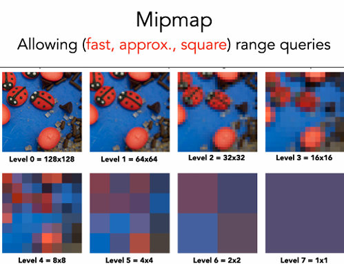{ width="90%" }

### SAT for Range Query

Range average is same as range sum.

Classic data structure and algorithm (prefix sum)

* In 1D: 

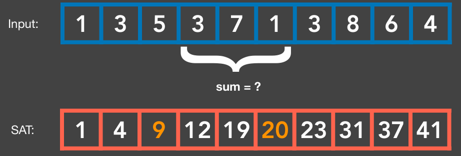{ width="80%" }

* In 2D: 

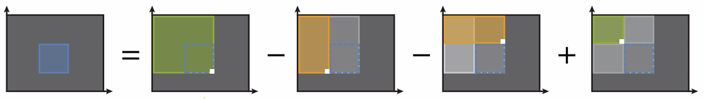{ width="100%" }

* Note: accurate, but need $O(n)$ time and storage to build

## Moment Shadow Mapping

### Revisit VSSM

Normal distribution is not always good enough to approximate the distribution of fragments' distances.

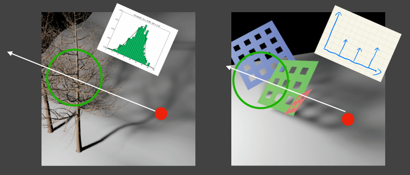{ width="100%" }

* Issues if the depth distribution is inaccurate

    - Overly dark: may be aceeptable 
    
    - Overly bright: LIGHT LEAKING

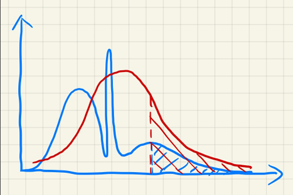{ width="80%" }

Limitations?

- Light leaking 

- non-planarity artifact 

Chebychev is to blame?

- Only valid when $t > z_{avg}$

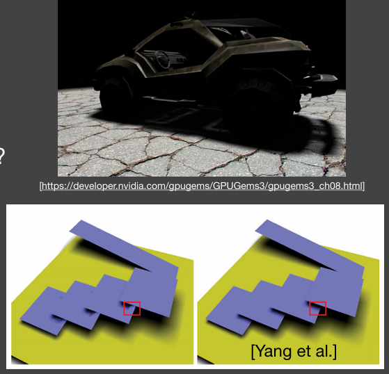{ width="100%" }

### Moment Shadow Mapping

* Goal

    - Represent a distribution more accurately  (but still not too costly to store) 

* Idea

    - Use higher order moments to represent a distribution

* Moments

    - Quite a few variations on the definition 
    
    - We use the simplest: $x,x^2,x^3,x^4,\dots$
    
    - So, VSSM is essentially using the **first two** orders of moment

* What can moments do?

    - Conclusion: first $m$ orders of moments can represent a function with $m/2$ steps
    
    - Usually, 4 is good enough to approximate the actual CDF of depth dist. 

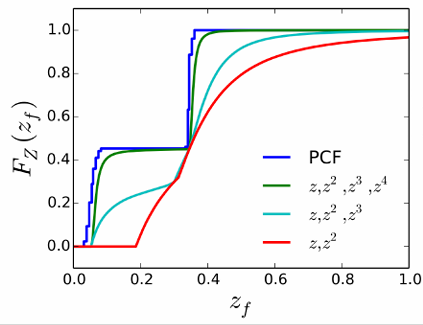{ width="80%" }

* Moment Shadow Mapping

    - Extremely similar to VSSM 
    
    - When generating the shadow map, record $z,z^2,z^3,z^4$ 
    
    - Restore the CDF during blocker search & PCF

* Pro: very nice results

* Cons

    - Costly storage (might be fine) 
    
    - Costly performance (in the reconstruction)

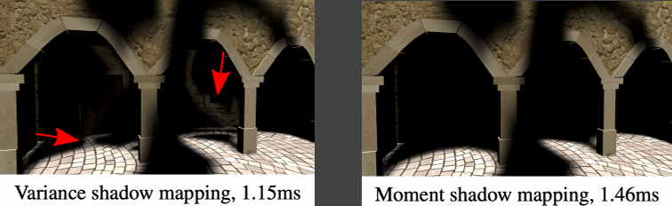{ width="80%" }

## Distance Field Soft Shadows

Distance Functions: 

* At any point, giving the minimum distance (could be signed distance) to the closest location on an object 

* An Example: Blending (linear interp.) a moving boundary

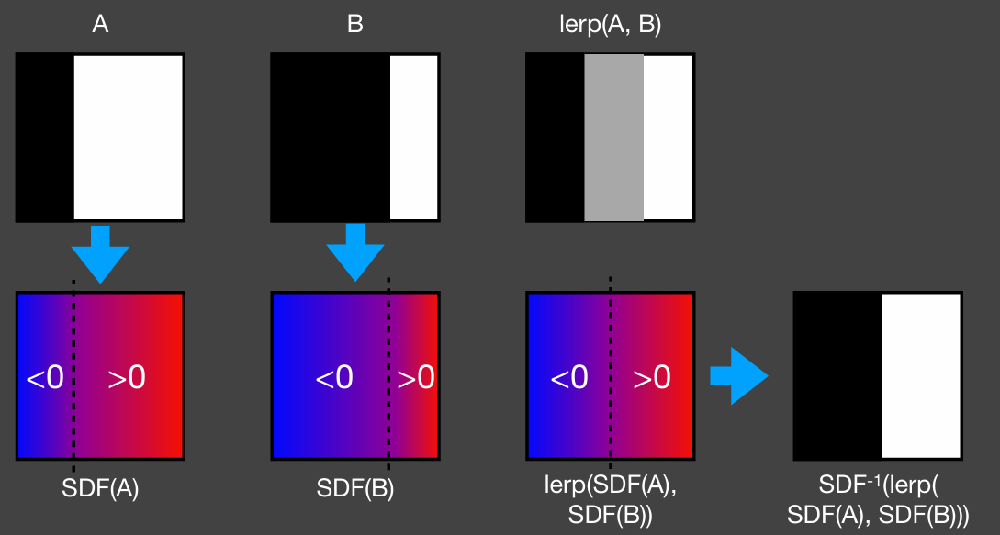{ width="80%" }

Usage 1: ray-SDF intersection 

* Ray marching (sphere tracing) to perform ray-SDF intersection 

- Very smart idea behind this: 

    - The value of SDF == a "safe" distance around, i.e. the ray won't reach any object if it travel a distance less than the SDF at that point  
    
    - Therefore, each time at p, just travel SDF(p) distance, until intersecting or travelling too far

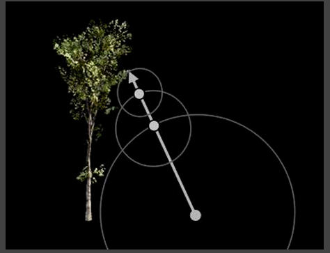{ width="80%" }

Usage 2: 

* Use SDF to determine the **(approx.)** percentage of occlusion 

*  the value of SDF -> a "safe" angle seen from the eye, i.e. the ray won't be blocked within this angle (just approximation)

    * Smaller “safe” angle <-> less visibility

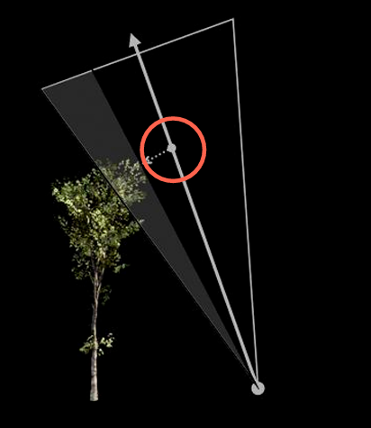{ width="80%" }

* During ray matching

    * Calculate the “safe” angle from shading point to light at every step 
    
    - Keep the minimum 

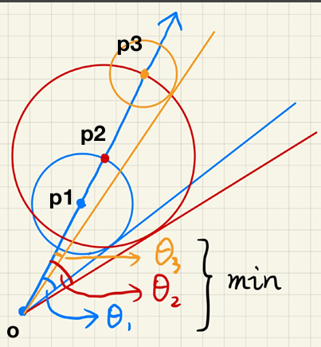{ width="80%" }

* How to compute the angle? 

$$
\arcsin{\frac{SDF(p)}{p-o}}
$$

* $arcsin$ has high computational cost and actually, we don't need the accurate angle, but a relative relationship

$$
\min\{\frac{k\cdot SDF(p)}{p-o}, 1.0\}
$$

* Larger $k$ <-> earlier cutoff of penumbra <-> harder

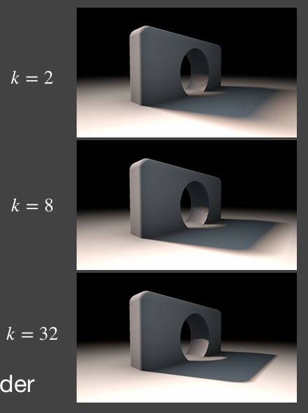{ width="80%" }

* Pros

    - Fast
    
    - High quality 

* Cons

    - Need precomputation 
    
    - Need heavy storage 
    
    - Artifact