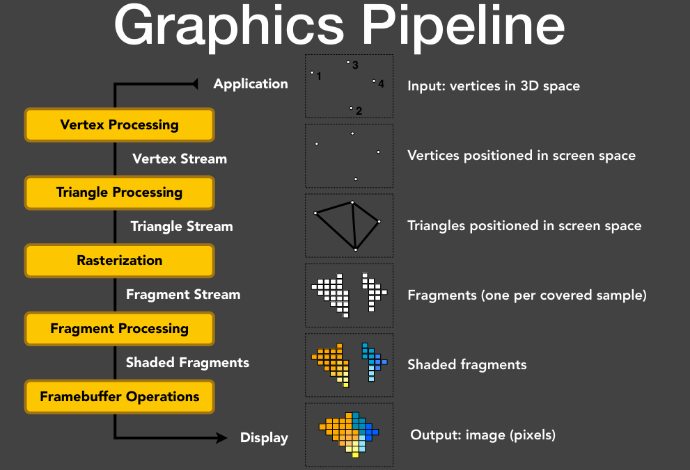

# GAMES202 - Reaf-Time High Quality Rendering

* **Real-Time** High Quality Rendering

    - Speed: more than 30 FPS (frames per second), even more for Virtual / Augmented Reality (VR / AR): 90 FPS
    
    - Interactivity: Each frame generated on the fly

* Real-Time **High Quality** Rendering
    - Realism: advanced approaches to make rendering more realistic

    - Dependability: all-time correctness (exact or approximate),no tolerance to (uncontrollable) failures

## Motivation

* Today, Computer Graphics is able to generate photorealistic images
    
    - Complex geometry, lighting, materials, shadows 
    
    - Computer-generated movies/special effects (difficult or impossible to tell real from rendered...)

* But accurate algorithms (esp. ray tracing) are very slow

    - So they are called offline rendering methods 

* With proper approximations, we can generate plausible results but runs much faster

## CG Basis

### Graphics Pipeline

{ width="100%" }

### OpenGL

Is a set of APIs that call the GPU pipeline from CPU

- Therefore, language does not matter! 

- Cross platform 

- Alternatives (DirectX, Vulkan, etc.) 

Cons

- Fragmented: lots of different versions 

- C style, not easy to use

#### Analogy: Oil Painting

A. Place objects/models

- Model specification 

- Model transformation 

- User specifies an object’s vertices, normals, texture coords and send them to GPU as a Vertex buffer object (VBO)
    
    - The way how attributes stored is similar to .obj files 

- Use OpenGL functions to obtain matrices

    - e.g., glTranslate, glMultMatrix, etc. 
    
    - No need to write anything on your own

B. Set up an easel

- View transformation 

- Create / use a framebuffer, which performs the same function as an easel

- Set camera (the viewing transformation matrix) by simply calling, e.g., gluPerspectiv

C. Attach a canvas to the easel
 
- Analogy of oil painting: 

    - you can also paint multiple pictures using the same easel 

    - so you can render different textures using one framebuffer

- One rendering pass in OpenGL
    
    - A framebuffer is specified to use 
    
    - Specify one or more textures as output (shading, depth, etc.) on one rendering pass

    - Render (fragment shader specifies the content on each texture)

D. Paint to the canvas

- i.e., how to perform shading

- This is when vertex / fragment shaders will be used 

- For each vertex in parallel	

    - OpenGL calls user-specified vertex shader: Transform vertex (ModelView, Projection), other ops 

- For each primitive, OpenGL rasterizes

    - Generates a fragment for each pixel the fragment covers

- For each fragment in parallel
    
    - OpenGL calls user-specified fragment shader: Shading and lighting calculations 
    
    - OpenGL handles z-buffer depth test unless overwritten 

- This is the “Real” action that we care about the most: user-defined vertex, fragment shaders

    - Other operations are mostly encapsulated 
    
    - Even in the form of GUI-

E. (Attach other canvases to the easel and continue painting) 

F. (Use previous paintings for reference)

#### Summary

Summary: in each pass

- Specify everything on GPU: 

    - objects, camera, MVP, etc. 

    - framebuffer and input/output textures 

    - vertex / fragment shaders 

- Render!

### Shading Languages

* Vertex / Fragment shading described by small program

* Written in language similar to C but with restrictions

* Long history.  Cook’s paper on Shade Trees, Renderman for offline rendering 

    - In ancient times: assembly on GPUs! 
    
    - Stanford Real-Time Shading Language, work at SGI 
    
    - Still long ago: Cg from NVIDIA 
    
    - HLSL in DirectX (vertex + pixel) 
    
    - GLSL in OpenGL (vertex + fragment)

#### Shader Setup

* Initializing (shader itself discussed later)

    - Create shader (Vertex and Fragment) 

    - Compile shader  

    - Attach shader to program 

    - Link program  

    - Use program  

* Shader source is just sequence of strings

* Similar steps to compile a normal program

### Rendering Equation 

Most important equation in rendering

- Describing light transpor

$$
L_{o}\left(\mathrm{p}, \omega_{o}\right)=L_{e}\left(\mathrm{p}, \omega_{o}\right)+\int_{H^{2}} f_{r}\left(\mathrm{p}, \omega_{i} \rightarrow \omega_{o}\right) L_{i}\left(\mathrm{p}, \omega_{i}\right) \cos \theta_{i} \mathrm{~d} \omega_{i}
$$

In real-time rendering (RTR)

- Visibility is often explicitly considered 

- BRDF is often considered together with the cosine term

$$
L_{o}\left(\mathrm{p}, \omega_{o}\right)=\int_{\Omega^{+}} \boxed{L_{i}\left(\mathrm{p}, \omega_{i}\right)} \boxed{f_{r}\left(\mathrm{p}, \omega_{i}, \omega_{o}\right)  \cos \theta_{i}} \boxed{V(p,\omega_i)} \mathrm{~d} \omega_{i}
$$

#### Environment Lighting

- Representing incident lighting from all directions

    - Usually represented as a cube map or a sphere map (texture) 
    
    - We’ll introduce a new representation in this cours