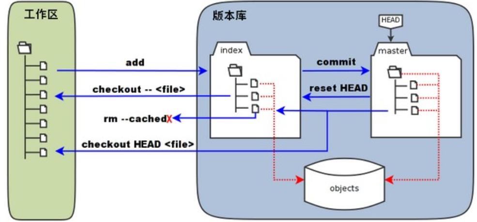
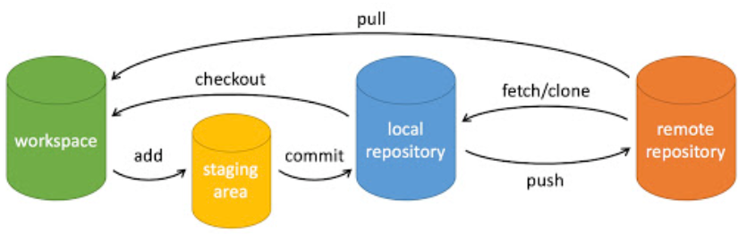

# Git command tutorial
## 工作区、暂存区和版本库
* workspace：工作区，即本地能看到的目录
* staging area：暂存区，一般存放在 `.git` 目录下的 index 文件（.git/index）中，所以有时也叫作索引（index）
* local repository：版本库或本地仓库，工作区有一个隐藏目录 .git，这个不算工作区，而是 Git 的版本库
* remote repository：远程仓库

* 图中的 objects 标识的区域为 Git 的对象库，实际位于 ".git/objects" 目录下，里面包含了创建的各种对象及内容。
* 当对工作区修改（或新增）的文件执行 `git add` 命令时，暂存区的目录树被更新，同时工作区修改（或新增）的文件内容被写入到对象库中的一个新的对象中，而该对象的ID被记录在暂存区的文件索引中。
* 当执行提交操作 `git commit`时，暂存区的目录树写到版本库（对象库）中，master 分支会做相应的更新。即 master 指向的目录树就是提交时暂存区的目录树。
* 当执行 `git reset HEAD` 命令时，暂存区的目录树会被重写，被 master 分支指向的目录树所替换，但是工作区不受影响。
## 基本操作

### 创建仓库
`git init` 在当前目录新建Git仓库
`git clone` 将一个远程仓库clone到本地。其复制远程仓库的所有代码和历史记录，并在本地创建一个与远程仓库相同的仓库副本。
```git
$ git clone [url]
```
### 提交与修改
`git add` 将修改的文件添加到暂存区
```git
$ git add [file1] [file2] ...     //添加指定文件
$ git add [dir]                   //添加指定目录
$ git add .                       //添加当前目录下所有文件
```
`git commit` 将暂存区的内容提交到本地仓库
提交时的message是必须的，可以使用 `-m` 参数在命令后面直接添加，否则会打开默认编辑器添加
```git
$ git commit -m [message] 
$ git commit [file1] [file2] ... -m [message] //可以只提交指定文件
$ git commit -a                               // -a 参数可以不add直接提交 
```
`git reset` 将暂存区回退到某一次提交的版本
```git
$ git reset [--soft | --mixed | --hard] [commit]
$ git reset --hard [commit]       //将暂存区和工作区的内容都重置到commit状态
```
`git restore` 恢复或撤销文件的更改
```git
$ git restore <file>            //将指定文件恢复到最新的提交状态
$ git restore --staged <file>   //仅恢复暂存区的文件，不影响工作区
```
`git revert`
```git 
$ git revert <commit>   //生成一个新的commit节点，新节点与指定节点一样
```
`git mv` 移动或重命名
`git rm` 从暂存区和工作区删除文件
```git
$ git rm <file>           
$ git rm --cached <file>  // 仅删除暂存区
```
### 状态查看
`git status` 查看Git仓库当前状态，显示以下信息：
* 当前分支的名称
* 当前分支与远程分支的关系（例如，是否是最新的）
* 未暂存的修改：显示已修改但尚未使用 git add 添加到暂存区的文件列表
* 未跟踪的文件：显示尚未纳入版本控制的新文件列表
```git
$ git status
On branch master
Changes to be committed:
  (use "git restore --staged <file>..." to unstage)
        modified:   Git/git_command.md

Untracked files:
  (use "git add <file>..." to include in what will be committed)
        Git/images/
```
`-s` 参数显示精简信息，第一列字符表示版本库与暂存区之间的比较状态。第二列字符表示暂存区与工作区之间的比较状态。
* ` ` 空格表示文件未改动
* `M` 文件发生改动
* `A` 新增文件
* `D` 删除文件
* `R` 文件重命名
* `?` 文件未跟踪
```git
$ git status -s
MM Git/git_command.md
A  Git/images/workspace_and_localrepo.png
?? Git/images/basic_op.png
```
`git diff` 比较文件在暂存区和工作区中的差别
```git
$ git diff [file]               //
$ git diff --cached [file]      //显示暂存区与上一次提交的差异
$ git diff [commit1] [commit2]  //显示两次提交的差异
```
`git log` 查看历史提交记录，`--help` 查看帮助
`git blame` 逐行显示指定文件的具体修改
### 分支
几乎每一种版本控制系统都以某种形式支持分支，一个分支代表一条独立的开发线。
使用分支意味着你可以从开发主线上分离开来，然后在不影响主线的同时继续工作。
`git branch` 
```git
$ git branch                  //列出分支
$ git branch [branchname]     //创建分支
$ git branch -d [branchname]  //删除分支
```
`git switch` 切换分支
```git
$ git switch [branchname]
```
`git merge` 合并分支
```git
$ git merge [branchname]    //将该分支合并到当前分支
```
`git checkout` 可以切换到分支(建议switch)或特定提交
以下指令将头指针切换到commit，此时进入"detached HEAD"状态，只能查看历史记录而不能进行分支操作，不建议在分离头指针状态下工作，因为更改可能会丢失。
```git
$ git checkout [commit]     
```
## 远程操作
### remote
`git remote` 命令用于用于管理 Git 仓库中的远程仓库。
```git      
//列出当前仓库中已配置的远程仓库
$ git remote
//列出当前仓库中已配置的远程仓库，并显示它们的 URL。
$ git remote -v
//添加一个新的远程仓库。指定一个远程仓库的名称和 URL，将其添加到当前仓库中。
$ git remote add <remote_name> <remote_url>
//将已配置的远程仓库重命名
$ git remote rename <old_name> <new_name>
//从当前仓库中删除指定的远程仓库
$ git remote remove <remote_name>
//修改指定远程仓库的 URL
$ git remote set-url <remote_name> <new_url>
//显示指定远程仓库的详细信息，包括 URL 和跟踪分支
$ git remote show <remote_name>
```
### fetch & pull
`git fetch`将远程仓库的最新内容拉取到本地，可以在检查后决定是否合并。
`git pull`将远程仓库的最新内容拉取到本地并直接合并。可能产生冲突，需要手动解决
#### git fetch
```git
$ git fetch <远程主机名> //将远程主机的更新全部取回本地
$ git fetch <远程主机名> <分支名> //仅将该分支取回
```
如取回Learning主机的main分支：
```git
$ git fetch Learning main
From github.com:mostimaaa/Learning
 * branch            main       -> FETCH_HEAD
```
如果之后要进行merge操作最好指明分支名
取回更新后会返回`FETCH_HEAD`，指向某个分支在服务器上的最新状态，可以通过以下指令查看：
```git
$ git log -p FETCH_HEAD
commit cccb391c24e8bacdb0eb5d88730f8a6278a0d68d (Learning/main)
Author: mostimaaa <112405530+mostimaaa@users.noreply.github.com>
Date:   Sat Dec 16 19:27:59 2023 +0800

    Initial commit

diff --git a/README.md b/README.md
new file mode 100644
index 0000000..f986672
--- /dev/null
+++ b/README.md
@@ -0,0 +1,2 @@
+# Learning
+a simple repo for some learning resources
```
#### git pull
`git pull = git fetch + git merge`，即：
```git
$ git fetch Learning main   //获取最新分支，返回FETCH_HEAD
$ git merge FETCH_HEAD  //将该远程分支合并到本地当前分支
```
用`git pull`可表示为：
```git
$ git pull <远程主机名> <远程分支名>:<本地分支名>
```
如果是与本地当前分支合并则可不写本地分支名：
```git
$ git pull Learning main
```
### conflict
要进行合并的分支有互相冲突的文件或行为，如两个分支中相同名称的文件有不同内容
```git
$ git pull Learning main
remote: Enumerating objects: 5, done.
remote: Counting objects: 100% (5/5), done.
remote: Compressing objects: 100% (2/2), done.
remote: Total 3 (delta 0), reused 0 (delta 0), pack-reused 0
Unpacking objects: 100% (3/3), 665 bytes | 55.00 KiB/s, done.
From github.com:mostimaaa/Learning
 * branch            main       -> FETCH_HEAD
   cccb391..5a0f9f5  main       -> Learning/main
CONFLICT (modify/delete): README.md deleted in HEAD and modified in 5a0f9f57ec2556de6729f76549832fd2e16c337a.  Version 5a0f9f57ec2556de6729f76549832fd2e16c337a of README.md left in tree.
Automatic merge failed; fix conflicts and then commit the result.
```
操作步骤：
* 将两个分支的代码拉取到本地
* 手动整合
* 提交

拉取到本地后，在本地打开冲突的文件，修改为想要保留的内容后提交即可。
如，修改README后如下：
```git
86156@lzp MINGW64 ~/desktop/Learning (master|MERGING)
$ git add README.md

86156@lzp MINGW64 ~/desktop/Learning (master|MERGING)
$ git commit
[master c410de8] Merge branch 'main' of github.com:mostimaaa/Learning
```
### push
`git push`将本地分支上传到远程并合并
```git
$ git push <远程主机名> <本地分支名>:<远程分支名>
$ git push <远程主机名> <本地分支名>    //如远程分支名与本地分支名相同则可省略
```
如将本地master分支推送到Learning主机的main分支：
```git
$ git push Learning master:main
```
如果本地版本与远程版本有差异，但又要强制推送可以使用`--force`参数
```git
$ git push --force Learning master:main
```
删除主机的分支可以使用 --delete 参数，以下命令表示删除 Learning 主机的 main 分支：
```git
$ git push Learning --delete main
```