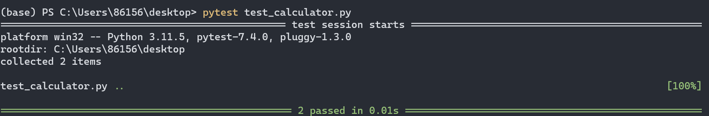
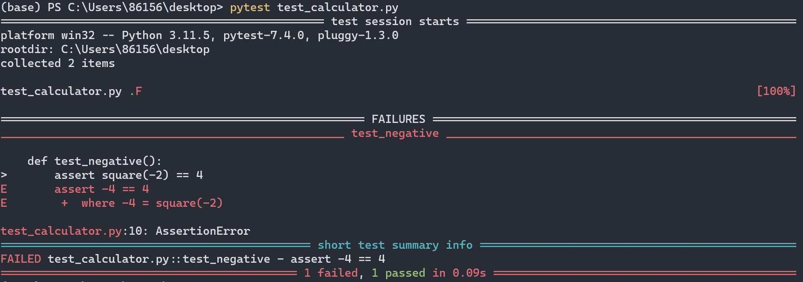

# Python
## introduction
* Don't need to explicitly compile and run your code like C.
* Use interpreter, a program to read and run your code.
* Less code, more work.
* A good ecosystem with lots of libraries to solve problems which have been solved by others.
```
code hello.py
python hello.py         # python means the interpreter program here 
```

```py title="hello.py"
print("hello, world")
```
## Types
`bool`, `int`, `float` and `str` are types in python.
Use `input` to get ***str*** from your keyboard
```py title="calculator.py"
x = input("x: ")
y = input("y: ")

print(x + y)
```
> Note that you can perform `str` by `+` and `*`. `+` performs string concatenation and `*` performs repetition.

Run the code and we get following result. The variable type that `input` returns is `str` explains the reason why output is 12, i.e. '1' + '2'
```
python .\calculator.py
x: 1
y: 2
12
```
The correct version is shown below
```py title="new_calculator.py"
x = int(input("x: "))
y = int(input("y: "))

print(x + y)
```
A traceback will appear if the input isn't number.
`type()` can be used to tell you the type of a value.
```py
>>> type(1.2)
<class 'float'>
```
In these results, the word “class” is used in the sense of a category; a type is a category of values.
### String
Use `index` to choose the char you want in the sequence.
Use `slice` to select a segment of a string.
```py
>>> s = "hello, world"
>>> s[1]
'e'
>>> s[0:5]
'hello'
>>> s[:7]
'hello, '
>>> s[7:]
'world'
>>> s[:]
'hello, world'
```
The operator `[n:m]` returns the part of the string from the “n-eth” character to the “m-eth” character, including the first but excluding the last.
> `str` is immutable.

## Conditions
* Indentation is important in python

```py
if x < y:
    print("x is less than y")
elif x > y:
    print("x is greater than y")
else:
    print("x is equal to y")
```
## Object-Oriented Programming
Some functions are built into objectives themselves. These functions called `method` comes with some data types, like a string.
```py title="agree.py"
s = input("Do you agree? ")
# method for string to convert it to lowercase
s = s.lower()               

if s in ["y", "yes"]:
    print("Agreed")
elif s in ["n", "no"]:
    print("Not agreed")
```

Click <a herf="docs.python.org">here</a> for official documentation

### Programmer-defined types

A programmer-defined type is also called a ***class***. We can define a class like this:

```py
class Point:
     """Represents a point in 2-D space"""
```

To create a Point class, you can call `Point` as if it were a function. Creating a new object is called ***instantiation***, and the object is an ***instance*** of the class.

```py
>>> black = Point()
>>> black
<__main__.Point object at 0x000002595BC5D890>
```

### Attributes
You can assign values to named elements of an object using dot notation. These elements are called ***attributes***

```py
>>> black.x = 3.0
>>> black.y = 4.0
```

You can pass an instance as an argument.

```py
def print_point(p):
    print('(%g, %g)' % (p.x, p.y))

>>> print_point(black)
(3, 4)
```

An object that is an attribute of another object is ***embedded***

```py
class Rectangle:
    """Represents a rectangle. 

    attributes: width, height, corner.
    """

box = Rectangle()
box.width = 100.0
box.height = 200.0
box.corner = Point()
box.corner.x = 0.0
box.corner.y = 0.0
```

Instances can also be return values. 

Objects are mutable.

Copying an object is often used. You can use `copy` module to do that. There are two types of copy

* Shallow copy: `copy.copy()` copies the object and any references it contains, but not the embedded objects.

* Deep copy: `copy.deepcopy()` copies not only the object but also the objects it refers to, and the objects they refer to, and so on.
## Loop
=== "while loop"
    ```py
    i = 0
    while i < 3:
        print("meow")
        i += 1
    ```

=== "for loop"
    ```py
    # on every iteration of this loop, 
    # Python is assigning `i` to the next value in the list behind `in`
    for i in range(3):          # range(3) returns a list of integers from 0 to 2
        print("hello, world")
    ```

A forever loop
```py
while True:
    print("meow")
```
> True and False are capitalized in Python

You can loop over almost anything that is iterable in Python, such as string.
```py title="uppercase.py"
before = input("Before: ")
print("After: ", end="")
for c in before:
    print(c.upper(), end="")    
    # end is a second parameter here telling print to insert nothing instead of a new line after every output
    # otherwise each letter will be outputed in seperate lines
print()     # move cursor to next line
```
Actually if you want to convert a string to uppercase, you just need to call the method
```py
before = input("Before: ")
after = before.upper()
print(f"After: {after}")
```
When you want to implement a `do-while` loop, just put the loop body into a forever loop and jump out when something happens.
In Python, even a for loop can have a `else` clause.
```py
names = ["Cat", "Dog", "Bird"]

name = input("Name: ")

for n in names:
    if name == n:
        print("Found")
        break
else:
    print("Not Found")
```
If the for loop terminates without calling `break`, then the code in `else` will execute.
This is just an example to explain `for-else`. Actually it can be solved below
```py
names = ["Cat", "Dog", "Bird"]

name = input("Name: ")

if name in names:
    print("Found")
else:
    print("Not Found")
```
## Function
Practically, we want the main part of a program at the top of the file so that we can dive right in and know what the file is doing. Let's look at the following way.
```py
for i in range(3):
    meow()

def meow():
    print("meow")
```
If we run the code, we will find a traceback.
```
Traceback (most recent call last):
  File "C:\Users\86156\desktop\meow.py", line 2, in <module>
    meow()
    ^^^^
NameError: name 'meow' is not defined
```
This could happen because the interpreter read the file from top to down and `meow()` is called before its defination.
To solve this problem, we need to define a function called `main` and takes no arguments.
```py
def main():
    for i in range(3):
        meow()

def meow():
    print("meow")

main()
```
Note that the last line is necessary since the beginning only define the `main` function and it will be executed only when we call it.
Now, let's add some parameter so that we can control the times the loop will run.
```py
def main():
    meow(5)

def meow(n):
    for i in range(n):
        print("meow")

main()
```
### Flow of execution
The order statements run in is called **flow of execution**. Execution always begin at the first statement of the program. Statements are run one at a time from top to bottom. Function definition don't alter the flow of execution of the program, but remember that statements inside the function don’t run until the function is called. A function call is like a detour in the flow of execution. Instead of going to the next statement, the flow jumps to the body of the function, runs the statements there, and then comes back to pick up where it left off.
### Higher-Order Functions
#### Functions as Arguments
Consider you want to compute the sum of a series. Here are two examples:
```py
def sum_naturals(n):
    total, k = 0, 1
    while k <= n:
        total, k = total + k, k + 1
    return total

def sum_cubes(n):
    total, k = 0, 1
    while k <= n:
        total, k = total + k*k*k, k + 1
    return total
``` 
The upper one returns the sum of natural numbers up to n, while the other returns the sum of the cubes of natural numbers.
These two functions share a common pattern as following:
```py
def <name>(n):
    total, k = 0, 1
    while k <= n:
        total, k = total + <term>(k), k + 1
    return total
```
This remind us that we can pass another parameter `term`, which is a function, into the sum function so that we don't need to write a paricular function for every series.
Let's define our function in the following way:
```py
def summation(n, term):
    total, k = 0, 1
    while k <= n:
        total, k = total + term(k), k + 1
    return total

def cube(x):
    return x*x*x

def identity(x):
    return x

sum_cube = summation(n, cube)
sum_natural = summation(n, identity)
```
The last two rows compute the two series. We can pass more `term` function to get the sum of more series.
#### Functions as General Methods
Consider the following function to compute the golden ratio.
```py
def improve(update, close, guess = 1):
    while not close(guess):
        guess = update(guess)
    return guess

def golden_update(guess):
    return 1 / guess + 1

def square_close_to_successor(guess):
    return approx_eq(guess * guess, guess + 1)

def approx_eq(x, y, tolerance = 1e-3):
    return abs(x - y) < tolerance

phi = improve(golden_update, square_close_to_successor)
```
The `improve` function is asgeneral expression of repetitive refinement. It doesn't specify what problem is being solved: those details are left to the `update` and `close` functions passed in as arguments. `approx_eq` returns True when its arguments are close to each other. 

This example illustrates two related big ideas in computer science. 

* Naming and functions allow us to abstract away a vast amount of complexity. While each function definition has been trivial, the computational process set in motion by our evaluation procedure is quite intricate. 

* It is only by virtue of the fact that we have an extremely general evaluation procedure for the Python language that small components can be composed into complex processes. Understanding the procedure of interpreting programs allows us to validate and inspect the process we have created.
#### Nested Definitions
The above examples demonstrate how the ability to pass functions as arguments significantly enhances the expressive power of our programming language. Each general concept or equation maps onto its own short function. One negative consequence of this approach is that the global frame becomes cluttered with names of small functions, which must all be unique. Another problem is that we are constrained by particular function signatures: the `update` argument to `improve` must take exactly one argument. Nested function definitions address both of these problems, but require us to enrich our environment model.
The following program compute a square root of a number.
```py
def sqrt(a):
    def sqrt_update(x):
        return average(x, a/x)
    def sqrt_close(x):
        return approx_eq(x * x, a)
    return improve(sqrt_update, sqrt_close)
```
Like local assignment, local `def` statements only affect the current local frame. These functions are only in scope while `sqrt` is being evaluated. Consistent with our evaluation procedure, these local `def` statements don't even get evaluated until `sqrt` is called.

* The names of a local function do not interfere with names external to the function in which it is defined, because the local function name will be bound in the current local environment in which it was defined, rather than the global environment.

* A local function can access the environment of the enclosing function, because the body of the local function is evaluated in an environment that extends the evaluation environment in which it was defined.

The `sqrt_update` function carries with it some data: the value for a referenced in the environment in which it was defined. Because they "enclose" information in this way, locally defined functions are often called ***closures***.
#### Functions as Returned Values
We can define function composition like $h(x)=f(g(x))$ using our existing tools:
```py
def square(x):
    return x * x

def successor(x):
    return x + 1 

def composel(f, g):
    def h(x):
        return f(g(x))
    return h

square_successor = composel(square, successor)
result = square_successor(12)
```
#### Lambda Expressions
`lambda` expression is an unnamed function, reture a single expression as its body.
```py
s = lambda x, y : x * y             # input x and y, return x*y
t = lambda : None                   # no input and always output None
u = lambda *args: sum(args)         # input arbitary arguments, reutrn their sum
v = lambda **kwargs: 1              # input arbitary key-value arguments, return 1
```
`s`, `t`, `u` and `v` are all functions
## Exceptions
In C, we often return some distinct value to signifies the function failed to achieve its goal. In Python, we can use `exception` to handle it.
```py
def main():
    x = get_int("x: ")
    y = get_int("y: ")

    print(x + y)

def get_int(prompt):
    return int(input(prompt))

main()
```
In the above program, the `get_int()` function works well when we input some numbers. But a exception happens when we input other things.
```
python .\calculator.py
x: cat
Traceback (most recent call last):
  File "C:\Users\86156\desktop\calculator.py", line 10, in <module>
    main()
  File "C:\Users\86156\desktop\calculator.py", line 2, in main
    x = get_int("x: ")
        ^^^^^^^^^^^^^^
  File "C:\Users\86156\desktop\calculator.py", line 8, in get_int
    return int(input(prompt))
           ^^^^^^^^^^^^^^^^^^
ValueError: invalid literal for int() with base 10: 'cat'
```
The `ValueError` tells us what kind of exception we have. We can revise it in this way:
```py title="get_int()"
def get_int(prompt):
    try:
        return int(input(prompt))
    except ValueError:
        print("Not an interger")
```
In this program, we use `try` and `except` to tell the interpreter we try to do something and if `ValueError` exception happens, we will see "Not an integer" instead of traceback.
Only `try` and `except` are not enough. We need to add a loop so that the function will loop again and again until get a valid input.
```py title="get_int()"
def get_int(prompt):
    while True:
        try:
            return int(input(prompt))
        except ValueError:
            print("Not an interger")
```
You can also use `else` as part of try-except block. The statement in `else` execute when the `except` not happened.
```py
while True:
    try:
        x = int(input("What's x? "))
    except ValueError:
        print("x is not an integer")
    else:
        break

print(f"x is {x}")
```
## Unit Tests
Assume we have a program `calculator.py` to calculate the square of the input. We want to write a program to automaticaly test whether our program is right. We can use `assert` to assert the boolean expression following it is True. If True, nothing will happen. But if not, `AssertionError` will appear on screen

=== "calculator.py"
    ```py
    def main():
        x = int(input("What's x? "))
        print("x squared is", square(x))


    def square(n):
        return n * n
    
    if __name__ == "__main__":
        main()
    ```
=== "test_calculator.py"
    ```py
    from calculator import square

    def main():
        test_square()

    def test_square():
        try:
            assert square(2) == 4
        except AssertionError:
            print("2 squared was not 4")
        try:
            assert square(3) == 9
        except AssertionError:
            print("3 squared was not 9")
        try:
            assert square(0) == 0
        except AssertionError:
            print("0 squared was not 0")
        try:
            assert square(-2) == 4
        except AssertionError:
            print("-2 squared was not 4")

    if __name__ == "__main__":
        main()
    ```

### pytest
You can also use `pytest`, is a third-party library that allows you to unit test your program.

Run `pytest test_calculator.py` in your command line, which is shown below, pytest will automatically test it for you.

```py title="test_calculator.py"
from calculator import square


def test_positive():
    assert square(2) == 4
    assert square(3) == 9


def test_negative():
    assert square(-2) == 4
    assert square(-3) == 9


def test_positive():
    assert square(0) == 0
```



Let's add some bug in `calculator.py`, rerun the command and see what will happen.
```py title="calculator.py"
def main():
    x = int(input("What's x? "))
    print("x squared is", square(x))


def square(n):
    return n + n

if __name__ == "__main__":
    main()
```



* Unit testing code using multiple tests is so common that you have the ability to run a whole folder of tests with a single command.
* Add a folder called `test` with test programs in it. An additional file `__init__.py` is necessary. Leave it empty and `pytest` is informed that the whole folder containing `__init__.py` has tests that can be run.
* Run `pytest test` for testing.

## list
List is something like array but their memory is automatically handled for you.
An array is about having contiguously in memory. In Python, a list is more like a linked list. It will allocate memory for you and you don't have to know about pointers and nodes. 

```py 
scores = [72, 73, 33]           # List using square brackets
# use the bulid-in functions to get the sum and length of the list
average = sum(scores) / len(scores)
```
### Traverse
You can use following ways to traverse a list
```py
names = ['adam', 'bob', 'tony']

for name in names:
    print(name)

for i in range(len(names)):
    print(names[i])
```
### Opeartions
You can use `+` and `*` to manipulate lists
```py
>>> a = [1, 2, 3]
>>> b = [4, 5, 6]
>>> a + b
[1, 2, 3, 4, 5, 6]
>>> a * 3
[1, 2, 3, 1, 2, 3, 1, 2, 3]
```
### Method
`append` add a element to the end of a list

`extend` takes a list as an argument and append its element to the end of the origin list

`sort` sort the elements from low to high
```py
>>> a = [1, 2, 3]
>>> a.append(6)
>>> a
[1, 2, 3, 6]
>>> b = [5, 7]
>>> b.extend(a)
>>> b
[5, 7, 1, 2, 3, 6]
>>> b.sort()
>>> b
[1, 2, 3, 5, 6, 7]
```
`pop` delete the element with given index in the list and return that element. If no index is provided, delete the last one.

`remove` delete the element with given value and return nothing

`del` operator can remove more than one element with slice
```py
>>> x = b.pop(2)
>>> x
3
>>> b
[1, 2, 5, 6, 7]
>>> b.remove(7)
>>> b
[1, 2, 5, 6]
>>> del b[1:3]
>>> b
[1, 6]
```
## dist
Dictionary is essentially a hash tabel, a collection of key-value pairs.
```py
people = [
    {"name": "Carter", "number": "12345"},     # dist uses curly brace
    {"name": "David", "number": "12335"},
    {"name": "John", "number": "16345"},
]

name = input("Name: ")

for person in people:
    if person["name"] == name:
        number = person["number"]
        print(f"Found {number}")
        break
else:
    print("Not Found")
```
A big dist can be used, which is tidier in the following case. Note that Python will traverse the ***keys*** of the dirtionary.
```py
people = {
    "Carter": "12345",
    "David": "12335",
    "John": "16345",
}

name = input("Name: ")

if name in people:              # Python will look for the name among the keys in the dist
    number = people[name]
    print(f"Found {number}")
else:
    print("Not Found")
``` 
`len` function returns the number of key-value pairs.

`in` operator tells whether something appears as a ***key*** in the dist.

`values` method returns a collection of values.
```py
>>> dist = {"apple":"red", "banana":"yellow", "potato":"brown"}
>>> len(dist)
3
>>> "apple" in dist
True
>>> "red" in dist
False
>>> value = dist.values()
>>> "red" in value
True
```

## tuple
Tuples are immutable, you can't modify the elements. But you can replace one tuple with another.

```py
>>> t = ('a', 'b', 'c', 'd', 'e')
>>> t = ('A', ) + t[1:]
>>> t
('A', 'b', 'c', 'd', 'e')
```

Note that one value in parentheses without a comma is not a tuple
```py
>>> t = ('A')
>>> type(t)
<class 'str'>
>>> t = ('A', )
>>> type(t)
<class 'tuple'>
```

### Assignment
tuple assignment is more elegant for you can implement in the following way.

```py
a, b = b, a
```

The left side is a tuple of variables; the right side is a tuple of expressions. Each value is assigned to its respective variable. All the expressions on the right side are evaluated before any of the assignments.

### Tuples as return values
Actually a tuple is a list of value separated by comma and we can omit the parentheses although not recommand. 

In some functions, return values are often separated by comma, which are actually tuples.

```py
def min_max(t):
    return min(t), max(t)
```

### Variable-length argument tuples
Functions can take a variable number of arguments. A parameter name that begins with a ***\**** gathers arguments into a tuple. For example, the following print out arguments as a tuple.

```py
def print(*args):
    print(args)
```

The complement of gather is scatter. If you have a sequence of values and you want to pass it to a function as multiple arguments, you can use the ***\**** operator. For example:

```py
>>> t = (1, 2)
>>> divmod(t)
Traceback (most recent call last):
  File "<stdin>", line 1, in <module>
TypeError: divmod expected 2 arguments, got 1
>>> divmod(*t)
(0, 1)
```

### Lists and tuples
`zip()` is a built-in function that takes two or more sequences and interleaves them.

The result is a zip object that knows how to iterate through the pairs. The most common use of `zip` is in a for loop:

```py
>>> l = 'abc'
>>> n = [1, 2, 3]
>>> z = zip(l ,n)
>>> for pair in z:
...     print(pair)
...
('a', 1)
('b', 2)
('c', 3)
```

A zip object is a kind of iterator, which is any object that iterates through a sequence. Iterators are similar to lists in some ways, but unlike lists, you can’t use an index to select an element from an iterator.

If you want to use list operators and methods, you can use a zip object to make a list:

```py
>>> list(zip(l, n))
[('a', 1), ('b', 2), ('c', 3)]
```

If you need to traverse the elements of a sequence and their indices, you can use the built-in function `enumerate`:
```py
>>> list(zip(l, n))
[('a', 1), ('b', 2), ('c', 3)]
>>> for index, element in enumerate('abc'):
...     print(index, element)
...
0 a
1 b
2 c
```

### Dicts and tuples
Dictionary have a method called `items` returns a sequence of tuples with key-value pairs. The result is a `dist_items` object, which is also an iterator.

```py
>>> d = {'a':1, 'b':2, 'c':3}
>>> t = d.items()
>>> t
dict_items([('a', 1), ('b', 2), ('c', 3)])
```

Combining `dict` with `zip` yields a concise way to create a dictionary

```py
>>> d = dict(zip('abc', range(3)))
>>> d
{'a': 0, 'b': 1, 'c': 2}
```
## Files

* transient program: data disappears when programs end
* persistent program: some of their data is kept in permanent storage.
* reading and writing text files or store the state of program in a database are basic way to maintain data.

### Reading and writing

The built-in function `open` takes the name of the file as a parameter and returns a ***file object***. 

`readline` reads a line each time and returns the result as a string.

```py
>>> fin = open('demo.txt')
>>> line = fin.readline()
>>> line
'This is a title.\n'
```

You can also use a file object as part of a for loop

```py
fin = open('demo.txt')
for line in fin:
    print(line.strip())     # strip() removes '\n' in the end of a str
```

Open a file with mode `w` as a second parameter to write a file. If the file already exists, opening it in write mode clears out the old data and starts fresh. 

`write` write ***str*** into the file. Return value is the number of characters that were written.

```py
>>> fout = open('demo.txt', 'w')
>>> line1 = "This is a title.\n"
>>> fout.write(line1)
17
>>> line2 = "this is a p"
>>> fout.write(line2)
11
```

### Filenames and paths
`os` module provides functions for working with files and directories.

`os.getcwd` returns the name of the current directory
```py
>>> import os
>>> os.getcwd()
'C:\\Users\\86156\\Desktop'
```

`os.path` provides other functions for working with filenames and paths.
```py
>>> os.path.abspath('demo.txt')         # find absolute path
'C:\\Users\\86156\\Desktop\\demo.txt'
>>> os.path.exists('demo.txt')          # check is the file exist
True
>>> os.path.isdir('demo.txt')           # check is it a directory
False
```

Close the file when operating is completed
```py
>>> fout.close()
```
### Database
A ***database*** is a file that is organized for storing data. Many databases are organized like a dictionary in the sense that they map from keys to values, and it is on disk.

The module `dbm` provides an interface for creating and updating database files.

```py
>>> import dbm
>>> db = dbm.open('MyGO', 'c')
```

Mode `c` means that database should be created if it doesn’t already exist. The result is a database object that can be used (for most operations) like a dictionary.

```py
>>> db['vocal'] = 'tomori'      # create a new item
>>> db['vocal']                 # access the item
b'tomori'
```

The result of access is ***bytes object***.

You can iterate it with a for loop

```py
for key in db.keys():
    print(key, db[key])
```

Close it when you are done
```py
>>> db.close()
```

A limitation of `dbm` is that the keys and values have to be strings or bytes.

You can use `pickle` module to transilate any type of object into a string, and then translate the string back into objects.

* `pickle.dumps` takes an object and returns a string representation.
* `pickle.loads` reconstitues the object.

```py
>>> import pickle
>>> t = [1, 2 ,3]
>>> t1 = pickle.dumps(t)
>>> t1
b'\x80\x04\x95\x0b\x00\x00\x00\x00\x00\x00\x00]\x94(K\x01K\x02K\x03e.'
>>> t2 = pickle.loads(t1)
>>> t2
[1, 2, 3]
```

### Writing modules
Any file that contains Python code can be imported as a module.

Suppose you have a file like this

```py title="demo.py"
def add(a, b):
    return a+b

print("This is a add function")
```

You can import it like this. 

```
>>> import demo
This is a add function
```

Now you have a module object `demo` and you can use function in it.

```py
>>> demo
<module 'demo' from 'C:\\Users\\86156\\Desktop\\demo.py'>
>>> demo.add(3, 4)
7
```

The test code in the module will run when you import it, but normally we only want the defination of functions. We can add the following idiom:

```py
if __name__ == '__main__':
    print("This is a add function")
```

`__name__` is a built-in variable that is set when the program starts. If the program is running as a script, `__name__` has the value `'__main__'`; in that case, the test code runs. Otherwise, if the module is being imported, the test code is skipped.

## Other
### Some operators
#### Floor division and modulus
The division sign `/` divides two numbers to a float, while floor division `//` returns an integer rounded down by that float. The modulus operator `%` divides two numbers and return s the remainder.
```py
>>> 32 / 10
3.2
>>> 32 // 10
3
>>> 32 % 10
2
``` 
#### Logical operator
Python use `and`, `or` and `not` these three keywords to do logical operation.
### truncation, imprecision and overflow
Python won't truncate the result if it has fractional component. It will convert type automatically.
```py title="calculator.py"
x = int(input("x: "))
y = int(input("y: "))
z = x / y
print(z)
```
Run the code
```
python .\calculator.py
x: 1
y: 3
0.3333333333333333
```
We can use f string to show more digits after the decimal point
```py
x = int(input("x: "))
y = int(input("y: "))
z = x / y
print(f"{z:.50f}")
```
The result below shows that the floating point imprecision problem remains in Python
```
python .\calculator.py
x: 1
y: 3
0.33333333333333331482961625624739099293947219848633
```
In Python, integer won't overflow no matter how big it is because Python will reserve more and more memeory for that integer to fit it.
### sys
The sys library has system-related functionality. 
In C, we got access to command-line arguments with `main()`, `argc` and `argv`.
You can do command-line arguments in Python with the help of `sys`
```py
from sys import argv

if len(argv) == 2:
    print(f"hello, {argv[1]}")
else:
    print("hello, world")
```
If you give one argument, the output is `hello, world`. If two, then different. 
Note that the command `python` is ignored from `argv`
```
$ python greet.py
hello, world
$ python greet.py David
hello, David
```
You can also exit the program with `sys`
```py
import sys

if len(sys.argv) != 2:
    print("Missing command-line argument")
    sys.exit(1)

print(f"hello, {sys.argv[1]}")
sys.exit(0)
```
### pip
Using `pip` to install third-party libraries.