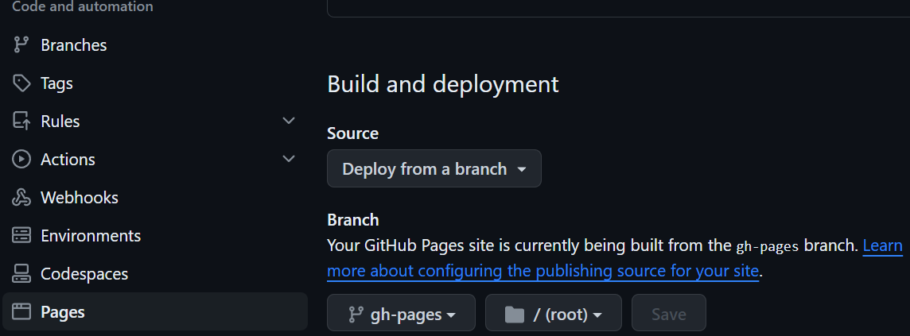

# How to build personal website using MkDocs
## MkDocs
MkDocs is a **fast**, **simple** and **downright gorgeous** static site generator that's geared towards building project documentation. Documentation source files are written in Markdown, and configured with a single YAML configuration file. You can easily customize your webpages, preview your site and host it in almost anywhere.
Run the following command to install mkdocs
```
pip install mkdocs
```
Run the following code to initialize the project
```
mkdocs new my-project
```
This will create a new folder in your current directory with basic files to build the site. `mkdocs.yml` is a configuration file, storing site configuration. `docs` is a folder which contains your documentation source files. You can also try the following command to generate these files directly in your current directory.
```
mkdocs new .
```
`mkdocs.yml` specifies basic site configurations. A simple demo is showing below.
```yml
site_name: tianliangtian's personal website
site_url: https://tianliangtian.github.io
site_author: tianliangtian

theme:
  name: material

nav:
  - Home: index.md
  - Learning: 
    - Git: Learning/Git.md
```
`site_name` is the name of the site. `site_url` is the place where you deploy your site.
You can customize your site in the `theme` block
`nav` block helps you to arrange the order, title, and nesting of each page in the navigation header. Remember to relate your source files in `docs` to those pages.
You can use the following command to preview your site in the given url.
```
mkdocs serve
```
The following commands generate static site files.
```
mkdocs build
```
The following command helps you deploy your pages. It will create a new branch called `gh-pages` in your Github project, execute `mkdocs build` and push the content in `site` to that branch.
```
mkdocs gh-deploy
```
## Material for MkDocs
Material for MkDocs is a powerful documentation framework on top of MkDocs, a static site generator for project documentation.
Install with pip
```
pip install mkdocs-material
```
You can customize your pages in `mkdocs.yml`. Configuration of my pages is shown below
```yaml
site_name: tianliangtian's pages
site_url: https://tianliangtian.github.io
site_author: tianliangtian

theme:
  name: material
  icon: 
    logo: material/library
  features:
    - navigation.tracking
    - navigation.tabs
    - navigation.expand
    - navigation.indexes
    - navigation.top
    - navigation.footer
    - toc.follow
    - search.suggest
    - search.highlight
    - search.share
    - header.autohide
    - content.code.copy
    - content.code.select
    - content.code.annotate
  palette:
    # Palette toggle for light mode
    - scheme: default
      primary: pink
      accent: teal
      toggle:
        icon: material/brightness-7
        name: Switch to dark mode
    # Palette toggle for dark mode
    - scheme: slate
      primary: pink
      accent: teal
      toggle:
        icon: material/brightness-4
        name: Switch to light mode
nav:
  - Home: index.md
  - Learning: 
    - Learning/index.md
    - Git: Learning/Git.md
    - Website building: Learning/Website-building.md

plugins:
  - search
  - tags

extra:
  social:
    - icon: fontawesome/brands/bilibili
      link: https://github.com/tianliangtian
    - icon: fontawesome/brands/github
      link: https://github.com/tianliangtian
  homepage: https://tianliangtian.github.io

markdown_extensions:
  - pymdownx.arithmatex:
      generic: true
  - pymdownx.highlight:
      anchor_linenums: true
      line_spans: __span
      pygments_lang_class: true
  - pymdownx.inlinehilite
  - pymdownx.snippets
  - pymdownx.superfences

extra_javascript:
  - javascripts/mathjax.js
  - https://polyfill.io/v3/polyfill.min.js?features=es6
  - https://cdn.jsdelivr.net/npm/mathjax@3/es5/tex-mml-chtml.js


```
Please  check <a herf="https://squidfunk.github.io/mkdocs-material/">Material for MkDocs</a> for more details.
## Github Pages
If you're already hosting your code on GitHub, GitHub Pages is certainly the most convenient way to publish your project documentation. It's free of charge and pretty easy to set up.
There are two types of site. You can choose one of them to cater for your demand according to their different property, but remember that the two types can't exist simultaneously.
* User or organization site: Head over to GitHub and create a new public repository named `<username>.github.io`, where username is your username (or organization name) on GitHub. If the first part of the repository doesn’t exactly match your username, it won’t work, so make sure to get it right. This is the only site you can use if you choose this type. The corresponding url is `http(s)://<username>.github.io`
* Project site: You can have many repositories for different sites as long as the name of it isn't `<username>.github.io`. The corresponding url is `http(s)://<username>.github.io/<repository>`

## Critical Steps
### Installation
Install MkDocs and Material for Mkdocs as mentioned before
### Create new repo
Create a new repo in Github with name `<username>.github.io` if you want to establish
User or organization site.
Clone the repo into a subfolder of your project root with git
```git
git clone https://github.com/tianliangtian/tianliangtian.github.io.git
```
### Create your site
Go to the directory where you want your project to be located and enter:
```
mkdocs new .
```
Setting your configuration in `mkdocs.yml` and add corresponding files in `docs`
Use the following command to preview
```
mkdocs serve
```
Build your site with:
```
mkdocs build
```
### Publishing your site
Using GitHub Actions you can automate the deployment of your project documentation. At the root of your repository, create a new GitHub Actions workflow, e.g. .github/workflows/ci.yml, and copy and paste the following contents:
``` yaml
name: ci 
on:
  push:
    branches:
      - master 
      - main
permissions:
  contents: write
jobs:
  deploy:
    runs-on: ubuntu-latest
    steps:
      - uses: actions/checkout@v4
      - name: Configure Git Credentials
        run: |
          git config user.name github-actions[bot]
          git config user.email 41898282+github-actions[bot]@users.noreply.github.com
      - uses: actions/setup-python@v4
        with:
          python-version: 3.x
      - run: echo "cache_id=$(date --utc '+%V')" >> $GITHUB_ENV 
      - uses: actions/cache@v3
        with:
          key: mkdocs-material-${{ env.cache_id }}
          path: .cache
          restore-keys: |
            mkdocs-material-
      - run: pip install mkdocs-material 
      - run: mkdocs gh-deploy --force
```
Now, when a new commit is pushed to either the master or main branches, the static site is automatically built and deployed. Push your changes to see the workflow in action.
## Other
### Workflow permission
Revise your Actions permission and Workflow permissions in your Github repo setting so that the workflow will work.
Go to `Settings` in your repo, find `Actions` in your left bar and click `General`
* Actions permissions: Allow all actions and reusable workflows
* Workflow permissions: Read and write permissions
### Choose the right branch
The documentation is deployed in branch `gh-pages` so don't forget to choose it as the branch where your GitHub Pages built from.
Go to `Settings` in your repo, click `Pages` in your left bar. In `Build and deployment`, choose `gh-pages` as the branch.

## Referance
* https://www.mkdocs.org/
* https://squidfunk.github.io/mkdocs-material/
* https://yang-xijie.github.io/BLOG/Markdown/mkdocs-site/